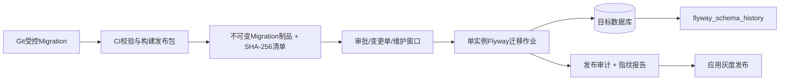

# 数据库版本管理与Migration治理设计

> 版本：V1.0
> 对应阶段：Sprint 2-1.7
> 文档性质：治理设计，不修改业务代码、不创建或执行正式Migration
> 技术基线：Spring Boot 3、Java 21、MySQL 8，兼容达梦与人大金仓
> 当前Migration基线：仓库最高V2.1.3，投资模块候选链V2.4.0—V2.4.x

## 1. 决策摘要

### 1.1 推荐方案

采用：

```text
Flyway Community CLI/容器
  + SQL-first版本脚本
  + 独立数据库迁移作业
  + Schema指纹与发布审计
  + 分厂商等价脚本
```

核心决策：

1. Flyway作为统一版本记录、校验和、互斥锁、顺序执行和状态查询工具。
2. 生产不由Spring Boot业务实例启动时自动执行Migration；由发布流水线中的单实例迁移作业执行。
3. 开发、测试、预生产和生产使用同一Flyway主版本、同一逻辑版本链和相同配置模板。
4. MySQL、达梦、人大金仓分别维护SQL实现；相同逻辑变更使用相同版本号和语义，禁止混用执行目录。
5. Flyway历史表不是Schema一致性的充分条件，同时实施结构指纹、关键数据指纹和验收SQL。
6. 生产默认使用前向修复与应用回退；不把自动Undo当作数据安全保障。
7. `clean` 在所有共享和生产环境永久禁用，`repair` 只能经过DBA审批并保留前后证据。

### 1.2 适用边界

本选择基于当前仓库：

- 已存在 `V2.0.0__...sql`、`V2.1.x__...sql` 的SQL-first脚本；
- 后端为Spring Boot，但当前POM未引入Flyway/Liquibase；
- 数据库设计需支持DBA审阅原始SQL；
- 主运行库为MySQL 8，国产数据库要求是兼容迁移，而非当前三库同时在线写入；
- 需要已有数据库纳管、校验和、版本锁和流水线审批。

如果未来变成“同一版本必须同时在三种数据库在线运行、主要由声明式模型自动生成差异”的产品模式，应重新评估Liquibase，不沿用本结论作为永久限制。

## 2. 工具选型评估

### 2.1 评价维度

权重建议：

| 维度 | 权重 | 说明 |
|---|---:|---|
| 现有脚本迁移成本 | 20% | 是否可直接纳管现有SQL链 |
| 版本、校验和与锁 | 20% | 是否防重复、篡改和并发执行 |
| MySQL 8成熟度 | 15% | 主运行库可靠性 |
| 国产数据库适配 | 15% | 达梦/人大金仓驱动与方言治理 |
| 生产审阅与审批 | 10% | DBA能否查看实际SQL和影响 |
| 回滚与失败恢复 | 10% | 是否支持受控恢复，而非仅命令存在 |
| Spring Boot/CI集成 | 5% | 是否易于自动化 |
| 学习与维护成本 | 5% | 团队负担 |

### 2.2 Flyway

优点：

- 与现有 `V<version>__<description>.sql` 命名完全一致，历史脚本纳管成本最低；
- SQL-first，DBA能够直接评审实际执行SQL；
- 通过Schema History记录版本、状态和校验和，`validate`可以发现名称、类型、校验和、缺失及待执行Migration差异；
- `info / validate / migrate / baseline / repair` 能覆盖既有数据库纳管和常规治理；
- 可使用CLI、Maven、Spring Boot或容器，适合独立迁移作业；
- 人大金仓提供Flyway相关官方开发框架文档，具备厂商侧适配依据。

限制：

- SQL脚本天然包含数据库方言，跨MySQL、达梦、人大金仓不能仅靠工具自动转换；
- Community版不应依赖商业版Undo、Dry Run或高级Schema Diff能力；
- 对已有数据库执行 `baseline` 只会登记起点，不会证明Schema真的等于该版本，必须结合指纹门禁；
- MySQL DDL和数据迁移的事务边界受数据库能力限制，工具命令不能替代备份和恢复设计；
- 国产数据库适配需固定Flyway版本、JDBC驱动和方言扩展并执行厂商实测。

结论：最符合当前SQL-first仓库，作为主执行器。

### 2.3 Liquibase

优点：

- changeset具备 `id + author + path` 身份，`DATABASECHANGELOG`记录执行顺序、状态、部署ID和校验和；
- 支持XML、YAML、JSON和SQL changelog；
- 声明式change type、precondition、context和label适合复杂多环境编排；
- `update-sql`、rollback SQL预览和显式rollback块有利于发布评审；
- MySQL在官方支持数据库范围内。

限制：

- 现有Flyway式SQL必须重构为changeset或formatted SQL，迁移成本和双轨风险较高；
- 声明式抽象不能消除所有方言差异，复杂索引、CHECK、注释、分批回填仍需厂商SQL；
- 达梦和人大金仓的兼容性仍依赖驱动、扩展和版本实测，不能因为工具声明“多数据库”就免除适配；
- changeset、master changelog、context、label、rollback等治理复杂度高于当前团队需求；
- 同时保留Flyway式目录和Liquibase changelog会形成两个版本权威来源。

适用条件：未来明确要求单套声明式变更覆盖多数据库、团队具备Liquibase治理经验并完成存量链一次性迁移时再评估。

### 2.4 人工脚本管理

优点：

- 对任何数据库和厂商工具都可执行；
- DBA可完全控制执行时间、拆分、限速和特殊语句；
- 紧急修复或封闭网络环境中可作为最后手段。

缺点：

- 缺少统一历史表、校验和、互斥锁、待执行检测和篡改发现；
- 文件名、执行顺序和环境状态依赖人工记录，极易发生漏执行、重复执行和乱序；
- 多环境一致性无法自动证明；
- 回滚、审计和责任追踪成本高。

结论：不作为主方案。人工执行只能运行由Flyway治理链生成并批准的离线发布包，执行后必须同步写入相同版本历史和发布审计；禁止出现“生产手工执行但版本表无记录”。

### 2.5 选型评分

采用1—5分，分数为当前项目适配度而非产品绝对能力：

| 维度 | Flyway | Liquibase | 人工脚本 |
|---|---:|---:|---:|
| 现有脚本迁移成本 | 5 | 2 | 4 |
| 版本/校验和/锁 | 5 | 5 | 1 |
| MySQL成熟度 | 5 | 5 | 4 |
| 国产数据库适配 | 3 | 3 | 4 |
| SQL审阅 | 5 | 4 | 5 |
| 回滚治理 | 3 | 4 | 2 |
| Spring Boot/CI | 5 | 5 | 2 |
| 维护成本 | 4 | 3 | 2 |
| 加权结论 | **4.55** | **3.65** | **2.85** |

## 3. 执行架构

### 3.1 推荐拓扑



### 3.2 为什么不由应用启动自动执行

Spring Boot可以在应用启动时触发Flyway，但生产环境不采用该方式：

- Docker多副本并发启动会把数据库变更与业务可用性耦合；
- 迁移需要独立账号、审批、维护窗口、备份和人工观察；
- 大表DDL/回填耗时不可由应用启动超时控制；
- 数据库变更失败时应停止应用发布，而不是让部分Pod启动、部分失败；
- 应用账号不应拥有ALTER、DROP等DDL权限。

开发环境可以使用独立命令快捷迁移，但仍建议通过同一CLI/容器入口执行。若未来为了本地体验启用Spring Boot集成，生产配置必须显式关闭，且不能成为唯一执行路径。

### 3.3 账号分离

| 账号 | 权限 | 使用方 |
|---|---|---|
| `enterprise_migrator` | 受控DDL、DML、历史表 | 独立Migration作业 |
| `enterprise_app` | 业务表最小CRUD，不含DDL | Spring Boot应用 |
| `enterprise_readonly` | 只读及监控视图 | 审计、报表和核查 |
| DBA应急账号 | 临时提升、全审计 | 经审批的故障处理 |

密码从Secrets/环境变量注入，不写入仓库、镜像、命令日志或文档示例。

## 4. 目录与权威来源

### 4.1 目标目录

```text
database
├─ migration-manifest.yaml            # 逻辑版本及各厂商制品SHA-256
├─ mysql
│  ├─ baseline
│  │  └─ B2.1.3__foundation_baseline.sql
│  ├─ migration
│  │  ├─ V2.4.0__verify_investment_baseline.sql
│  │  └─ ...
│  ├─ rollback                         # 不在自动扫描路径
│  └─ verification                     # 只读验收SQL
├─ dm
│  ├─ baseline
│  ├─ migration
│  ├─ rollback
│  └─ verification
├─ kingbase
│  ├─ baseline
│  ├─ migration
│  ├─ rollback
│  └─ verification
├─ init                                # Docker/空库入口，职责单一
└─ deprecated                          # 历史保留，不参与扫描
```

说明：当前仓库只有MySQL目录；达梦与人大金仓目录在真正适配Sprint中创建，本阶段不创建空目录或脚本。

### 4.2 扫描路径

每次执行只配置一个厂商的一个Migration路径和可选Baseline路径：

```text
MySQL    → database/mysql/baseline,database/mysql/migration
达梦     → database/dm/baseline,database/dm/migration
人大金仓 → database/kingbase/baseline,database/kingbase/migration
```

禁止同时加载三个厂商目录，否则同版本脚本会冲突。`rollback`、`verification`、`deprecated`、`manual`和`init`永远不进入自动扫描路径。

### 4.3 权威规则

- Migration一经在任何共享环境执行即不可修改、删除、重命名或移动；
- 修复已执行脚本必须新增更高版本前向修复；
- `repair`不能用于掩盖历史文件被修改；
- 初始化快照/Baseline服务新环境，不替代版本历史；
- 历史聚合SQL不得重新成为结构权威来源；
- `migration-manifest.yaml`记录逻辑版本、模块、依赖、各厂商文件与SHA-256、回滚包和验收脚本。

## 5. 版本编号与命名规范

### 5.1 版本格式

统一采用：

```text
V<平台主版本>.<模块版本>.<序号>__<英文小写描述>.sql
```

当前示例：

```text
V2.4.0__verify_investment_baseline.sql
V2.4.1__create_investment_opportunity.sql
V2.4.12__publish_investment_lifecycle_template.sql
```

规则：

1. 三段数字均为非负整数，不使用`SNAPSHOT`、日期汉字或分支名作为版本。
2. 版本按数值顺序比较，不依赖文件系统字典序。
3. 同一逻辑版本在三个厂商目录中使用完全相同的版本和语义描述。
4. 一个版本只完成一个可独立验证和恢复的目标。
5. DDL、历史回填、约束收紧、权限种子和模板发布原则上拆分版本。
6. 紧急修复使用下一个未占用版本，不插入已发布版本之间。
7. 合并冲突时尚未进入共享环境的分支脚本可以整体重编号；已执行脚本绝不重编号。

### 5.2 前缀

| 前缀 | 用途 | 规范 |
|---|---|---|
| `V` | 只执行一次的版本化Migration | 主要业务变更 |
| `B` | 新环境Baseline Migration | 只在验证后的空库使用 |
| `R` | Repeatable Migration | 仅稳定视图/存储程序等可重复对象，首期慎用 |
| `U` | Undo脚本 | 不作为Community生产依赖；回滚脚本放非扫描目录 |

初始化字典和权限仍优先使用V脚本，以免Repeatable脚本无意覆盖用户配置。`R`脚本不得用于表结构和业务数据回填。

### 5.3 描述命名

- 使用小写英文和下划线；
- 动词开头：`create_`、`extend_`、`backfill_`、`enforce_`、`seed_`、`publish_`、`fix_`；
- 禁止 `update.sql`、`fix.sql`、`final.sql`、`new.sql` 等无业务含义名称；
- 文件名、脚本头注释、变更单和Manifest描述必须一致。

### 5.4 脚本头

每个脚本头必须声明：

```text
Logical Version
Module
Target DBMS and tested version
Predecessor
Purpose
Affected tables
Online/offline classification
Lock and estimated duration
Data volume assumptions
Pre-check
Post-check
Rollback boundary and rollback artifact
Author / reviewer / approval reference
```

## 6. 既有数据库纳管

### 6.1 分类

目标数据库分为：

1. **新空库**：无业务对象、无历史表；
2. **标准既有库**：结构和数据与V2.1.3基线一致，但无Flyway历史表；
3. **已纳管库**：存在可信 `flyway_schema_history`；
4. **漂移库**：结构、脚本历史或指纹不一致；
5. **混合库**：部分Migration手工执行、部分对象来自聚合SQL。

### 6.2 新空库

- 使用评审后的 `B2.1.3__foundation_baseline.sql` 构建V2.1.3状态；
- Flyway继续执行高于2.1.3的V脚本；
- Baseline文件必须通过与标准V2.1.3顺序执行结果的Schema指纹等价测试；
- 当前尚未创建B2.1.3文件，必须在专项Sprint生成和验证后使用。

### 6.3 标准既有库

流程：

```text
备份
  → 只读基线识别
  → Schema指纹与关键数据核对
  → DBA和系统负责人签字
  → 手工执行Flyway baseline到2.1.3
  → info + 资产/版本/指纹策略检查
  → migrate
  → 严格validate + 目标指纹
  → 执行V2.4+
```

`baselineOnMigrate` 必须为false，禁止工具看到非空Schema时自动宣称它符合基线。

### 6.4 漂移/混合库

- 禁止直接baseline、repair或migrate；
- 生成对象、字段、索引、约束和关键数据差异；
- 识别哪些脚本已实际执行；
- 编写独立、可审计的对齐Migration或人工修复包；
- 对齐后重新计算指纹并纳管；
- 不允许人工修改历史表伪造已执行状态。

## 7. Migration历史与执行控制

### 7.1 历史表

默认使用 `flyway_schema_history`，记录版本、描述、类型、脚本、校验和、执行人、执行时间和成功状态。建议放在业务Schema内并限制只有迁移账号写入。

额外发布审计建议保存在流水线审计库或后续治理表：

```text
releaseId
environment
applicationVersion
databaseVendor / databaseVersion
flywayVersion
fromVersion / toVersion
artifactDigest
preFingerprint / postFingerprint
changeTicket
operator / approver
startTime / endTime / result
backupRef / rollbackRef
```

本阶段不创建治理表。

### 7.2 执行锁

- 每个目标Schema同一时间只允许一个迁移作业；
- Flyway历史锁之外，流水线按环境和Schema设置互斥资源锁；
- 作业超时不能直接并发重试，必须确认数据库会话、DDL状态和历史表；
- 多租户/多Schema逐个执行并记录结果，禁止部分失败后仍发布全部应用实例。

### 7.3 固定工具版本

- Flyway CLI/容器使用精确版本和镜像摘要，不使用`latest`；
- JDBC驱动使用精确版本并纳入SBOM；
- 工具升级单独建变更单，在所有环境演练校验和及历史表兼容；
- 升级工具不得与业务Migration在同一次生产变更中进行。

### 7.4 安全配置

生产必须设置或实现等价控制：

```text
cleanDisabled=true
baselineOnMigrate=false
validateOnMigrate=true
outOfOrder=false
mixed=false（除非脚本专项评审）
```

禁止把密码写入命令行参数导致进程列表或日志泄漏；使用密钥文件、Secrets挂载或流水线凭据注入。

## 8. 环境一致性与Schema指纹

### 8.1 三层一致性

一致性不能只看“最高版本号”，必须同时满足：

```text
Migration历史一致
  + Schema结构指纹一致
  + 关键参考数据指纹一致
```

### 8.2 Migration历史检查

检查项：

- 成功版本集合、顺序、脚本名和校验和；
- 不存在failed、future、missing、ignored异常；
- 不存在目标环境独有的手工版本；
- 待执行版本与发布包一致；
- 工具版本和厂商脚本路径正确；
- 迁移前 `info`、资产摘要和起始版本/指纹，以及迁移后严格 `validate` 结果均作为发布证据归档。

### 8.3 结构指纹

从数据库元数据提取并稳定排序：

- Schema、表、表类型和注释；
- 字段名、规范化类型、长度/精度、可空、默认值、生成规则和注释；
- 主键、唯一键、普通索引及字段顺序；
- 外键、引用表/字段、更新/删除规则；
- CHECK约束；
- 视图定义的规范化文本；
- 必需时包含序列、触发器和函数。

排除：

- 表行数、统计信息、碎片率、物理文件位置；
- MySQL自增当前值；
- 数据库自动生成的约束名（应映射为逻辑结构）；
- 与结构无关的创建时间；
- `flyway_schema_history` 和治理审计表自身。

规范化后按UTF-8生成SHA-256：

```text
vendorRawFingerprint    # 厂商物理结构精确指纹
logicalSchemaFingerprint # 映射后跨厂商逻辑等价指纹
```

物理指纹用于同厂商环境比较，逻辑指纹用于MySQL、达梦、人大金仓等价验收。

### 8.4 类型规范化示例

| 逻辑类型 | MySQL | 达梦 | 人大金仓 |
|---|---|---|---|
| 64位整数 | BIGINT | BIGINT | BIGINT |
| 布尔/删除标识 | SMALLINT | SMALLINT | SMALLINT |
| 金额 | DECIMAL(18,2) | DECIMAL(18,2) | NUMERIC(18,2) |
| 毫秒时间 | DATETIME(3) | TIMESTAMP(3) | TIMESTAMP(3) |
| 长文本 | TEXT | TEXT/CLOB按适配规范 | TEXT |

逻辑指纹映射表必须版本化。不能把所有厂商差异忽略，否则会掩盖精度、默认值和索引缺失。

### 8.5 参考数据指纹

对系统保留字典、菜单、权限和生命周期模板按业务键排序后计算SHA-256。必须排除用户可配置内容：

- 系统保留权限编码和菜单结构：纳入；
- 用户角色授权、组织、用户：排除；
- ACTIVE生命周期模板定义与条件：纳入；
- 业务运行数据：排除。

种子数据脚本只能补充缺失系统项，不覆盖管理员合法配置。

### 8.6 指纹门禁

| 阶段 | 门禁 |
|---|---|
| Migration前 | 当前指纹必须等于已批准起始版本，或存在已批准漂移豁免 |
| Migration后 | 历史表成功、目标物理指纹匹配该厂商清单、逻辑指纹匹配发布版本 |
| 应用启动 | 只读健康检查验证数据库版本在应用支持区间 |
| 定时巡检 | 每日/每周比较生产指纹，发现漂移告警，不自动修复 |

## 9. 脚本设计与执行顺序

### 9.1 单个业务能力顺序

```text
前置检查
  → 扩展表/列
  → 应用兼容发布
  → 分批数据回填
  → 双读差异校验
  → 切换读取
  → 约束收紧
  → 观察期
  → 后续版本清理旧结构
```

### 9.2 DDL与DML拆分

- DDL扩展与历史数据回填分版本；
- 大表索引与列变更单独评估在线算法、锁级别和磁盘；
- 回填脚本支持批次、断点、幂等、限速和异常清单；
- 约束收紧只在异常清零后执行；
- 清理旧列/表不与新结构上线同批。

### 9.3 事务边界

不能假设所有数据库DDL都能事务回滚：

- 脚本必须识别DDL隐式提交和厂商差异；
- 多步骤DDL失败后按实际对象状态恢复，不盲目重跑；
- 数据回填显式分批事务，并记录水位和结果；
- Migration历史显示失败时，先核对数据库实际状态，再决定前向修复或受控repair；
- `repair`只修历史元数据，不会自动恢复业务Schema。

### 9.4 重复和乱序

- `outOfOrder=false`；
- 两个feature分支产生相同版本时，在进入共享环境前由后合并分支重编号；
- 已执行版本冲突时禁止强行repair，新增更高版本消解；
- 热修复使用当前最高版本之后的新版本，随后回合并main/develop，避免生产独有链。

## 10. 回滚与恢复策略

### 10.1 回滚边界

数据库回滚分为：

| 类型 | 适用 | 默认策略 |
|---|---|---|
| 应用回退 | 新代码异常、Schema向后兼容 | 回退应用镜像，保留扩展Schema |
| 功能停用 | 新模块或流程异常 | 关闭功能开关，停止新写入 |
| Migration前向修复 | 已执行DDL/DML存在缺陷 | 新增更高版本修复 |
| 结构反向操作 | 新增对象未写入或可证明安全 | 受控rollback脚本 |
| 数据恢复 | 数据被错误改写/删除 | 备份、PITR或映射表恢复 |
| 整库灾难恢复 | Schema不可服务 | 恢复演练过的快照/PITR并重放已批准链 |

生产默认顺序：停止扩大影响 → 应用回退/功能关闭 → 评估数据库状态 → 前向修复；只有数据不可前向纠正时才执行恢复。

### 10.2 Expand/Contract回退

扩展版本保持旧应用可运行：

- 新列先可空或有安全默认；
- 新表不替代旧表直至双读通过；
- 新写入使用Outbox/双写监控；
- 切读失败可回旧路径；
- 旧结构清理延后至少一个发布周期。

这样大多数应用发布失败无需回滚数据库。

### 10.3 数据迁移回滚

每个回填版本必须提供：

- 原记录主键与目标记录主键映射；
- 批次号、水位、源/目标校验和；
- 异常记录表或安全外部报告；
- 反向恢复SQL或备份恢复步骤；
- 业务唯一键、金额、比例、日期和外键核查；
- 最晚可逆时间点。

禁止使用当前日期、名称相似度或状态猜测历史业务事实。无法确认的记录标记LEGACY/待确认，不伪造审批、模板或外部引用。

### 10.4 发布失败处理

#### Migration未开始

- 停止发布，修复发布包或审批；
- 数据库无变化，应用不发布。

#### Migration执行中失败

- 立即阻断应用发布和自动重试；
- 保存Flyway输出、数据库错误、会话和对象状态；
- 判断事务是否提交、DDL是否部分生效、历史表状态；
- 依据Runbook执行前向补偿或反向脚本；
- 未经DBA批准不得执行repair。

#### Migration成功、应用失败

- 若Schema向后兼容，回退应用并保留Schema；
- 关闭新功能写入，监控新表是否已有数据；
- 修复应用后重新灰度；
- 不因应用失败立即删除已成功Schema。

#### Migration与数据校验成功、业务验收失败

- 停用功能开关；
- 保留审计证据并评估已产生业务数据；
- 优先前向修复；
- 需要恢复时按变更单执行并重新计算指纹。

### 10.5 备份与恢复

生产发布前必须：

- 完成全量或一致性快照；
- 确认binlog/归档日志和PITR可用；
- 在隔离环境实际恢复并验证，而非只检查“备份任务成功”；
- 记录恢复点、备份制品、加密、保留期和责任人；
- 大数据回填前增加业务级导出或映射快照。

RPO/RTO由业务和运维确认，不在脚本中隐含假设。

## 11. 多环境发布流程

### 11.1 开发环境

流程：

1. 开发者创建未占用版本并填写脚本头、Manifest和回滚设计；
2. 静态检查禁止DROP核心表、无WHERE更新、修改历史脚本和敏感值；
3. 在一次性MySQL容器执行Baseline + 全链；
4. 从标准存量快照执行升级路径；
5. 运行Repository、Migration和指纹测试；
6. 同行评审SQL、锁、索引和国产库差异；
7. 合并后制品由CI生成，不使用开发者本地文件上线。

本地需要重建时销毁一次性数据库容器，不依赖Flyway `clean` 清理共享库。

### 11.2 测试环境

必须执行两条路径：

- 空库Baseline到目标版本；
- 上一生产版本真实脱敏数据升级到目标版本。

验证功能、回填、约束、权限、数据权限、事务、性能和回滚Runbook。测试环境Migration必须由流水线账号执行，不由测试人员手工补表。

### 11.3 预生产环境

- 数据量、数据库参数、字符集、时区和拓扑尽量对齐生产；
- 使用生产脱敏快照恢复后完整演练；
- 测量每个脚本耗时、锁等待、磁盘、日志空间和复制延迟；
- 执行备份恢复、发布失败、应用回退和前向修复演练；
- 生成最终Schema指纹、参考数据指纹和发布报告；
- DBA、安全、测试、业务负责人签字后才允许生产。

### 11.4 生产环境

#### 发布前

- 冻结Migration制品并记录SHA-256和镜像摘要；
- 审批变更单、维护窗口、影响范围和回滚负责人；
- 验证备份/PITR和恢复演练证据；
- `info`、资产SHA-256、起始版本和起始Schema指纹必须通过；迁移前不因合法pending版本执行严格validate；
- 确认无长事务、冲突DDL和异常复制延迟；
- 应用仍运行旧兼容版本或按方案停写。

#### 执行

- 获取环境/Schema流水线互斥锁；
- 使用Migration专用账号运行固定版本Flyway作业；
- 实时观察数据库会话、锁、CPU、IO、日志和复制；
- 每个阶段运行后置检查，不通过立即停止；
- 保存完整标准输出、历史表快照和发布审计。

#### 发布后

- 执行不带pending忽略规则的严格 `validate`，确认历史脚本名称和checksum一致；
- 计算目标物理/逻辑Schema指纹和参考数据指纹；
- 执行记录数、金额汇总、业务唯一键、外键孤儿和状态一致性检查；
- 灰度发布应用，验证健康、关键查询和写入；
- 逐步扩大流量，监控慢查询、错误、Outbox、回调和业务差异；
- 业务验收后关闭变更单，保留观察期；
- 不在观察期内清理旧结构。

## 12. CI/CD门禁

### 12.1 Pull Request

- 文件名和版本唯一；
- 历史脚本无修改；
- SQL lint和危险语句扫描；
- Manifest、回滚、前后检查齐全；
- 空库与存量升级测试；
- MySQL执行计划和索引评审；
- 达梦/人大金仓适配状态明确；
- Schema指纹符合预期；
- 至少一名后端Reviewer和一名数据库Reviewer批准。

### 12.2 制品

发布制品包含：

```text
vendor-specific migration scripts
migration-manifest.yaml
SHA-256SUMS
precheck/postcheck SQL
rollback scripts outside scan path
release runbook
expected fingerprints
Flyway image digest and configuration template
SBOM
```

制品签名后不可修改；生产从制品库拉取，不从Git工作区现场执行。

### 12.3 自动阻断项

- 版本重复、缺号依赖或乱序；
- 已执行脚本校验和变化；
- `DROP DATABASE/SCHEMA`、无审批的大表DROP/TRUNCATE；
- 无WHERE的UPDATE/DELETE；
- 明文密码、Token、账户或敏感业务数据；
- 缺少回滚边界、前后检查或锁评估；
- Baseline和全链结果指纹不同；
- 国产数据库支持状态为未知却标记可发布；
- 目标环境存在Schema漂移。

## 13. 国产数据库兼容治理

### 13.1 同版本、分实现

相同逻辑Migration在三个目录中保持：

- 相同版本号；
- 相同业务目标；
- 相同逻辑表、字段、约束和种子数据；
- 允许不同物理类型、DDL语法、索引算法和批处理实现；
- 各自独立SHA-256和厂商测试结果。

禁止把MySQL语法通过简单字符串替换后直接标记为国产库已支持。

### 13.2 适配检查清单

- JDBC URL、驱动类、数据库识别和Flyway扩展；
- BIGINT、DECIMAL、时间精度、TEXT/CLOB和布尔映射；
- 标识符大小写、保留字和引号；
- 默认值、CURRENT_TIMESTAMP和更新时间机制；
- CHECK、外键、部分/函数索引能力；
- 自增/序列与雪花主键；
- 分页、批量更新、UPSERT和锁语法；
- DDL事务、隐式提交和失败恢复；
- 元数据查询和Schema指纹采集；
- 执行计划、统计信息和大表迁移策略。

### 13.3 Flyway适配门禁

每个国产数据库组合必须固定并验证：

```text
database vendor/version
JDBC driver/version
Flyway version
database type/extension
history table DDL
lock behavior
baseline/validate/migrate/repair behavior
```

只有厂商文档存在仍不代表当前组合通过验收；必须在实际版本执行全链和故障恢复测试。

## 14. 运行手册要点

### 14.1 日常命令边界

| 操作 | 开发一次性库 | 测试/预生产 | 生产 |
|---|:---:|:---:|:---:|
| info | 允许 | 允许 | 允许，只读 |
| validate | 必须 | 必须 | 必须 |
| migrate | 允许 | 流水线 | 独立审批作业 |
| baseline | 必要时 | 仅首次纳管审批 | 仅首次纳管专项审批 |
| repair | 受控 | DBA审批 | 严格DBA审批 |
| clean | 仅销毁式容器可不用此命令 | 禁止 | 永久禁止 |

### 14.2 Repair规则

允许场景仅包括：

- 已确认失败Migration未产生业务影响，修复Schema后同步历史状态；
- 厂商工具明确要求的历史元数据修复；
- 校验和变化有合法、全环境一致且审计完整的特殊原因。

常规正确做法仍是恢复历史文件并新增前向修复。任何repair前后都必须导出历史表、指纹和审批记录。

### 14.3 漂移处理

发现生产漂移时：

1. 告警并冻结新Migration；
2. 导出实际结构和历史表；
3. 确认漂移来源、变更人和业务影响；
4. 禁止工具自动对齐生产；
5. 通过前向Migration纳管合法漂移，或恢复未授权漂移；
6. 重新计算指纹并完成安全复盘。

## 15. 实施路线

### 阶段A：治理落地

- 评审并冻结Flyway方案、执行方式和账号；
- 选择精确Flyway/JDBC版本并完成许可证与安全评审；
- 定义Manifest、脚本头、指纹格式和发布审计；
- 建立CI静态检查和一次性MySQL测试库。

### 阶段B：V2.1.3基线纳管

- 生成并验证B2.1.3 Baseline；
- 对标准既有库执行只读指纹识别；
- 演练baseline、validate和info；
- 漂移/混合库逐库治理，不批量强制baseline。

### 阶段C：V2.4投资链试点

- 创建V2.4脚本及MySQL实现；
- 完成空库、存量、异常和恢复测试；
- 按开发批次发布Migration及生命周期模板；
- 用Investment模块作为统一执行器首个完整试点。

### 阶段D：国产数据库适配

- 建立达梦和人大金仓目录及适配实现；
- 使用相同逻辑版本完成全链；
- 比较逻辑Schema和参考数据指纹；
- 完成性能、锁、故障恢复和厂商认证测试。

### 阶段E：全平台推广

- 将后续HR、Party、Operation、Risk等变更统一纳入版本链；
- 停止新增manual结构变更；
- 定期漂移巡检、恢复演练和治理审计；
- 在版本链过长时生成新的Baseline，但不删除历史Migration。

## 16. 风险与待确认事项

| 风险 | 影响 | 控制 |
|---|---|---|
| 既有库无可信版本历史 | 错误baseline | 指纹识别、逐库签字、禁止baselineOnMigrate |
| Flyway版本/许可变化 | 能力与发布流程变化 | 固定版本、许可证评审、升级独立变更 |
| 国产数据库扩展不稳定 | validate/migrate失败 | 厂商版本组合认证和备用受控离线包 |
| 一份SQL跨三库 | 方言与语义错误 | 同逻辑版本分厂商实现 |
| DDL不可事务回滚 | 半完成Schema | 扩展式脚本、状态核查、前向修复和备份 |
| 自动repair掩盖篡改 | 历史失真 | 严格审批、默认禁止 |
| 应用启动自动迁移 | 多副本并发与权限过大 | 独立单实例Migration作业 |
| 只看最高版本号 | Schema漂移漏检 | 历史+结构指纹+参考数据三层校验 |

实施前需确认：

1. Flyway具体版本、Community许可和容器来源；
2. 达梦、人大金仓目标版本和JDBC驱动组合；
3. Migration执行平台、密钥管理和审计留存；
4. V2.1.3标准Schema指纹和关键参考数据范围；
5. 生产RPO/RTO、维护窗口及大表在线DDL标准；
6. B2.1.3 Baseline生成与审批责任；
7. 指纹工具实现语言、运行位置和Manifest格式；
8. 漂移豁免、repair和紧急人工脚本的审批人。

上述事项确认前，不修改POM、不启用应用启动迁移、不创建Baseline或V2.4正式脚本。

## 17. 参考依据

- Redgate Flyway：Validate、Schema History、Baseline、命令和数据库支持文档；
- Liquibase：DATABASECHANGELOG、changeset checksum、update/update-sql与rollback命令文档；
- Spring Boot：Flyway/Liquibase数据库初始化集成文档；
- 人大金仓：KingbaseES客户端编程开发框架Flyway文档。

工具能力和支持矩阵会随版本变化。正式实施时必须以选定版本的官方文档、许可证和厂商兼容报告重新核验，不能仅依赖本文设计时点的信息。
