# 国企数字化治理与经营赋能平台数据库设计 V1.0

## 总体设计

物理库统一为 `enterprise_platform`，使用模块前缀实现逻辑分域，避免跨库事务，
并便于迁移到达梦和人大金仓。所有业务表统一包含 `id`、`create_time`、
`create_by`、`update_time`、`update_by`、`deleted`、`remark`；同时保留
`delete_token`（释放逻辑删除唯一键）和 `version`（乐观锁）。

类型和状态使用字符编码，不依赖数据库枚举；主键由应用雪花算法生成。

## ER 模型

```mermaid
erDiagram
  SYS_ORG ||--o{ HR_EMPLOYEE : employs
  HR_POSITION ||--o{ HR_EMPLOYEE : assigns
  HR_EMPLOYEE o|--o| SYS_USER : binds
  SYS_USER ||--o{ SYS_USER_ROLE : has
  SYS_ROLE ||--o{ SYS_USER_ROLE : grants
  SYS_ROLE ||--o{ SYS_ROLE_PERMISSION : grants
  SYS_PERMISSION ||--o{ SYS_ROLE_PERMISSION : contains
  HR_EMPLOYEE ||--o{ PROJECT_INFO : leads
  SYS_ORG ||--o{ PROJECT_INFO : owns
  PROJECT_INFO ||--o{ PROJECT_STAGE : contains
  PROJECT_INFO ||--o{ PROJECT_TASK : contains
  PROJECT_STAGE ||--o{ PROJECT_TASK : groups
  HR_EMPLOYEE ||--o{ PROJECT_TASK : handles
  PROJECT_INFO ||--o{ PROJECT_MEMBER : staffs
  HR_EMPLOYEE ||--o{ PROJECT_MEMBER : joins
  PROJECT_INFO ||--o{ OPERATION_CONTRACT : supports
  OPERATION_CONTRACT ||--o{ CONTRACT_PAYMENT : schedules
  PROJECT_INFO ||--o{ OPERATION_INCOME : generates
  PROJECT_INFO ||--o{ OPERATION_COST : incurs
  PROJECT_INFO ||--o{ PROJECT_PROFIT : analyzes
  PROJECT_INFO o|--o{ INVESTMENT_PROJECT : relates
  INVESTMENT_PROJECT ||--o{ INVESTMENT_DECISION : decides
  INVESTMENT_PROJECT ||--o| INVESTMENT_EVALUATION : evaluates
  INVESTMENT_PROJECT ||--o{ INVESTMENT_INCOME : earns
  INVESTMENT_PROJECT ||--o{ INVESTMENT_RISK : exposes
  INVESTMENT_PROJECT ||--o{ INVESTMENT_EXIT : exits
  INVESTMENT_COMPANY ||--o{ INVESTMENT_EQUITY : owns
  INVESTMENT_COMPANY ||--o{ INVESTMENT_SHAREHOLDER_RIGHT : governs
  INVESTMENT_COMPANY ||--o{ INVESTMENT_DIRECTOR : appoints
  INVESTMENT_COMPANY ||--o{ INVESTMENT_MONITOR_INDICATOR : monitors
  DATA_RESOURCE ||--o{ DATA_ASSET : capitalizes
  DATA_ASSET ||--o{ DATA_PRODUCT : packages
  DATA_PRODUCT ||--o{ DATA_AUTHORIZATION : authorizes
  DATA_PRODUCT ||--o{ DATA_INCOME : earns
  DATA_RESOURCE ||--o{ DATA_QUALITY : evaluates
  DATA_RESOURCE ||--o{ DATA_ACCESS_LOG : audits
  RISK_INFO ||--o{ RISK_RECTIFICATION : rectifies
  PARTY_ORG ||--o{ PARTY_MEMBER : contains
  HR_EMPLOYEE ||--o| PARTY_MEMBER : maps
  PARTY_ORG ||--o{ PARTY_ACTIVITY : organizes
  PARTY_ACTIVITY ||--o{ PARTY_ACTIVITY_MEMBER : signs
  PARTY_MEMBER ||--o{ PARTY_ACTIVITY_MEMBER : attends
```

## 表结构与字段

| 分域 | 表 | 主业务字段 |
|---|---|---|
| 系统 | `sys_user` | `username,password,real_name,phone,email,org_id,employee_id,status` |
| 系统 | `sys_role` | `role_name,role_code,description,data_scope_type,status` |
| 系统 | `sys_user_role` | `user_id,role_id` |
| 系统 | `sys_permission` | `permission_name,permission_code,permission_type,resource_path` |
| 系统 | `sys_menu` | `menu_name,menu_type,parent_id,path,component,permission,sort_no` |
| 系统 | `sys_role_permission` | `role_id,permission_id` |
| 系统 | `sys_role_menu` | `role_id,menu_id` |
| 系统 | `sys_role_org` | `role_id,org_id` |
| 系统 | `sys_org` | `org_code,org_name,org_type,parent_id,leader_id` |
| 系统 | `sys_log` | `user_id,operation,request_url,ip,result,trace_id` |
| 人事 | `hr_employee` | `employee_no,name,gender,id_card,org_id,position_id,status` |
| 人事 | `hr_position` | `position_code,position_name,department_id,position_level` |
| 人事 | `hr_three_definition` | `org_id,position_id,approved_number,current_number,definition_year` |
| 人事 | `hr_cadre` | `employee_id,cadre_level,current_position,term_start,term_end` |
| 人事 | `hr_performance_indicator` | `indicator_name,indicator_type,weight,target_value,score_rule` |
| 党建 | `party_org` | `org_name,org_type,secretary_id,parent_id,sys_org_id` |
| 党建 | `party_member` | `employee_id,join_date,positive_date,party_position,party_org_id` |
| 党建 | `party_activity` | `activity_type,title,activity_date,location,content` |
| 党建 | `party_activity_member` | `activity_id,member_id,sign_status,sign_time` |
| 项目 | `project_info` | `project_no,project_name,project_type,project_mode,leader_id,department_id,status,start_date,end_date,budget_amount,expected_income,expected_profit` |
| 项目 | `project_stage` | `project_id,stage_code,stage_name,stage_order,start_time,end_time,status` |
| 项目 | `project_task` | `project_id,stage_id,task_no,task_name,responsible_person,plan_date,actual_date,status` |
| 项目 | `project_member` | `project_id,employee_id,role,joined_date,left_date,status` |
| 经营 | `operation_contract` | `contract_no,contract_name,customer_id,project_id,amount,sign_date,status` |
| 经营 | `contract_payment` | `contract_id,payment_name,amount,plan_date,actual_date,status` |
| 经营 | `operation_income` | `project_id,contract_id,income_amount,income_date` |
| 经营 | `operation_cost` | `project_id,cost_type,amount,cost_date` |
| 经营 | `project_profit` | `project_id,income,cost,profit,profit_rate,statistic_date` |
| 投资 | `investment_plan` | `plan_year,plan_name,industry_direction,plan_amount,actual_amount,responsible_dept,status` |
| 投资 | `investment_project` | `investment_no,plan_id,project_id,investment_name,investment_type,investment_amount,investment_ratio,expected_return,risk_level,approval_status` |
| 投资 | `investment_decision` | `investment_id,decision_type,meeting_type,meeting_date,decision_result,decision_file` |
| 投资 | `investment_evaluation` | `investment_id,total_amount,annual_income,annual_cost,annual_profit,roi,irr,payback_period` |
| 投资 | `investment_company` | `company_name,credit_code,register_capital,legal_person,establish_date,industry,company_status` |
| 投资 | `investment_equity` | `investment_company_id,holder_name,holding_ratio,investment_amount,share_type,acquire_date` |
| 投资 | `investment_shareholder_right` | `company_id,meeting_type,meeting_date,agenda,resolution,file_url` |
| 投资 | `investment_director` | `company_id,person_name,director_position,appoint_date,term_start,term_end` |
| 投资 | `investment_monitor_indicator` | `company_id,indicator_name,target_value,actual_value,monitor_period,status` |
| 投资 | `investment_income` | `investment_id,income_type,income_date,income_amount` |
| 投资 | `investment_risk` | `investment_id,risk_type,risk_description,risk_level,response_measure,status` |
| 投资 | `investment_exit` | `investment_id,exit_type,exit_date,exit_amount,exit_income,status` |
| 数据资产 | `data_resource` | `resource_code,resource_name,resource_type,source_unit,responsible_person,update_frequency,data_size,security_level` |
| 数据资产 | `data_asset` | `asset_code,asset_name,resource_id,ownership,application_scene,value_level,evaluation_amount,status` |
| 数据资产 | `data_product` | `product_code,product_name,asset_id,service_object,service_mode,price,status` |
| 数据资产 | `data_authorization` | `product_id,customer,authorization_type,start_date,end_date,purpose,approval_status` |
| 数据资产 | `data_income` | `product_id,contract_id,income_amount,income_date,customer` |
| 数据资产 | `data_quality` | `resource_id,completeness_score,accuracy_score,timeliness_score,quality_score,evaluation_period` |
| 数据资产 | `data_access_log` | `user_id,resource_id,access_time,operation,result,ip,trace_id` |
| 风险 | `risk_info` | `risk_code,risk_name,risk_type,risk_level,responsible_dept,responsible_person,status` |
| 风险 | `risk_rule` | `rule_name,business_type,rule_condition,warning_level,enabled` |
| 风险 | `risk_rectification` | `risk_id,problem,measure,responsible_person,deadline,status` |
| 风险 | `audit_problem` | `audit_project,problem_content,problem_level,department,rectification_status` |
| 风险 | `inspection_problem` | `inspection_batch,problem,responsible_unit,deadline,status` |
| BI | `bi_operation_dashboard` | `statistic_date,income,profit,asset,cash,project_count` |
| BI | `bi_project_analysis` | `project_id,statistic_date,income,cost,profit,risk_level,progress` |

精确类型、长度、默认值、字段注释和检查约束以
[`V1.0.0__enterprise_platform_v1.sql`](../../../database/mysql/V1.0.0__enterprise_platform_v1.sql)
和
[`V1.1.0__investment_data_risk_bi.sql`](../../../database/mysql/V1.1.0__investment_data_risk_bi.sql)
为唯一可执行基准。

## 索引设计

- 编码唯一键组合 `delete_token`，逻辑删除后允许重新使用业务编码。
- 项目列表索引为 `department_id,status,deleted,create_time`，负责人查询使用
  `leader_id,status,deleted`。
- 阶段按 `project_id,deleted,stage_order` 排序；任务按阶段、状态、排序号查询；
  成员提供项目和员工两个查询方向。
- 日志按用户/结果和创建时间建立组合索引；收入、成本和付款节点按主对象及业务日期索引。
- 投资决策、收益、风险和退出按投资事项与业务日期索引；投后指标按企业、指标和期间唯一。
- 数据资产链路按资源、资产、产品逐级索引；授权结束日期和数据访问时间单独建立审计索引。
- 风险整改、审计、巡察按责任组织、状态和截止日期索引；BI 按统计日期保存唯一快照。

## 外键与安全

- `sys_user.employee_id`、项目/阶段/任务负责人及项目成员全部引用 `hr_employee.id`。
- 任务使用 `(stage_id,project_id)` 复合外键，禁止跨项目引用阶段或父任务。
- 身份证、手机号字段预留密文长度，应用层必须加密，接口不得直接输出。
- 外键限制物理删除，业务数据统一逻辑删除，保持审计链完整。
- 投资事项关联 `project_info`，投资治理表关联 `investment_company`；数据收益可关联
  `operation_contract`，形成项目、合同、数据产品和收益链路。
- BI 表是同步快照，不对在线交易表建立物理外键，防止分析装载影响业务事务。
- 为兼容国产数据库，原设计中的 `condition`、`level`、`date`、`position`、
  `period` 分别规范为 `rule_condition`、`warning_level`、`statistic_date`、
  `director_position`、`monitor_period`。

## 初始化与升级

新环境执行
[`V1.0.0__enterprise_platform_v1.sql`](../../../database/mysql/V1.0.0__enterprise_platform_v1.sql)
和
[`V1.1.0__investment_data_risk_bi.sql`](../../../database/mysql/V1.1.0__investment_data_risk_bi.sql)；
脚本不创建默认账号或口令。旧版采用蓝绿迁移，字段映射和旧表保留操作见
[`V2.0.0__legacy_to_v1.sql`](../../../database/mysql/migration/V2.0.0__legacy_to_v1.sql)。
无法从用户映射到员工的数据必须进入异常清单，禁止静默丢弃。
