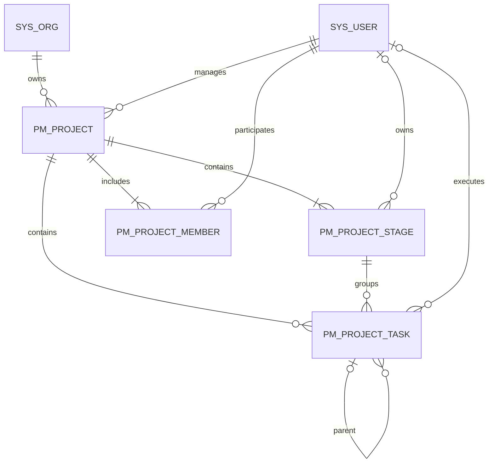

# 项目全生命周期数据库设计

> 安全加固：执行 `V1.1.0__project_lifecycle.sql` 后继续执行
> `V1.2.0__security_and_project_hardening.sql`。四张项目表增加 `delete_token`，
> 活跃数据固定为 `0`，逻辑删除时写入记录主键，使业务唯一键在删除后可安全复用。
> 任务的阶段、父任务改为携带 `project_id` 的组合外键，数据库层阻止跨项目关联。

## ER 模型

## 表职责

| 表 | 职责 | 核心唯一约束 |
|---|---|---|
| `pm_project` | 项目主档、经营指标、当前阶段与总进度 | `project_code` |
| `pm_project_stage` | 储备、立项、实施、运营、验收五阶段 | `project_id + stage_code` |
| `pm_project_task` | 阶段任务、子任务、责任人、成果和风险 | `project_id + task_code` |
| `pm_project_member` | 项目成员、角色、职责和参与周期 | `project_id + user_id + member_role` |

## 生命周期规则

1. 创建项目时自动生成五个标准阶段，首阶段“项目储备”进入进行中。
2. 阶段完成时完成度强制为 100%，并记录实际完成日期。
3. 项目总进度为五个阶段完成度的算术平均值。
4. 当前阶段为顺序最靠前且未完成、未跳过的阶段。
5. 五阶段全部完成后，项目自动变为 `COMPLETED`。
6. 项目负责人自动进入成员表，且不能直接从成员中移除。
7. 任务必须属于当前项目的某一阶段；父任务必须属于同一项目。
8. 所有更新携带 `version`，通过乐观锁避免覆盖并发修改。

## 索引设计

- 项目按组织、状态、负责人和当前阶段建立组合索引。
- 阶段按 `project_id, deleted, stage_order` 加载完整时间线。
- 任务按阶段、状态、负责人和父任务建立索引。
- 成员按项目状态和用户状态建立双向查询索引。
- 所有表保留创建时间、更新时间、创建人、更新人、删除标识和乐观锁版本。

## 外键策略

- 组织、项目负责人和成员用户使用 `RESTRICT`，防止仍被项目引用的数据被物理删除。
- 阶段负责人、任务负责人使用 `SET NULL`，人员离开后保留历史任务。
- 项目物理删除时阶段、任务、成员使用 `CASCADE`；正常业务删除统一执行逻辑删除。
- 任务父子关系使用 `RESTRICT`，有子任务时必须先处理子任务。
