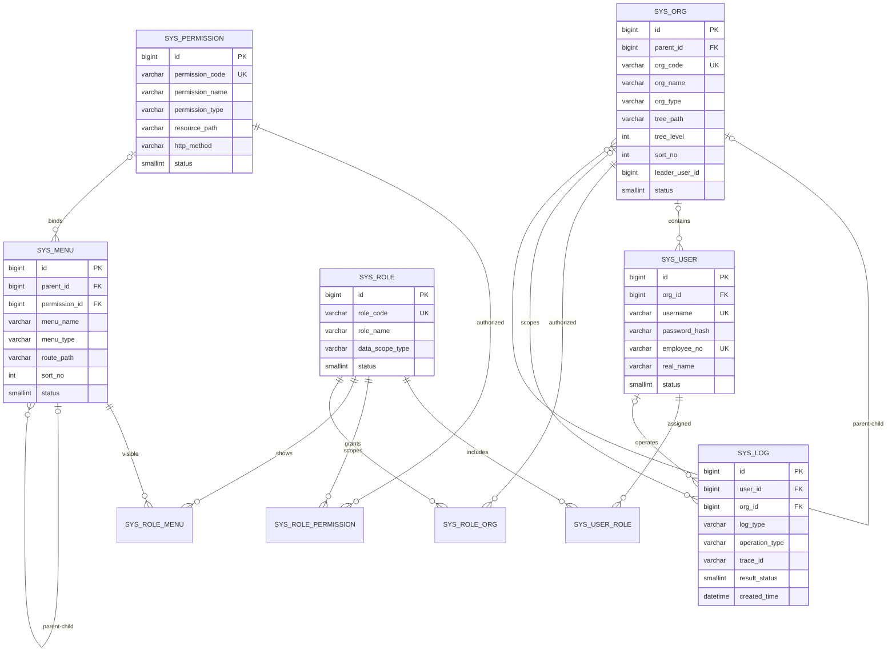

# 系统基础表数据库设计

## 1. 设计范围

本设计依据 PRD 中“组织编码、人员编码作为党建、人事、权限底座”以及“等保三级、权限控制、日志审计”的要求，优先建设统一组织、用户账号、RBAC 权限、菜单与审计日志。

核心表：

- `sys_user`：平台登录账号
- `sys_role`：角色及数据权限范围
- `sys_org`：企业、部门、党组织等统一组织树
- `sys_permission`：接口、按钮和数据操作权限
- `sys_menu`：目录、菜单、按钮及外部链接
- `sys_log`：登录、安全与操作审计日志

为满足第三范式和多对多关系，增加：

- `sys_user_role`
- `sys_role_permission`
- `sys_role_menu`
- `sys_role_org`

## 2. ER 模型

## 3. 公共字段规范

除纯历史日志外，所有表统一保留以下审计字段；`sys_log` 同样保留这些字段以符合项目规范。

| 字段 | 类型 | 必填 | 说明 |
|---|---|---:|---|
| `created_time` | `DATETIME(3)` | 是 | 创建时间，精确到毫秒 |
| `updated_time` | `DATETIME(3)` | 是 | 最后更新时间 |
| `created_by` | `BIGINT` | 否 | 创建人用户 ID |
| `updated_by` | `BIGINT` | 否 | 更新人用户 ID |
| `deleted` | `SMALLINT` | 是 | 逻辑删除：0 正常，1 删除 |

主键统一使用应用侧雪花 ID `BIGINT`，不依赖数据库自增，便于 MySQL、达梦、人大金仓适配。`created_by`、`updated_by` 是审计引用，不设置物理外键，以避免用户初始化循环并确保用户删除后审计记录仍可保留。

## 4. 表结构与字段说明

### 4.1 `sys_org` 统一组织表

统一承载企业、子公司、部门及党组织层级。`org_code` 对应 PRD 中必须唯一的组织主数据编码。

| 字段 | 类型 | 必填 | 默认值 | 说明 |
|---|---|---:|---|---|
| `id` | `BIGINT` | 是 | - | 主键 |
| `parent_id` | `BIGINT` | 否 | `NULL` | 上级组织，根组织为空 |
| `org_code` | `VARCHAR(64)` | 是 | - | 全局唯一组织编码 |
| `org_name` | `VARCHAR(128)` | 是 | - | 组织名称 |
| `org_short_name` | `VARCHAR(64)` | 否 | `NULL` | 组织简称 |
| `org_type` | `VARCHAR(32)` | 是 | - | `GROUP/COMPANY/DEPARTMENT/PARTY_COMMITTEE/PARTY_BRANCH/PARTY_GROUP` |
| `tree_path` | `VARCHAR(1000)` | 是 | `/` | 祖先路径，如 `/1/10/` |
| `tree_level` | `INT` | 是 | `1` | 树层级，从 1 开始 |
| `sort_no` | `INT` | 是 | `0` | 同级排序 |
| `leader_user_id` | `BIGINT` | 否 | `NULL` | 负责人用户 ID，逻辑引用 |
| `contact_phone` | `VARCHAR(32)` | 否 | `NULL` | 联系电话 |
| `established_date` | `DATE` | 否 | `NULL` | 成立日期 |
| `status` | `SMALLINT` | 是 | `1` | 0 停用，1 正常 |
| 公共审计字段 | - | - | - | 见公共字段规范 |

### 4.2 `sys_user` 用户账号表

保存认证所需的最小账号信息。人员完整档案后续应进入组织人事业务表，避免账号表演变成人事大宽表。

| 字段 | 类型 | 必填 | 默认值 | 说明 |
|---|---|---:|---|---|
| `id` | `BIGINT` | 是 | - | 主键 |
| `org_id` | `BIGINT` | 是 | - | 所属主组织 |
| `username` | `VARCHAR(64)` | 是 | - | 登录名，全局唯一 |
| `password_hash` | `VARCHAR(255)` | 是 | - | BCrypt/Argon2 密码摘要，禁止明文 |
| `employee_no` | `VARCHAR(64)` | 否 | `NULL` | 人员主数据编码，全局唯一 |
| `real_name` | `VARCHAR(64)` | 是 | - | 姓名 |
| `mobile` | `VARCHAR(32)` | 否 | `NULL` | 手机号，展示时脱敏 |
| `email` | `VARCHAR(128)` | 否 | `NULL` | 邮箱 |
| `avatar_url` | `VARCHAR(500)` | 否 | `NULL` | 头像受控访问地址 |
| `status` | `SMALLINT` | 是 | `1` | 0 停用，1 正常，2 锁定 |
| `login_fail_count` | `INT` | 是 | `0` | 连续失败次数 |
| `locked_until` | `DATETIME(3)` | 否 | `NULL` | 锁定截止时间 |
| `last_login_time` | `DATETIME(3)` | 否 | `NULL` | 最近成功登录时间 |
| `last_login_ip` | `VARCHAR(64)` | 否 | `NULL` | 最近登录 IP |
| `password_changed_time` | `DATETIME(3)` | 否 | `NULL` | 密码最后修改时间 |
| 公共审计字段 | - | - | - | 见公共字段规范 |

### 4.3 `sys_role` 角色表

| 字段 | 类型 | 必填 | 默认值 | 说明 |
|---|---|---:|---|---|
| `id` | `BIGINT` | 是 | - | 主键 |
| `role_code` | `VARCHAR(64)` | 是 | - | 角色编码，全局唯一 |
| `role_name` | `VARCHAR(128)` | 是 | - | 角色名称 |
| `data_scope_type` | `VARCHAR(32)` | 是 | `SELF` | `ALL/ORG_AND_CHILDREN/ORG/SELF/CUSTOM` |
| `role_category` | `VARCHAR(32)` | 是 | `BUSINESS` | `SYSTEM/BUSINESS` |
| `sort_no` | `INT` | 是 | `0` | 排序 |
| `status` | `SMALLINT` | 是 | `1` | 0 停用，1 正常 |
| `remark` | `VARCHAR(500)` | 否 | `NULL` | 备注 |
| 公共审计字段 | - | - | - | 见公共字段规范 |

### 4.4 `sys_permission` 权限资源表

权限编码是后端方法鉴权的稳定标识；接口路径只用于资源登记和审计，不能替代权限编码。

| 字段 | 类型 | 必填 | 默认值 | 说明 |
|---|---|---:|---|---|
| `id` | `BIGINT` | 是 | - | 主键 |
| `permission_code` | `VARCHAR(128)` | 是 | - | 唯一权限码，如 `system:user:list` |
| `permission_name` | `VARCHAR(128)` | 是 | - | 权限名称 |
| `permission_type` | `VARCHAR(32)` | 是 | - | `API/BUTTON/DATA` |
| `resource_path` | `VARCHAR(500)` | 否 | `NULL` | API 路径或资源表达式 |
| `http_method` | `VARCHAR(16)` | 否 | `NULL` | GET/POST/PUT/DELETE/PATCH |
| `module_code` | `VARCHAR(64)` | 是 | - | 所属模块 |
| `status` | `SMALLINT` | 是 | `1` | 0 停用，1 正常 |
| `remark` | `VARCHAR(500)` | 否 | `NULL` | 备注 |
| 公共审计字段 | - | - | - | 见公共字段规范 |

### 4.5 `sys_menu` 菜单表

| 字段 | 类型 | 必填 | 默认值 | 说明 |
|---|---|---:|---|---|
| `id` | `BIGINT` | 是 | - | 主键 |
| `parent_id` | `BIGINT` | 否 | `NULL` | 上级菜单 |
| `permission_id` | `BIGINT` | 否 | `NULL` | 绑定权限资源 |
| `menu_name` | `VARCHAR(128)` | 是 | - | 菜单名称 |
| `menu_type` | `VARCHAR(16)` | 是 | - | `DIRECTORY/MENU/BUTTON/EXTERNAL` |
| `route_name` | `VARCHAR(128)` | 否 | `NULL` | Vue 路由名称 |
| `route_path` | `VARCHAR(255)` | 否 | `NULL` | 前端路由路径 |
| `component_path` | `VARCHAR(255)` | 否 | `NULL` | 组件路径 |
| `redirect_path` | `VARCHAR(255)` | 否 | `NULL` | 重定向路径 |
| `icon` | `VARCHAR(64)` | 否 | `NULL` | 图标编码 |
| `sort_no` | `INT` | 是 | `0` | 同级排序 |
| `visible` | `SMALLINT` | 是 | `1` | 0 隐藏，1 显示 |
| `keep_alive` | `SMALLINT` | 是 | `0` | 0 不缓存，1 缓存 |
| `status` | `SMALLINT` | 是 | `1` | 0 停用，1 正常 |
| 公共审计字段 | - | - | - | 见公共字段规范 |

### 4.6 `sys_log` 审计日志表

统一记录登录、操作和安全事件。日志不保存密码、JWT、完整身份证号等敏感内容。

| 字段 | 类型 | 必填 | 默认值 | 说明 |
|---|---|---:|---|---|
| `id` | `BIGINT` | 是 | - | 主键 |
| `log_type` | `VARCHAR(32)` | 是 | - | `LOGIN/OPERATION/SECURITY` |
| `user_id` | `BIGINT` | 否 | `NULL` | 操作用户 |
| `org_id` | `BIGINT` | 否 | `NULL` | 操作时组织快照 |
| `username` | `VARCHAR(64)` | 否 | `NULL` | 用户名快照 |
| `module_code` | `VARCHAR(64)` | 否 | `NULL` | 模块编码 |
| `operation_type` | `VARCHAR(32)` | 否 | `NULL` | QUERY/CREATE/UPDATE/DELETE/LOGIN 等 |
| `operation_desc` | `VARCHAR(255)` | 否 | `NULL` | 操作说明 |
| `request_method` | `VARCHAR(16)` | 否 | `NULL` | HTTP 方法 |
| `request_uri` | `VARCHAR(500)` | 否 | `NULL` | 请求 URI |
| `ip_address` | `VARCHAR(64)` | 否 | `NULL` | IPv4/IPv6 |
| `user_agent` | `VARCHAR(500)` | 否 | `NULL` | 客户端标识 |
| `trace_id` | `VARCHAR(64)` | 否 | `NULL` | 链路追踪 ID |
| `result_status` | `SMALLINT` | 是 | `1` | 0 失败，1 成功 |
| `error_code` | `VARCHAR(64)` | 否 | `NULL` | 错误码 |
| `error_message` | `VARCHAR(1000)` | 否 | `NULL` | 脱敏错误摘要 |
| `duration_ms` | `BIGINT` | 否 | `NULL` | 执行耗时 |
| 公共审计字段 | - | - | - | 见公共字段规范 |

### 4.7 关联表

| 表 | 主键 | 说明 |
|---|---|---|
| `sys_user_role` | `(user_id, role_id)` | 用户与角色多对多 |
| `sys_role_permission` | `(role_id, permission_id)` | 角色与权限多对多 |
| `sys_role_menu` | `(role_id, menu_id)` | 角色与菜单可见性多对多 |
| `sys_role_org` | `(role_id, org_id)` | 自定义数据范围内的角色与组织多对多 |

关联表均包含完整公共审计字段。逻辑删除后的历史关联不复用原组合主键；需要重新授权时应恢复原记录，而不是重复插入。

## 5. 索引设计

| 表 | 索引 | 字段 | 目的 |
|---|---|---|---|
| `sys_org` | `uk_sys_org_code` | `org_code` | 组织编码唯一 |
| `sys_org` | `idx_sys_org_parent_sort` | `parent_id, deleted, sort_no` | 组织树同级查询 |
| `sys_org` | `idx_sys_org_path` | `tree_path(255)` | 祖先路径辅助查询 |
| `sys_user` | `uk_sys_user_username` | `username` | 登录名唯一 |
| `sys_user` | `uk_sys_user_employee_no` | `employee_no` | 人员编码唯一 |
| `sys_user` | `idx_sys_user_org_status` | `org_id, status, deleted` | 组织内有效用户查询 |
| `sys_user` | `idx_sys_user_mobile` | `mobile` | 手机号检索 |
| `sys_role` | `uk_sys_role_code` | `role_code` | 角色编码唯一 |
| `sys_permission` | `uk_sys_permission_code` | `permission_code` | 权限编码唯一 |
| `sys_permission` | `idx_sys_permission_module` | `module_code, status, deleted` | 模块权限加载 |
| `sys_menu` | `idx_sys_menu_parent_sort` | `parent_id, deleted, status, sort_no` | 菜单树加载 |
| `sys_menu` | `idx_sys_menu_permission` | `permission_id` | 权限反查菜单 |
| `sys_log` | `idx_sys_log_created_type` | `created_time, log_type` | 按时间和类型审计 |
| `sys_log` | `idx_sys_log_user_time` | `user_id, created_time` | 用户行为追踪 |
| `sys_log` | `idx_sys_log_trace` | `trace_id` | 链路定位 |
| `sys_log` | `idx_sys_log_org_time` | `org_id, created_time` | 组织范围审计 |

`sys_log` 数据量增长后建议按月归档或分区；在线库保留 6-12 个月，归档期限按等保和企业制度确定。

## 6. 外键关系

| 子表字段 | 父表字段 | 删除策略 | 说明 |
|---|---|---|---|
| `sys_org.parent_id` | `sys_org.id` | `RESTRICT` | 有下级时禁止物理删除 |
| `sys_user.org_id` | `sys_org.id` | `RESTRICT` | 有用户时禁止物理删除组织 |
| `sys_menu.parent_id` | `sys_menu.id` | `RESTRICT` | 有子菜单时禁止物理删除 |
| `sys_menu.permission_id` | `sys_permission.id` | `SET NULL` | 权限删除不破坏菜单树 |
| `sys_user_role.user_id` | `sys_user.id` | `CASCADE` | 清理用户授权关系 |
| `sys_user_role.role_id` | `sys_role.id` | `CASCADE` | 清理角色授权关系 |
| `sys_role_permission.role_id` | `sys_role.id` | `CASCADE` | 清理角色权限关系 |
| `sys_role_permission.permission_id` | `sys_permission.id` | `CASCADE` | 清理权限授权关系 |
| `sys_role_menu.role_id` | `sys_role.id` | `CASCADE` | 清理角色菜单关系 |
| `sys_role_menu.menu_id` | `sys_menu.id` | `CASCADE` | 清理菜单授权关系 |
| `sys_role_org.role_id` | `sys_role.id` | `CASCADE` | 清理角色数据范围 |
| `sys_role_org.org_id` | `sys_org.id` | `CASCADE` | 清理组织数据范围 |
| `sys_log.user_id` | `sys_user.id` | `SET NULL` | 保留审计日志 |
| `sys_log.org_id` | `sys_org.id` | `SET NULL` | 保留审计日志 |

业务运行统一采用逻辑删除；外键删除策略只约束极少发生的物理清理操作。

## 7. 初始化说明

初始化脚本位于 `database/mysql/V1.0.0__system_base.sql`，包含：

1. 十张系统基础表；
2. 主键、唯一索引、查询索引和物理外键；
3. 超级管理员角色；
4. 系统管理目录、六个基础菜单；
5. 基础菜单权限及超级管理员授权。

脚本不创建默认管理员用户，避免在源码中保存初始密码。管理员账号应由部署流程生成 BCrypt 密码摘要后创建，并关联 `SUPER_ADMIN` 角色。
