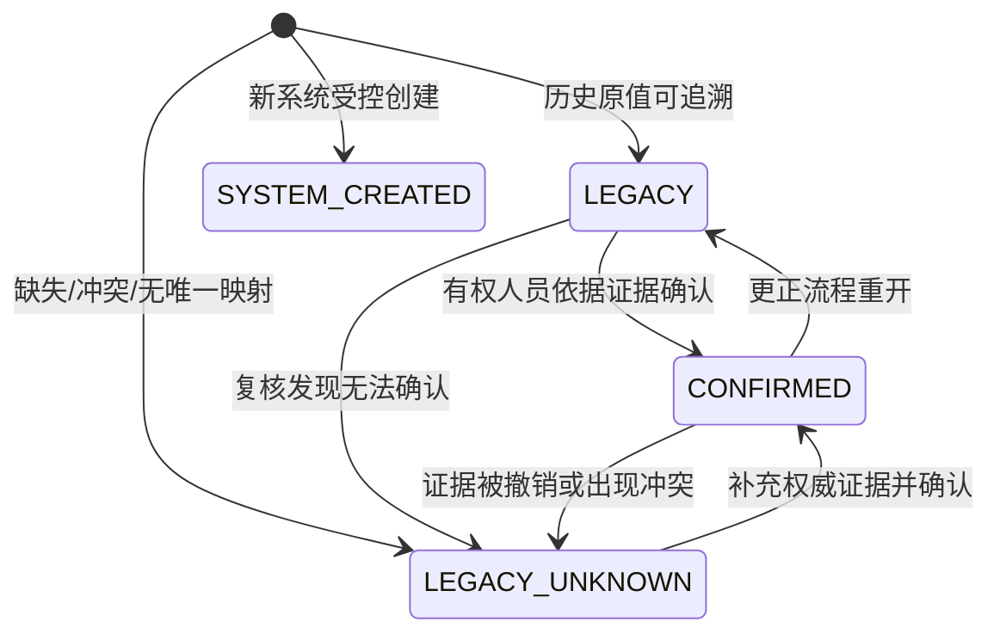
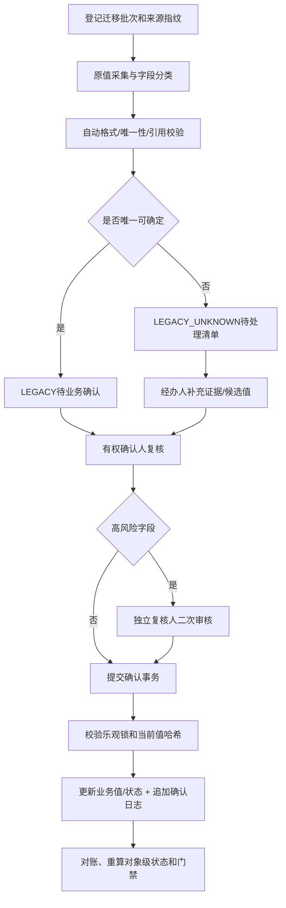

# Investment历史数据来源治理设计

## 1. 文档目标

本设计用于固化Investment模块历史数据的迁移、待确认、人工确认和证据留存规则，解决以下问题：

1. 区分历史原值、历史未知值、人工确认值和新系统原生值；
2. 禁止根据名称、日期、金额或相似度自动伪造业务事实；
3. 记录确认人、确认时间、确认依据、原值和确认值；
4. 使历史数据在决策、统计、阶段门禁和审计场景中可被明确识别。

本Sprint只产出设计，不修改已验证的 `V2.4.0__create_investment_decision_baseline.sql`，不修改历史SQL，不执行数据库变更。

## 2. 核心原则

### 2.1 来源与确认分离

“数据从哪里来”和“当前值是否已被业务确认”是两个不同维度：

- `origin_type`是不可变来源，确认后仍必须保留；
- `provenance_status`是可流转治理状态；
- 每次确认、退回、重开或更正都以新日志记录追加，不覆盖审计历史。

### 2.2 字段级溯源

同一条投资记录可能同时存在：

- 可直接迁移的历史编号和名称；
- 需人工确认的出资方式；
- 无法建立的项目或被投企业引用；
- 由新系统生成的审计字段。

因此溯源的最小粒度是“业务对象 + 字段”。对象级状态只是字段状态的聚合结果，不能替代字段级审计。

### 2.3 失败关闭

缺失、冲突、无证据或映射不唯一时，默认不使用该值做决策事实，不通过审批或生命周期门禁。

## 3. 状态模型

### 3.1 不可变来源类型 `origin_type`

| 编码 | 含义 | 规则 |
|---|---|---|
| `LEGACY` | 数据来自旧系统、历史SQL、台账或历史档案 | 必须记录来源系统/台账、表/文件、原始主键和迁移批次 |
| `SYSTEM_CREATED` | 对象或字段由新平台通过正常业务流程创建 | 必须有操作用户/系统主体、TraceId和创建时间 |

`origin_type`一经创建不得改写。历史值被人工确认后，来源仍是 `LEGACY`，不得改为 `SYSTEM_CREATED`。

### 3.2 治理状态 `provenance_status`

| 状态 | 定义 | 是否可作为权威事实 |
|---|---|---:|
| `LEGACY` | 已从可追溯历史来源原值迁移，但尚未完成业务确认 | 否；仅可用于历史展示和待治理清单 |
| `LEGACY_UNKNOWN` | 原值缺失、语义不明、存在冲突或无法建立唯一关联 | 否；必须阻断依赖该字段的关键流程 |
| `CONFIRMED` | 有权确认人已基于可验证依据确认当前值 | 是；但仍受有效期、字段级规则和审批状态约束 |
| `SYSTEM_CREATED` | 值由新系统的受控业务流程产生，不属于历史回填 | 是；前提是创建流程、权限和校验均成功 |

`LEGACY_UNKNOWN`不是真实业务值，只是治理哨兵状态。对业务字段已使用的 `LEGACY_UNKNOWN`（如V2.4.0中的 `investment_method`），后续确认必须将其替换为受控业务编码，不得将哨兵值纳入正常统计分组。

### 3.3 对象级聚合规则

| 条件 | 对象级状态 |
|---|---|
| 任一关键字段为 `LEGACY_UNKNOWN` | `LEGACY_UNKNOWN` |
| 无未知关键字段，但仍有待确认历史字段 | `LEGACY` |
| 所有关键历史字段已确认，且无未处理冲突 | `CONFIRMED` |
| 对象在新系统创建，不包含历史回填字段 | `SYSTEM_CREATED` |
| 新对象合并了历史字段 | 不得标记 `SYSTEM_CREATED`，按历史字段的最低信任等级聚合 |

## 4. 状态流转

补充规则：

- `SYSTEM_CREATED`不能转为 `LEGACY`；需更正时使用正常业务变更和数据变更审计；
- `CONFIRMED`不允许直接覆盖，必须先发起更正/重开申请；
- 重开只改变当前状态，历次确认记录和哈希不得删除。

## 5. 字段迁移规则

### 5.1 允许原值迁移

仅当来源可追溯、目标字段语义一致、类型与单位一致时，允许将下列数据按原值迁移并标记 `LEGACY`：

| 类别 | 允许迁移字段 | 前置检查 |
|---|---|---|
| 业务身份 | 投资编号、机会编号、报告编号、决策事项编号 | 原始值完整；有效记录中无重复；不通过随机编号替代业务编号 |
| 文本原值 | 名称、标题、分析摘要、会议名称、决策原文、备注 | 保持原文；字符集正常；敏感数据已分类 |
| 日期时间 | 签发日期、会议日期、创建/更新时间 | 时区和精度已明确；无非法零日期；不用导入时间代替业务时间 |
| 金额指标 | 原始投资额、收入、成本、利润、ROI、IRR、回收期 | 币种、单位、税口径、期间和精度一致；原值不被重新计算 |
| 历史原文件信息 | 原文件名、原路径、原档案编号 | 仅进入迁移溯源记录，不直接写入 `sys_file.id` |
| 删除状态 | 旧系统的明确有效/删除标识 | 已经过受控值映射；删除时间和原因可追溯 |

原值迁移只表示“转存准确”，不表示“业务事实已复核”。

### 5.2 仅允许通过受控映射迁移

| 类别 | 字段 | 必须满足 |
|---|---|---|
| 枚举状态 | `investment_type`、`risk_level`、审批/决策/尽调状态 | 存在已审批的映射版本；不在白名单的值进入 `LEGACY_UNKNOWN` |
| 组织和人员 | `org_id`、责任人、编制人、复核人 | 通过稳定外部编码映射；同名不得自动选择 |
| 关联对象 | `project_id`、`investment_id`、`investee_company_id`、`plan_id` | 外部稳定ID或经人工确认的唯一映射；映射结果留存 |
| 文件引用 | `primary_file_id`、`evidence_file_id` | 文件经安全扫描、受控导入和完整性校验，已生成 `sys_file.id` |
| 金额与比例 | 币种转换额、万元/元转换额、百分比 | 转换规则、汇率/基准日、原值和转换值全部留存 |

受控映射表或配置也必须版本化。迁移记录必须保存 `mapping_version`，否则无法重现迁移结果。

### 5.3 禁止自动推断

下列值必须保持空、保留安全哨兵值或进入待确认清单，禁止自动猜测：

1. 根据投资名称、合作方或金额推断 `project_id`、`investment_id` 或 `investee_company_id`；
2. 根据投资类型、实缴记录或凭证文字推断 `investment_method`；
3. 根据存在合作方推断 `cooperation_mode`，根据注册资本和投资额自动计算股权比例；
4. 根据会议日期、决议文件名或流程节点存在推断审批通过、三重一大适用性或党委前置研究完成；
5. 根据阶段名称、项目类型或日期推断生命周期模板、模板版本、阶段快照或完成状态；
6. 根据“有报告”推断可研/尽调已通过、已冻结、内容哈希、当前版本或当前冻结版本；
7. 根据利润、ROI、风险文本或人工备注推断可研结论、尽调结论、风险可接受性或决策结果；
8. 根据姓名、手机号、邮箱或相似度自动绑定 `sys_user.id`/`hr_employee.id`；
9. 根据文件路径或同名文件自动生成文件业务引用；
10. 在币种、单位、税口径、基准日或计算公式不明时自动换算金额、利润、ROI、IRR或回收期；
11. 根据数据库导入时间伪造业务提交、审批、冻结、会议或完成时间；
12. 为满足非空约束而伪造审批引用、决策路线哈希、内容哈希、证据文件或确认人。

## 6. 数据确认流程

### 6.1 流程

### 6.2 步骤详细规则

1. **批次登记**：记录迁移批次号、源系统、数据截止时间、提取SQL/文件哈希、条数和金额汇总；
2. **字段分类**：按直接迁移、受控映射、禁止推断分类，生成待确认任务；
3. **技术校验**：校验类型、长度、枚举、唯一键、外部映射、数量和金额，但技术校验不等于业务确认；
4. **证据补充**：经办人提交候选值、确认依据和备注，不能直接把数据置为 `CONFIRMED`；
5. **业务确认**：有权人员查看原值、候选值、差异和证据后签署确认；
6. **独立复核**：项目关联、投资金额、出资方式、股权比例、决策结果、审批引用、冻结版本等高风险字段必须双人复核；
7. **原子提交**：业务值更新、溯源状态更新和确认日志追加必须在同一事务；
8. **对账收尾**：重算记录状态，核对条数、金额、引用和未确认关键字段，异常时禁止关闭批次。

## 7. 确认人、时间与依据

### 7.1 必备审计信息

| 字段 | 必填 | 说明 |
|---|---:|---|
| `confirmed_by` | 是 | 确认人系统用户ID，不只保存姓名 |
| `confirmer_name_snapshot` | 是 | 确认时姓名快照 |
| `confirmer_org_id` | 是 | 确认时所属组织ID |
| `confirmer_role_snapshot` | 是 | 确认时的角色/岗位快照，不仅依赖后续RBAC现状 |
| `confirmed_time` | 是 | 数据库服务器时间 `DATETIME(3)` |
| `basis_type` | 是 | 确认依据类型 |
| `basis_reference` | 是 | 稳定档案号、合同号、会议号、审批实例号或文件ID |
| `basis_file_id` | 条件必填 | 依据为文件时引用 `sys_file.id` |
| `basis_summary` | 是 | 说明依据如何支持确认值，不可只填“已核实” |
| `source_value_hash` | 是 | 确认时原始值哈希，防止确认期间原值被替换 |
| `confirmed_value_hash` | 是 | 已确认值哈希 |
| `trace_id` | 是 | 确认请求链路标识 |
| `confirmation_note` | 否 | 补充说明，禁止写入密码、Token或身份证全文 |

### 7.2 确认依据类型

| 编码 | 依据 |
|---|---|
| `SIGNED_CONTRACT` | 已签署合同/协议 |
| `APPROVAL_RECORD` | 正式审批流程记录 |
| `MEETING_RESOLUTION` | 党委会、董事会、经理办公会等正式决议 |
| `FINANCIAL_VOUCHER` | 财务凭证、银行回单或经审计报表 |
| `AUDIT_REPORT` | 审计、评估、可研或尽调正式报告 |
| `REGISTRATION_RECORD` | 工商、产权、股权或不动产登记记录 |
| `GOVERNMENT_DOCUMENT` | 政府/国资监管部门正式文件 |
| `LEGACY_LEDGER` | 经归档并能识别责任单位的历史台账 |
| `OTHER_AUTHORIZED_EVIDENCE` | 经数据治理负责人批准的其他依据，必须填写批准引用 |

口头说明、聊天截图、未签署草稿、无来源导出文件和系统自动推荐不能单独作为 `CONFIRMED` 依据。

## 8. 权限与职责分离

### 8.1 建议权限

| 权限 | 用途 |
|---|---|
| `investment:provenance:view` | 查看溯源状态和非敏感证据摘要 |
| `investment:provenance:prepare` | 补充候选值和确认依据 |
| `investment:provenance:confirm` | 执行普通字段业务确认 |
| `investment:provenance:review` | 复核高风险字段 |
| `investment:provenance:reopen` | 重开已确认数据 |
| `investment:provenance:export` | 导出治理清单，必须受数据权限和脱敏约束 |

### 8.2 分离规则

1. 迁移程序/导入人不能成为 `confirmed_by`；
2. 候选值经办人原则上不能复核自己提交的高风险字段；
3. 确认人必须在该投资事项的Project访问范围和组织数据权限内；
4. 文件查看权限与数据确认权限分开，确认接口不得绕过文件密级授权；
5. 批量确认只允许同字段、同映射版本、同证据类型且逐条可审计的任务，禁止“一键全部确认”。

## 9. 后续数据库扩展建议

本Sprint不建表。后续应使用更高Flyway版本新增，不得回改V2.4.0。

### 9.1 溯源当前状态 `investment_data_provenance`

| 字段 | 说明 |
|---|---|
| `id` | 雪花主键 |
| `business_type` | `INVESTMENT_PROJECT/FEASIBILITY/DECISION/...` 白名单 |
| `business_id` | 业务对象ID，由服务校验对象存在与访问权限 |
| `field_name` | 稳定字段编码，`*` 表示对象级 |
| `origin_type` | `LEGACY/SYSTEM_CREATED`，创建后不可变 |
| `provenance_status` | `LEGACY/LEGACY_UNKNOWN/CONFIRMED/SYSTEM_CREATED` |
| `source_system` | 来源系统/台账编码 |
| `source_object` | 来源表、文件或档案编码 |
| `source_record_key` | 原始记录稳定主键 |
| `source_field` | 原始字段 |
| `source_value_hash` | 原值标准化后哈希，避免在审计表重复存敏感明文 |
| `migration_batch_no` | 迁移批次 |
| `mapping_version` | 枚举/关联映射版本 |
| `confirmed_by/time` | 最近一次有效确认人和时间 |
| `basis_type/reference/file_id` | 最近一次有效确认依据 |
| 通用字段 | 审计、逻辑删除、`delete_token`、备注和乐观锁 |

建议唯一键：`(business_type, business_id, field_name, delete_token)`。索引覆盖 `(provenance_status, business_type)`、`migration_batch_no`和 `confirmed_by/confirmed_time`。

### 9.2 追加式确认日志 `investment_data_confirmation_log`

日志至少保存：

- 溯源记录ID、动作类型、原状态、新状态；
- 原值哈希、候选/确认值哈希；
- 经办人、确认人、独立复核人及当时组织/角色快照；
- 确认依据、意见、动作时间、TraceId和幂等键；
- 重开/更正时引用被替代日志ID。

该表原则上不允许业务逻辑删除或修改；错误通过追加 `CORRECT/REOPEN/REVOKE` 动作更正。

### 9.3 迁移批次 `investment_migration_batch`

建议保存批次号、源系统、数据截止时间、提取文件/SQL哈希、记录数、金额汇总、异常数、待确认数、确认数、批次状态和对账报告引用。

## 10. 服务和查询规则

1. Investment详情需返回对象级溯源状态，但确认证据按权限另行查询；
2. 使用历史值的报表必须按 `CONFIRMED/SYSTEM_CREATED`与未确认数据分组，不得默认混算；
3. 决策、冻结、审批和生命周期门禁只可使用 `CONFIRMED` 或 `SYSTEM_CREATED` 的关键字段；
4. `LEGACY_UNKNOWN`不得被前端转换为“现金”、“其他”或0，必须显示为“历史待确认”；
5. 溯源为通用审计能力，但不得绕过 `ProjectAccessPolicy`、组织数据权限、RBAC和文件密级权限；
6. 导出内容默认不包含原始敏感值，只包含状态、哈希、证据引用和脱敏摘要。

## 11. 安全与审计

- 原始数据包和确认证据使用独立存储权限，不存入业务日志；
- 身份证、银行账号、手机号等不写入确认意见，必要时仅保存密文或哈希；
- 确认请求必须防重放，幂等键在同一溯源任务内唯一；
- 提交前比对业务记录 `version`和原值哈希，发生并发变更时拒绝确认；
- 所有确认、退回、豁免、重开、导出和证据下载写入 `sys_log`，不记录附件全文；
- 确认日志按国资审计和档案要求设置保留期，不随业务对象逻辑删除而清理。

## 12. 验收规则

后续实施至少覆盖：

1. 原值迁移后 `origin_type=LEGACY`，原记录键、批次和哈希完整；
2. 缺失、冲突和多候选映射必须产生 `LEGACY_UNKNOWN`，不自动选值；
3. `LEGACY_UNKNOWN`未确认时无法通过投资方案冻结或决策门禁；
4. 确认人、时间、依据、原/确认值哈希和TraceId缺一时事务失败；
5. 无权、越组织、绕过Project访问策略、确认自己提交的高风险字段均被拒绝；
6. 并发修改导致乐观锁或原值哈希变化时确认失败；
7. 确认后仍能追溯 `origin_type=LEGACY`和全部状态历史；
8. 重开和更正通过新日志记录完成，不覆盖原确认记录；
9. 批次前后记录数、金额、引用和状态分布对账一致；
10. 报表和导出可正确区分已确认、系统创建和待治理数据。

## 13. 后续实施顺序

1. 评审来源状态和高风险字段清单；
2. 以更高Flyway版本创建批次、字段溯源和确认日志表；
3. 建立历史字段扫描和待确认任务生成器，先试运行不更新业务值；
4. 实现权限、四眼原则、事务提交、幂等和审计；
5. 小批量确认并完成对账，再扩大治理范围；
6. 数据治理结束后以新Migration收紧业务枚举和引用约束，永不回改已执行Migration。
