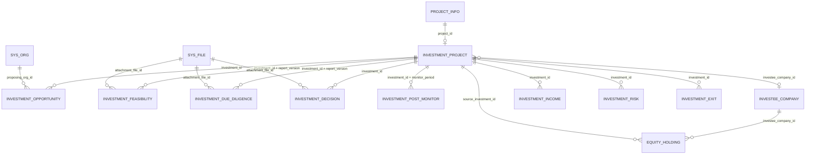

# 投资项目数据库模型设计

> 版本：V1.0
> 对应阶段：Sprint 2-1.1
> 文档性质：数据库设计，不修改业务代码、不执行Migration
> 设计基线：`07_investment.sql`、`investment-project-domain-design.md`
> 数据库：`enterprise_platform`

## 1. 设计目标与原则

本设计以 `project_info` 为通用项目聚合根，以 `investment_project` 为投资事项权威数据。Project负责项目身份、责任组织、负责人和生命周期；Investment负责机会、论证、决策、实施、投后及退出事实。

设计遵循以下规则：

1. 不修改历史初始化脚本 `07_investment.sql`，后续变更必须通过独立Migration交付。
2. 不创建第二套投资事项台账；`investment_project` 始终是投资事项唯一权威主表。
3. `project_info` 与 `investment_project` 使用ID关联，不把投资专业字段写入 `project_info`。
4. 被投企业和股权为独立聚合，禁止嵌入 `investment_project`。
5. 金额统一使用 `DECIMAL(18,2)`，比例统一使用 `DECIMAL(9,4)` 或 `DECIMAL(7,4)`，禁止浮点类型。
6. 主键由应用雪花算法生成，避免依赖MySQL自增，兼容达梦和人大金仓。
7. 所有业务表包含审计、逻辑删除和乐观锁字段；时间精度统一为毫秒。
8. 枚举在应用层集中管理，数据库保存稳定英文编码，不使用数据库原生ENUM。
9. 敏感附件只保存 `sys_file.id` 引用，不保存外部URL、文件系统路径或文件正文。
10. 外键用于表达结构关系；生产环境是否启用物理外键由国产数据库兼容和运维策略统一决定，应用层必须始终校验引用完整性。

### 1.1 统一字段

除专门说明外，所有新表统一包含：

| 字段 | 类型 | 约束 | 说明 |
|---|---|---|---|
| `id` | BIGINT | PK, NOT NULL | 雪花主键 |
| `create_time` | DATETIME(3) | NOT NULL | 创建时间 |
| `create_by` | VARCHAR(64) | NULL | 创建人账号或用户ID字符串 |
| `update_time` | DATETIME(3) | NOT NULL | 更新时间 |
| `update_by` | VARCHAR(64) | NULL | 更新人账号或用户ID字符串 |
| `deleted` | SMALLINT | NOT NULL DEFAULT 0 | 逻辑删除标识，0正常、1删除 |
| `delete_token` | BIGINT | NOT NULL DEFAULT 0 | 逻辑删除唯一键释放令牌 |
| `remark` | VARCHAR(500) | NULL | 备注 |
| `version` | INT | NOT NULL DEFAULT 0 | 乐观锁版本 |

`delete_token` 在有效记录中固定为0，逻辑删除时更新为唯一非零值，使带 `delete_token` 的唯一索引允许删除后重建业务键。

## 2. 总体关系模型

### 2.1 基数与权威关系

- `project_info 1 : 0..1 investment_project`：一个通用项目最多对应一个有效主投资事项。当前基线没有唯一约束，收紧前必须审计存量一对多数据。
- `investment_project 1 : N investment_opportunity`：允许保留多轮机会登记，但同一投资事项最多一个有效的已转化机会。
- `investment_project 1 : N investment_feasibility`：按报告版本保存，不覆盖历史版本。
- `investment_project 1 : N investment_due_diligence`：按尽调类型和报告版本保存。
- `investment_project 1 : N investment_decision`：党委会、经理办公会、董事会、股东会等分别记录。
- `investment_project 1 : N investment_post_monitor`：每个监管周期一条汇总快照。
- `investee_company 1 : N equity_holding`：被投企业独立维护股权台账。

## 3. 投资事项主表 `investment_project`

### 3.1 定位

`investment_project` 是Investment限界上下文的聚合根和唯一权威投资事项台账。`project_info` 保存通用项目信息；二者不共享可编辑的投资金额、比例、合作模式等专业字段。

### 3.2 字段设计

| 字段 | 类型 | 约束 | 说明 |
|---|---|---|---|
| `id` | BIGINT | PK | 投资事项ID |
| `investment_no` | VARCHAR(50) | NOT NULL | 投资编号 |
| `project_id` | BIGINT | NOT NULL, FK | 关联 `project_info.id` |
| `plan_id` | BIGINT | NULL, FK | 年度投资计划ID |
| `investment_name` | VARCHAR(200) | NOT NULL | 投资名称 |
| `investment_type` | VARCHAR(50) | NOT NULL | EQUITY/FIXED_ASSET/FUND/DATA_ASSET/OTHER |
| `investment_method` | VARCHAR(50) | NOT NULL | CASH/ASSET/EQUITY/TECHNOLOGY/DATA_ASSET/MIXED |
| `cooperation_mode` | VARCHAR(50) | NULL | SOLE/JV/STRATEGIC_COOPERATION/FUND_PARTNERSHIP/OTHER |
| `industry` | VARCHAR(100) | NULL | 所属行业 |
| `total_amount` | DECIMAL(18,2) | NOT NULL DEFAULT 0 | 投资总额 |
| `own_capital` | DECIMAL(18,2) | NOT NULL DEFAULT 0 | 自有资金 |
| `financing_amount` | DECIMAL(18,2) | NOT NULL DEFAULT 0 | 融资金额 |
| `investment_ratio` | DECIMAL(7,4) | NULL | 拟持股比例，0—100 |
| `partner_summary` | VARCHAR(500) | NULL | 合作方摘要，不作为合作方主数据 |
| `investee_company_id` | BIGINT | NULL, FK | 被投企业或SPV企业ID |
| `expected_income` | DECIMAL(18,2) | NOT NULL DEFAULT 0 | 预计收益 |
| `expected_roi` | DECIMAL(9,4) | NULL | 预计收益率，0—100 |
| `risk_level` | VARCHAR(20) | NOT NULL | LOW/MEDIUM/HIGH/CRITICAL |
| `approval_status` | VARCHAR(30) | NOT NULL | NOT_SUBMITTED/IN_REVIEW/APPROVED/REJECTED |
| `status` | VARCHAR(30) | NOT NULL | 投资事项业务状态 |
| 统一字段 | 见1.1 |  | 审计、删除、备注和版本 |

与现有基线相比，目标模型新增或语义调整：

- 新增 `investment_method`、`cooperation_mode`；
- `partner_name` 语义升级为 `partner_summary`；
- `spv_company_id` 语义升级为 `investee_company_id`；
- `project_id` 由可空收紧为非空，但必须在存量数据治理后执行；
- `investment_project.project_id` 增加有效记录唯一性。

### 3.3 约束与索引

| 名称 | 类型 | 字段 | 用途 |
|---|---|---|---|
| `pk_investment_project` | PK | `id` | 主键 |
| `uk_investment_project_no` | UNIQUE | `investment_no, delete_token` | 投资编号唯一 |
| `uk_investment_project_project` | UNIQUE | `project_id, delete_token` | 一个Project一个有效主投资事项 |
| `idx_investment_project_plan` | INDEX | `plan_id, approval_status, deleted` | 计划与审批查询 |
| `idx_investment_project_company` | INDEX | `investee_company_id, status, deleted` | 被投企业反查 |
| `idx_investment_project_status` | INDEX | `status, risk_level, deleted` | 状态和风险筛选 |

检查约束：金额不小于0；`own_capital + financing_amount <= total_amount`；比例和ROI为空或在0—100之间；`deleted` 只能为0或1。资金结构允许存在其他资金来源，因此不强制等于投资总额。

### 3.4 与 `project_info` 的关系

1. `project_id` 必须引用 `project_info.id`。
2. 被引用项目必须是投资类项目，建议以应用层稳定编码校验，避免跨表CHECK约束。
3. 创建投资事项前必须先创建Project；删除Project前必须校验投资事项状态。
4. Investment查询必须先通过Project访问策略与Project责任组织数据权限，不能因为投资表本身没有组织字段而绕过权限。
5. `project_investment_info` 仅为Project侧摘要或兼容投影，不允许作为投资专业事实写入口。

## 4. 投资机会表 `investment_opportunity`

### 4.1 字段设计

| 字段 | 类型 | 约束 | 说明 |
|---|---|---|---|
| `id` | BIGINT | PK | 机会ID |
| `opportunity_no` | VARCHAR(50) | NOT NULL | 机会编号 |
| `investment_id` | BIGINT | NULL, FK | 转化后的投资事项ID；机会阶段允许为空 |
| `opportunity_name` | VARCHAR(200) | NOT NULL | 机会名称 |
| `source_type` | VARCHAR(50) | NOT NULL | STRATEGIC_PLAN/GOVERNMENT_ASSIGNMENT/MARKET_DISCOVERY/INTERNAL_PROPOSAL/PARTNER_PROPOSAL/OTHER |
| `source_description` | VARCHAR(500) | NULL | 来源说明 |
| `proposing_org_id` | BIGINT | NOT NULL, FK | 提出部门，关联 `sys_org.id` |
| `proposer_id` | BIGINT | NULL | 提出人用户ID |
| `investment_direction` | VARCHAR(200) | NOT NULL | 投资方向 |
| `partner_summary` | VARCHAR(500) | NULL | 候选合作方摘要 |
| `preliminary_amount` | DECIMAL(18,2) | NULL | 初步投资额 |
| `preliminary_income` | DECIMAL(18,2) | NULL | 初步收益 |
| `preliminary_roi` | DECIMAL(9,4) | NULL | 初步ROI，百分比 |
| `preliminary_irr` | DECIMAL(9,4) | NULL | 初步IRR，百分比 |
| `payback_period` | DECIMAL(9,2) | NULL | 初步回收期，年 |
| `estimate_date` | DATE | NULL | 测算基准日 |
| `estimate_assumption` | TEXT | NULL | 测算假设 |
| `status` | VARCHAR(30) | NOT NULL | DISCOVERED/SCREENING/ACCEPTED/REJECTED/CONVERTED/CLOSED |
| `screening_conclusion` | VARCHAR(1000) | NULL | 筛选结论 |
| `converted_time` | DATETIME(3) | NULL | 转化时间 |
| 统一字段 | 见1.1 |  | 通用字段 |

### 4.2 约束与索引

- 唯一索引：`(opportunity_no, delete_token)`。
- 普通索引：`(proposing_org_id, status, deleted)`、`(source_type, status, deleted)`、`(investment_id, deleted)`。
- 金额、回收期不小于0；ROI与IRR允许负值以表达亏损预期，建议范围为-1000至1000。
- `status='CONVERTED'` 时 `investment_id` 与 `converted_time` 必须非空；跨字段状态规则由应用服务和验收SQL共同保证。
- 合作方摘要不是合作方主数据。未来多合作方、出资承诺和尽调结果应单独设计关系表，不能扩展为逗号分隔ID。

## 5. 投资论证模型

### 5.1 可研表 `investment_feasibility`

现有表保留名称，升级为不可变报告版本模型。

| 字段 | 类型 | 约束 | 说明 |
|---|---|---|---|
| `id` | BIGINT | PK | 可研报告ID |
| `investment_id` | BIGINT | NOT NULL, FK | 投资事项ID |
| `report_version` | INT | NOT NULL | 报告版本，从1递增 |
| `report_no` | VARCHAR(100) | NULL | 报告编号 |
| `report_name` | VARCHAR(200) | NOT NULL | 报告名称 |
| `market_analysis` | TEXT | NULL | 市场分析摘要 |
| `technical_analysis` | TEXT | NULL | 技术分析摘要 |
| `financial_analysis` | TEXT | NULL | 财务分析摘要 |
| `risk_analysis` | TEXT | NULL | 风险分析摘要 |
| `investment_period` | INT | NULL | 投资周期，月 |
| `annual_income` | DECIMAL(18,2) | NOT NULL | 预计年收入 |
| `annual_cost` | DECIMAL(18,2) | NOT NULL | 预计年成本 |
| `annual_profit` | DECIMAL(18,2) | NOT NULL | 预计年利润 |
| `roi` | DECIMAL(9,4) | NULL | 投资回报率 |
| `irr` | DECIMAL(9,4) | NULL | 内部收益率 |
| `payback_period` | DECIMAL(9,2) | NULL | 回收期，年 |
| `conclusion` | VARCHAR(30) | NOT NULL | PENDING/PASS/CONDITIONAL_PASS/FAIL |
| `conclusion_summary` | VARCHAR(2000) | NULL | 论证结论摘要 |
| `attachment_file_id` | BIGINT | NULL, FK | 报告附件，关联 `sys_file.id` |
| `approval_instance_ref` | VARCHAR(100) | NULL | 审批流程实例稳定引用 |
| `status` | VARCHAR(30) | NOT NULL | DRAFT/SUBMITTED/APPROVED/REJECTED/FROZEN |
| `frozen_time` | DATETIME(3) | NULL | 冻结时间 |
| 统一字段 | 见1.1 |  | 通用字段 |

索引与规则：

- 唯一索引 `(investment_id, report_version, delete_token)`。
- 索引 `(investment_id, status, deleted)`、`(approval_instance_ref, deleted)`。
- 已冻结版本禁止原地修改，修订必须创建更高版本。
- 原唯一键 `(investment_id, delete_token)` 必须在引入版本前解除，否则无法保存历史版本。
- `annual_profit` 可为负数；不建议继续使用“利润必须等于收入减成本”的数据库CHECK，因为税费、折旧和口径可能由独立测算明细决定，应用层应保存测算口径。

### 5.2 尽调表 `investment_due_diligence`

| 字段 | 类型 | 约束 | 说明 |
|---|---|---|---|
| `id` | BIGINT | PK | 尽调报告ID |
| `investment_id` | BIGINT | NOT NULL, FK | 投资事项ID |
| `due_diligence_type` | VARCHAR(30) | NOT NULL | LEGAL/FINANCIAL/BUSINESS/TECHNICAL/TAX/ASSET/COMPREHENSIVE |
| `report_version` | INT | NOT NULL | 同类型报告版本 |
| `report_no` | VARCHAR(100) | NULL | 报告编号 |
| `report_name` | VARCHAR(200) | NOT NULL | 报告名称 |
| `entrusted_org` | VARCHAR(200) | NULL | 受托机构名称 |
| `start_date` | DATE | NULL | 尽调开始日期 |
| `end_date` | DATE | NULL | 尽调结束日期 |
| `conclusion` | VARCHAR(30) | NOT NULL | PENDING/PASS/CONDITIONAL_PASS/FAIL |
| `conclusion_summary` | VARCHAR(2000) | NULL | 结论摘要 |
| `material_risk_count` | INT | NOT NULL DEFAULT 0 | 重大风险数量 |
| `unresolved_risk_count` | INT | NOT NULL DEFAULT 0 | 未关闭风险数量 |
| `attachment_file_id` | BIGINT | NULL, FK | 尽调报告附件 |
| `approval_instance_ref` | VARCHAR(100) | NULL | 审批流程引用 |
| `status` | VARCHAR(30) | NOT NULL | DRAFT/SUBMITTED/APPROVED/REJECTED/FROZEN |
| `frozen_time` | DATETIME(3) | NULL | 冻结时间 |
| 统一字段 | 见1.1 |  | 通用字段 |

唯一索引 `(investment_id, due_diligence_type, report_version, delete_token)`；查询索引 `(investment_id, status, deleted)`、`(conclusion, unresolved_risk_count, deleted)`。

尽调只保存报告、结论和风险计数。具体风险事项继续进入 `investment_risk`；不得把完整风险清单拼接进TEXT字段。

## 6. 投资决策表 `investment_decision`

### 6.1 字段设计

| 字段 | 类型 | 约束 | 说明 |
|---|---|---|---|
| `id` | BIGINT | PK | 决策记录ID |
| `investment_id` | BIGINT | NOT NULL, FK | 投资事项ID |
| `decision_no` | VARCHAR(100) | NOT NULL | 决策事项编号 |
| `decision_subject` | VARCHAR(300) | NOT NULL | 决策事项 |
| `decision_type` | VARCHAR(50) | NOT NULL | PARTY_COMMITTEE/MANAGER_MEETING/BOARD/SHAREHOLDER |
| `sequence_no` | INT | NOT NULL DEFAULT 1 | 同一事项决策顺序 |
| `meeting_date` | DATE | NULL | 会议日期 |
| `meeting_name` | VARCHAR(200) | NULL | 会议名称 |
| `approval_instance_ref` | VARCHAR(100) | NULL | 审批流实例稳定引用 |
| `major_decision_ref` | VARCHAR(100) | NULL | 三重一大事项稳定引用 |
| `approval_status` | VARCHAR(30) | NOT NULL | NOT_SUBMITTED/IN_REVIEW/APPROVED/REJECTED/WITHDRAWN |
| `decision_result` | VARCHAR(50) | NULL | APPROVED/CONDITIONAL_APPROVED/REJECTED/DEFERRED |
| `decision_content` | TEXT | NULL | 决策内容摘要 |
| `condition_summary` | VARCHAR(2000) | NULL | 附条件批准内容 |
| `conditions_closed` | SMALLINT | NOT NULL DEFAULT 0 | 附加条件是否关闭 |
| `attachment_file_id` | BIGINT | NULL, FK | 决议附件 |
| `decided_time` | DATETIME(3) | NULL | 决策完成时间 |
| 统一字段 | 见1.1 |  | 通用字段 |

### 6.2 约束与索引

- 唯一索引 `(decision_no, decision_type, sequence_no, delete_token)`。
- 索引 `(investment_id, approval_status, deleted)`、`(major_decision_ref, deleted)`、`(approval_instance_ref, deleted)`。
- `decision_result='CONDITIONAL_APPROVED'` 时必须填写 `condition_summary`。
- 决策通过后记录原则上只允许追加更正记录，不允许覆盖会议日期、结果和附件。
- `major_decision_ref` 只保存跨域稳定引用；三重一大正文、参会人和会议流程由治理/审批模块维护。
- `approval_status` 表示流程状态，`decision_result` 表示业务结论，二者不得混用。

## 7. 投后监测表 `investment_post_monitor`

### 7.1 定位

`investment_post_monitor` 是按周期形成的投后综合快照，用于驾驶舱与阶段判断。收益、分红、风险和退出的权威明细仍分别保存在 `investment_income`、`investment_risk`、`investment_exit`，禁止在快照表中替代流水台账。

### 7.2 字段设计

| 字段 | 类型 | 约束 | 说明 |
|---|---|---|---|
| `id` | BIGINT | PK | 投后监测ID |
| `investment_id` | BIGINT | NOT NULL, FK | 投资事项ID |
| `investee_company_id` | BIGINT | NULL, FK | 被投企业ID |
| `monitor_period` | VARCHAR(20) | NOT NULL | 期间，如2027Q1或2027-03 |
| `period_type` | VARCHAR(20) | NOT NULL | MONTH/QUARTER/YEAR/SPECIAL |
| `period_start` | DATE | NOT NULL | 周期开始日 |
| `period_end` | DATE | NOT NULL | 周期结束日 |
| `cumulative_income` | DECIMAL(18,2) | NOT NULL DEFAULT 0 | 累计投资收益 |
| `period_income` | DECIMAL(18,2) | NOT NULL DEFAULT 0 | 本期投资收益 |
| `cumulative_dividend` | DECIMAL(18,2) | NOT NULL DEFAULT 0 | 累计分红 |
| `period_dividend` | DECIMAL(18,2) | NOT NULL DEFAULT 0 | 本期分红 |
| `open_risk_count` | INT | NOT NULL DEFAULT 0 | 未关闭风险数 |
| `critical_risk_count` | INT | NOT NULL DEFAULT 0 | 重大未关闭风险数 |
| `exit_status` | VARCHAR(30) | NULL | NOT_PLANNED/PLANNED/APPROVING/EXECUTING/COMPLETED |
| `evaluation_score` | DECIMAL(5,2) | NULL | 本期综合评价分 |
| `operation_summary` | VARCHAR(2000) | NULL | 经营评价摘要 |
| `data_cutoff_time` | DATETIME(3) | NOT NULL | 快照数据截止时间 |
| `status` | VARCHAR(20) | NOT NULL | DRAFT/CONFIRMED/CLOSED |
| `confirmed_by` | BIGINT | NULL | 确认人用户ID |
| `confirmed_time` | DATETIME(3) | NULL | 确认时间 |
| 统一字段 | 见1.1 |  | 通用字段 |

### 7.3 约束与索引

- 唯一索引 `(investment_id, monitor_period, delete_token)`。
- 索引 `(investee_company_id, monitor_period, deleted)`、`(critical_risk_count, status, deleted)`、`(period_end, status, deleted)`。
- `period_start <= period_end`，风险数量非负，评分为空或在0—100之间。
- 已确认快照不可重算覆盖；发现差错时新增更正版本或先走撤回审批。
- 快照金额可通过权威明细重算，需保存 `data_cutoff_time` 以保证可追溯。

## 8. 被投企业表 `investee_company`

### 8.1 定位与命名治理

目标名称使用用户指定的 `investee_company`，表达“被投企业”而非宽泛的“投资公司”。现有 `investment_company` 数据不得复制成第二套可编辑主数据；正式Migration应采用受控重命名与兼容视图过渡。

### 8.2 字段设计

| 字段 | 类型 | 约束 | 说明 |
|---|---|---|---|
| `id` | BIGINT | PK | 被投企业ID |
| `company_name` | VARCHAR(200) | NOT NULL | 企业名称 |
| `credit_code` | VARCHAR(100) | NOT NULL | 统一社会信用代码 |
| `legal_person` | VARCHAR(50) | NULL | 法定代表人 |
| `register_capital` | DECIMAL(18,2) | NOT NULL DEFAULT 0 | 注册资本 |
| `currency_code` | CHAR(3) | NOT NULL DEFAULT 'CNY' | ISO 4217币种 |
| `establish_date` | DATE | NULL | 成立日期 |
| `industry` | VARCHAR(100) | NULL | 所属行业 |
| `company_type` | VARCHAR(50) | NULL | CONTROLLED/PARTICIPATED/SPV/FUND/OTHER |
| `registered_address` | VARCHAR(300) | NULL | 注册地址 |
| `business_scope` | TEXT | NULL | 经营范围 |
| `ownership_nature` | VARCHAR(50) | NULL | 所有制性质 |
| `control_type` | VARCHAR(30) | NULL | CONTROL/JOINT_CONTROL/SIGNIFICANT_INFLUENCE/FINANCIAL_INVESTMENT |
| `status` | VARCHAR(30) | NOT NULL | PREPARING/NORMAL/SUSPENDED/CANCELLED/LIQUIDATED |
| 统一字段 | 见1.1 |  | 通用字段 |

唯一索引 `(credit_code, delete_token)`；索引 `(company_name, deleted)`、`(status, industry, deleted)`。

## 9. 股权台账表 `equity_holding`

### 9.1 定位与字段

目标名称使用 `equity_holding`，替代现有 `investment_equity` 的宽泛命名。股权记录属于被投企业聚合，不嵌入投资事项表。

| 字段 | 类型 | 约束 | 说明 |
|---|---|---|---|
| `id` | BIGINT | PK | 股权台账ID |
| `investee_company_id` | BIGINT | NOT NULL, FK | 被投企业ID |
| `source_investment_id` | BIGINT | NULL, FK | 形成该持股的投资事项ID |
| `holder_id` | BIGINT | NULL | 内部股东主数据ID，外部股东可空 |
| `holder_name` | VARCHAR(200) | NOT NULL | 股东名称快照 |
| `holder_type` | VARCHAR(50) | NULL | STATE_OWNED/PRIVATE/FOREIGN/NATURAL_PERSON/OTHER |
| `holding_ratio` | DECIMAL(7,4) | NOT NULL | 持股比例，0—100 |
| `investment_amount` | DECIMAL(18,2) | NOT NULL DEFAULT 0 | 累计出资金额 |
| `currency_code` | CHAR(3) | NOT NULL DEFAULT 'CNY' | 币种 |
| `share_type` | VARCHAR(50) | NULL | 普通股、优先股等 |
| `acquire_date` | DATE | NULL | 取得日期 |
| `effective_from` | DATE | NOT NULL | 生效开始日 |
| `effective_to` | DATE | NULL | 生效结束日 |
| `status` | VARCHAR(20) | NOT NULL | ACTIVE/TRANSFERRED/EXITED/INVALID |
| 统一字段 | 见1.1 |  | 通用字段 |

### 9.2 约束与索引

- 唯一索引 `(investee_company_id, holder_name, share_type, effective_from, delete_token)`。
- 索引 `(source_investment_id, status, deleted)`、`(investee_company_id, status, deleted)`。
- `holding_ratio` 在0—100之间，金额不小于0，`effective_to` 不早于 `effective_from`。
- 同一企业同一时点有效股权比例合计不超过100%，该跨行约束由事务服务和数据库验收SQL保证。
- 股权变更采用新增有效期记录，不覆盖历史持股比例。

## 10. 附件引用设计

本阶段要求可研、尽调和决策保存附件引用。为兼容现有单附件需求，目标表可先使用 `attachment_file_id`。若同一业务记录需要多附件，后续统一增加关系表：

`investment_document_ref(id, business_type, business_id, document_type, file_id, document_version, is_primary, ...)`

约束规则：

1. `file_id` 引用 `sys_file.id`；
2. 禁止继续写入 `attachment VARCHAR(500)` 路径；
3. 下载权限必须同时校验投资事项访问权限和文件业务绑定；
4. 决策、尽调材料应设置密级、保留期限和下载审计；这些字段由文件中心统一管理，不在投资表重复保存。

## 11. 现有基线到目标模型差异

| 对象 | 当前基线 | 目标设计 | 治理方式 |
|---|---|---|---|
| `investment_project` | 已有，缺投资方式/合作模式；Project关联可空 | 扩展字段并收紧一对一关系 | ALTER + 数据治理 + 约束收紧 |
| `investment_opportunity` | 不存在 | 新增机会模型 | CREATE |
| `investment_feasibility` | 单记录覆盖，附件路径 | 版本化报告、结论、文件ID、流程引用 | 扩展后回填V1 |
| `investment_due_diligence` | 不存在 | 新增版本化尽调 | CREATE |
| `investment_decision` | 已有会议结果，缺事项/流程/三重一大引用 | 扩展审批与决策语义 | ALTER + 回填 |
| `investment_post_monitor` | 不存在；现有指标/收益/风险/退出分散 | 新增周期综合快照 | CREATE，不替代明细表 |
| `investment_company` | 已有 | 目标命名 `investee_company` 并补充治理字段 | 受控RENAME + 兼容视图 |
| `investment_equity` | 已有 | 目标命名 `equity_holding`，增加来源和有效期 | 受控RENAME + 扩展 |
| 附件 | VARCHAR路径 | `sys_file.id` 引用 | 双写/回填/收敛 |

## 12. Migration方案

### 12.1 原则

- 本文只设计Migration，不创建或执行SQL文件。
- 版本接续现有 `V2.1.3`，建议使用 `V2.2.x`。
- 采用“扩展—回填—校验—收紧—兼容清理”，DDL、数据回填和约束收紧分开交付。
- 历史Migration与 `07_investment.sql` 不得修改。
- 每个版本必须提供MySQL 8、达梦、人大金仓语法适配说明和空库/存量库测试结果。

### 12.2 版本规划

| 版本 | 建议文件 | 内容 | 可用性影响 |
|---|---|---|---|
| V2.2.0 | `V2.2.0__create_investment_opportunity_and_due_diligence.sql` | 新建机会与尽调表 | 仅扩展，无停机 |
| V2.2.1 | `V2.2.1__extend_investment_project.sql` | 增加投资方式、合作模式及新企业引用字段 | 仅扩展 |
| V2.2.2 | `V2.2.2__version_investment_feasibility.sql` | 增加报告版本、结论、文件与流程字段；移除旧唯一约束前置检查 | 短时DDL锁风险 |
| V2.2.3 | `V2.2.3__extend_investment_decision.sql` | 增加决策事项、流程、三重一大、条件字段 | 仅扩展 |
| V2.2.4 | `V2.2.4__create_investment_post_monitor.sql` | 新建投后周期快照表 | 仅扩展 |
| V2.2.5 | `V2.2.5__rename_investee_company_and_equity.sql` | 重命名企业/股权表并建立过渡兼容视图 | 需维护窗口 |
| V2.2.6 | `V2.2.6__backfill_investment_v2.sql` | 回填报告V1、附件引用、企业引用及股权有效期 | 数据迁移 |
| V2.2.7 | `V2.2.7__validate_investment_v2.sql` | 输出孤儿、重复Project、比例与金额异常报告 | 只读校验 |
| V2.2.8 | `V2.2.8__enforce_investment_v2_constraints.sql` | 收紧非空、唯一键和外键 | 阻断式门禁 |
| V2.2.9 | `V2.2.9__retire_investment_legacy_columns.sql` | 观察期后清理旧列/兼容视图 | 独立发布，可延期 |

### 12.3 新增表清单

确定新增：

1. `investment_opportunity`；
2. `investment_due_diligence`；
3. `investment_post_monitor`。

条件新增：

4. `investment_document_ref`：仅在确认一条业务记录需要多附件后创建。

`investee_company` 与 `equity_holding` 不是新增第二套表，而是现有 `investment_company`、`investment_equity` 的目标命名与结构升级。

### 12.4 存量数据回填

1. 盘点 `investment_project.project_id IS NULL`，由业务确认关联项目；不得自动伪造Project。
2. 检查一个 `project_id` 对应多个有效投资事项的记录，输出冲突清单；不得直接选择最早或最新记录。
3. 现有可研记录统一回填 `report_version=1`，仅在有明确业务结果时回填结论，否则为 `PENDING`。
4. 旧附件路径通过文件中心受控导入生成 `sys_file.id`；导入失败的记录保留旧路径并进入异常清单。
5. 决策历史记录生成 `decision_no` 时使用可追溯的历史业务编号；无编号时生成迁移专用编号并记录映射表，不伪造审批和三重一大引用。
6. 现有被投企业和股权ID在表重命名后保持不变，避免外键和业务引用重映射。
7. 现有股权 `effective_from` 优先取 `acquire_date`；缺失时标记待确认，禁止使用Migration执行日冒充取得日期。

### 12.5 收紧前检查SQL口径

正式脚本应至少核查：

- 投资编号重复数量；
- `project_id` 空值与重复有效记录；
- Project不存在或Project类型不匹配；
- 金额小于0、资金结构超过总额；
- 比例越界和同一企业有效持股比例合计超过100%；
- 报告版本重复、版本断档；
- 决策通过但缺会议/审批依据；
- 已转化机会缺投资事项；
- 已确认投后快照缺数据截止时间；
- 所有外键孤儿记录。

任一阻断项非零时，不得执行V2.2.8约束收紧。

## 13. 回滚方案

### 13.1 回滚原则

1. 扩展阶段优先停用新功能，不立即删除新表或新列。
2. 数据回填前必须完成全量备份和恢复演练，并记录记录数、金额汇总及校验和。
3. 发生业务写入后，禁止通过DROP表简单回滚；应前向修复或双向数据同步后切回旧读路径。
4. 约束收紧失败时回退约束，不回退已经核验有效的数据。
5. 重命名操作必须在维护窗口执行，并准备反向RENAME及依赖对象清单。

### 13.2 分版本回滚

| 版本范围 | 回滚方式 |
|---|---|
| V2.2.0—V2.2.4 | 未启用业务写入时可受控删除新增对象；已写入时保留表并关闭功能开关 |
| V2.2.5 | 移除兼容视图后反向重命名；核对全部外键、视图、Mapper和报表依赖 |
| V2.2.6 | 使用迁移前备份及逐表映射回退；附件导入不物理删除，只解除业务关联 |
| V2.2.7 | 只读检查，无数据回滚 |
| V2.2.8 | 删除新增非空/唯一/外键约束，保留已迁移数据 |
| V2.2.9 | 原则上不可直接回滚；执行前保留旧列归档表至少一个发布周期 |

回滚验收必须比较：核心表记录数、按投资事项金额汇总、决策记录数、收益与分红汇总、股权比例、文件引用数和外键孤儿数。

## 14. 性能与安全设计

### 14.1 查询与索引

- 投资列表以 `project_info` 责任组织作为数据权限入口，再按 `project_id` 关联投资主表。
- 禁止对金额、日期和状态列使用函数后再过滤，避免索引失效。
- 投后驾驶舱优先读取已确认的 `investment_post_monitor`，明细追溯再查询收益、风险和退出表。
- 大字段报告正文不参与列表查询；列表只返回摘要和附件引用。
- 所有逻辑删除查询必须显式包含 `deleted=0`。

### 14.2 安全

- Investment读取必须经过Project访问策略及统一数据权限。
- 尽调、决策、银行账户、估值和收益为敏感数据，应按权限分级和字段脱敏。
- 文件下载必须校验 `file_id` 的业务归属，禁止仅凭文件ID下载。
- 三重一大与审批引用不可由前端任意填入，必须由受信服务回写。
- 所有状态变更、决策、附件替换和股权变化必须写入审计日志。

## 15. 后续开发路线

### Sprint 2-1.2：Migration详细设计与基线验收

- 对真实数据库执行只读结构识别和存量质量审计；
- 确认表重命名策略、国产数据库差异和维护窗口；
- 形成V2.2.0—V2.2.8可执行脚本评审稿，但不直接执行生产变更。

### Sprint 2-1.3：投资机会与论证

- 落地机会、可研版本和尽调模型；
- 接入附件权限、审批引用和Project访问策略；
- 完成机会转投资事项的事务与幂等测试。

### Sprint 2-1.4：投资决策

- 接入审批流和三重一大稳定引用；
- 实现决策顺序、附条件批准与不可变审计；
- 通过越权、重复回调和状态机测试。

### Sprint 2-1.5：投后与股权

- 落地投后周期快照；
- 接入收益、分红、风险、退出及被投企业股权台账；
- 建立汇总重算、差异核对和历史追溯能力。

### Sprint 2-1.6：生命周期联动验收

- 将机会、可研、尽调、决策、实施、投后和退出事实接入生命周期V2条件端口；
- 创建新的不可变投资模板版本；
- 完成历史项目兼容、权限隔离、性能和国产数据库验收。

## 16. 待业务确认事项

1. 一个Project是否严格只允许一个主投资事项；
2. 投资方式与合作模式的正式字典；
3. ROI、IRR、利润、分红和退出收益的财务口径；
4. 各投资类型必须执行的可研、尽调和决策矩阵；
5. 三重一大事项编码来源及审批系统集成方式；
6. 被投企业是否复用统一企业主数据，以及统一社会信用代码缺失时的临时编码规则；
7. 股权台账是否需要穿透到最终受益人；
8. 多币种、估值基准日和汇率来源；
9. 投后监测周期、确认责任人与差错更正流程；
10. 历史附件迁入文件中心的密级和保留期限。

上述事项确认前，只能保留为可配置字典或设计扩展点，不得在Controller、Mapper或Migration中固化临时规则。
