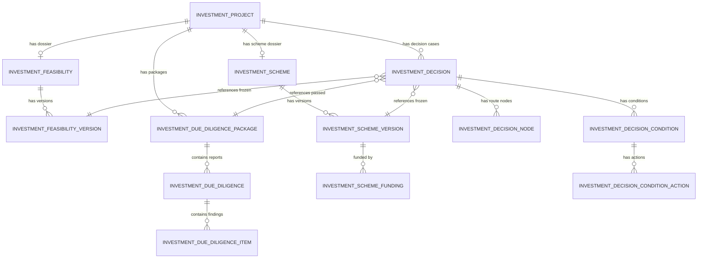

# 投资论证与决策数据库模型设计

> 版本：V1.0
> 对应阶段：Sprint 2-1.4
> 文档性质：数据库设计，不修改业务代码、不创建或执行Migration
> 数据库：`enterprise_platform`
> 设计基线：`07_investment.sql`、投资机会设计、投资论证与决策领域设计、生命周期V2

## 1. 设计目标与约束

本设计将可研、四类尽调、投资方案、国企治理决策及附条件批准落为可版本化、可审计、可关联生命周期V2的数据库模型。

原则：

1. `investment_project` 仍是投资事项权威聚合根，论证和决策表均通过 `investment_id` 关联。
2. 冻结报告、冻结方案和正式决策记录不可覆盖；修订创建新版本或追加更正记录。
3. 附件只保存 `sys_file.id` 引用，禁止保存文件系统路径、外部URL或正文。
4. 审批、三重一大和会议领域只通过稳定引用关联，不复制其完整业务数据。
5. 主键由应用雪花算法生成；金额使用 `DECIMAL`；枚举保存稳定英文编码。
6. 历史 `07_investment.sql` 不可修改，后续结构变更必须使用独立Migration。
7. 本文只给出目标模型和Migration规划，不创建SQL脚本，不执行数据库变更。

### 1.1 通用字段

所有新表统一包含：

| 字段 | 类型 | 约束 | 说明 |
|---|---|---|---|
| `id` | BIGINT | PK, NOT NULL | 雪花主键 |
| `create_time` | DATETIME(3) | NOT NULL | 创建时间 |
| `create_by` | VARCHAR(64) | NULL | 创建人 |
| `update_time` | DATETIME(3) | NOT NULL | 更新时间 |
| `update_by` | VARCHAR(64) | NULL | 更新人 |
| `deleted` | SMALLINT | NOT NULL DEFAULT 0 | 逻辑删除标识 |
| `delete_token` | BIGINT | NOT NULL DEFAULT 0 | 逻辑删除唯一键释放令牌 |
| `remark` | VARCHAR(500) | NULL | 备注 |
| `version` | INT | NOT NULL DEFAULT 0 | 乐观锁版本 |

除特别说明外，唯一索引均包含 `delete_token`；有效数据中该值为0，逻辑删除时更新为唯一非零值。

## 2. 命名冲突与冻结决策

### 2.1 `investment_plan` 冲突

现有 `07_investment.sql` 已定义：

```text
investment_plan = 年度投资计划
```

用户本阶段提出的“投资方案 `investment_plan / investment_plan_version`”与该权威表名称冲突。直接复用会把企业年度计划与单个项目交易方案混为一个聚合，破坏现有外键 `investment_project.plan_id` 的语义。

本设计冻结以下物理命名：

| 业务概念 | 物理表名 | 处理 |
|---|---|---|
| 年度投资计划 | `investment_plan` | 保留现有表及语义，不改名 |
| 项目投资方案头 | `investment_scheme` | 新设计 |
| 项目投资方案版本 | `investment_scheme_version` | 新设计 |
| 方案资金来源 | `investment_scheme_funding` | 新设计 |

因此不创建 `investment_plan_version`。它容易被误解为年度计划版本，且与 `investment_plan` 形成错误外键语义。领域层仍可使用 `InvestmentPlan` 作为业务术语，但Repository必须映射到 `investment_scheme*` 表。

### 2.2 现有表演进

| 现有表 | 当前职责 | 目标职责 | 演进方式 |
|---|---|---|---|
| `investment_feasibility` | 单份可研内容 | 可研档案头 | 扩展—回填版本—收敛 |
| `investment_decision` | 单个会议结果 | 一次完整决策事项头 | 旧记录回填为事项及节点 |
| `investment_plan` | 年度投资计划 | 保持不变 | 不参与方案版本改造 |

## 3. 总体关系模型



关系要点：

- 一个投资事项最多一个有效可研档案头和一个有效方案档案头，但各自拥有多个版本。
- 一个投资事项可以有多轮尽调包；每个尽调包包含按类型版本化的报告和问题清单。
- 一次正式决策只引用一组冻结版本，后续新版本不会改变历史决策。
- 一次决策包含多个专业审核、党委前置研究、董事会/经理层等节点和多个附加条件。

## 4. 可研数据库模型

### 4.1 可研档案头 `investment_feasibility`

目标表仅保存投资事项级档案状态和当前版本指针。

| 字段 | 类型 | 约束 | 说明 |
|---|---|---|---|
| `id` | BIGINT | PK | 可研档案ID |
| `investment_id` | BIGINT | NOT NULL, FK | 关联 `investment_project.id` |
| `current_version_id` | BIGINT | NULL | 当前工作版本ID |
| `current_frozen_version_id` | BIGINT | NULL | 当前权威冻结版本ID |
| `status` | VARCHAR(30) | NOT NULL | NOT_STARTED/IN_PROGRESS/APPROVED/REJECTED/SUSPENDED |
| 通用字段 | 见1.1 |  | 审计、删除、备注和版本 |

索引与约束：

- 唯一索引 `uk_feasibility_investment(investment_id, delete_token)`；
- 索引 `idx_feasibility_status(status, deleted)`；
- `investment_id` 外键引用投资事项；
- 当前版本指针在版本表建立后通过独立Migration补充外键，避免建表循环依赖；
- 指针必须指向同一 `feasibility_id` 的有效版本，由应用服务和验收SQL双重检查。

### 4.2 可研版本 `investment_feasibility_version`

| 字段 | 类型 | 约束 | 说明 |
|---|---|---|---|
| `id` | BIGINT | PK | 可研版本ID |
| `feasibility_id` | BIGINT | NOT NULL, FK | 可研档案ID |
| `version_no` | INT | NOT NULL | 版本号，从1递增 |
| `report_no` | VARCHAR(100) | NULL | 报告编号 |
| `report_name` | VARCHAR(200) | NOT NULL | 报告名称 |
| `compiler_type` | VARCHAR(20) | NOT NULL | INTERNAL/EXTERNAL/JOINT |
| `compiler_org_id` | BIGINT | NULL | 内部编制组织ID |
| `compiler_org_name` | VARCHAR(200) | NOT NULL | 编制单位名称快照 |
| `prepared_date` | DATE | NULL | 编制日期 |
| `base_date` | DATE | NOT NULL | 测算基准日 |
| `currency_code` | CHAR(3) | NOT NULL DEFAULT 'CNY' | ISO 4217币种 |
| `market_analysis` | TEXT | NULL | 市场分析摘要 |
| `technical_analysis` | TEXT | NULL | 技术分析摘要 |
| `financial_analysis` | TEXT | NULL | 财务分析摘要 |
| `risk_analysis` | TEXT | NULL | 风险分析摘要 |
| `total_investment` | DECIMAL(18,2) | NOT NULL DEFAULT 0 | 总投资额 |
| `own_capital` | DECIMAL(18,2) | NOT NULL DEFAULT 0 | 自有资金 |
| `financing_amount` | DECIMAL(18,2) | NOT NULL DEFAULT 0 | 融资金额 |
| `construction_period_months` | INT | NULL | 建设期，月 |
| `operation_period_months` | INT | NULL | 运营期，月 |
| `annual_revenue` | DECIMAL(18,2) | NOT NULL DEFAULT 0 | 年收入 |
| `annual_cost` | DECIMAL(18,2) | NOT NULL DEFAULT 0 | 年成本 |
| `annual_tax` | DECIMAL(18,2) | NOT NULL DEFAULT 0 | 年税费 |
| `annual_net_profit` | DECIMAL(18,2) | NOT NULL DEFAULT 0 | 年净利润，可为负 |
| `net_present_value` | DECIMAL(18,2) | NULL | 净现值，可为负 |
| `roi` | DECIMAL(9,4) | NULL | ROI百分比 |
| `irr` | DECIMAL(9,4) | NULL | IRR百分比 |
| `payback_period` | DECIMAL(9,2) | NULL | 回收期，年 |
| `discount_rate` | DECIMAL(9,4) | NULL | 折现率百分比 |
| `calculation_assumption` | TEXT | NULL | 测算口径和假设 |
| `risk_conclusion` | VARCHAR(30) | NOT NULL | ACCEPTABLE/CONDITIONAL/UNACCEPTABLE |
| `conclusion` | VARCHAR(30) | NOT NULL | PENDING/PASS/CONDITIONAL_PASS/FAIL |
| `conclusion_summary` | VARCHAR(2000) | NULL | 结论摘要 |
| `approval_instance_ref` | VARCHAR(100) | NULL | 审批实例稳定引用 |
| `primary_file_id` | BIGINT | NULL, FK | 主报告文件ID |
| `status` | VARCHAR(30) | NOT NULL | DRAFT/SUBMITTED/REVIEWING/RETURNED/APPROVED/FROZEN/REJECTED/SUPERSEDED |
| `content_hash` | VARCHAR(128) | NULL | 冻结内容哈希 |
| `frozen_time` | DATETIME(3) | NULL | 冻结时间 |
| 通用字段 | 见1.1 |  | 通用字段 |

索引：

- 唯一索引 `(feasibility_id, version_no, delete_token)`；
- 可选唯一索引 `(report_no, delete_token)`，仅在编号制度保证全局唯一后启用；
- 索引 `(feasibility_id, status, deleted)`、`(approval_instance_ref, deleted)`；
- 外键 `feasibility_id`、`primary_file_id`。

检查约束：金额非负，建设/运营期非负，回收期非负；ROI、IRR和NPV允许负数；`status='FROZEN'` 时哈希、冻结时间和批准引用必须齐全，该跨字段规则由应用和验收SQL保证。

### 4.3 指标与收益测算

本阶段先将固定核心指标列化，满足索引、统计和国产数据库兼容。多年度现金流、敏感性场景和扩展指标不应使用不可查询的大JSON替代，建议后续配套：

| 表 | 用途 |
|---|---|
| `investment_feasibility_cash_flow` | 按版本、年度/期间保存收入、成本、税费、净现金流 |
| `investment_feasibility_scenario` | 基准、乐观、悲观等情景的输入和输出 |
| `investment_feasibility_indicator` | 经治理批准的扩展指标值 |

这些属于条件扩展表，只有正式模板和报表需求确认后才进入Migration。

### 4.4 可研附件

`primary_file_id` 保存主报告。多附件统一使用后续通用关系表 `investment_document_ref`，通过 `business_type='FEASIBILITY_VERSION'` 和版本ID关联。禁止使用逗号分隔文件ID。

## 5. 尽调数据库模型

### 5.1 尽调包 `investment_due_diligence_package`

尽调包用于冻结某一轮尽调的必需类型和整体结论，是生命周期门禁的权威对象。

| 字段 | 类型 | 约束 | 说明 |
|---|---|---|---|
| `id` | BIGINT | PK | 尽调包ID |
| `investment_id` | BIGINT | NOT NULL, FK | 投资事项ID |
| `package_version` | INT | NOT NULL | 尽调包版本 |
| `rule_version` | VARCHAR(50) | NOT NULL | 必需尽调类型规则版本 |
| `required_types` | VARCHAR(200) | NOT NULL | 稳定排序编码快照，仅作校验快照 |
| `overall_conclusion` | VARCHAR(30) | NOT NULL | PENDING/PASS/CONDITIONAL_PASS/FAIL |
| `open_blocking_count` | INT | NOT NULL DEFAULT 0 | 未关闭阻断问题数快照 |
| `status` | VARCHAR(30) | NOT NULL | PLANNED/IN_PROGRESS/UNDER_REVIEW/CONDITIONAL/PASSED/FAILED/SUPERSEDED |
| `frozen_time` | DATETIME(3) | NULL | 冻结时间 |
| `content_hash` | VARCHAR(128) | NULL | 包内容哈希 |
| 通用字段 | 见1.1 |  | 通用字段 |

唯一索引 `(investment_id, package_version, delete_token)`；索引 `(investment_id, status, deleted)`、`(status, open_blocking_count, deleted)`。

`required_types` 是规则结果快照，不作为关系查询来源。报告完整性以该字段解析后的白名单编码与报告表分组核验；若后续类型配置复杂，应新增包类型关系表而不是扩展自由文本。

### 5.2 尽调报告 `investment_due_diligence`

每一行表示一个尽调报告版本，支持财务、法务、业务、技术四类。

| 字段 | 类型 | 约束 | 说明 |
|---|---|---|---|
| `id` | BIGINT | PK | 尽调报告版本ID |
| `package_id` | BIGINT | NOT NULL, FK | 尽调包ID |
| `investment_id` | BIGINT | NOT NULL, FK | 冗余投资事项ID，用于校验和查询 |
| `due_diligence_type` | VARCHAR(30) | NOT NULL | FINANCIAL/LEGAL/BUSINESS/TECHNICAL |
| `report_version` | INT | NOT NULL | 同包同类型版本号 |
| `report_no` | VARCHAR(100) | NULL | 报告编号 |
| `report_name` | VARCHAR(200) | NOT NULL | 报告名称 |
| `entrusted_org` | VARCHAR(200) | NULL | 受托机构名称 |
| `lead_person_id` | BIGINT | NULL | 负责人用户ID |
| `start_date` | DATE | NULL | 开始日期 |
| `end_date` | DATE | NULL | 结束日期 |
| `base_date` | DATE | NULL | 尽调基准日 |
| `scope_summary` | VARCHAR(2000) | NULL | 范围摘要 |
| `methodology_summary` | VARCHAR(2000) | NULL | 方法摘要 |
| `conclusion` | VARCHAR(30) | NOT NULL | PENDING/PASS/CONDITIONAL_PASS/FAIL |
| `conclusion_summary` | VARCHAR(2000) | NULL | 结论摘要 |
| `material_risk_count` | INT | NOT NULL DEFAULT 0 | 重大问题数量快照 |
| `unresolved_risk_count` | INT | NOT NULL DEFAULT 0 | 未关闭问题数量快照 |
| `approval_instance_ref` | VARCHAR(100) | NULL | 审批引用 |
| `primary_file_id` | BIGINT | NULL, FK | 主报告文件ID |
| `status` | VARCHAR(30) | NOT NULL | DRAFT/SUBMITTED/REVIEWING/RETURNED/APPROVED/FROZEN/REJECTED/SUPERSEDED |
| `content_hash` | VARCHAR(128) | NULL | 冻结内容哈希 |
| `frozen_time` | DATETIME(3) | NULL | 冻结时间 |
| 通用字段 | 见1.1 |  | 通用字段 |

索引与约束：

- 唯一索引 `(package_id, due_diligence_type, report_version, delete_token)`；
- 索引 `(investment_id, due_diligence_type, status, deleted)`；
- 索引 `(package_id, status, deleted)`、`(approval_instance_ref, deleted)`；
- `package_id` 与 `investment_id` 必须指向同一投资事项；
- 类型必须来自白名单，日期满足 `start_date <= end_date`。

### 5.3 尽调问题与整改 `investment_due_diligence_item`

| 字段 | 类型 | 约束 | 说明 |
|---|---|---|---|
| `id` | BIGINT | PK | 问题ID |
| `due_diligence_id` | BIGINT | NOT NULL, FK | 来源报告版本ID |
| `investment_id` | BIGINT | NOT NULL, FK | 投资事项ID |
| `item_no` | VARCHAR(50) | NOT NULL | 问题编号 |
| `category` | VARCHAR(50) | NOT NULL | 问题类别 |
| `severity` | VARCHAR(20) | NOT NULL | LOW/MEDIUM/HIGH/BLOCKING |
| `blocking_flag` | SMALLINT | NOT NULL DEFAULT 0 | 是否阻断阶段推进 |
| `problem_description` | TEXT | NOT NULL | 问题描述 |
| `impact_description` | TEXT | NULL | 对估值、结构或实施的影响 |
| `rectification_measure` | TEXT | NULL | 整改措施 |
| `responsible_org_id` | BIGINT | NULL | 责任组织ID |
| `responsible_person_id` | BIGINT | NULL | 责任人用户ID |
| `deadline` | DATE | NULL | 整改期限 |
| `status` | VARCHAR(30) | NOT NULL | OPEN/RECTIFYING/SUBMITTED_FOR_REVIEW/CLOSED/RISK_ACCEPTED/OVERDUE |
| `resolution_summary` | VARCHAR(2000) | NULL | 整改结果摘要 |
| `evidence_file_id` | BIGINT | NULL, FK | 主关闭证据文件 |
| `reviewer_id` | BIGINT | NULL | 复核人 |
| `review_result` | VARCHAR(20) | NULL | PASS/RETURN/REJECT |
| `review_opinion` | VARCHAR(2000) | NULL | 复核意见 |
| `reviewed_time` | DATETIME(3) | NULL | 复核时间 |
| `risk_acceptance_ref` | VARCHAR(100) | NULL | 风险接受授权引用 |
| `closed_time` | DATETIME(3) | NULL | 关闭时间 |
| 通用字段 | 见1.1 |  | 通用字段 |

索引：

- 唯一索引 `(due_diligence_id, item_no, delete_token)`；
- 索引 `(investment_id, severity, status, deleted)`；
- 索引 `(responsible_person_id, status, deadline, deleted)`；
- 索引 `(due_diligence_id, status, deleted)`。

约束：问题严重度为BLOCKING时 `blocking_flag=1`；关闭必须有复核人、复核通过和证据；风险接受必须有授权引用和有效审批，不允许问题责任人自行复核。

### 5.4 四类尽调数据边界

四类尽调共享报告表和问题表，通过稳定 `due_diligence_type` 区分，不为每类复制结构相同的表：

| 类型 | 重点结构化内容 | 明细策略 |
|---|---|---|
| FINANCIAL | 调整后净资产、净债务、或有负债、估值调整 | 固定核心指标可后续增加扩展指标表 |
| LEGAL | 权属、诉讼、许可、重大合同、合规 | 以问题项和文件引用为权威 |
| BUSINESS | 市场、客户、供应链、管理团队、协同 | 以报告版本与问题项为权威 |
| TECHNICAL | 技术成熟度、知识产权、安全、国产化 | 以报告版本与问题项为权威 |

禁止使用四个大JSON字段保存所有专业事实；需要统计或门禁的指标必须列化或进入受治理扩展表。

## 6. 投资方案数据库模型

### 6.1 方案档案头 `investment_scheme`

| 字段 | 类型 | 约束 | 说明 |
|---|---|---|---|
| `id` | BIGINT | PK | 方案档案ID |
| `investment_id` | BIGINT | NOT NULL, FK | 投资事项ID |
| `current_version_id` | BIGINT | NULL | 当前工作版本 |
| `current_frozen_version_id` | BIGINT | NULL | 当前冻结权威版本 |
| `status` | VARCHAR(30) | NOT NULL | NOT_STARTED/IN_PROGRESS/FROZEN/SUPERSEDED/SUSPENDED |
| 通用字段 | 见1.1 |  | 通用字段 |

唯一索引 `(investment_id, delete_token)`；指针同可研模型分阶段建立外键并校验同一档案归属。

### 6.2 方案版本 `investment_scheme_version`

| 字段 | 类型 | 约束 | 说明 |
|---|---|---|---|
| `id` | BIGINT | PK | 方案版本ID |
| `scheme_id` | BIGINT | NOT NULL, FK | 方案档案ID |
| `version_no` | INT | NOT NULL | 版本号 |
| `scheme_no` | VARCHAR(100) | NULL | 方案编号 |
| `scheme_name` | VARCHAR(200) | NOT NULL | 方案名称 |
| `investment_subject_org_id` | BIGINT | NOT NULL | 投资主体组织ID |
| `investee_company_id` | BIGINT | NULL | 被投企业或SPV ID |
| `investment_type` | VARCHAR(50) | NOT NULL | 投资类型 |
| `total_amount` | DECIMAL(18,2) | NOT NULL | 投资总额 |
| `currency_code` | CHAR(3) | NOT NULL DEFAULT 'CNY' | 币种 |
| `investment_method` | VARCHAR(50) | NOT NULL | CASH/ASSET/EQUITY/TECHNOLOGY/DATA_ASSET/MIXED |
| `contribution_schedule_summary` | VARCHAR(2000) | NULL | 出资节奏摘要 |
| `pre_investment_ratio` | DECIMAL(7,4) | NULL | 投前持股比例 |
| `post_investment_ratio` | DECIMAL(7,4) | NULL | 投后持股比例 |
| `share_type` | VARCHAR(50) | NULL | 股份类型 |
| `control_type` | VARCHAR(30) | NULL | CONTROL/JOINT_CONTROL/SIGNIFICANT_INFLUENCE/FINANCIAL |
| `governance_arrangement` | TEXT | NULL | 董监高、表决权和重大事项安排 |
| `cooperation_mode` | VARCHAR(50) | NULL | 合作模式 |
| `partner_arrangement` | TEXT | NULL | 合作方责任和承诺摘要 |
| `valuation_amount` | DECIMAL(18,2) | NULL | 估值金额 |
| `valuation_base_date` | DATE | NULL | 估值基准日 |
| `income_distribution` | TEXT | NULL | 收益和分红安排 |
| `exit_type` | VARCHAR(50) | NULL | 主退出方式 |
| `exit_plan` | TEXT | NULL | 退出触发、期限、估值和实施安排 |
| `conditions_precedent` | TEXT | NULL | 交割先决条件摘要 |
| `feasibility_version_id` | BIGINT | NOT NULL, FK | 冻结可研版本 |
| `due_diligence_package_id` | BIGINT | NOT NULL, FK | 通过的尽调包 |
| `status` | VARCHAR(30) | NOT NULL | DRAFT/INTERNAL_REVIEW/RETURNED/APPROVED_FOR_DECISION/FROZEN/SUPERSEDED |
| `content_hash` | VARCHAR(128) | NULL | 冻结内容哈希 |
| `frozen_time` | DATETIME(3) | NULL | 冻结时间 |
| `primary_file_id` | BIGINT | NULL, FK | 主方案文件 |
| 通用字段 | 见1.1 |  | 通用字段 |

索引：

- 唯一索引 `(scheme_id, version_no, delete_token)`；
- 索引 `(scheme_id, status, deleted)`；
- 索引 `(feasibility_version_id, deleted)`、`(due_diligence_package_id, deleted)`；
- 索引 `(investee_company_id, status, deleted)`。

冻结规则：冻结版本必须引用FROZEN可研和PASSED尽调包；金额非负；比例在0—100之间；内容哈希和冻结时间非空。

### 6.3 资金来源 `investment_scheme_funding`

资金来源是一对多结构，不能只保存“自有资金+融资金额”两个固定列。

| 字段 | 类型 | 约束 | 说明 |
|---|---|---|---|
| `id` | BIGINT | PK | 资金来源ID |
| `scheme_version_id` | BIGINT | NOT NULL, FK | 方案版本ID |
| `funding_type` | VARCHAR(30) | NOT NULL | OWN_CAPITAL/BANK_LOAN/FUND/GOVERNMENT_FUND/OTHER |
| `provider_name` | VARCHAR(200) | NULL | 资金提供方名称快照 |
| `amount` | DECIMAL(18,2) | NOT NULL | 金额 |
| `cost_rate` | DECIMAL(9,4) | NULL | 年化资金成本百分比 |
| `available_date` | DATE | NULL | 预计到位日期 |
| `confirmed_flag` | SMALLINT | NOT NULL DEFAULT 0 | 是否已落实 |
| `evidence_file_id` | BIGINT | NULL, FK | 资金证明 |
| 通用字段 | 见1.1 |  | 通用字段 |

唯一索引 `(scheme_version_id, funding_type, provider_name, delete_token)`；索引 `(scheme_version_id, confirmed_flag, deleted)`。同一版本资金来源合计不得超过或低于方案总额，差额是否允许由正式业务规则决定。

## 7. 投资决策数据库模型

### 7.1 决策事项头 `investment_decision`

目标表表示针对一个冻结方案的一次完整决策事项，而不是单个会议结果。

| 字段 | 类型 | 约束 | 说明 |
|---|---|---|---|
| `id` | BIGINT | PK | 决策事项ID |
| `investment_id` | BIGINT | NOT NULL, FK | 投资事项ID |
| `decision_no` | VARCHAR(100) | NOT NULL | 决策事项编号 |
| `decision_subject` | VARCHAR(300) | NOT NULL | 决策事项 |
| `scheme_version_id` | BIGINT | NOT NULL, FK | 冻结方案版本 |
| `scheme_content_hash` | VARCHAR(128) | NOT NULL | 方案哈希快照 |
| `feasibility_version_id` | BIGINT | NOT NULL, FK | 冻结可研版本 |
| `due_diligence_package_id` | BIGINT | NOT NULL, FK | 通过的尽调包 |
| `decision_package_version` | INT | NOT NULL DEFAULT 1 | 决策材料包版本 |
| `route_rule_version` | VARCHAR(50) | NOT NULL | 决策权限规则版本 |
| `route_snapshot_hash` | VARCHAR(128) | NOT NULL | 决策路线快照哈希 |
| `major_decision_applicable` | SMALLINT | NOT NULL DEFAULT 0 | 是否适用三重一大 |
| `major_decision_ref` | VARCHAR(100) | NULL | 三重一大事项稳定引用 |
| `party_pre_study_required` | SMALLINT | NOT NULL DEFAULT 0 | 是否需要党委前置研究 |
| `approval_status` | VARCHAR(30) | NOT NULL | NOT_SUBMITTED/MATERIAL_REVIEW/ROUTE_CONFIRMED/IN_DECISION/CONDITIONAL_PENDING/COMPLETED |
| `decision_result` | VARCHAR(30) | NULL | APPROVED/CONDITIONAL_APPROVED/REJECTED/DEFERRED/WITHDRAWN |
| `decision_summary` | VARCHAR(2000) | NULL | 整体决策摘要 |
| `submitted_time` | DATETIME(3) | NULL | 提交时间 |
| `completed_time` | DATETIME(3) | NULL | 完成时间 |
| `supersedes_decision_id` | BIGINT | NULL, FK | 被替代或重新决策的事项ID |
| 通用字段 | 见1.1 |  | 通用字段 |

索引与约束：

- 唯一索引 `(decision_no, delete_token)`；
- 唯一索引 `(investment_id, scheme_version_id, decision_package_version, delete_token)`；
- 索引 `(investment_id, approval_status, deleted)`；
- 索引 `(major_decision_ref, deleted)`、`(decision_result, completed_time, deleted)`；
- 若适用三重一大，则引用不能为空；若需要党委前置研究，必需节点必须存在；
- 决策完成后不得修改版本引用、路线规则和结果，只能追加更正/新决策。

### 7.2 决策节点 `investment_decision_node`

该表承载专业审核、党委前置研究、董事会、经理层、股东会及外部监管节点。

| 字段 | 类型 | 约束 | 说明 |
|---|---|---|---|
| `id` | BIGINT | PK | 决策节点ID |
| `decision_id` | BIGINT | NOT NULL, FK | 决策事项ID |
| `node_code` | VARCHAR(50) | NOT NULL | 节点编码 |
| `node_type` | VARCHAR(50) | NOT NULL | BUSINESS_REVIEW/FINANCE_REVIEW/LEGAL_COMPLIANCE_REVIEW/INVESTMENT_REVIEW/MAJOR_DECISION_REGISTRATION/PARTY_COMMITTEE_PRE_STUDY/MANAGEMENT_DECISION/BOARD_DECISION/SHAREHOLDER_DECISION/REGULATORY_APPROVAL |
| `sequence_no` | INT | NOT NULL | 顺序号 |
| `required_flag` | SMALLINT | NOT NULL DEFAULT 1 | 是否必需 |
| `veto_flag` | SMALLINT | NOT NULL DEFAULT 0 | 是否具有否决效力 |
| `decision_body` | VARCHAR(200) | NULL | 决策主体名称快照 |
| `authority_basis` | VARCHAR(1000) | NULL | 权限依据摘要 |
| `approval_instance_ref` | VARCHAR(100) | NULL | 审批实例引用 |
| `meeting_ref` | VARCHAR(100) | NULL | 会议稳定引用 |
| `status` | VARCHAR(30) | NOT NULL | PENDING/IN_PROGRESS/COMPLETED/RETURNED/SKIPPED/CANCELLED |
| `result` | VARCHAR(30) | NULL | 节点结果 |
| `opinion_summary` | VARCHAR(2000) | NULL | 意见摘要 |
| `started_time` | DATETIME(3) | NULL | 开始时间 |
| `decided_time` | DATETIME(3) | NULL | 完成时间 |
| `primary_file_id` | BIGINT | NULL, FK | 主要决议文件 |
| `correction_of_node_id` | BIGINT | NULL, FK | 更正的原节点记录 |
| `record_hash` | VARCHAR(128) | NULL | 正式结果记录哈希 |
| 通用字段 | 见1.1 |  | 通用字段 |

唯一索引 `(decision_id, node_code, sequence_no, delete_token)`；索引 `(decision_id, status, sequence_no, deleted)`、`(approval_instance_ref, deleted)`、`(meeting_ref, deleted)`。

党委前置研究是独立节点，不能与 `BOARD_DECISION` 或 `MANAGEMENT_DECISION` 合并成一个结果字段。党委节点完成不等于整体投资决策批准。

### 7.3 决策路线快照

节点表本身即保存路线快照。决策正式提交后，节点顺序、是否必需、否决属性、决策主体和权限依据不可修改。`investment_decision.route_snapshot_hash` 用于检查节点集合完整性。

如果未来需要并行/条件分支，应新增稳定的 `group_no`、`group_operator` 和 `predecessor_node_id`，禁止把流程图保存为无法验证的自由JSON。

## 8. 附条件批准模型

### 8.1 条件任务 `investment_decision_condition`

| 字段 | 类型 | 约束 | 说明 |
|---|---|---|---|
| `id` | BIGINT | PK | 条件任务ID |
| `decision_id` | BIGINT | NOT NULL, FK | 决策事项ID |
| `source_node_id` | BIGINT | NOT NULL, FK | 条件来源节点 |
| `condition_no` | VARCHAR(50) | NOT NULL | 条件编号 |
| `condition_type` | VARCHAR(30) | NOT NULL | PRECEDENT/RECTIFICATION/ONGOING/OTHER |
| `condition_content` | TEXT | NOT NULL | 条件内容 |
| `blocking_flag` | SMALLINT | NOT NULL DEFAULT 1 | 是否阻断进入实施 |
| `responsible_org_id` | BIGINT | NOT NULL | 责任组织ID |
| `responsible_person_id` | BIGINT | NOT NULL | 责任人用户ID |
| `deadline` | DATE | NOT NULL | 截止日期 |
| `status` | VARCHAR(30) | NOT NULL | OPEN/RECTIFYING/SUBMITTED_FOR_REVIEW/CLOSED/WAIVED/OVERDUE |
| `rectification_summary` | VARCHAR(2000) | NULL | 整改摘要 |
| `evidence_file_id` | BIGINT | NULL, FK | 主证据文件 |
| `submitted_time` | DATETIME(3) | NULL | 提交复核时间 |
| `reviewer_id` | BIGINT | NULL | 复核人 |
| `review_result` | VARCHAR(20) | NULL | PASS/RETURN/REJECT |
| `review_opinion` | VARCHAR(2000) | NULL | 复核意见 |
| `reviewed_time` | DATETIME(3) | NULL | 复核时间 |
| `waiver_approval_ref` | VARCHAR(100) | NULL | 豁免批准引用 |
| `waiver_expire_date` | DATE | NULL | 豁免有效期 |
| `closed_time` | DATETIME(3) | NULL | 关闭时间 |
| 通用字段 | 见1.1 |  | 通用字段 |

索引：

- 唯一索引 `(decision_id, condition_no, delete_token)`；
- 索引 `(responsible_person_id, status, deadline, deleted)`；
- 索引 `(decision_id, blocking_flag, status, deleted)`；
- 索引 `(source_node_id, status, deleted)`。

关闭约束：`CLOSED` 必须有证据、复核人、通过结果和关闭时间；`WAIVED` 必须有有效授权引用。提交整改人与复核人原则上不能为同一用户。

### 8.2 条件动作历史 `investment_decision_condition_action`

条件主表保存当前状态，动作表保存不可变历史。

| 字段 | 类型 | 约束 | 说明 |
|---|---|---|---|
| `id` | BIGINT | PK | 动作ID |
| `condition_id` | BIGINT | NOT NULL, FK | 条件任务ID |
| `action_type` | VARCHAR(30) | NOT NULL | CREATE/ASSIGN/RECTIFY/SUBMIT/RETURN/VERIFY/CLOSE/WAIVE/REOPEN |
| `from_status` | VARCHAR(30) | NULL | 原状态 |
| `to_status` | VARCHAR(30) | NOT NULL | 新状态 |
| `operator_id` | BIGINT | NOT NULL | 操作人 |
| `operator_role_snapshot` | VARCHAR(200) | NULL | 角色快照 |
| `action_opinion` | VARCHAR(2000) | NULL | 动作意见 |
| `evidence_file_id` | BIGINT | NULL | 动作证据 |
| `action_time` | DATETIME(3) | NOT NULL | 动作时间 |
| `trace_id` | VARCHAR(64) | NULL | 链路ID |
| `idempotency_key` | VARCHAR(100) | NULL | 幂等键 |
| 通用字段 | 见1.1 |  | 通用字段；动作记录原则上不逻辑删除 |

唯一索引 `(condition_id, idempotency_key, delete_token)`；索引 `(condition_id, action_time, deleted)`、`(operator_id, action_time, deleted)`。

## 9. 文档附件关系

主文件列满足快速查询，多附件统一设计 `investment_document_ref`：

| 字段 | 说明 |
|---|---|
| `business_type` | FEASIBILITY_VERSION/DUE_DILIGENCE/SCHEME_VERSION/DECISION/NODE/CONDITION |
| `business_id` | 对应业务记录ID |
| `document_type` | MAIN_REPORT/WORKING_PAPER/LEGAL_OPINION/MEETING_RESOLUTION/EVIDENCE等 |
| `file_id` | `sys_file.id` |
| `document_version` | 文件业务版本 |
| `is_primary` | 是否主文件 |
| `security_level` | 密级快照 |

该通用关系表是否在V2.3同步落地，需要与文件中心权限设计一并评审。禁止通过通用关系表绕过业务对象访问策略下载文件。

## 10. 索引与约束汇总

### 10.1 业务唯一约束

| 表 | 唯一业务键 |
|---|---|
| `investment_feasibility` | `investment_id, delete_token` |
| `investment_feasibility_version` | `feasibility_id, version_no, delete_token` |
| `investment_due_diligence_package` | `investment_id, package_version, delete_token` |
| `investment_due_diligence` | `package_id, due_diligence_type, report_version, delete_token` |
| `investment_due_diligence_item` | `due_diligence_id, item_no, delete_token` |
| `investment_scheme` | `investment_id, delete_token` |
| `investment_scheme_version` | `scheme_id, version_no, delete_token` |
| `investment_decision` | `decision_no, delete_token` |
| `investment_decision_node` | `decision_id, node_code, sequence_no, delete_token` |
| `investment_decision_condition` | `decision_id, condition_no, delete_token` |

### 10.2 外键策略

- 投资从属表最终引用 `investment_project.id`。
- 版本表引用档案头；决策引用冻结版本和通过的尽调包。
- 文件引用 `sys_file.id`，组织引用 `sys_org.id`。
- 人员字段当前统一保存系统用户ID或按项目既有规范确定；实施前必须冻结 `sys_user.id` 与 `hr_employee.id` 的使用边界，禁止混用。
- 生产是否启用物理外键由国产数据库兼容策略决定；即使不启用，应用校验和数据库一致性测试仍是强制门禁。

### 10.3 跨行约束

以下规则无法仅依靠普通CHECK完成，由事务服务加验收SQL实现：

1. 当前版本指针必须属于同一档案；
2. 同一档案只有一个当前FROZEN版本；
3. 尽调包必需类型全部存在冻结报告；
4. BLOCKING问题全部关闭后尽调包才能PASSED；
5. 方案资金来源合计与总金额一致或符合允许差额规则；
6. 决策引用的可研、尽调和方案版本必须处于有效冻结状态；
7. 所有必需决策节点通过且阻断条件关闭后整体结果才能APPROVED；
8. 党委前置研究完成不能替代董事会/经理层必需节点。

## 11. 生命周期V2关联

### 11.1 关联方式

生命周期表不直接外键绑定各业务记录。阶段条件快照保存白名单 `condition_code` 和参数；运行时通过Project找到 `investment_project`，再由Investment事实服务读取权威版本。

```text
project_stage condition snapshot
  → project_id
  → investment_project.project_id
  → feasibility / due diligence / scheme / decision facts
```

### 11.2 可研门禁

| 条件 | 数据判定 |
|---|---|
| `INVESTMENT_ITEM_EXISTS` | 存在有效 `investment_project` |
| `FEASIBILITY_APPROVED` | `current_frozen_version_id` 指向FROZEN版本，结论PASS或合规CONDITIONAL_PASS |
| `FEASIBILITY_CONDITIONS_CLOSED` | 可研产生的阻断条件全部关闭或有效豁免 |

### 11.3 尽调门禁

| 条件 | 数据判定 |
|---|---|
| `REQUIRED_DUE_DILIGENCE_COMPLETED` | 当前尽调包规则要求的四类/专项报告均存在FROZEN版本 |
| `DUE_DILIGENCE_PASSED` | 包状态PASSED且内容哈希有效 |
| `NO_OPEN_BLOCKING_FINDING` | `investment_due_diligence_item` 无有效BLOCKING未关闭项 |
| `NO_OPEN_CRITICAL_RISK` | 投资风险台账无未处置CRITICAL风险 |

### 11.4 决策门禁

| 条件 | 数据判定 |
|---|---|
| `INVESTMENT_SCHEME_FROZEN` | 决策引用的方案版本FROZEN且哈希匹配 |
| `DECISION_ROUTE_CONFIRMED` | 路线规则版本、节点集合和路线哈希完整 |
| `MAJOR_DECISION_PROCEDURE_COMPLETED` | 适用时三重一大引用有效且程序完成 |
| `PARTY_PRE_STUDY_COMPLETED` | 适用时存在完成的党委前置研究节点 |
| `INVESTMENT_DECISION_APPROVED` | 所有必需法定决策节点批准，无否决结果 |
| `DECISION_CONDITIONS_CLOSED` | 所有阻断条件CLOSED或处于有效WAIVED |

### 11.5 模板发布

现有ACTIVE模板不可原地修改。V2.3数据模型就绪并通过回填校验后，应创建新的投资生命周期模板版本，将上述条件复制为项目实例快照。历史项目继续使用原条件快照。

## 12. Migration规划

### 12.1 版本前提

当前仓库真实Migration最高为V2.1.3。投资机会数据库设计已预留V2.2系列但尚未生成或执行。为避免编号冲突，本模块建议从V2.3.0开始，并以V2.2机会结构完成为前置条件。

本文不创建下列文件，仅规划：

| 版本 | 建议文件 | 目标 |
|---|---|---|
| V2.3.0 | `V2.3.0__create_investment_feasibility_version_model.sql` | 创建可研版本表，扩展档案头字段 |
| V2.3.1 | `V2.3.1__create_investment_due_diligence_model.sql` | 创建尽调包、报告和问题表 |
| V2.3.2 | `V2.3.2__create_investment_scheme_model.sql` | 创建方案头、版本和资金来源表 |
| V2.3.3 | `V2.3.3__extend_investment_decision_case.sql` | 扩展决策事项头并创建节点表 |
| V2.3.4 | `V2.3.4__create_investment_decision_condition.sql` | 创建条件任务和动作历史表 |
| V2.3.5 | `V2.3.5__backfill_investment_argumentation.sql` | 回填历史可研和决策数据 |
| V2.3.6 | `V2.3.6__validate_investment_argumentation.sql` | 输出孤儿、版本、状态、金额和引用异常 |
| V2.3.7 | `V2.3.7__enforce_investment_argumentation_constraints.sql` | 收紧非空、唯一键及外键 |
| V2.3.8 | `V2.3.8__seed_investment_lifecycle_condition_template.sql` | 创建新模板版本与白名单条件快照来源 |
| V2.3.9 | `V2.3.9__retire_investment_argumentation_legacy_columns.sql` | 观察期后清理旧内容列，可延期 |

### 12.2 扩展—迁移—收敛

1. **扩展**：新增版本、尽调、方案、节点和条件表；旧代码继续读旧结构。
2. **双写验证**：新服务灰度写入新表，并比较旧查询与新查询结果。
3. **数据回填**：历史可研作为版本1；历史决策记录拆分为事项头和节点。
4. **切读**：验证通过后切换Repository读取新模型。
5. **收紧**：处理异常后增加非空、唯一和外键约束。
6. **收敛**：至少观察一个发布周期后清理旧列，禁止同版本同时扩展和删除。

### 12.3 历史数据回填规则

- 每条旧可研记录创建一个版本1；无法证明批准的记录结论保持PENDING，不伪造审批引用。
- 原可研 `attachment` 路径经文件中心导入后生成文件ID；失败项保留异常清单。
- 原决策每条会议记录先创建独立决策事项和对应节点；只有能以业务编号证明属于同一事项时才合并。
- 历史 `decision_type` 映射到节点类型，无法识别的记录使用 `LEGACY_DECISION` 并保留原值。
- 不根据会议名称猜测党委前置研究、董事会或经理层权限关系。
- 现有年度 `investment_plan` 数据完全不参与方案表迁移。

### 12.4 收紧前检查

必须核查：

- 可研档案重复、版本号重复及当前指针越界；
- 冻结版本缺审批引用、哈希或文件；
- 尽调包缺必需类型、问题数量与快照不一致；
- BLOCKING问题已关闭但缺证据或复核人；
- 方案资金来源合计与总金额差异；
- 方案引用非冻结可研或未通过尽调包；
- 决策引用版本不存在或哈希不一致；
- 三重一大适用但引用为空；
- 党委前置研究适用但节点缺失；
- 决策已批准但必需节点未完成或阻断条件未关闭；
- 所有外键孤儿和逻辑删除引用。

任一阻断项非零时不得执行V2.3.7或发布新生命周期模板。

### 12.5 回滚方案

- V2.3.0—V2.3.4在未启用新写入前可受控删除新增对象；启用后只关闭功能开关，不直接DROP数据。
- V2.3.5回填前必须备份；回滚使用映射表和备份恢复，不删除文件中心已导入文件，只解除业务引用。
- V2.3.7约束导致问题时删除新增约束，保留已验证数据并前向修复。
- V2.3.8通过停用新模板版本回滚，已创建项目继续使用其不可变快照。
- V2.3.9属于不可轻易回滚的收敛步骤，执行前保留归档表和恢复脚本至少一个发布周期。

回滚验收比较记录数、版本数、金额汇总、问题状态、决策结果、条件任务、文件引用和外键孤儿数量。

## 13. 安全与审计

1. 所有从属资源先通过 `investment_id → project_id → ProjectAccessPolicy` 校验，再校验功能权限。
2. 从表列表不得自行拼接不存在的组织字段；按Project责任组织执行统一数据权限。
3. 可研财务模型、尽调底稿、估值、党委前置材料和决策文件按密级授权并审计下载。
4. 审批、会议和三重一大引用只能由受信服务回写；前端输入不得直接成为权威引用。
5. 冻结和正式节点记录保存内容哈希；附件替换产生新文件ID。
6. 条件整改提交人与复核人职责分离；豁免必须有稳定授权引用和有效期。
7. 操作日志禁止记录完整报告正文、Token、银行账户和敏感附件内容。

## 14. 后续开发路线

### Sprint 2-1.5：结构评审与存量审计

- 确认表命名、人员ID口径、附件关系和指标扩展表；
- 对真实数据库执行只读结构与数据质量检查；
- 完成MySQL、达梦、人大金仓DDL差异评审；
- 形成V2.3系列Migration评审稿，但未经确认不执行生产变更。

### Sprint 2-1.6：可研与尽调落地

- 实现档案头、不可变版本、尽调包和问题整改Repository；
- 接入文件中心、审批引用、风险台账、权限和审计；
- 完成版本、并发、阻断问题和历史兼容测试。

### Sprint 2-1.7：投资方案与决策落地

- 实现方案版本、资金来源、决策路线、党委前置研究和法定决策节点；
- 实现附条件任务、整改、复核、豁免及追加更正；
- 完成职责分离和敏感数据安全测试。

### Sprint 2-1.8：生命周期与综合验收

- 发布新的投资生命周期模板版本；
- 验证可研、尽调、决策全部门禁；
- 验证历史快照不受影响、审批幂等、数据权限、性能及国产数据库兼容。

## 15. 待确认事项

1. 是否确认保留年度表 `investment_plan`，项目投资方案使用 `investment_scheme` 命名；
2. 可研现金流、情景和扩展指标是否在首期结构化落表；
3. 尽调包是否允许正式豁免某一尽调类型及授权层级；
4. 人员引用统一使用 `sys_user.id` 还是 `hr_employee.id`；
5. 多附件关系表由Investment模块还是文件中心统一提供；
6. 方案资金来源合计是否必须严格等于投资总额；
7. 决策路线是否需要支持并行节点和条件分支；
8. 三重一大及会议系统稳定引用格式；
9. 条件豁免权限、有效期和重新打开规则；
10. 历史决策记录合并为同一决策事项的业务识别键。

上述事项确认前，不得在Migration、Mapper、Controller或前端固定为临时规则。
