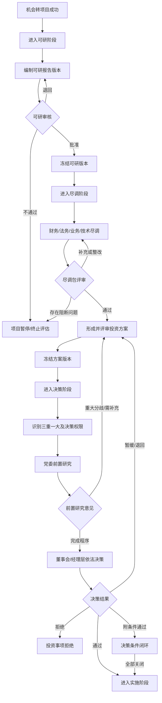

# 投资论证与决策领域设计

> 版本：V1.0
> 对应阶段：Sprint 2-1.3
> 文档性质：领域设计，不修改业务代码、不新增或执行数据库Migration
> 设计基线：投资机会设计、投资项目领域设计、投资数据库模型、生命周期V2

## 1. 目标与边界

本设计覆盖投资机会转为正式项目后的论证与决策过程：

```text
机会转项目
  → 可行性研究
  → 财务/法务/业务/技术尽调
  → 投资方案冻结
  → 决策材料组卷
  → 三重一大识别
  → 党委前置研究
  → 董事会或经理层依法决策
  → 附加条件闭环
  → 进入投资实施
```

本能力负责可研、尽调、投资方案和投资决策的版本、状态、结论、引用及审计。它不负责：

- 投资机会登记与转项目审批；
- 通用Project阶段、任务和成员管理；
- 审批引擎内部流程定义；
- 党委会、董事会、经理办公会的会议全量管理；
- 支付、投后收益、股权和退出执行；
- 企业级风险库。投资论证只管理投资事项风险事实，并向风险域发布重大风险事件。

### 1.1 治理原则

1. 党委前置研究是重大经营管理事项决策前的治理程序，不替代董事会或经理层依照章程和授权清单作出决定。
2. 决策链由企业章程、权限清单、投资类型和金额动态计算，禁止在Controller硬编码固定会议顺序。
3. 只有批准的可研、通过的必需尽调和冻结的投资方案才能提交正式决策。
4. 报告和方案采用不可变版本；历史决策始终引用当时版本，不随新版本变化。
5. 审批流程、三重一大事项和会议记录由各自领域维护，Investment只保存稳定引用和结果快照。
6. 附条件批准必须形成可追踪的条件清单；所有阻断条件关闭前不得进入实施。
7. 编制、审核、审批和归档职责分离，系统管理员不自动拥有业务审批权。

## 2. 总体业务流程



### 2.1 流程产物

| 环节 | 权威产物 | 是否版本化 | 是否可覆盖 |
|---|---|:---:|:---:|
| 可研 | `FeasibilityReportVersion` | 是 | 冻结后不可覆盖 |
| 尽调 | 四类 `DueDiligenceReportVersion` 与问题清单 | 是 | 发布后不可覆盖 |
| 投资方案 | `InvestmentSchemeVersion` | 是 | 冻结后不可覆盖 |
| 决策规则识别 | `DecisionRouteSnapshot` | 是，规则快照 | 不可覆盖 |
| 党委前置研究 | `DecisionNodeRecord` | 结果快照 | 不可覆盖，只能更正 |
| 董事会/经理层决策 | `DecisionNodeRecord` | 结果快照 | 不可覆盖，只能更正 |
| 附加条件 | `DecisionCondition` | 有状态历史 | 关闭后不可删除 |

## 3. 可研管理模型

### 3.1 聚合结构

```text
FeasibilityStudy
├─ investmentId
├─ currentVersionId
└─ versions[]
   └─ FeasibilityReportVersion
      ├─ reportVersion / reportNo / reportName
      ├─ compiler / compilerOrg / preparedDate
      ├─ market / technical / financial / risk summaries
      ├─ FinancialProjection
      ├─ riskConclusion
      ├─ conclusion
      ├─ attachmentRefs[]
      └─ status / approvalRef / frozenTime
```

`FeasibilityStudy` 按投资事项唯一，版本记录映射目标 `investment_feasibility`。当前基线单记录模型在未来Migration中升级为多版本，但本Sprint不创建脚本。

### 3.2 报告版本字段

| 字段 | 含义 | 规则 |
|---|---|---|
| `reportVersion` | 报告版本 | 同一投资事项从1递增，不复用 |
| `reportNo` | 报告编号 | 冻结前生成或确认，冻结后不可改 |
| `reportName` | 报告名称 | 必填 |
| `compilerType` | 编制主体类型 | INTERNAL/EXTERNAL/JOINT |
| `compilerOrgId` | 内部编制组织 | 内部或联合编制时必填 |
| `compilerOrgName` | 编制单位名称快照 | 外部编制时必填；内部也保存展示快照 |
| `compilerPersonIds` | 编制人员 | 领域集合，不保存逗号分隔ID |
| `preparedDate` | 编制日期 | 不晚于提交日期 |
| `baseDate` | 测算基准日 | 收益和估值的统一基准 |
| `currencyCode` | 币种 | ISO 4217，默认CNY |
| `conclusion` | 可研结论 | PASS/CONDITIONAL_PASS/FAIL |
| `riskConclusion` | 风险结论 | ACCEPTABLE/CONDITIONAL/UNACCEPTABLE |
| `approvalInstanceRef` | 审批实例引用 | 由受信审批服务回写 |
| `status` | 版本状态 | 见3.5 |
| `attachmentRefs` | 报告及支撑附件 | 引用 `sys_file.id`，支持多附件 |

### 3.3 关键指标与收益测算

```text
FinancialProjection
  totalInvestment
  ownCapital
  financingAmount
  constructionPeriodMonths
  operationPeriodMonths
  annualRevenue
  annualCost
  annualTax
  annualNetProfit
  cashFlow
  netPresentValue
  roi
  irr
  paybackPeriod
  breakEvenPoint
  discountRate
  terminalValue
  sensitivityScenarios[]
  calculationAssumptions
```

规则：

1. 所有金额携带币种和含税/不含税口径；所有比率明确百分数口径。
2. 收入、成本、税费、折旧、融资成本和现金流的计算口径必须可追溯。
3. ROI、IRR、NPV与回收期由财务测算服务计算，前端提交的计算值只作草稿，不作为批准事实。
4. 基准、乐观、悲观等敏感性场景分别保存输入和输出，不只保存最终总分。
5. 关键指标变更会改变报告内容哈希，冻结后必须创建新版本。

### 3.4 可研风险结论

可研风险至少覆盖政策、市场、技术、资金、建设、运营、合作方和退出风险。报告保存风险摘要和总体结论，具体风险项进入投资风险台账。

存在以下情况时不能形成 `PASS`：

- 有未缓释的CRITICAL风险；
- 核心资金来源无法落实；
- 关键收益指标低于企业正式投资门槛；
- 可研基础数据或编制主体资质不完整；
- 命中禁止投资领域。

`CONDITIONAL_PASS` 必须生成条件清单、责任人、期限和验证证据要求，不能只写一段结论文本。

### 3.5 可研版本状态机

```text
DRAFT → SUBMITTED → REVIEWING → APPROVED → FROZEN
  ↑         │           │          │
  └─RETURNED┘           REJECTED    └→ SUPERSEDED（产生新冻结版本后）
```

| 状态 | 含义 | 允许操作 |
|---|---|---|
| DRAFT | 编制中 | 编辑、上传附件、删除草稿 |
| SUBMITTED | 已提交 | 撤回需满足审核未开始 |
| REVIEWING | 审核中 | 审核意见、退回、批准/拒绝 |
| RETURNED | 已退回 | 编制人修订后再次提交同一草稿轮次 |
| APPROVED | 已批准待冻结 | 核验编号、附件和审批引用 |
| FROZEN | 冻结权威版本 | 只读，可供尽调和决策引用 |
| REJECTED | 已拒绝 | 只读，可基于其创建新版本 |
| SUPERSEDED | 被新冻结版本替代 | 永久只读 |

## 4. 尽调管理模型

### 4.1 尽调包

```text
DueDiligencePackage
├─ investmentId
├─ packageVersion
├─ requiredTypes[]
├─ reports[]
├─ findings[]
├─ overallConclusion
├─ openBlockingFindingCount
└─ status
```

尽调包根据投资类型、金额、合作模式、行业和风险等级计算必需尽调类型。标准类型为：

- `FINANCIAL`：财务尽调；
- `LEGAL`：法务尽调；
- `BUSINESS`：业务尽调；
- `TECHNICAL`：技术尽调。

规则可以增加税务、资产、数据合规等专项尽调，但不得把专项结果塞入四类报告备注。

### 4.2 通用尽调报告版本

```text
DueDiligenceReportVersion
  id
  investmentId
  packageVersion
  dueDiligenceType
  reportVersion
  reportNo
  reportName
  entrustedOrg
  leadPersonId
  startDate / endDate / baseDate
  scope
  methodology
  conclusion
  conclusionSummary
  materialRiskCount
  unresolvedRiskCount
  attachmentRefs[]
  approvalInstanceRef
  status / frozenTime
```

同一投资事项、尽调类型和包版本内，报告版本从1递增。附件只保存文件中心引用；正式报告、底稿、问题证据和关闭证据按文档类型区分，不保存外部路径。

### 4.3 财务尽调 `FinancialDueDiligence`

重点事实：

- 财务报表真实性、审计意见和会计政策；
- 收入质量、利润质量和非经常性损益；
- 资产质量、减值、或有负债和表外事项；
- 现金流、偿债能力、融资安排和资金占用；
- 关联交易、税务风险、担保和诉讼影响；
- 估值基础、净债务调整和交易价格影响。

结论必须给出调整后关键指标和对投资方案的影响，不能只保存“通过/不通过”。

### 4.4 法务尽调 `LegalDueDiligence`

重点事实：

- 主体资格、历史沿革、股权权属和实际控制；
- 章程、治理机构、重大决议和授权有效性；
- 重大合同、知识产权、土地房产和资质许可；
- 诉讼仲裁、行政处罚、失信和合规调查；
- 劳动用工、数据合规、环境及安全责任；
- 交易结构、先决条件、陈述保证和赔偿安排。

权属不清、主体资格缺失、重大未披露诉讼等阻断问题未关闭时，法务尽调不能通过。

### 4.5 业务尽调 `BusinessDueDiligence`

重点事实：

- 行业空间、政策周期、竞争格局和进入壁垒；
- 商业模式、客户结构、供应链和核心合同；
- 收入可持续性、价格机制和获客成本；
- 管理团队能力、关键人员依赖和组织能力；
- 协同价值、合作方承诺和实施资源；
- 商业计划合理性及与可研预测的差异。

业务尽调发现与可研假设重大不一致时，必须触发可研或投资方案新版本，不能直接在尽调报告中静默修正。

### 4.6 技术尽调 `TechnicalDueDiligence`

重点事实：

- 技术路线、成熟度、先进性和替代风险；
- 自主知识产权、第三方授权和开源合规；
- 架构、产能、质量、可靠性与可扩展性；
- 研发团队、研发流程、技术债和持续投入；
- 网络安全、数据安全、国产化和供应链风险；
- 技术改造计划、成本、周期及验收标准。

数字化、数据资产和关键基础设施项目应提高网络安全、数据合规和国产化检查等级。

### 4.7 尽调问题 `DueDiligenceFinding`

| 字段 | 含义 |
|---|---|
| `findingNo` | 问题编号 |
| `reportVersionId` | 来源报告版本 |
| `category` | 问题类别 |
| `severity` | LOW/MEDIUM/HIGH/BLOCKING |
| `description` | 问题描述 |
| `impact` | 对估值、交易结构或实施的影响 |
| `responseMeasure` | 处置措施 |
| `responsiblePersonId` | 责任人 |
| `deadline` | 截止日期 |
| `status` | OPEN/MITIGATING/VERIFIED/CLOSED/ACCEPTED_WITH_AUTHORIZATION |
| `evidenceFileRefs` | 关闭证据引用 |
| `verifiedBy/verifiedTime` | 验证人和时间 |

`BLOCKING`问题只能由有权审核人员依据证据关闭，编制人不能自行关闭。风险接受必须有明确授权引用和有效期。

### 4.8 尽调版本与状态

单份报告状态为：

```text
DRAFT → SUBMITTED → REVIEWING → APPROVED → FROZEN
                       ├→ RETURNED
                       └→ REJECTED
FROZEN → SUPERSEDED（新版本冻结后）
```

尽调包状态为：

```text
PLANNED → IN_PROGRESS → UNDER_REVIEW → CONDITIONAL → PASSED
                              └→ FAILED
```

尽调包只能在所有必需类型均有FROZEN且结论通过的报告、所有BLOCKING问题已关闭时进入 `PASSED`。

## 5. 投资方案模型

### 5.1 聚合结构

```text
InvestmentScheme
├─ investmentId
├─ currentVersionId
└─ versions[]
   └─ InvestmentSchemeVersion
      ├─ subjectAndType
      ├─ amountAndFunding
      ├─ contributionArrangement
      ├─ equityArrangement
      ├─ cooperationArrangement
      ├─ governanceArrangement
      ├─ returnAndValuation
      ├─ exitPlan
      ├─ conditionsPrecedent
      ├─ referencedFeasibilityVersionId
      ├─ referencedDueDiligencePackageVersion
      └─ status / contentHash / frozenTime
```

投资方案是决策对象的完整快照，不能只依赖 `investment_project` 当前字段拼装。现有数据库没有版本化方案表，物理结构属于后续Migration设计范围，本Sprint不创建。

### 5.2 方案字段

| 分类 | 关键字段 |
|---|---|
| 基础 | 方案版本、投资主体、投资类型、标的/被投企业、SPV安排、交易目的 |
| 金额 | 投资总额、分期金额、币种、估值、定价依据、价格调整机制 |
| 资金来源 | 自有资金、融资资金、基金资金、其他来源、融资成本与资金到位条件 |
| 出资方式 | CASH/ASSET/EQUITY/TECHNOLOGY/DATA_ASSET/MIXED，作价依据和交付条件 |
| 股权安排 | 投前/投后股权比例、股份类型、稀释机制、优先权和控制权 |
| 合作模式 | 独资、合资、战略合作、基金合伙及各方出资承诺 |
| 治理安排 | 董监高席位、表决权、重大事项清单、印章财务和经营控制 |
| 收益安排 | 分红政策、收益分配顺序、业绩承诺、补偿机制 |
| 退出方案 | 转让、回购、清算、IPO等路径，触发条件、期限和估值方法 |
| 先决条件 | 许可、审批、融资、尽调问题关闭、协议签署等条件 |
| 依据版本 | 冻结可研版本、尽调包版本、估值报告和风险清单 |

### 5.3 方案状态机

```text
DRAFT → INTERNAL_REVIEW → APPROVED_FOR_DECISION → FROZEN
  ↑          │                      │
  └─RETURNED─┘                      └→ SUPERSEDED
```

只有 `FROZEN` 方案可以提交决策。冻结时生成内容哈希，决策包保存方案版本ID和哈希。

以下关键字段在决策后变化时必须执行“是否重新决策”评估：

- 投资金额或资金来源；
- 投资主体、标的或合作方；
- 投资类型、出资方式和交易结构；
- 股权比例、控制权或治理席位；
- 估值、收益安排、重大先决条件和退出机制。

若超过权限清单规定阈值或改变决策实质，必须创建新方案版本并重新走适用决策链。

## 6. 投资决策模型

### 6.1 决策事项聚合

```text
InvestmentDecisionCase
├─ decisionCaseId / decisionNo
├─ investmentId
├─ decisionSubject
├─ schemeVersionId / schemeContentHash
├─ feasibilityVersionId
├─ dueDiligencePackageVersion
├─ ruleVersion
├─ majorDecisionRef
├─ routeSnapshot
├─ nodes[]
├─ conditions[]
├─ overallResult
└─ status
```

`InvestmentDecisionCase` 表达一次针对冻结投资方案的完整决策。现有 `investment_decision` 可承载各节点结果，但决策事项头、路线快照和条件明细属于后续数据库设计缺口。

### 6.2 决策材料组卷

提交决策前必须冻结“决策包”：

- 冻结投资方案版本及内容哈希；
- 批准的可研版本；
- 通过的四类或规则要求的尽调报告版本；
- 未关闭风险与已授权接受风险清单；
- 法律意见、财务意见、合规审查及估值依据；
- 拟决策事项、权限判断、三重一大识别结果；
- 决策材料目录及文件引用。

决策包提交后禁止替换附件或引用版本。需补充材料时退回生成新包版本，保留旧包审计记录。

### 6.3 决策路线计算

`DecisionRoutePolicy` 根据下列事实计算所需节点：

- 企业章程和投资决策权限清单版本；
- 投资类型、金额、资产比例和资金来源；
- 是否属于主责主业、负面清单或重大风险事项；
- 是否构成关联交易；
- 企业层级、投资主体和被投企业性质；
- 是否属于“三重一大”重大经营管理事项；
- 是否需要出资人、国资监管或政府审批/备案。

计算结果形成不可变 `DecisionRouteSnapshot`，至少包括节点编码、节点类型、顺序、是否必需、决策主体、权限依据、规则版本和否决效力。

### 6.4 标准审批与决策节点

标准节点集合如下，实际启用和顺序由路线策略决定：

| 节点 | 编码 | 性质 | 结果 |
|---|---|---|---|
| 业务部门会签 | `BUSINESS_REVIEW` | 专业审核 | PASS/RETURN/REJECT |
| 财务审核 | `FINANCE_REVIEW` | 专业审核 | PASS/CONDITIONAL/REJECT |
| 法务合规审核 | `LEGAL_COMPLIANCE_REVIEW` | 专业审核 | PASS/CONDITIONAL/REJECT |
| 投资评审机构 | `INVESTMENT_REVIEW` | 专业评审 | RECOMMEND/CONDITIONAL/NOT_RECOMMEND |
| 三重一大识别/备案 | `MAJOR_DECISION_REGISTRATION` | 治理程序 | COMPLETED/RETURNED |
| 党委前置研究 | `PARTY_COMMITTEE_PRE_STUDY` | 前置研究程序 | AGREE/CONDITIONAL/DISAGREE/DEFER |
| 经理层决策 | `MANAGEMENT_DECISION` | 依法经营决策 | APPROVED/CONDITIONAL_APPROVED/REJECTED/DEFERRED |
| 董事会决策 | `BOARD_DECISION` | 依法决策 | APPROVED/CONDITIONAL_APPROVED/REJECTED/DEFERRED |
| 股东会/出资人决定 | `SHAREHOLDER_DECISION` | 依章程或授权决策 | APPROVED/CONDITIONAL_APPROVED/REJECTED/DEFERRED |
| 监管审批/备案 | `REGULATORY_APPROVAL` | 外部程序 | APPROVED/FILED/REJECTED |

党委前置研究节点完成后，方案仍须提交具有法定决策权限的董事会或经理层。党委研究意见、董事会/经理层决策及其差异说明均应留痕。

### 6.5 三重一大关联

Investment保存值对象：

```text
MajorDecisionReference
  systemCode
  itemId
  itemNo
  itemType
  procedureStatus
  ruleVersion
  verifiedTime
```

要求：

1. 引用由受信治理服务创建或校验，前端不能任意填写。
2. Investment不复制三重一大正文、参会人员和表决明细。
3. 三重一大规则调整不反向改变历史决策路线。
4. 未被识别为三重一大的事项仍保存识别结论和规则版本，保证可解释。

### 6.6 决策节点记录

```text
DecisionNodeRecord
  nodeId
  decisionCaseId
  nodeCode / nodeType / sequenceNo
  decisionBody
  meetingRef / approvalInstanceRef
  startedTime / decidedTime
  result
  opinionSummary
  conditionIds[]
  attachmentRefs[]
  operatorSnapshot
  correctionOfNodeId
```

正式节点结果原则上只追加。发现记录错误时创建更正记录并引用原记录，禁止直接UPDATE覆盖会议日期、决策主体、结果或附件。

### 6.7 附条件批准

`DecisionCondition` 至少包含：

- 条件编号、来源节点、条件内容和类别；
- 责任组织、责任人、截止日期；
- 状态 `OPEN/PROCESSING/SUBMITTED_FOR_VERIFY/CLOSED/WAIVED/OVERDUE`；
- 关闭证据文件引用；
- 验证人、验证时间和验证意见；
- 豁免批准引用及有效期。

阻断性条件未全部 `CLOSED` 或有效 `WAIVED` 时，生命周期不能从DECISION进入IMPLEMENTATION。

### 6.8 整体结果

| 结果 | 判定 |
|---|---|
| `APPROVED` | 所有必需决策节点批准且无未关闭阻断条件 |
| `CONDITIONAL_APPROVED` | 必需节点批准但存在待关闭条件 |
| `REJECTED` | 任一具有否决效力的必需节点拒绝 |
| `DEFERRED` | 至少一个必需节点暂缓，等待补充或重新提交 |
| `WITHDRAWN` | 正式决策前经授权撤回 |

## 7. 状态机

### 7.1 决策事项状态机

```text
DRAFT
  → MATERIAL_REVIEW
  → ROUTE_CONFIRMED
  → IN_DECISION
  → CONDITIONAL_PENDING
  → APPROVED

分支：
MATERIAL_REVIEW / IN_DECISION → RETURNED → DRAFT（新决策包版本）
IN_DECISION → REJECTED
DRAFT / MATERIAL_REVIEW → WITHDRAWN
IN_DECISION → DEFERRED → MATERIAL_REVIEW
```

### 7.2 关键状态约束

1. `ROUTE_CONFIRMED` 前必须保存规则版本和路线快照。
2. `IN_DECISION` 后不得替换可研、尽调或方案引用。
3. `CONDITIONAL_PENDING` 只在整体结论为附条件批准时出现。
4. `APPROVED` 必须满足全部必需节点通过及阻断条件关闭。
5. `REJECTED` 后不得进入实施；重新提交必须建立新决策事项或新包版本，并引用原事项。
6. 所有状态命令携带乐观锁版本，不提供通用状态修改接口。

## 8. 生命周期V2关联

### 8.1 机会转项目后的初始化

机会成功转化时：

1. 创建 `project_info` 和 `investment_project`；
2. 选择ACTIVE投资生命周期模板版本并复制阶段、条件快照；
3. 将OPPORTUNITY阶段以 `OPPORTUNITY_CONVERTED` 事实完成；
4. 当前阶段推进到FEASIBILITY；
5. 论证与决策领域只提供受信事实，不直接更新 `project_stage`。

### 8.2 可研阶段

| 条件类型 | 条件编码 | 判定 |
|---|---|---|
| ENTRY | `INVESTMENT_ITEM_EXISTS` | 投资事项存在且关联当前Project |
| ENTRY | `OPPORTUNITY_CONVERTED` | 机会转化事实有效 |
| COMPLETION | `FEASIBILITY_APPROVED` | 存在当前FROZEN可研版本且结论PASS或合规的CONDITIONAL_PASS |
| COMPLETION | `FEASIBILITY_CONDITIONS_CLOSED` | 可研阻断条件全部关闭或有效豁免 |

可研完成后进入DUE_DILIGENCE。若冻结可研被新版本替代且实质结论变化，Application层评估是否回退阶段或阻断后续决策。

### 8.3 尽调阶段

| 条件类型 | 条件编码 | 判定 |
|---|---|---|
| ENTRY | `FEASIBILITY_APPROVED` | 可研阶段权威版本有效 |
| COMPLETION | `REQUIRED_DUE_DILIGENCE_COMPLETED` | 规则要求的尽调类型全部有FROZEN报告 |
| COMPLETION | `DUE_DILIGENCE_PASSED` | 尽调包整体结论PASSED |
| COMPLETION | `NO_OPEN_BLOCKING_FINDING` | 无未关闭BLOCKING尽调问题 |
| COMPLETION | `NO_OPEN_CRITICAL_RISK` | 无未处置CRITICAL投资风险 |

尽调完成并形成冻结投资方案后才能进入DECISION。

### 8.4 决策阶段

| 条件类型 | 条件编码 | 判定 |
|---|---|---|
| ENTRY | `FEASIBILITY_APPROVED` | 引用的可研版本有效 |
| ENTRY | `DUE_DILIGENCE_PASSED` | 引用的尽调包有效 |
| ENTRY | `INVESTMENT_SCHEME_FROZEN` | 决策包引用冻结方案和内容哈希 |
| ENTRY | `DECISION_ROUTE_CONFIRMED` | 决策路线及规则版本已冻结 |
| COMPLETION | `MAJOR_DECISION_PROCEDURE_COMPLETED` | 三重一大识别及适用程序完成 |
| COMPLETION | `PARTY_PRE_STUDY_COMPLETED` | 适用时党委前置研究程序完成 |
| COMPLETION | `INVESTMENT_DECISION_APPROVED` | 所有必需依法决策节点批准 |
| COMPLETION | `DECISION_CONDITIONS_CLOSED` | 阻断性决策条件全部关闭或有效豁免 |

现有设计中的 `MAJOR_DECISION_APPROVED` 应在模板新版本中细化为“程序完成”和“法定决策批准”两个事实，避免把党委前置研究误解释为经营决策结果。历史模板快照保持不变。

### 8.5 条件执行边界

- 条件编码必须注册在白名单，由 `InvestmentLifecycleFactPort` 提供事实。
- 条件参数只允许版本ID、规则版本和布尔策略等已验证JSON，不执行脚本或SQL片段。
- 条件失败默认 `BLOCK`；仅资料提醒等非关键条件可配置 `WARN`。
- 事实响应包含事实版本、发生时间和脱敏摘要，避免TOCTOU和敏感数据泄漏。
- ACTIVE模板不可原地修改；上述条件必须发布为新的不可变模板版本。

## 9. 权限设计

### 9.1 权限编码

| 能力 | 查看 | 编制/维护 | 审核 | 审批/冻结 |
|---|---|---|---|---|
| 可研 | `investment:feasibility:view` | `investment:feasibility:edit` | `investment:feasibility:review` | `investment:feasibility:approve` |
| 尽调 | `investment:due-diligence:view` | `investment:due-diligence:edit` | `investment:due-diligence:review` | `investment:due-diligence:approve` |
| 投资方案 | `investment:scheme:view` | `investment:scheme:edit` | `investment:scheme:review` | `investment:scheme:freeze` |
| 决策 | `investment:decision:view` | `investment:decision:submit` | `investment:decision:material-review` | `investment:decision:record` |
| 决策条件 | `investment:decision:condition:view` | `investment:decision:condition:handle` | `investment:decision:condition:verify` | `investment:decision:condition:waive` |
| 敏感附件 | `investment:document:view` | `investment:document:upload` | 不适用 | `investment:document:download-sensitive` |

节点审批权不应仅由通用 `record` 权限决定，还必须校验审批待办、决策主体授权、委托关系和有效期。

### 9.2 角色边界

| 参与者 | 可执行 | 禁止行为 |
|---|---|---|
| 编制人员 | 创建草稿、修订退回版本、上传材料 | 审批本人编制的最终版本 |
| 专业审核人员 | 审核对应专业内容、提出退回和条件 | 修改原始报告或替编制人关闭问题 |
| 投资负责人 | 组卷、组织评估、提交方案和决策 | 作为唯一最终审批人批准本人负责事项 |
| 党委前置研究记录人员 | 关联会议、记录研究意见和引用 | 代替董事会/经理层形成法定决定 |
| 董事会/经理层授权人员 | 处理本人节点、记录正式结果 | 修改前置研究和专业审核结论 |
| 条件验证人员 | 验证关闭证据 | 验证本人提交的关闭申请，除非有复核机制 |
| 查看人员 | 查看授权范围内的摘要 | 默认下载尽调底稿、估值和敏感决策附件 |

### 9.3 数据权限

所有论证和决策资源均为投资事项从属资源：

1. 先通过 `investment_id` 获取关联 `project_id`；
2. 调用 `ProjectAccessPolicy.requireAccessible(projectId)`；
3. 再校验可研、尽调、方案或决策功能权限；
4. 敏感附件、估值、合作方和详细财务数据执行附加字段/文档权限；
5. 列表查询通过Project责任组织落实 `@DataScope`，从表不得自行拼接不存在的组织字段。

## 10. 审计与安全

### 10.1 必审计动作

- 报告和方案创建、提交、退回、批准、冻结、替代；
- 尽调问题新增、升级、风险接受、关闭和重开；
- 决策路线生成、规则版本变化和人工例外；
- 三重一大、党委会、董事会和经理层引用关联；
- 决策结果、更正记录、附加条件和豁免；
- 附件上传、替换、下载、导出和解密查看；
- 生命周期事实变化和阶段推进尝试。

审计记录包含操作者、代理人、角色快照、组织、时间、TraceId、来源IP、对象版本、前后状态和结果。禁止记录完整报告正文、Token、银行账户或敏感附件内容。

### 10.2 版本完整性

- 冻结时计算报告/方案元数据和附件清单的内容哈希；
- 决策包引用版本ID、哈希和冻结时间；
- 文件替换必须产生新文件ID，不能覆盖原对象；
- 审批回调验签并校验审批实例、节点、业务ID和幂等键；
- 正式结果更正使用追加记录，不修改原始审计链。

### 10.3 密级建议

| 资料 | 默认级别 | 控制 |
|---|---|---|
| 可研摘要 | 内部 | 项目查看权限可读 |
| 可研财务模型 | 敏感 | 财务/投资专门权限，导出审计 |
| 尽调报告 | 敏感 | 按专业和项目授权 |
| 尽调底稿 | 高敏感 | 最小范围、下载审批、水印 |
| 决策材料与会议结果 | 敏感 | 决策参与人和授权监督人员 |
| 党委前置研究材料 | 按治理制度 | 独立权限与留痕，不随普通项目权限开放 |

## 11. 应用能力边界

本节仅定义未来应用入口，不代表本Sprint新增接口。

### 11.1 可研

```text
createFeasibilityVersion
updateFeasibilityDraft
submitFeasibility
reviewFeasibility
approveAndFreezeFeasibility
createRevisionFromFrozen
```

### 11.2 尽调

```text
planDueDiligencePackage
createDueDiligenceReportVersion
submitDueDiligenceReport
recordFinding
submitFindingResolution
verifyFinding
reviewDueDiligencePackage
```

### 11.3 投资方案

```text
createSchemeVersion
updateSchemeDraft
submitSchemeReview
freezeScheme
assessMaterialChange
```

### 11.4 决策

```text
assembleDecisionPackage
calculateDecisionRoute
submitDecisionCase
handleApprovalCallback
recordDecisionNodeResult
submitDecisionConditionEvidence
verifyDecisionCondition
finalizeDecision
```

所有命令必须校验状态、对象版本、Project访问策略、功能权限和职责分离，不提供可绕过状态机的通用更新接口。

## 12. 验收场景设计

| 场景 | 预期结果 |
|---|---|
| 编制人员冻结可研 | 拒绝，必须由具备审批权限且通过职责分离的人员处理 |
| 冻结可研后修改财务指标 | 拒绝；需创建新版本，旧决策引用不变 |
| 财务尽调通过但法务存在BLOCKING问题 | 尽调包不能PASSED，不能进入决策 |
| 尽调附件被文件中心替换 | 原报告仍引用旧文件ID和哈希 |
| 未冻结投资方案提交决策 | 拒绝 |
| 党委前置研究完成但董事会节点未完成 | 决策整体不能APPROVED |
| 经理层越权批准应由董事会决定的事项 | 路线校验拒绝，记录安全审计 |
| 附条件批准且条件未关闭 | 保持CONDITIONAL_PENDING，不进入实施 |
| 决策后关键投资金额变化 | 触发实质变更评估，必要时重新决策 |
| 普通项目查看用户下载尽调底稿 | 拒绝并记录访问审计 |
| 相同审批回调重复到达 | 幂等返回，不重复推进节点或生命周期 |
| 生命周期事实服务超时 | 阶段推进失败关闭，不默认放行 |

## 13. 后续开发计划

### Sprint 2-1.4：数据库详细设计

- 完成可研版本、尽调包与问题、投资方案版本、决策事项头、路线快照和条件明细的表设计；
- 审计现有 `investment_feasibility`、`investment_decision` 历史数据；
- 形成独立Migration评审稿及MySQL、达梦、人大金仓适配方案；
- 本阶段之后仍须经确认才可执行生产Migration。

### Sprint 2-1.5：论证后端能力

- 实现可研、尽调和投资方案聚合及ApplicationService；
- 接入文件中心、风险台账、审批引用、权限和不可变版本；
- 实现尽调问题闭环与方案实质变更判断。

### Sprint 2-1.6：决策后端能力

- 实现决策组卷、路线策略、三重一大引用和节点结果；
- 接入党委前置研究、董事会/经理层审批回调；
- 实现附加条件闭环、幂等和追加更正。

### Sprint 2-1.7：生命周期与前端

- 发布带条件快照的新投资生命周期模板版本；
- 开发可研、尽调、方案、决策及时间线页面；
- 保持历史项目和历史模板快照兼容。

### Sprint 2-1.8：综合验收

- 验证版本隔离、职责分离、决策路线和生命周期门禁；
- 验证ALL、ORG、ORG_AND_CHILDREN、SELF、CUSTOM数据权限；
- 完成敏感附件、审批回调、并发、性能、国产数据库和审计验收。

## 14. 待确认事项

1. 可研报告模板、正式关键指标及企业投资门槛；
2. 内部/外部编制单位的资质和签章要求；
3. 不同投资类型必须执行的尽调类型及豁免权限；
4. BLOCKING问题风险接受的授权层级和有效期限；
5. 投资方案实质变更的金额、比例和控制权阈值；
6. 企业章程、董事会和经理层授权清单的正式版本来源；
7. 三重一大识别规则及党委前置研究适用范围；
8. 董事会、经理层、股东会和监管审批的具体顺序；
9. 附条件批准的最大关闭期限和逾期处理规则；
10. 可研、尽调底稿和决策材料的密级、保留期限与水印要求。

以上规则应由制度和章程确认后配置化、版本化，禁止在Controller、前端按钮或临时SQL中固化。
