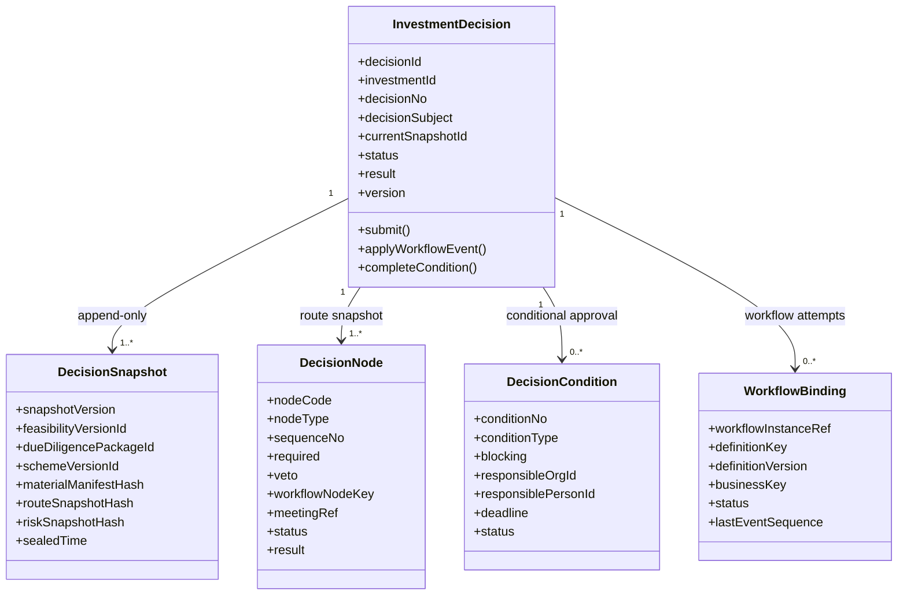
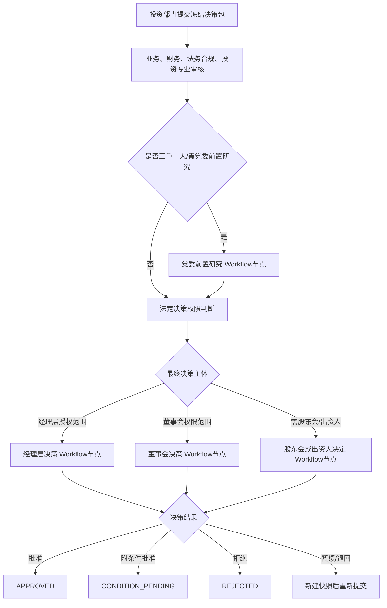

# 投资决策领域设计（冻结版）

项目：县域国企数字化运营治理平台

版本：Sprint 2-3.0

状态：**DESIGN_FROZEN**
冻结日期：2026-08-08

## 0. 冻结结论

本设计在既有Investment分层、Project访问策略、生命周期V2和V2.4.0决策表基础上增量演进，不推翻已有架构，不删除已有代码和字段。

冻结原则：

1. `InvestmentDecision`是投资决策聚合根；
2. 所有人工审核、审批和正式决策必须进入统一Workflow流程中心；
3. Investment不得实现流程定义解析、任务分派、代办、委托、催办或审批引擎；
4. 决策提交时生成不可变`DecisionSnapshot`，固定可研、尽调和投资方案版本；
5. 党委前置研究不替代董事会或经理层的法定决策；
6. Workflow保存流程事实，Investment保存业务状态、稳定引用和经验证的结果快照；
7. 正式结果、决策快照和审计事件只追加，不覆盖；
8. 后续数据库变化只能通过V2.4.4及更高版本Migration完成。

当前仓库尚未发现独立Workflow流程中心的领域模型、数据库表和稳定服务接口。在Workflow契约冻结前，投资决策业务不得以本地状态字段或Controller直改状态代替真实审批。

## 1. 领域模型

### 1.1 聚合边界



聚合内只维护投资决策一致性。以下能力不属于该聚合：

- Workflow流程定义、任务、候选人、委托和SLA；
- 党委会、董事会、经理办公会的议程、参会、表决和会议纪要正文；
- 企业风险台账和风险规则计算；
- 通用操作日志、文件存储、电子签章和消息通知；
- 项目、合同、财务支付和投后管理业务事实。

### 1.2 `InvestmentDecision`

职责：

- 标识一次针对冻结投资方案的完整决策事项；
- 校验提交材料、决策路线和三重一大适用性；
- 关联当前冻结快照和Workflow实例；
- 根据受信Workflow事件推进业务状态；
- 汇总节点结果和附加条件；
- 控制生命周期V2的DECISION阶段门禁；
- 产生不可变业务审计事件。

建议字段：

| 字段 | 说明 |
| --- | --- |
| `id/decisionNo/investmentId` | 聚合标识和投资事项归属 |
| `decisionSubject` | 拟决策事项 |
| `currentSnapshotId` | 当前提交使用的冻结快照 |
| `approvalStatus` | 决策过程状态 |
| `decisionResult` | 整体结果 |
| `majorDecisionApplicable` | 是否适用三重一大 |
| `majorDecisionRef` | 治理中心稳定引用 |
| `partyPreStudyRequired` | 是否必须党委前置研究 |
| `riskLevelSnapshot/riskGateResult` | 提交时风险级别和风险门禁结果 |
| `auditTraceId` | 决策链路审计标识 |
| `version` | 乐观锁版本 |

状态冻结为：

```text
DRAFT
  -> MATERIAL_REVIEW
  -> ROUTE_CONFIRMED
  -> SUBMITTING
  -> IN_WORKFLOW
  -> CONDITION_PENDING
  -> APPROVED

分支：
MATERIAL_REVIEW / IN_WORKFLOW -> RETURNED
IN_WORKFLOW -> REJECTED
IN_WORKFLOW -> DEFERRED -> MATERIAL_REVIEW
DRAFT / MATERIAL_REVIEW -> WITHDRAWN
APPROVED / REJECTED -> SUPERSEDED（仅由新决策事项替代）
```

禁止提供通用`changeStatus`接口。每个状态变化必须由明确命令或已验签Workflow事件触发。

### 1.3 `DecisionSnapshot`

`DecisionSnapshot`是一次提交材料包的不可变事实，职责为：

- 固定已冻结可研版本；
- 固定已通过且冻结的尽调包；
- 固定已冻结投资方案版本；
- 固定材料目录、风险清单和路线规则版本；
- 保存每项内容的哈希和整体清单哈希；
- 支持退回后创建新快照，保留历史提交证据。

建议字段：

| 字段 | 说明 |
| --- | --- |
| `decisionId/snapshotVersion` | 决策内连续快照版本 |
| `feasibilityVersionId/feasibilityHash` | 冻结可研引用和内容哈希 |
| `dueDiligencePackageId/dueDiligenceHash` | 冻结尽调包引用和内容哈希 |
| `schemeVersionId/schemeHash` | 冻结方案引用和内容哈希 |
| `documentManifestHash` | 决策材料目录哈希 |
| `riskAssessmentRef/riskSnapshotHash` | 风险评估引用和风险清单哈希 |
| `routeRuleVersion/routeSnapshotHash` | 权限规则版本和节点集合哈希 |
| `majorDecisionRuleVersion` | 三重一大识别规则版本 |
| `provenanceStatus` | `SYSTEM_CREATED/CONFIRMED`等来源状态 |
| `sealedBy/sealedTime/auditTraceId` | 封存人、时间和审计链路 |

快照封存后不得修改。退回补充、方案变化、可研更新或尽调更新时，必须创建下一快照版本，禁止替换旧快照中的引用。

### 1.4 `DecisionNode`

`DecisionNode`同时承担两类职责：

1. 提交前保存不可变决策路线快照；
2. 流程运行后保存节点结果的业务侧摘要。

核心字段：节点编码、类型、顺序、是否必需、是否具有否决效力、决策主体、权限依据、Workflow节点键、Workflow任务引用、会议引用、状态、结果、意见摘要、正式文件、结果哈希和更正引用。

正式节点结果不得直接UPDATE覆盖。错误更正必须追加新节点记录，并通过`correctionOfNodeId`引用原记录。

### 1.5 `DecisionCondition`

附条件批准产生条件任务，状态冻结为：

```text
OPEN -> RECTIFYING -> SUBMITTED_FOR_REVIEW -> CLOSED
                    -> RETURNED -> RECTIFYING
OPEN / RECTIFYING -> WAIVED（必须经过Workflow授权）
未按期完成 -> OVERDUE
```

约束：

- 阻断条件未全部`CLOSED`或有效`WAIVED`，不得进入IMPLEMENTATION；
- 整改提交人与复核人不得为同一人；
- 豁免必须关联独立Workflow实例，且保存有效期；
- 条件动作写入`investment_decision_condition_action`，不得删除或覆盖历史。

### 1.6 聚合不变量

1. 可研、尽调、方案和决策必须属于同一`investment_id`；
2. 提交快照只能引用`FROZEN`可研、`FROZEN + PASS`尽调包和`FROZEN`方案；
3. 尽调不得存在未关闭阻断问题；
4. `IN_WORKFLOW`后不得修改当前快照和路线节点；
5. 每次Workflow启动必须绑定唯一`decisionId + snapshotId + attemptNo`；
6. Workflow回调只能按单调递增事件序号应用，重复事件幂等返回；
7. 党委前置研究完成不等于整体决策批准；
8. 任一必需且具有否决效力的节点拒绝，整体结果为`REJECTED`；
9. 附条件批准必须生成至少一个条件任务；
10. `APPROVED`要求所有必需节点通过且无未关闭阻断条件。

## 2. Workflow边界

### 2.1 职责划分

| 能力 | Investment决策域 | Workflow流程中心 |
| --- | --- | --- |
| 决策材料和冻结版本 | 权威维护 | 不保存业务正文 |
| 路线业务规则计算 | 权威维护并形成快照 | 按输入节点编排流程 |
| 流程定义和版本 | 保存稳定引用 | 权威维护 |
| 流程实例 | 保存绑定和状态摘要 | 权威维护 |
| 任务分派、候选人、委托、代办 | 不实现 | 权威维护 |
| 审批操作和原始意见 | 保存结果摘要和哈希 | 权威维护完整记录 |
| 会议议程、表决和纪要 | 保存`meetingRef`及结果摘要 | 不维护，由治理/会议中心维护 |
| 业务状态和生命周期门禁 | 权威维护 | 通过事件通知，不直接改业务库 |
| 超时、催办、通知 | 订阅结果 | 权威维护 |
| 业务审计事件 | 保存不可变业务事件 | 保存流程操作审计 |

Workflow不得直接写Investment表；Investment也不得查询Workflow数据库表拼装审批状态。

### 2.2 端口契约

Application层预留以下端口，具体技术协议由Workflow中心冻结：

```text
WorkflowCommandPort
  startProcess(StartDecisionWorkflowCommand)
  requestWithdrawal(WithdrawalCommand)
  requestConditionWaiver(ConditionWaiverCommand)

WorkflowQueryPort
  getInstance(workflowInstanceRef)
  getUserTasks(userId, businessKey)

WorkflowEventConsumer
  onProcessStarted(event)
  onNodeCompleted(event)
  onProcessReturned(event)
  onProcessCompleted(event)
  onProcessCancelled(event)
```

启动命令至少包含：`businessKey`、`decisionId`、`snapshotId`、`snapshotHash`、`routeRuleVersion`、节点定义、发起人、组织、幂等请求号和`traceId`。

回调事件必须包含：事件ID、事件序号、流程实例引用、定义键/版本、业务键、决策ID、快照ID、节点键、任务引用、结果、操作者、操作时间、签名和`traceId`。

### 2.3 一致性与安全

提交不使用跨系统大事务：

```text
本地事务：封存DecisionSnapshot + 冻结DecisionNode路线 + 状态SUBMITTING + 写Outbox
  -> 异步启动Workflow
  -> Workflow返回实例引用
  -> 受信回调将状态推进为IN_WORKFLOW
```

要求：

- Outbox与决策快照同事务；
- Workflow启动使用`decisionId:snapshotId:attemptNo`幂等键；
- 回调验签并校验租户/企业、业务键、快照ID、节点ID和事件顺序；
- Inbox记录事件ID，重复回调不得重复推进节点或生成条件；
- 回调失败进入重试和人工处置队列，不允许前端补写流程结果；
- Workflow实例引用只能由受信适配器回写。

## 3. 三重一大流程

### 3.1 路线判定

`DecisionRoutePolicy`基于以下冻结事实计算路线：

- 章程和决策权限清单版本；
- 投资类型、金额、资产比例、资金来源和合作模式；
- 主责主业、负面清单、关联交易和重大风险识别；
- 投资主体层级、控制关系和被投企业性质；
- 三重一大事项规则版本；
- 是否需要股东会、出资人或监管审批/备案。

计算结果固化到`DecisionSnapshot + DecisionNode`，规则升级不能反向改变历史路线。

### 3.2 标准流程



### 3.3 进入Workflow的节点

所有包含人工判断、会签、审核、批准、否决、豁免或正式决策的节点都进入Workflow：

| 节点 | 是否进入Workflow | 说明 |
| --- | --- | --- |
| `BUSINESS_REVIEW` | 是 | 业务部门会签 |
| `FINANCE_REVIEW` | 是 | 财务审核 |
| `LEGAL_COMPLIANCE_REVIEW` | 是 | 法务合规审核 |
| `RISK_REVIEW` | 是 | 高风险或规则要求时启用 |
| `INVESTMENT_REVIEW` | 是 | 投资评审机构意见 |
| `MAJOR_DECISION_REGISTRATION` | 是 | 三重一大识别复核/备案 |
| `PARTY_COMMITTEE_PRE_STUDY` | 是 | 党委前置研究程序 |
| `MANAGEMENT_DECISION` | 是 | 经理层法定决策 |
| `BOARD_DECISION` | 是 | 董事会法定决策 |
| `SHAREHOLDER_DECISION` | 是 | 股东会或出资人决定 |
| `REGULATORY_APPROVAL` | 是 | 作为外部任务或服务任务接入 |
| 条件豁免、条件关闭复核 | 是 | 防止责任人自行关闭或豁免 |

纯技术校验，如材料哈希、版本状态、金额一致性和阻断项数量检查，由Investment同步执行，不创建审批节点。

### 3.4 党委、董事会和经理层规则

- 党委前置研究是前置程序，输出`AGREE/CONDITIONAL/DISAGREE/DEFER`，不能写成最终投资批准；
- 党委研究后仍必须进入章程和授权清单确定的董事会或经理层节点；
- 董事会与经理层是否串行或互斥由冻结的权限规则决定，禁止Controller硬编码；
- 党委意见与最终决策不一致时，必须记录差异说明、权限依据和审计事件；
- 会议正文、参会人和表决明细保存在治理/会议中心，Investment只保存受信`meetingRef`、结果摘要、文件ID和哈希。

## 4. 决策快照设计

### 4.1 提交规则

提交前必须同时满足：

1. 方案版本状态为`FROZEN`且内容哈希有效；
2. 引用的可研版本为同一投资事项的有效冻结版本；
3. 尽调包为同一投资事项的`FROZEN + PASS`版本；
4. 尽调必需类型完整，阻断问题为0；
5. 风险评估已完成或存在有效授权处理结论；
6. 决策材料文件有效、未逻辑删除、访问级别符合要求；
7. 路线规则和三重一大规则版本明确；
8. 当前用户通过Project访问策略和提交权限校验。

### 4.2 快照复制边界

允许固化：稳定业务ID、版本号、状态、内容哈希、规则版本、文件清单哈希、风险清单哈希和必要的名称/编码展示快照。

禁止复制：可研全文、尽调全文、会议正文、完整Workflow任务数据、人员敏感信息和风险台账全文。

历史查询必须从`DecisionSnapshot`读取固定引用，不得读取可研档案头、方案档案头的`current_version_id`，也不得按“最新版本”重算历史决策。

### 4.3 退回和重新提交

- 流程退回后当前快照仍保持`SEALED`；
- 补充材料创建`snapshotVersion + 1`；
- 新快照重新执行版本、风险、材料和路线完整性校验；
- 新Workflow实例绑定新快照，旧实例保留；
- 决策事项通过`currentSnapshotId`切换当前提交版本，历史引用不变。

## 5. 风险与审计设计

### 5.1 风险预留

重要业务对象统一预留：

| 字段 | 用途 |
| --- | --- |
| `risk_level_snapshot` | 提交时风险级别 |
| `risk_assessment_ref` | Risk中心稳定评估引用 |
| `risk_gate_result` | PASS/CONDITIONAL/BLOCK |
| `risk_rule_version` | 风险规则版本 |
| `risk_snapshot_hash` | 风险清单摘要哈希 |
| `risk_acceptance_workflow_ref` | 风险接受或豁免Workflow引用 |
| `source_risk_ref` | 节点/条件来源风险引用 |

Investment不创建企业风险台账；发现风险时通过Risk端口登记或关联，Investment仅保存稳定引用和门禁结果。

### 5.2 审计预留

现有表继续保留`create_time/create_by/update_time/update_by/deleted/delete_token/remark/version`。正式决策另增加不可变审计事件，至少记录：

- `event_type`、业务对象ID和事件时间；
- 操作用户、组织和角色快照；
- 原状态、目标状态和命令类型；
- Workflow实例、任务和事件稳定引用；
- `trace_id`、`idempotency_key`和来源IP摘要；
- 请求摘要、结果摘要和`payload_hash`；
- 风险引用、审计项目引用和证据文件引用。

必须审计：创建、封存快照、提交、撤回、节点完成、党委前置研究、董事会/经理层结果、条件创建/整改/复核/豁免、Workflow回调拒绝、风险接受、决策替代和生命周期推进。

密码、JWT全文、身份证号、银行账号和会议敏感正文禁止进入审计事件。

### 5.3 职责分离

- 编制人不能审批本人提交的最终节点；
- 条件整改人不能复核本人整改；
- 系统管理员不自动获得业务审批权；
- RBAC权限不能替代Workflow待办、决策主体授权和有效委托校验；
- 审计查看与业务编辑权限分离；
- 风险豁免必须由高于风险责任人的授权层级审批。

## 6. 数据库规划

### 6.1 现有结构复用

V2.4.0已提供：

- `investment_decision`：决策事项头及兼容历史字段；
- `investment_decision_node`：路线节点和结果摘要；
- `investment_decision_condition`：附加条件当前状态；
- `investment_decision_condition_action`：条件动作历史；
- 可研、尽调和方案版本外键及部分哈希字段。

上述表继续使用，不删除、不重建。`investment_decision`上已有的`scheme_version_id`、`feasibility_version_id`和`due_diligence_package_id`作为兼容摘要保留；新业务以`DecisionSnapshot`为权威提交依据。

### 6.2 增量表建议

#### `investment_decision_snapshot`

核心字段：

```text
id, decision_id, snapshot_version, status,
feasibility_version_id, feasibility_content_hash,
due_diligence_package_id, due_diligence_content_hash,
scheme_version_id, scheme_content_hash,
document_manifest_hash,
risk_assessment_ref, risk_level_snapshot, risk_gate_result,
risk_rule_version, risk_snapshot_hash,
route_rule_version, route_snapshot_hash,
major_decision_rule_version, provenance_status,
sealed_by, sealed_time, audit_trace_id,
create_time, create_by, update_time, update_by,
deleted, delete_token, remark, version
```

唯一约束：`decision_id + snapshot_version + delete_token`。封存后不允许更新或逻辑删除。

#### `investment_decision_workflow_binding`

只保存跨域绑定，不复制Workflow任务：

```text
id, decision_id, snapshot_id, attempt_no,
workflow_instance_ref, definition_key, definition_version,
business_key, start_request_id, status,
last_event_id, last_event_sequence,
started_time, completed_time, trace_id,
create_time, create_by, update_time, update_by,
deleted, delete_token, remark, version
```

唯一约束：`decision_id + snapshot_id + attempt_no + delete_token`、`workflow_instance_ref + delete_token`和`start_request_id + delete_token`。

#### `investment_decision_audit_event`

不可变业务审计流水，保存事件类型、对象引用、操作者/角色快照、Workflow事件引用、状态变化、风险/审计引用、`traceId`、幂等键和载荷哈希。该表只追加，不提供删除接口。

### 6.3 增量字段建议

| 表 | 增量字段 |
| --- | --- |
| `investment_decision` | `current_snapshot_id`、`risk_level_snapshot`、`risk_assessment_ref`、`risk_gate_result`、`audit_trace_id` |
| `investment_decision_node` | `snapshot_id`、`workflow_node_key`、`workflow_task_ref`、`workflow_event_ref`、`risk_review_ref`、`audit_trace_id` |
| `investment_decision_condition` | `source_risk_ref`、`waiver_workflow_ref`、`audit_trace_id` |
| `investment_decision_condition_action` | `workflow_event_ref`、`payload_hash`、`audit_ref` |

新增字段第一阶段均允许NULL，完成回填和一致性验证后再由更高版本Migration收紧。Workflow、Risk和Audit中心物理表尚未冻结前只保存稳定字符串引用，不创建错误的跨模块外键。

## 7. 权限设计

保留现有`investment:decision`作为投资决策菜单兼容权限，不改名、不删除。新增细粒度权限：

| 权限 | 用途 |
| --- | --- |
| `investment:decision:view` | 查看决策事项、节点和当前状态 |
| `investment:decision:create` | 创建决策草稿 |
| `investment:decision:edit` | 编辑未提交草稿 |
| `investment:decision:submit` | 封存快照并提交Workflow |
| `investment:decision:withdraw` | 在规则允许时申请撤回 |
| `investment:decision:condition:manage` | 整改条件任务 |
| `investment:decision:condition:review` | 复核、关闭或退回条件 |
| `investment:decision:risk:view` | 查看风险摘要和稳定引用 |
| `investment:decision:audit:view` | 查看决策审计时间线 |

不设置可绕过流程的通用`investment:decision:approve`业务入口。实际审批必须同时满足：

1. 用户拥有Workflow任务操作权限；
2. 当前用户是有效待办处理人或合法受托人；
3. 当前节点对应的决策主体授权有效；
4. 职责分离规则通过；
5. Workflow实例、快照和节点绑定校验通过。

Workflow内部回调使用服务身份、双向认证或签名，不使用普通用户RBAC权限。

数据查询统一经过Project访问策略和数据权限；Workflow待办只能缩小可操作范围，不能扩大项目数据范围。

## 8. Migration规划

历史V2.4.0—V2.4.3不可修改。建议版本链：

| 版本 | 文件建议 | 内容 | 前置条件 |
| --- | --- | --- | --- |
| V2.4.4 | `V2.4.4__create_investment_decision_snapshot.sql` | 新建快照表，增加`current_snapshot_id`和版本完整性索引 | 本设计冻结 |
| V2.4.5 | `V2.4.5__add_investment_decision_workflow_binding.sql` | 新建Workflow绑定表，扩展节点Workflow引用 | Workflow端口和标识规范冻结 |
| V2.4.6 | `V2.4.6__add_investment_decision_risk_audit.sql` | 新建业务审计事件，增加risk/audit字段 | Risk/Audit稳定引用规范冻结 |
| V2.4.7 | `V2.4.7__bootstrap_investment_decision_rbac.sql` | 细粒度权限、菜单、字典和超级管理员技术访问 | 权限评审通过 |
| V2.4.8 | `V2.4.8__tighten_investment_decision_integrity.sql` | 回填校验后收紧非空、唯一和一致性约束 | V2.4.4—V2.4.7真实验收通过 |

迁移规则：

- 先扩展、再回填、后收紧；
- 历史决策不能推断Workflow实例、审批人、三重一大引用或冻结快照；
- 无法确认来源的数据标记`LEGACY/LEGACY_UNKNOWN`，不进入自动门禁；
- 快照回填只能引用有确凿版本证据的记录，禁止按“当前版本”伪造历史；
- 每个版本执行空库和V2.4.3升级库Flyway验收；
- 生产失败优先采用更高版本前向修复，禁止自动`repair`；
- 回滚不得删除已产生的决策、快照、节点和审计事实。

## 9. 后续开发计划

### Sprint 2-3.1：Workflow契约冻结

- 建设或确认统一Workflow流程中心；
- 冻结流程定义键、版本、实例、任务、委托、回调和签名协议；
- 冻结通用Outbox/Inbox实现；
- 提供契约测试和Mock适配器，但不伪造生产审批事实。

### Sprint 2-3.2：决策Migration落地

- 实施V2.4.4—V2.4.7；
- 完成空库、V2.4.3升级库和历史数据兼容测试；
- 冻结SHA-256、Flyway checksum和Schema指纹。

### Sprint 2-3.3：聚合与快照持久化

- 重构现有`InvestmentDecision`骨架；
- 实现DecisionSnapshot、DecisionNode、DecisionCondition；
- 实现Repository Adapter和不可变性测试；
- 保留现有代码兼容入口，渐进迁移。

### Sprint 2-3.4：Workflow接入

- 实现提交Outbox、流程启动、验签回调和Inbox幂等；
- 接入专业审核、党委前置研究、董事会和经理层节点；
- 完成重复、乱序、伪造和超时回调安全测试。

### Sprint 2-3.5：条件闭环与生命周期门禁

- 实现条件整改、复核、豁免和审计时间线；
- 所有阻断条件关闭后推进生命周期V2；
- 对接Risk中心稳定引用。

### Sprint 2-3.6：综合验收

- 完成RBAC、数据权限、职责分离、敏感附件、审计和性能测试；
- 执行真实MySQL/Flyway、Workflow集成和故障恢复验收；
- 形成投资决策模块冻结版本。

## 10. 编码前置门禁

以下条件未满足前，不进入投资决策业务编码：

1. Workflow流程中心职责、接口和稳定标识已评审冻结；
2. 可研、尽调和方案的正式提交/评审/冻结能力已可用；
3. 党委会、董事会、经理层会议稳定引用规则已确认；
4. 三重一大识别规则和决策权限清单版本来源已确认；
5. Risk和Audit稳定引用字段规范已确认；
6. V2.4.4 Migration评审通过且不修改历史Migration；
7. 编制、审批、复核和系统管理员职责分离矩阵已批准。
