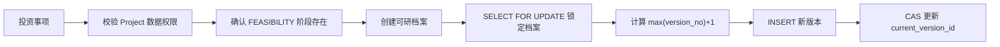
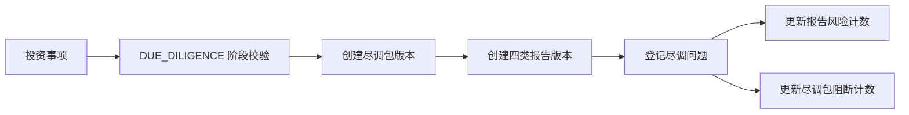

# 投资论证基础能力实施报告

## 1. 实现范围

Sprint 2-2.4 已基于 V2.4.0 既有数据库结构完成可研和尽调基础能力，未修改投资业务表结构，未启用投资决策强制门禁。

### 1.1 可研管理

- 创建 `investment_feasibility` 可研档案头，一个投资事项只能存在一个有效档案。
- 向 `investment_feasibility_version` 追加报告版本。
- 自动生成连续版本号并按版本号倒序查询。
- 维护总投资、年收入、年成本、年税费、年净利润、ROI、IRR、回收期和风险结论等关键指标。
- 创建版本后，通过乐观锁原子切换档案的 `current_version_id`。
- 不提供历史版本更新或删除用例；任何指标调整都必须创建新版本。

### 1.2 尽调管理

- 创建版本化 `investment_due_diligence_package` 尽调包。
- 尽调包固化规则版本和必需尽调类型快照。
- 支持四类报告：`FINANCIAL`、`LEGAL`、`BUSINESS`、`TECHNICAL`。
- 每个尽调包、每种报告类型独立递增报告版本，旧版本不覆盖。
- 支持问题登记、风险等级、阻断标识、整改措施、责任组织/人员和截止日期。
- 登记问题时同步维护报告重大/未解决风险数量；阻断问题同步维护尽调包阻断问题数量。

## 2. 领域流程

### 2.1 可研版本流程

版本新增、当前版本指针更新处于同一 REQUIRED 事务。若插入失败、唯一键冲突或档案版本 CAS 失败，整笔事务回滚。

### 2.2 尽调流程

本 Sprint 只验证项目生命周期中存在 `FEASIBILITY` 或 `DUE_DILIGENCE` 阶段，不自动开始、完成或推进阶段，也不把报告结论配置为决策阶段的强制门禁。

### 2.3 数据访问链

所有入口均按以下路径校验：

`Investment 资源ID → investment_project.project_id → ProjectResourceAccessService → ProjectAccessPolicy → 生命周期阶段`

通过尽调包 ID 或报告 ID 查询时，先读取最小 `investment_id` 投影完成授权，再加载完整报告事实，避免在权限校验前读取受保护内容。

## 3. API范围

### 可研

| 方法 | 路径 | 功能 |
| --- | --- | --- |
| POST | `/investment/feasibilities/{investmentId}` | 创建可研档案 |
| POST | `/investment/feasibilities/{investmentId}/versions` | 追加可研版本及关键指标 |
| GET | `/investment/feasibilities/{investmentId}/versions` | 查询全部历史版本 |

### 尽调

| 方法 | 路径 | 功能 |
| --- | --- | --- |
| POST | `/investment/due-diligence/{investmentId}/packages` | 创建尽调包版本 |
| GET | `/investment/due-diligence/{investmentId}/packages` | 查询尽调包 |
| POST | `/investment/due-diligence/packages/{packageId}/reports` | 创建四类尽调报告版本 |
| GET | `/investment/due-diligence/packages/{packageId}/reports` | 查询报告版本 |
| POST | `/investment/due-diligence/reports/{reportId}/items` | 登记问题 |
| GET | `/investment/due-diligence/reports/{reportId}/items` | 查询问题 |

## 4. 权限设计

| 权限 | 能力 |
| --- | --- |
| `investment:feasibility:view` | 查询可研历史版本 |
| `investment:feasibility:edit` | 创建档案、追加可研版本和关键指标 |
| `investment:due_diligence:view` | 查询尽调包、报告和问题 |
| `investment:due_diligence:edit` | 创建尽调包、追加报告、登记问题 |

Controller 和 Application Service 均声明 `@PreAuthorize`，后端权限校验不依赖前端隐藏。

权限初始化资产为：

- `V2.4.2__add_investment_feasibility_due_diligence_permissions.sql`
- SHA-256：`c71ddc226a04155afe4552fd23bc826b87ba600967258675dc95b8a26d002d40`
- 只写入 RBAC 权限、菜单和超级管理员授权，不修改业务表。
- 当前状态：`CANONICAL_PENDING_VALIDATION / NOT_EXECUTED`。

## 5. 测试结果

| 测试项 | 结果 |
| --- | --- |
| Java 21 编译与测试编译 | 通过 |
| Investment 专项测试 | 39 个通过 |
| 可研版本自动递增 | 通过 |
| 历史版本无更新/删除用例 | 通过 |
| 档案乐观锁冲突拒绝 | 通过 |
| 可研版本保存异常事务回滚 | 通过 |
| 四类尽调报告 | 通过 |
| 高风险/阻断问题计数更新 | 通过 |
| RBAC权限契约 | 通过 |
| Entity与V2.4表映射 | 通过 |
| 后端全量测试 | 158 个通过，0 失败，0 错误，0 跳过 |
| Migration SHA-256清单 | 全部匹配 |

测试上下文未加载业务 Schema，因此启动字段检查仍会输出 H2 `TABLE_NOT_FOUND` 告警；该告警不代表 MySQL 映射失败。

## 6. 剩余风险

1. 当前机器没有 Docker 命令，V2.4.2 尚未执行真实 MySQL8/Flyway `migrate → validate`，上线前必须完成并回填 Flyway checksum。
2. 历史版本不可修改目前由领域端口和 Application Service 强制；基础设施 Mapper 仍具备 MyBatis Plus 通用更新能力，绕过 Repository 属于代码审查阻断项。后续可通过数据库账号权限或专用只写 Mapper 进一步加固。
3. 可研市场、技术、财务和风险长文本字段已经完成 Entity 映射，但本批 API 只开放关键指标和结论，完整报告正文编辑需后续版本化命令支持。
4. 尽调问题当前只实现登记和查询，整改提交、复核、关闭、风险接受尚未实现。
5. 报告文件只保存 `sys_file` 引用，文件有效性校验和病毒扫描由文件中心负责，本批未重复实现。
6. 阶段关联暂不自动推进生命周期；强制决策门禁必须在投资决策 Sprint 中基于冻结版本和未关闭阻断项单独启用。
7. 尽调包/报告版本号采用“查询最大值 + 数据库唯一约束”，并发冲突会安全回滚并要求重试；若未来需要无重试连续编号，应增加独立序列机制。
