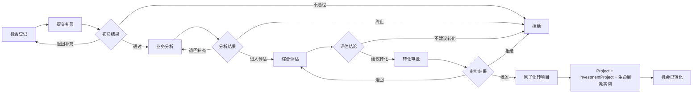

# 投资机会管理能力设计

> 版本：V1.0
> 对应阶段：Sprint 2-1.2
> 文档性质：业务能力设计，不修改业务代码、不新增或执行数据库Migration
> 设计基线：`investment-project-domain-design.md`、`investment-database-design.md`

## 1. 目标与边界

投资机会管理用于在正式建立Project之前，对潜在投资事项进行登记、筛选、分析、评估和转化决策。核心记录为 `investment_opportunity`。

本能力负责：

- 机会来源、提出部门、提出人和责任人的记录；
- 初步投资方向、合作方和收益测算；
- 机会初筛、业务分析、综合评估和转化审批；
- 研判材料、结论、驳回原因和过程审计；
- 通过受控事务转化为 `project_info` 与 `investment_project`。

本能力不负责：

- 正式可研、尽调、投资方案和投资决策；
- Project阶段、任务和成员管理；
- 被投企业、股权、支付、收益和退出管理；
- 三重一大正式决策。机会转化批准只表示允许建立正式投资项目，不等于最终投资决策通过。

### 1.1 核心业务原则

1. 机会可以独立存在，登记时不创建Project。
2. 初筛、分析、评估均保留结构化结论，禁止只通过修改一个状态表达全过程。
3. 转化操作必须幂等，并在一个应用事务中创建Project、投资事项和生命周期实例。
4. `investment_project` 是转化后的投资事项权威数据，机会记录只保留转化前事实和转化快照。
5. 机会被拒绝或关闭后仍保留审计记录，不进行物理删除。
6. 提出人不能单独批准自己提出的机会转项目；审批必须满足职责分离。
7. 所有列表和详情查询由后端执行权限与数据范围校验，禁止只依赖前端隐藏。

## 2. 业务流程

### 2.1 主流程



### 2.2 阶段职责与产出

| 阶段 | 主要责任人 | 必需输入 | 主要产出 |
|---|---|---|---|
| 机会登记 | 提出人 | 来源、名称、提出部门、方向 | 机会草稿 |
| 初筛 | 投资负责人或初筛人员 | 完整登记信息、基础材料 | 合规性、战略匹配、重复性初筛结论 |
| 分析 | 业务负责人 | 市场、合作方、业务模式、初步测算 | 业务分析报告及风险初识别 |
| 评估 | 投资负责人组织 | 初筛与分析结果 | 综合评分、评估结论、转化建议 |
| 转化审批 | 获授权审批人员 | 完整研判包、拟建项目信息 | 批准、退回或拒绝 |
| 转项目 | 系统 | 批准结论、模板与编号 | Project、投资事项、生命周期实例及转化审计 |

### 2.3 退回、拒绝与关闭

- **退回补充**：回到指定前置环节，可修改未冻结字段；必须填写退回原因。
- **拒绝**：当前研判周期终止；重新发起必须复制为新机会并关联原机会，不能清除历史结论后复用。
- **关闭**：用于机会失效、重复登记、外部条件消失等非评估拒绝场景；必须记录关闭类型和原因。
- **撤回**：提出人在初筛开始前可以撤回；初筛开始后需由当前办理人退回或关闭。

## 3. 数据模型

### 3.1 聚合模型

```text
InvestmentOpportunity
├─ Identity：opportunityId、opportunityNo
├─ Source：sourceType、sourceDescription、sourceReference
├─ Ownership：proposingOrgId、proposerId、businessOwnerId、investmentOwnerId
├─ Proposition：name、direction、partnerSummary、description
├─ PreliminaryReturn：amount、income、ROI、IRR、paybackPeriod、assumptions
├─ Assessment：screening、analysis、evaluation、conversionApproval
├─ Conversion：projectId、investmentId、templateVersionId、convertedTime
└─ Audit：status、version、created/updated、closed/rejected reason
```

`InvestmentOpportunity` 是机会阶段聚合根。研判记录是其有界子对象；Project与InvestmentProject是转化后创建的独立聚合，只保存ID引用，不作为机会聚合内部对象加载。

### 3.2 `investment_opportunity` 核心字段

| 字段 | 类型/值 | 必填阶段 | 说明 |
|---|---|---|---|
| `id` | BIGINT | 创建 | 机会ID |
| `opportunity_no` | VARCHAR(50) | 创建 | 机会编号，全局唯一 |
| `opportunity_name` | VARCHAR(200) | 创建 | 机会名称 |
| `source_type` | VARCHAR(50) | 提交 | 机会来源稳定编码 |
| `source_description` | VARCHAR(500) | 按来源 | 来源说明 |
| `source_reference` | VARCHAR(100) | 按来源 | 外部项目/集团任务等稳定引用 |
| `proposing_org_id` | BIGINT | 创建 | 提出部门 |
| `proposer_id` | BIGINT | 创建 | 提出人 |
| `business_owner_id` | BIGINT | 初筛通过前 | 业务负责人 |
| `investment_owner_id` | BIGINT | 初筛通过前 | 投资负责人 |
| `investment_direction` | VARCHAR(200) | 提交 | 投资方向 |
| `partner_summary` | VARCHAR(500) | 可选 | 合作方摘要，不保存逗号分隔ID |
| `opportunity_description` | TEXT | 提交 | 机会说明 |
| `preliminary_amount` | DECIMAL(18,2) | 分析完成 | 初步投资金额 |
| `preliminary_income` | DECIMAL(18,2) | 分析完成 | 初步收益 |
| `preliminary_roi` | DECIMAL(9,4) | 可选 | 初步ROI |
| `preliminary_irr` | DECIMAL(9,4) | 可选 | 初步IRR |
| `payback_period` | DECIMAL(9,2) | 可选 | 初步回收期，年 |
| `estimate_date` | DATE | 有测算时 | 测算基准日 |
| `estimate_assumption` | TEXT | 有测算时 | 测算口径与假设 |
| `screening_conclusion` | VARCHAR(30) | 初筛完成 | PASS/RETURN/REJECT |
| `analysis_conclusion` | VARCHAR(30) | 分析完成 | PROCEED/RETURN/STOP |
| `evaluation_conclusion` | VARCHAR(30) | 评估完成 | RECOMMEND/CONDITIONAL/NOT_RECOMMEND |
| `evaluation_score` | DECIMAL(5,2) | 评估完成 | 综合评分0—100 |
| `approval_instance_ref` | VARCHAR(100) | 转化审批 | 审批流程稳定引用 |
| `conversion_result` | VARCHAR(30) | 审批完成 | APPROVED/RETURNED/REJECTED |
| `project_id` | BIGINT | 转化成功 | 新建 `project_info.id` |
| `investment_id` | BIGINT | 转化成功 | 新建 `investment_project.id` |
| `template_version_id` | BIGINT | 转化成功 | 使用的生命周期模板版本 |
| `converted_time` | DATETIME(3) | 转化成功 | 转化完成时间 |
| `status` | VARCHAR(30) | 始终 | 当前状态 |
| `close_reason` | VARCHAR(1000) | 关闭/拒绝 | 原因 |
| 通用字段 | 审计/逻辑删除/版本 | 始终 | 遵循数据库统一规范 |

说明：上一阶段数据库文档只定义了机会最小字段。本设计新增的责任人、研判结论、审批和转化快照字段属于后续数据库评审候选，不在本Sprint创建Migration。

### 3.3 研判记录

为保留多次退回、重新分析和审批历史，不能只覆盖主表结论。建议后续设计统一过程记录：

```text
OpportunityAssessmentRecord
  id
  opportunityId
  assessmentType       SCREENING / ANALYSIS / EVALUATION / CONVERSION_APPROVAL
  roundNo
  conclusion
  score
  opinion
  assessorId
  assessedTime
  attachmentRefs
  ruleVersion
```

主表保存当前结论快照，过程记录保存不可变历史。具体物理表在后续数据库详细设计中确认，本阶段不新增表。

### 3.4 初步收益值对象

初步收益必须作为一组数据校验：

- 初步投资金额、预计收益；
- ROI、IRR、回收期；
- 币种，默认CNY；
- 测算基准日；
- 收益口径和关键假设。

初步收益只用于机会筛选，不能被正式可研、决策或财务报表直接引用为权威测算。

## 4. 机会来源管理

### 4.1 标准来源编码

| 中文来源 | 编码 | 来源引用 | 典型证明材料 |
|---|---|---|---|
| 政府项目 | `GOVERNMENT_PROJECT` | 政府项目/任务编号 | 政府文件、会议纪要、项目清单 |
| 企业合作 | `ENTERPRISE_COOPERATION` | 合作方或洽谈编号 | 合作意向、交流纪要、合作方资料 |
| 市场发现 | `MARKET_DISCOVERY` | 市场线索编号，可空 | 市场调研、行业报告、客户线索 |
| 集团下达 | `GROUP_ASSIGNED` | 集团任务编号 | 集团正式文件、年度任务 |
| 自主策划 | `SELF_PLANNED` | 内部策划编号，可空 | 策划方案、内部论证材料 |
| 其他 | `OTHER` | 可空 | 来源说明与支撑材料 |

上述编码是本能力的标准编码，细化了上一阶段文档中的通用来源。实施时应统一更新未来Migration设计和应用枚举，禁止同时保留语义重复的别名。

### 4.2 来源配置方式

- 来源元数据可由 `sys_dict` 管理显示名称、排序和启停状态，字典类型建议为 `INVESTMENT_OPPORTUNITY_SOURCE`。
- 编码属于系统保留值，已被历史数据使用后不得改名；停用只影响新登记，不影响历史展示。
- 来源规则由应用配置维护，例如是否必填 `source_reference`、是否需要政府/集团附件。
- 不允许普通业务用户创建任意来源编码，避免统计口径失控。

### 4.3 来源校验

| 来源 | 强制规则 |
|---|---|
| 政府项目 | 来源说明、政府事项引用和至少一份依据材料 |
| 企业合作 | 合作方摘要、合作背景；转入分析前完成合作方基本核验 |
| 市场发现 | 市场场景、需求依据和信息时效性 |
| 集团下达 | 集团任务引用、下达日期和责任组织 |
| 自主策划 | 策划部门、战略匹配说明和内部发起依据 |

## 5. 状态机与生命周期

### 5.1 状态定义

| 状态 | 含义 | 可修改范围 |
|---|---|---|
| `DRAFT` | 草稿 | 提出人可修改全部登记字段 |
| `REGISTERED` | 已登记、待初筛 | 仅允许撤回或由初筛人受理 |
| `SCREENING` | 初筛中 | 初筛意见、责任人分配 |
| `ANALYZING` | 分析中 | 业务分析和初步收益 |
| `EVALUATING` | 综合评估中 | 评分、评估意见和建议 |
| `PENDING_CONVERSION_APPROVAL` | 待转化审批 | 业务字段冻结，只允许审批操作 |
| `ACCEPTED` | 已批准转化 | 等待系统执行转化，业务字段冻结 |
| `CONVERTING` | 转化处理中 | 系统临时状态，禁止人工修改 |
| `CONVERTED` | 已转为正式项目 | 机会只读 |
| `REJECTED` | 研判或审批拒绝 | 只读，可复制重开新机会 |
| `CLOSED` | 已关闭 | 只读 |

`CONVERTING` 不应长时间存在。若使用单库本地事务，事务提交后直接表现为 `CONVERTED`；若涉及外部审批/事件协调，`CONVERTING` 用于幂等恢复。

### 5.2 合法流转

| 当前状态 | 命令 | 目标状态 | 核心条件 |
|---|---|---|---|
| DRAFT | `register` | REGISTERED | 必填字段、来源规则通过 |
| REGISTERED | `withdraw` | DRAFT | 初筛尚未开始、提出人本人 |
| REGISTERED | `startScreening` | SCREENING | 已分配投资负责人 |
| SCREENING | `returnForSupplement` | DRAFT | 退回原因非空 |
| SCREENING | `passScreening` | ANALYZING | 战略、合规、重复性初筛通过 |
| SCREENING | `reject` | REJECTED | 拒绝原因非空 |
| ANALYZING | `submitEvaluation` | EVALUATING | 分析结论和测算信息完整 |
| ANALYZING | `stop` | REJECTED | 终止原因非空 |
| EVALUATING | `returnAnalysis` | ANALYZING | 退回原因非空 |
| EVALUATING | `recommendConversion` | PENDING_CONVERSION_APPROVAL | 评估通过、无阻断风险 |
| EVALUATING | `notRecommend` | REJECTED | 评估结论完整 |
| PENDING_CONVERSION_APPROVAL | `returnEvaluation` | EVALUATING | 审批退回意见非空 |
| PENDING_CONVERSION_APPROVAL | `approveConversion` | ACCEPTED | 审批完成、职责分离通过 |
| PENDING_CONVERSION_APPROVAL | `rejectConversion` | REJECTED | 审批拒绝原因非空 |
| ACCEPTED | `convertToProject` | CONVERTED | 转化前置条件和事务全部成功 |
| 非终态 | `close` | CLOSED | 有关闭权限及原因，转化中除外 |

### 5.3 状态机约束

1. 所有命令携带当前 `version`，使用乐观锁防止重复审批和并发覆盖。
2. 状态更新必须使用条件更新：`WHERE id=? AND status=? AND version=? AND deleted=0`。
3. 禁止通用“修改状态”接口；每个业务动作对应明确命令。
4. 研判结论一经进入下一阶段即冻结；更正通过退回产生新一轮记录。
5. `CONVERTED` 必须同时具备 `project_id`、`investment_id`、`template_version_id` 和 `converted_time`。
6. `REJECTED`、`CLOSED`、`CONVERTED` 为终态，不可恢复为业务处理中状态。

## 6. 机会研判规则

### 6.1 初筛

初筛至少校验：

- 是否符合企业战略和年度投资方向；
- 是否属于禁止或限制投资领域；
- 是否与现有机会、项目或投资事项重复；
- 提出部门与来源材料是否真实完整；
- 合作方是否存在明显失信、关联交易或合规风险；
- 初步投资规模是否超出企业能力或授权边界。

初筛结论为 `PASS`、`RETURN` 或 `REJECT`。初筛通过不代表投资可行，只允许进入业务分析。

### 6.2 分析

分析至少覆盖：

- 行业、市场空间和竞争格局；
- 商业模式和投资方向匹配度；
- 合作方能力、合作模式及利益安排；
- 初步投资金额、资金来源和回报测算；
- 政策、市场、财务、法律、运营和退出风险初识别；
- 可能的被投主体或SPV安排。

分析阶段不得用机会测算替代正式可研或尽调。

### 6.3 评估

建议评估维度及权重由配置版本管理，不在Controller中硬编码：

| 维度 | 建议权重 | 阻断示例 |
|---|---:|---|
| 战略匹配 | 20% | 不符合主责主业或授权范围 |
| 市场与业务 | 20% | 缺乏明确需求或可持续模式 |
| 财务初评 | 20% | 资金不可落实或回报明显不合理 |
| 合作方 | 15% | 严重失信、主体资格异常 |
| 风险合规 | 20% | 禁止投资领域、重大未缓释风险 |
| 实施条件 | 5% | 核心资源无法取得 |

综合分只作辅助，命中阻断规则时不得因总分达标自动通过。评估结果必须保存规则版本，确保历史可解释。

## 7. 机会转项目规则

### 7.1 创建时点

| 对象 | 创建时点 | 原因 |
|---|---|---|
| `investment_opportunity` | 机会登记保存草稿时 | 承载转项前全部事实 |
| `project_info` | 转化审批通过后，执行转化命令时 | 避免未通过机会产生空壳Project |
| `investment_project` | 与 `project_info` 同一事务内紧接创建 | 保证通用项目与投资事项一一对应 |
| 生命周期V2实例 | `project_info` 创建后、事务提交前 | 新项目必须选择ACTIVE投资模板并生成快照 |
| 正式可研/尽调 | 转化成功后按生命周期推进时 | 不将机会分析伪装为正式报告 |

### 7.2 转化前置条件

1. 机会状态为 `ACCEPTED`；
2. 转化审批结果为 `APPROVED` 且审批引用有效；
3. 机会未关联Project或InvestmentProject；
4. 项目名称、责任组织、负责人、项目类型和拟用模板已确认；
5. 存在适用于投资项目类型的ACTIVE生命周期模板版本；
6. 无重复机会、重复项目或重复投资编号；
7. 当前用户拥有机会转化权限及目标组织数据权限；
8. 所有阻断风险已关闭或取得明确豁免依据。

### 7.3 原子化转化流程

```text
convertOpportunity(command, idempotencyKey)
  1. 校验功能权限和机会数据权限
  2. 锁定机会并校验状态、version、幂等键
  3. 重新校验审批与ACTIVE模板事实
  4. 生成 projectId、investmentId、项目编号和投资编号
  5. 创建 project_info（project_type=投资项目）
  6. 创建 investment_project（project_id=projectId）
  7. 复制生命周期模板，生成实例与阶段快照
  8. 回写机会 project_id、investment_id、template_version_id
  9. 更新机会为 CONVERTED，记录 converted_time
 10. 写Outbox领域事件和审计日志
 11. 提交事务
```

任一步失败必须整体回滚，禁止出现只有Project、没有InvestmentProject或生命周期实例的半成品。

### 7.4 字段映射

| 机会字段 | `project_info` | `investment_project` |
|---|---|---|
| `opportunity_name` | `project_name` | `investment_name` |
| 生成的项目编号 | `project_no` | 不使用 |
| 生成的投资编号 | 不使用 | `investment_no` |
| 固定投资项目类型 | `project_type` | `investment_type` 由转化命令确认 |
| `proposing_org_id`/确认责任组织 | `department_id` | 通过Project继承数据权限 |
| `investment_owner_id` | `leader_id`，需业务确认 | 不重复保存负责人 |
| `preliminary_amount` | 可作为预算初值，需口径确认 | `total_amount` 初值 |
| `preliminary_income` | 不直接写正式收益 | `expected_income` 初值并标记来源为机会测算 |
| `partner_summary` | 不写入 | 合作方摘要 |

机会转化后，Project和InvestmentProject中的字段独立演进；机会只保留转化时快照，不接受反向覆盖。

### 7.5 幂等与恢复

- 客户端必须传递 `idempotencyKey`，服务端以“机会ID + 幂等键”记录结果。
- 若机会已经 `CONVERTED`，相同幂等键返回既有 `project_id` 和 `investment_id`；不同命令不得再次创建。
- 单库事务内使用本地事务；跨系统通知通过Outbox在提交后投递。
- 禁止先调用Project接口、再由前端调用Investment接口拼装转化流程。

## 8. 权限设计

### 8.1 功能权限

| 权限编码 | 功能 |
|---|---|
| `investment:opportunity:view` | 查看机会列表和基础详情 |
| `investment:opportunity:create` | 新建机会 |
| `investment:opportunity:update` | 修改草稿或被退回机会 |
| `investment:opportunity:submit` | 提交登记进入初筛 |
| `investment:opportunity:screen` | 受理并完成初筛 |
| `investment:opportunity:analyze` | 维护业务分析和初步测算 |
| `investment:opportunity:evaluate` | 组织并完成综合评估 |
| `investment:opportunity:approve` | 审批机会转项目 |
| `investment:opportunity:convert` | 执行机会转项目 |
| `investment:opportunity:assign` | 分配业务/投资负责人 |
| `investment:opportunity:close` | 关闭非终态机会 |
| `investment:opportunity:audit:view` | 查看完整研判和审计历史 |

权限编码与现有RBAC对接，不新增权限表。菜单、按钮和接口使用同一权限编码，并通过 `@PreAuthorize` 强制校验。

### 8.2 参与者权限矩阵

| 操作 | 提出人 | 业务负责人 | 投资负责人 | 审批人员 |
|---|:---:|:---:|:---:|:---:|
| 创建/编辑草稿 | 是 | 被授权时 | 被授权时 | 否 |
| 提交/初筛前撤回 | 是 | 否 | 否 | 否 |
| 查看本人参与机会 | 是 | 是 | 是 | 是，仅待办或授权范围 |
| 初筛 | 否 | 可提供意见 | 是 | 否 |
| 业务分析 | 可补充资料 | 是 | 可复核 | 否 |
| 综合评估 | 可陈述 | 可参与 | 是/组织 | 可观察但不代办 |
| 转化审批 | 不得审批本人提出事项 | 不得单独批准本人负责事项 | 不得单独批准本人负责事项 | 是 |
| 执行转化 | 否 | 否 | 有权限时 | 审批与执行建议分离 |
| 关闭 | 草稿可撤回 | 提议 | 有关闭权限时 | 有授权时 |

功能角色不直接等同于系统角色名称。实际授权由RBAC角色配置，参与关系由机会记录和审批待办共同确定。

### 8.3 数据权限

机会尚未创建Project，不能使用 `ProjectAccessPolicy` 作为唯一入口。机会数据范围按以下顺序计算：

1. 管理员或ALL范围：可见全部；
2. 组织范围：按 `proposing_org_id` 执行 ORG、ORG_AND_CHILDREN、CUSTOM；
3. 参与者补充范围：提出人、业务负责人、投资负责人或当前审批待办人可查看与本人有关的机会；
4. SELF：仅 `proposer_id=currentUserId`，除非存在显式参与授权；
5. 敏感研判材料还需对应查看权限，拥有基础查看权限不自动开放全部附件。

列表查询Service必须接入统一 `@DataScope(orgField="proposing_org_id", userField="proposer_id")` 语义或等价的受控框架扩展。转化后访问Project、投资事项、阶段及资源必须重新经过 `ProjectAccessPolicy`，不能沿用机会参与关系自动扩大项目访问权。

### 8.4 职责分离

- 提出人不能作为该机会唯一转化审批人；
- 投资负责人不能既完成评估又作为唯一最终审批人；
- 审批人员不能修改分析、评分或测算原始事实；
- 系统管理员拥有配置能力不等于拥有业务审批权；
- 紧急代办和委托必须记录原办理人、代理人、授权期限和原因。

## 9. 应用能力与接口边界

本节定义未来能力边界，不代表本Sprint新增接口。

### 9.1 命令能力

```text
createDraft
updateDraft
register
withdraw
startScreening
completeScreening
submitAnalysis
completeEvaluation
submitConversionApproval
handleApprovalCallback
convertToProject
closeOpportunity
```

每个命令均校验权限、参与关系、状态、数据范围和乐观锁，输出稳定业务错误码。

### 9.2 查询能力

```text
pageOpportunities(criteria)
getOpportunity(id)
getAssessmentHistory(id)
getMyPendingOpportunities()
getConversionResult(id)
```

Controller不得直接调用Mapper；详情、历史和附件查询必须从同一已授权机会入口进入。

### 9.3 领域事件

- `InvestmentOpportunityRegistered`
- `InvestmentOpportunityScreened`
- `InvestmentOpportunityEvaluated`
- `OpportunityConversionApproved`
- `InvestmentOpportunityConverted`
- `InvestmentOpportunityRejected`
- `InvestmentOpportunityClosed`

事件携带事件ID、机会ID、操作者、发生时间、TraceId和必要业务引用，不携带完整报告、手机号、Token或敏感附件内容。

## 10. 审计与安全要求

1. 登记、分配、退回、结论、评分、审批、转化和关闭全部写审计日志。
2. 操作日志只保存字段摘要和变更标识，不记录附件正文、Token或完整敏感材料。
3. 合作方材料、评估报告和审批意见按密级控制下载并记录访问日志。
4. 审批回调必须验签、校验审批实例与机会绑定，并保证事件幂等。
5. 机会编号、项目编号和投资编号分别由服务端编号服务生成，前端不得提交最终编号。
6. 防止通过批量导出绕过逐条数据权限；导出使用相同查询授权条件并记录审计。
7. 被拒绝机会的原因只向具备业务权限的参与者开放，普通列表仅展示状态。

## 11. 验收场景设计

| 场景 | 预期结果 |
|---|---|
| 提出人创建并提交完整政府项目机会 | 进入REGISTERED，来源引用和材料齐全 |
| 缺政府事项引用提交 | 拒绝提交，保持DRAFT |
| 初筛退回 | 回到DRAFT，保留初筛历史和退回原因 |
| 普通员工访问其他组织机会 | 403或资源不可见 |
| 业务负责人维护未分配给自己的机会 | 拒绝 |
| 提出人审批本人机会 | 拒绝，触发职责分离规则 |
| 评估未通过直接转项目 | 拒绝，不创建任何Project记录 |
| 无ACTIVE投资模板转化 | 整体失败，机会保持ACCEPTED |
| 转化中创建投资事项失败 | Project与生命周期全部回滚 |
| 相同幂等键重复转化 | 返回同一projectId/investmentId，不重复创建 |
| 转化成功后修改机会测算 | 拒绝，机会只读 |
| 转化后无Project权限访问项目详情 | 被ProjectAccessPolicy拒绝 |

## 12. 后续开发计划

### Sprint 2-1.3：机会数据结构详细设计

- 评审责任人、研判结论、审批和转化快照字段；
- 确认是否增加不可变研判过程表；
- 形成Migration脚本评审稿及MySQL/达梦/人大金仓适配方案；
- 对真实数据库执行只读数据质量检查，不直接变更生产库。

### Sprint 2-1.4：机会后端能力

- 实现机会聚合、状态机、Repository和ApplicationService；
- 接入RBAC、数据权限、审批回调、审计日志与附件权限；
- 落地幂等的机会转Project事务。

### Sprint 2-1.5：机会前端能力

- 开发机会列表、登记、研判、审批进度和转化结果页面；
- 按角色展示操作按钮，但以后端权限为最终判断；
- 支持来源规则、退回补充和完整时间线。

### Sprint 2-1.6：集成验收

- 验证五类来源、全状态流转和职责分离；
- 验证ALL、ORG、ORG_AND_CHILDREN、SELF、CUSTOM数据权限；
- 验证转化事务、幂等、并发、失败恢复和生命周期V2生成；
- 完成安全、审计、国产数据库和性能测试。

## 13. 待确认事项

1. 机会编号规则及是否按年度、企业分别编号；
2. 五类来源各自的必备材料和有效期限；
3. 业务负责人、投资负责人由谁分配及是否允许同一人兼任；
4. 初筛、分析和评估的正式指标及权重；
5. 哪些金额、行业或合作模式必须升级审批层级；
6. 转化批准是否由现有审批系统承载，以及稳定引用格式；
7. 机会转项目时责任组织、项目负责人和投资类型的确认责任；
8. 提出人/参与者访问权在调岗、离职和机会转化后的保留规则；
9. 被拒绝机会重新提出时采用复制还是新建关联规则；
10. 合作方是否接入统一客户/供应商/企业主数据。

以上事项确认前应保留为配置、规则版本或扩展点，不得写成Controller常量、前端固定判断或不可追溯的状态修改。
