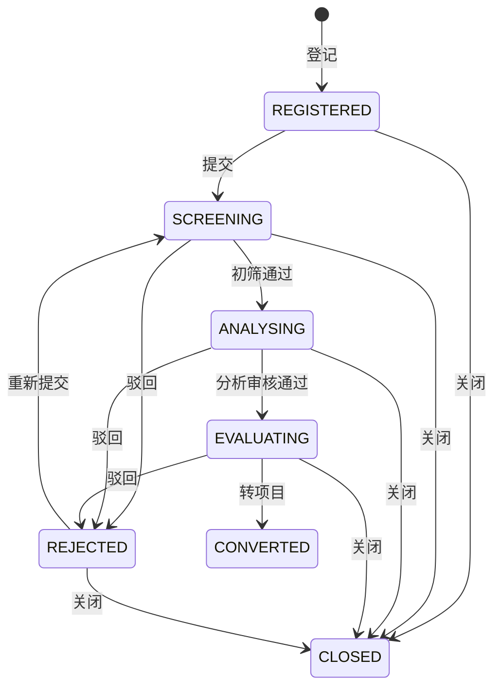
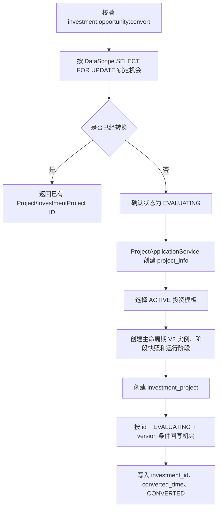

# 投资机会业务闭环实施报告

## 1. 实施结论

Sprint 2-2.3 已完成投资机会从登记、提交、初筛、分析、评估到转项目或关闭的业务闭环。状态变更统一封装在 `InvestmentOpportunity` 聚合，由 `InvestmentOpportunityApplicationService` 编排；Controller 不持有 Mapper/Repository，也不直接修改状态。

本次未修改投资业务表结构。新增 V2.4.1 Migration 仅初始化三个 RBAC 权限及超级管理员授权：

- `investment:opportunity:create`
- `investment:opportunity:review`
- `investment:opportunity:convert`

## 2. 状态机

### 2.1 聚合规则

- 新机会固定从 `REGISTERED` 开始，版本号为 `0`。
- `REGISTERED` 或 `REJECTED` 才能提交/重新提交到 `SCREENING`。
- 初筛审核通过后进入 `ANALYSING`，分析审核通过后进入 `EVALUATING`。
- `SCREENING`、`ANALYSING`、`EVALUATING` 可驳回到 `REJECTED`。
- 仅 `EVALUATING` 可以转项目。
- `CONVERTED` 和 `CLOSED` 为终态，禁止再次流转或关闭。
- 每次有效流转领域版本递增；数据库更新同时校验原状态与原版本。
- 驳回和关闭必须提供结论；重新提交会清除上一轮结论，避免旧结论被误认为当前审核意见。

## 3. 接口与调用链

| 方法 | 路径 | 权限 | 说明 |
| --- | --- | --- | --- |
| POST | `/investment/opportunities` | `investment:opportunity:create` | 登记机会 |
| GET | `/investment/opportunities/{id}` | `investment:view` | 查询机会详情 |
| PUT | `/investment/opportunities/{id}/submit` | `investment:opportunity:create` | 提交初筛 |
| PUT | `/investment/opportunities/{id}/review` | `investment:opportunity:review` | 审核通过或驳回 |
| PUT | `/investment/opportunities/{id}/resubmit` | `investment:opportunity:create` | 驳回后重新提交 |
| PUT | `/investment/opportunities/{id}/close` | `investment:opportunity:review` | 关闭机会 |
| POST | `/investment/opportunities/{id}/convert` | `investment:opportunity:convert` | 转换为项目和投资事项 |

所有写接口在 Controller 和 Application Service 两层声明 RBAC 权限。机会读取及加锁由 `InvestmentOpportunityScopedLoader` 建立统一 DataScope：

`@DataScope(orgField = "io.proposing_org_id", userField = "io.create_by")`

DataScope 上下文只包围机会查询 SQL，避免 `io` 表别名条件泄漏到 Project 或 InvestmentProject 的后续 Mapper；读取后继续通过 `ProjectAccessPolicy.requireOrgAccessible()` 做纵深校验。

## 4. 转项目事务设计

### 4.1 原子性

`convertOpportunity()` 使用 Spring REQUIRED 事务。Project、生命周期 V2、InvestmentProject 和机会回写均使用同一数据源、加入同一事务。任一步抛出异常时，整个事务回滚。

### 4.2 幂等与并发控制

1. 转换开始时使用 `SELECT ... FOR UPDATE` 锁定机会行。
2. 串行重复请求读取到 `CONVERTED` 后直接返回已有结果，不再创建数据。
3. 最终回写使用 `id + expected_status + expected_version + deleted` 条件，并原子执行 `version = version + 1`。
4. 若锁之外仍出现状态竞争，条件更新返回 `0`，Application Service 抛出业务异常，使已创建的项目、生命周期和投资事项一并回滚。
5. 项目编号、投资编号继续由数据库唯一约束提供最后一道幂等保护。

## 5. 代码变化

### 5.1 新增

- `InvestmentOpportunityController`
- `ReviewInvestmentOpportunityCommand`
- `ConvertInvestmentOpportunityCommand`
- `OpportunityConclusionCommand`
- `OpportunityConversionResult`
- `InvestmentOpportunityScopedLoader`
- `InvestmentOpportunityStateMachineTest`
- `V2.4.1__add_investment_opportunity_workflow_permissions.sql`

### 5.2 修改

- `InvestmentOpportunity`：增加状态行为、审核结论、转换时间和领域版本。
- `InvestmentOpportunityRepository`：增加加锁读取和乐观状态更新端口。
- `InvestmentOpportunityMapper`：增加受控加锁查询和条件更新 SQL。
- `InvestmentOpportunityRepositoryImpl`：完成状态、审核、转换结果和版本映射。
- `InvestmentOpportunityApplicationService`：完成审核、驳回、重新提交、关闭和转项目事务编排。
- `InvestmentPermissions`：增加机会专用权限。
- `SHA256SUMS`、`migration-inventory.yml`：登记 V2.4.1 资产及校验值。

## 6. 测试结果

| 测试项 | 结果 |
| --- | --- |
| Java 21 干净编译及测试编译 | 通过 |
| Investment 专项测试 | 29 个通过 |
| 状态机正常流转 | 通过 |
| 非法状态流转拒绝 | 通过 |
| 审核、驳回、重新提交 | 通过 |
| 重复转换幂等返回 | 通过 |
| 乐观状态冲突拒绝 | 通过 |
| 投资事项保存失败触发事务回滚 | 通过 |
| Controller 不依赖 Repository/Mapper | 通过 |
| RBAC 与 DataScope 契约 | 通过 |
| 后端全量回归 | 149 个通过，0 失败，0 错误，0 跳过 |
| 所有正式 Migration SHA-256 清单 | 全部匹配 |

上下文测试继续使用未加载业务 Schema 的 H2 数据库，因此启动字段检查会输出 `TABLE_NOT_FOUND` 告警；该告警不代表 MySQL 表结构错误。

## 7. V2.4.1 Migration 状态

- 文件：`database/migration/mysql/V2.4.1__add_investment_opportunity_workflow_permissions.sql`
- SHA-256：`eb73efbacbcced25c0494fbfed19f264cb10665e5dd6622cfe15cb57bdb8f2be`
- 变更范围：仅 `sys_permission`、`sys_menu`、`sys_role_permission`、`sys_role_menu` 初始化数据。
- 脚本设计为幂等写入，不修改任何投资业务表。
- 当前状态：`CANONICAL_PENDING_VALIDATION / NOT_EXECUTED`。
- 当前机器没有可用 Docker 命令，因此本 Sprint 未执行真实 MySQL/Flyway 验收，未修改任何受管环境。

## 8. 剩余风险

1. V2.4.1 必须在真实 MySQL8 验收环境执行 `migrate` 后再执行 `validate`，并回填 Flyway checksum 与执行记录。
2. 当前 `screening_conclusion` 只保存最新结论；完整的多轮审核历史仍需后续审核记录表或统一审批流承载，不能依靠该字段完成审计追溯。
3. 转项目依赖 ACTIVE 的投资项目生命周期模板；缺少模板时会整体失败并回滚，这是预期的安全失败策略。
4. 当前事务原子性成立的前提是 Project、Lifecycle V2 和 Investment 使用同一数据库事务管理器；未来拆库后必须改用事务消息/Saga，不能继续假设本地事务。
5. Controller 已保持薄适配，但请求级 Bean Validation 和独立 DTO/VO 还可在接口契约冻结 Sprint 中进一步加强。
6. 尚未发布机会列表、编辑基础信息和审核历史查询能力；这些不属于本次状态闭环范围。
