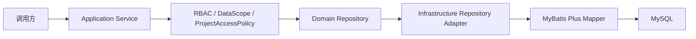

# Investment 持久化基础实现报告

## 1. 实施范围与结论

Sprint 2-2.2 已完成 `InvestmentProject`（投资事项）与 `InvestmentOpportunity`（投资机会）的第一批持久化能力。实现遵循领域仓储接口、基础设施适配器和 MyBatis Plus Mapper 分层，未开发完整投资流程，未新增 Controller，也未修改数据库结构或已验证的 V2.4.0 Migration。

V2.4.0 Migration 文件 SHA-256 复核值为：

`6a498a2065a4139a9423d0d23bb616fe66a7c91860ff6cd4c2642d629ec3ae49`

### 1.1 新增代码

| 分层 | 文件/类型 | 职责 |
| --- | --- | --- |
| Application | `CreateInvestmentProjectCommand` | 投资事项创建命令 |
| Application | `CreateInvestmentOpportunityCommand` | 投资机会创建命令 |
| Application | `InvestmentProjectApplicationService` | 投资事项创建、单项查询、权限及事务边界 |
| Application | `InvestmentOpportunityApplicationService` | 投资机会创建、单项查询、权限、数据范围及事务边界 |
| Domain | `InvestmentIdentityGenerator` | 隔离领域主键生成方式 |
| Infrastructure | `InvestmentProjectEntity` | `investment_project` 完整字段映射 |
| Infrastructure | `InvestmentOpportunityEntity` | `investment_opportunity` 完整字段映射 |
| Infrastructure | `InvestmentProjectMapper` | 投资事项数据库访问及最小权限投影查询 |
| Infrastructure | `InvestmentOpportunityMapper` | 投资机会数据库访问及带项目关联的受控查询 |
| Infrastructure | `InvestmentOpportunityRow` | 投资机会与转换项目 ID 的查询投影 |
| Infrastructure | `InvestmentProjectRepositoryImpl` | 投资事项 Repository Adapter |
| Infrastructure | `InvestmentOpportunityRepositoryImpl` | 投资机会 Repository Adapter |
| Infrastructure | `MybatisInvestmentIdentityGenerator` | MyBatis Plus 雪花 ID 适配器 |
| Test | `InvestmentPersistenceEntityMappingTest` | 表名、字段、逻辑删除、乐观锁映射测试 |
| Test | `InvestmentRepositoryAdapterTest` | Repository Adapter 映射及异常测试 |
| Test | `InvestmentApplicationServiceTest` | 创建、查询和业务约束测试 |
| Test | `InvestmentPersistenceSecurityContractTest` | RBAC、DataScope、ProjectAccessPolicy 契约测试 |
| Test | `InvestmentTransactionContractTest` | 事务声明和持久化失败回滚测试 |

### 1.2 调整代码

- `InvestmentProject`：补充 `investmentMethod` 领域字段和枚举；新建记录禁止使用 `LEGACY_UNKNOWN`。
- `InvestmentProjectRepository`：增加仅查询关联 `projectId` 的最小数据接口，避免权限判断前读取完整投资信息。
- `EnterprisePlatformApplication`：将 Investment 基础设施 Mapper 包加入统一扫描。
- Investment 原有上下文测试、领域模型测试：同步验证持久化 Bean 和新增领域约束。

### 1.3 Entity 基础规范

两个 Entity 均继承 `BaseIdEntity`：

- 主键：`id`，MyBatis Plus ASSIGN_ID。
- 审计字段：`create_by`、`create_time`、`update_by`、`update_time`、`remark`。
- 逻辑删除：`deleted` 与 `delete_token`。
- 乐观锁：`version`。
- 业务字段严格依据 V2.4.0 表结构映射，未改变数据库定义。

## 2. 调用链

### 2.1 投资事项

- 创建：`investment:create` → 校验关联项目访问权及项目类型 → 校验业务编号 → 创建领域对象 → Repository Adapter → Mapper 插入。
- 查询：`investment:view` → 先读取最小 `projectId` 投影 → `ProjectAccessPolicy.requireAccessible()` → 读取完整投资事项 → 补充项目责任组织和负责人投影。
- `investment_project` 本身没有组织字段，因此组织隔离以关联的 `project_info` 为权威来源，禁止在完成项目访问校验前返回投资事实数据。

### 2.2 投资机会

- 创建：`investment:create` → 校验提出组织可访问 → 校验业务编号 → 当前用户作为提出人 → Repository Adapter → Mapper 插入。
- 查询：`investment:view` + `@DataScope(orgField = "io.proposing_org_id", userField = "io.create_by")` → 自定义关联查询 → 显式组织范围复核 → 已转项目时追加 `ProjectAccessPolicy` 校验。
- 自定义 SQL 固定使用 `io` 别名，使统一数据权限条件只约束投资机会主表，避免错误注入到二次 Mapper 查询。

## 3. 权限与事务实现

- RBAC：创建使用 `investment:create`，查询使用 `investment:view`，由 Spring Security `@PreAuthorize` 后端强制执行。
- DataScope：投资机会查询接入统一 `@DataScope`；支持现有 `ALL / ORG / ORG_AND_CHILDREN / SELF / CUSTOM` 框架。
- 项目访问：投资事项以及已转换机会均复用 `ProjectAccessPolicy`，未建立平行权限模型。
- 事务：创建方法使用 REQUIRED 读写事务；查询方法使用 REQUIRED 只读事务。
- 异常安全：Repository 保存失败向上抛出并触发回滚；唯一索引冲突转换为统一业务异常。
- 分层约束：Domain 包未引入 Spring、MyBatis 或 Entity 依赖。

## 4. 测试结果

| 验证项 | 结果 |
| --- | --- |
| Java 21 / Maven 编译 | 通过 |
| Entity 字段及 MyBatis Plus 注解映射 | 通过 |
| Repository Adapter 映射、关联校验、重复键处理 | 通过 |
| Application Service 创建与查询 | 通过 |
| RBAC 权限注解契约 | 通过 |
| DataScope 与项目访问策略契约 | 通过 |
| 事务只读/读写声明 | 通过 |
| 持久化异常真实触发 Spring 事务回滚 | 通过 |
| 后端全量测试 | 141 个通过，0 失败，0 错误，0 跳过 |
| Migration 内容完整性 | SHA-256 与 V2.4.0 验证基线一致 |

上下文测试使用未创建业务表的 H2 环境，因此启动期字段映射检查会输出 `TABLE_NOT_FOUND` 告警；这是测试环境缺少 Schema 的已知现象，不影响测试通过，也不代表 MySQL Migration 发生变化。

## 5. 剩余风险与后续边界

1. 本批次没有 Controller/API，持久化能力暂由 Application Service 暴露；REST 接口应在后续 Sprint 单独设计并接入 DTO/VO。
2. 本批次 Repository 测试以单元测试为主，未重复执行真实 MySQL8 集成验收；建议下一批在已迁移的 MySQL8 容器中补充插入、查询、逻辑删除和乐观锁并发测试。
3. `investment_project` 历史结构允许 `project_id` 为空；新 Application Service 已强制非空，但存量数据仍需按数据来源治理规则确认，禁止自动推断。
4. 投资事项的责任组织取自 `project_info.department_id`，负责人取自 `project_info.leader_id`。负责人究竟采用系统用户 ID 还是员工 ID，需在后续身份主数据治理中冻结语义。
5. 投资机会本批只开放创建与单项查询；更新、删除、转项目、审批、可研、尽调和决策流程均未实现。
6. `@DataScope` 中的表别名与 Mapper SQL 存在契约关系。后续修改 SQL 时必须同步安全契约测试，否则可能造成数据范围条件失效。
7. 存量 `LEGACY` / `LEGACY_UNKNOWN` 数据应先经过确认流程再开放广泛查询；当前新建流程已禁止写入未知来源状态。

## 6. 本 Sprint 边界确认

- 未修改历史 SQL。
- 未修改 V2.4.0 Migration。
- 未执行生产 Migration。
- 未实现投资完整流程。
- 未绕过现有 RBAC、DataScope 或 ProjectAccessPolicy。
