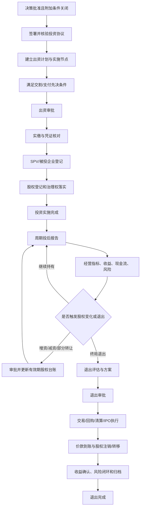
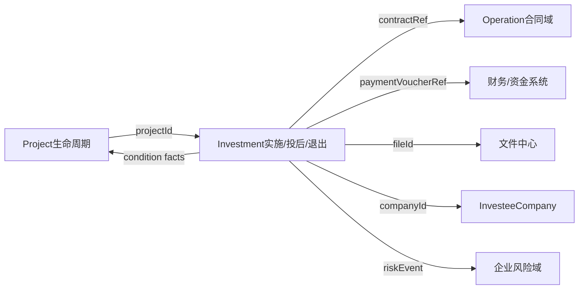

# 投资实施与投后管理领域设计

> 版本：V1.0
> 对应阶段：Sprint 2-1.5
> 文档性质：领域设计，不修改业务代码、不新增或执行数据库Migration
> 设计基线：投资项目、机会、论证与决策设计，`07_investment.sql`，生命周期V2

## 1. 目标与边界

本设计覆盖投资决策批准后的实施、投后管理、收益评价、股权变化和退出全过程：

```text
决策批准且条件关闭
  → 协议签署与生效
  → 出资计划
  → 出资审批与实缴
  → SPV/被投企业设立或变更
  → 股权登记与实施节点完成
  → 周期性投后监测
  → 收益、分红、现金流和回报评价
  → 风险处置与股权变化
  → 退出触发、方案、审批、执行和收益确认
```

### 1.1 聚合边界

| 能力 | 权威聚合 | 不承担的职责 |
|---|---|---|
| 投资实施 | `InvestmentImplementation` | 不维护合同正文，不替代Project任务 |
| 被投企业 | `InvesteeCompany` | 不嵌入InvestmentProject |
| 股权台账 | `EquityHoldingLedger` | 不由Project摘要直接修改 |
| 投后报告 | `PostInvestmentReport` | 不替代指标、收益和风险明细 |
| 经营指标 | `MonitorIndicatorSet` | 不复制企业财务总账 |
| 投资收益 | `InvestmentIncomeLedger` | 不计入项目经营收入台账 |
| 投资现金流 | `InvestmentCashFlowLedger` | 不替代银行或财务凭证 |
| 投资风险 | `InvestmentRiskRegister` | 不替代企业级风险库 |
| 投资退出 | `InvestmentExitCase` | 不直接执行外部产权交易或资金清算 |

`InvestmentProject` 只保存状态和必要摘要，不加载无界的支付、指标、收益、风险、股权和退出集合。

### 1.2 核心原则

1. 决策通过不等于允许立即支付；协议生效、先决条件和支付审批必须分别校验。
2. 出资计划、实缴记录、银行回单和财务凭证相互引用但职责独立。
3. 合同由Operation合同域维护，Investment只保存受信合同引用及用途。
4. SPV和被投企业由 `InvesteeCompany` 独立管理，股权采用有效期台账，不覆盖历史比例。
5. 收益与现金流分开：估值增值不是现金收入，分红宣告也不等于现金到账。
6. 投后汇总必须有数据截止时间和来源版本，禁止覆盖已确认周期报告。
7. 部分退出是投后阶段中的股权事件；只有终局退出才推进生命周期到EXIT并最终关闭投资项目。
8. 所有金额、比例、日期、审批和权属变化均可追溯，并执行职责分离和敏感数据保护。

## 2. 总体业务流程



### 2.1 跨域协作



跨域使用ID、受信端口和领域事件协作，不跨聚合直接更新对方数据。

## 3. 投资实施模型

### 3.1 投资实施聚合

```text
InvestmentImplementation
├─ implementationId
├─ investmentId / projectId
├─ decisionId / frozenSchemeVersionId
├─ implementationType
├─ agreementRefs[]
├─ contributionPlans[]
├─ paidInContributions[]
├─ milestones[]
├─ investeeCompanyId
├─ equityRegistrationRef
├─ conditionsPrecedent[]
├─ status
└─ completionConclusion
```

聚合只维护实施一致性和状态。合同正文、审批流、财务凭证、企业主数据及股权明细由独立聚合维护。

### 3.2 出资计划 `CapitalContributionPlan`

| 属性 | 说明 |
|---|---|
| `planId` | 出资计划ID |
| `investmentId` | 投资事项ID |
| `schemeVersionId` | 冻结方案版本ID |
| `installmentNo` | 出资期次，业务唯一 |
| `contributionType` | CASH/ASSET/EQUITY/TECHNOLOGY/DATA_ASSET/MIXED |
| `plannedAmount` | 计划金额 |
| `currencyCode` | 币种 |
| `plannedDate` | 计划出资日期 |
| `receiver` | 收款/受让主体引用及名称快照 |
| `fundingSourceRef` | 方案资金来源引用 |
| `prerequisites` | 本期支付先决条件集合 |
| `approvalInstanceRef` | 出资计划审批引用 |
| `status` | DRAFT/APPROVING/APPROVED/DUE/PARTIALLY_PAID/PAID/OVERDUE/CANCELLED |

规则：

- 所有有效期次计划金额合计不得超过冻结方案批准额度；
- 方案金额变化后必须先通过实质变更和重新决策判断，再修改未来期次；
- 已发生实缴的期次不能删除，只能通过冲正或调整计划处理；
- 到期未足额实缴自动标记OVERDUE并生成预警；
- 非现金出资必须具备评估、权属转移和验收依据，不能伪装为支付记录。

### 3.3 实缴记录 `PaidInContribution`

现有 `investment_payment` 可作为现金实缴基础，但领域上需表达：

```text
PaidInContribution
  paymentId
  contributionPlanId
  investmentId
  paymentRequestNo
  approvalInstanceRef
  contributionType
  paidAmount
  currencyCode
  paidDate
  payerAccountMasked / receiverAccountMasked
  bankTransactionRef
  financeVoucherRef
  valuationReportRef
  ownershipTransferRef
  status
```

状态：

```text
DRAFT → APPROVING → APPROVED → EXECUTING → PAID → VERIFIED
             └→ REJECTED          └→ FAILED
VERIFIED → REVERSED（有冲正依据）
```

安全与一致性规则：

1. 账户数据加密存储、脱敏展示，禁止进入普通操作日志。
2. 支付审批、银行流水和财务凭证至少完成规则要求的交叉核验后才可VERIFIED。
3. 累计已验证实缴不得超过计划和决策批准额度。
4. 重复银行流水号、审批号或幂等键不能重复入账。
5. 冲正记录必须反向关联原记录，不允许直接删除已验证实缴。

### 3.4 SPV与被投企业管理

SPV不是实施聚合内部大对象，而是独立 `InvesteeCompany`：

```text
InvesteeCompany
  companyId
  companyName / creditCode
  companyType = SPV / CONTROLLED / PARTICIPATED / FUND / OTHER
  establishmentStatus
  registrationFacts
  governanceStructure
  status
```

SPV设立流程包括名称核准、章程签署、工商登记、账户开立、出资、印章财务控制和治理席位落实。每项作为实施节点或外部引用，不在公司主表中堆积流程字段。

创建临时筹备主体时不得伪造统一社会信用代码；正式登记后通过受控命令补录并执行唯一性校验。

### 3.5 合同关联

投资协议、股东协议、增资协议、基金协议、回购协议等由Operation合同域权威管理。Investment保存 `InvestmentContractReference`：

| 属性 | 说明 |
|---|---|
| `investmentId` | 投资事项ID |
| `contractId` | `operation_contract.id` |
| `contractRole` | INVESTMENT_AGREEMENT/SHAREHOLDER_AGREEMENT/CAPITAL_INCREASE/TRANSFER/REPURCHASE/OTHER |
| `requiredFlag` | 是否实施门禁必需合同 |
| `effectiveStatusSnapshot` | 合同生效状态快照 |
| `effectiveDateSnapshot` | 生效日期快照 |
| `verifiedTime` | Investment核验时间 |

禁止复制合同金额、正文和审批全过程作为第二权威数据。合同变更事件触发Investment重新评估实施计划、决策条件和是否重新决策。

### 3.6 实施节点 `ImplementationMilestone`

标准节点：

| 编码 | 名称 | 完成事实 |
|---|---|---|
| `AGREEMENT_EFFECTIVE` | 投资协议生效 | 必需合同有效且先决条款满足 |
| `CONTRIBUTION_PLAN_APPROVED` | 出资计划批准 | 有效计划及审批引用 |
| `FIRST_CONTRIBUTION_VERIFIED` | 首期出资核验 | 首期实缴VERIFIED |
| `SPV_REGISTERED` | SPV/被投企业登记 | 主体登记事实有效 |
| `EQUITY_REGISTERED` | 股权登记 | 股权权属和持股台账一致 |
| `GOVERNANCE_RIGHTS_IMPLEMENTED` | 治理权落实 | 董监高席位及重大事项安排落实 |
| `IMPLEMENTATION_ACCEPTED` | 实施验收 | 实施验收结论通过 |

Project任务用于“谁在何时完成工作”，ImplementationMilestone用于“投资事实是否成立”。两者可引用，不得互相替代或双向无审计覆盖。

### 3.7 实施状态机

```text
NOT_STARTED
  → AGREEMENT_PENDING
  → PLANNING
  → CONTRIBUTING
  → REGISTRATION
  → ACCEPTANCE
  → COMPLETED

分支：ON_HOLD / FAILED / CANCELLED
```

- 进入CONTRIBUTING前：决策批准、阻断条件关闭、协议生效、出资计划批准。
- 进入REGISTRATION前：规则要求的实缴已核验。
- 进入COMPLETED前：所有必需实施节点完成，金额、股权和治理权核对一致。

## 4. 投后管理模型

### 4.1 投后管理组合

投后管理不是单一巨型聚合，而是由周期报告组织多个权威事实：

```text
PostInvestmentReport
├─ reportPeriod / dataCutoffTime
├─ operationSummary
├─ indicatorSnapshotRefs[]
├─ incomeSummary
├─ cashFlowSummary
├─ riskSummary
├─ equitySummary
├─ governanceSummary
├─ evaluation
├─ exceptionAndActions[]
└─ status / confirmedBy / confirmedTime
```

报告只保存周期快照和引用。指标值、收益流水、现金流、风险与股权变化分别由权威台账维护。

### 4.2 周期报告 `PostInvestmentReport`

周期类型：MONTH/QUARTER/HALF_YEAR/YEAR/SPECIAL。状态：

```text
DRAFT → DATA_COLLECTING → UNDER_REVIEW → CONFIRMED → CLOSED
                └→ RETURNED
```

规则：

- 同一投资事项、报告类型和期间只能有一个有效确认版本；
- 必须保存数据截止时间、来源版本和编制人；
- CONFIRMED后不可覆盖，更正创建新报告版本并引用原报告；
- 逾期未报、数据缺失或指标异常形成预警和责任任务；
- 存在未说明重大异常时不能确认报告。

上一阶段设计的 `investment_post_monitor` 可承载确认后的综合快照，不替代周期报告正文和明细事实。

### 4.3 经营指标

现有 `investment_monitor_indicator` 与 `investment_monitor_data` 分别作为指标定义和期间值基础。

指标分类建议：

- 经营：营业收入、订单、产能、客户数；
- 财务：利润、经营现金流、资产负债率、毛利率；
- 投资：实缴进度、分红、ROI、IRR、估值变化；
- 治理：董事会召开、委派人员履职、重大事项执行；
- 风险合规：重大风险数、诉讼、处罚、安全和数据合规事件；
- 战略协同：产业带动、就业、国资保值增值和公共目标。

`MonitorIndicator` 包含指标编码、名称、口径、单位、频率、目标值、预警规则、数据来源、责任人和有效期。指标定义变更必须版本化，历史期间值继续引用原版本。

`MonitorValue` 必须保存期间、实际值、数据来源、采集时间、审核状态和凭证引用。人工录入值与系统同步值应区分来源并审计。

### 4.4 风险监控

`InvestmentRiskRegister` 映射现有 `investment_risk`，风险类型包括：

```text
POLICY / MARKET / LEGAL / FINANCIAL / OPERATION
PARTNER / GOVERNANCE / COMPLIANCE / EXIT / OTHER
```

风险状态：

```text
OPEN → ASSESSING → MITIGATING → MONITORING → CLOSED
                      └→ ESCALATED
```

规则：

- HIGH/CRITICAL风险必须有责任人、措施、期限和升级路径；
- CRITICAL风险发布事件到企业风险域，但Investment保留业务处置权威记录；
- 风险关闭需要证据和独立复核；
- 风险接受保存授权依据和有效期限，过期自动重开；
- 投后报告展示风险快照，不能通过修改报告摘要关闭风险。

### 4.5 被投企业治理

利用 `investment_director` 和 `investment_meeting` 管理委派董事、监事、高管及股东会/董事会/监事会记录。治理权是否落实由：

- 应委派席位与实际有效席位；
- 任期到期和空缺情况；
- 重大事项会议及决议执行；
- 章程和股东协议约定；
- 印章、财务和信息报送权限

综合判定。会议附件迁入文件中心，不继续使用路径字段作为正式引用。

## 5. 投资收益与现金流模型

### 5.1 收益台账 `InvestmentIncomeLedger`

现有 `investment_income` 是收益权威流水基础。收益类型建议：

| 类型 | 是否现金收益 | 说明 |
|---|:---:|---|
| `DIVIDEND` | 是，以到账为准 | 股息、分红 |
| `INTEREST` | 是 | 债权或资金占用收益 |
| `FUND_DISTRIBUTION` | 是 | 基金分配 |
| `TRANSFER_GAIN` | 是 | 股权/资产转让已实现收益 |
| `ASSET_INCOME` | 是 | 资产运营收益 |
| `VALUATION_CHANGE` | 否 | 未实现估值变化，不能计作现金流入 |
| `OTHER` | 按规则 | 必须说明口径 |

`IncomeRecord` 至少包含收益类型、应收日期、确认日期、到账日期、税前金额、税费、净额、币种、来源主体、合同/决议/财务凭证引用和状态。

状态：`EXPECTED → DECLARED/RECOGNIZED → RECEIVABLE → RECEIVED → VERIFIED`，可分支 `CANCELLED/REVERSED`。

### 5.2 分红

分红是收益台账的专门业务对象：

```text
DividendRecord
  investeeCompanyId
  equitySnapshotDate
  shareholderResolutionRef
  recordDate / declarationDate / payableDate
  holdingRatioSnapshot
  grossDividend
  taxAmount
  netDividend
  receivedAmount
  financeVoucherRef
  status
```

分红金额必须与股东会决议、权益登记日持股比例和到账流水核对。宣告分红不等于现金到账；只有RECEIVED/VERIFIED进入现金流实收。

### 5.3 投资现金流 `InvestmentCashFlowLedger`

现金流是评价ROI、IRR和回收期的统一事实来源：

```text
InvestmentCashFlow
  investmentId
  flowDate
  direction = INFLOW / OUTFLOW
  flowType = CONTRIBUTION / FEE / TAX / DIVIDEND / INTEREST /
             FUND_DISTRIBUTION / TRANSFER / REPURCHASE / LIQUIDATION / OTHER
  amount
  currencyCode
  baseCurrencyAmount
  exchangeRate / rateDate / rateSource
  sourceBusinessType / sourceBusinessId
  financeVoucherRef
  status = PENDING / VERIFIED / REVERSED
```

金额始终为正，方向单独表达，避免正负号口径混乱。每条已验证实缴、到账收益和退出价款产生一条幂等现金流事实；未实现估值变化不得进入现金流。

### 5.4 投资回报评价

`InvestmentReturnEvaluation` 按评价基准日和计算规则版本生成：

- 累计实缴、累计现金流入和净现金流；
- 已实现收益、未实现估值变化；
- ROI、IRR、MOIC、DPI；
- 实际回收期和剩余投资账面价值；
- 与可研/方案目标的偏差；
- 计算基准日、币种、汇率和规则版本。

评价值由已验证现金流和估值事实计算，禁止由前端直接提交最终值。现有 `investment_evaluation` 可保存综合评分与总结，财务回报指标应引用计算结果版本。

### 5.5 收益与Project/Operation边界

- 投资分红和退出收益属于Investment，不直接写入Project经营收入。
- 项目经营合同收入属于Operation，不重复写成投资收益。
- 财务系统是会计凭证权威来源；Investment保存业务事实和凭证引用。
- 驾驶舱可以汇总展示，但必须保留指标来源和截止时间。

## 6. 股权变化模型

### 6.1 聚合关系

```text
InvesteeCompany
  └─ EquityHoldingLedger
       ├─ effective-dated EquityHolding records
       └─ EquityChange events
```

目标表名沿用已设计的 `investee_company` 和 `equity_holding`。现有 `investment_company`、`investment_equity` 后续通过受控迁移治理，不能形成两套台账。

### 6.2 股权变化 `EquityChange`

| 属性 | 说明 |
|---|---|
| `changeId/changeNo` | 变化标识 |
| `investeeCompanyId` | 被投企业ID |
| `sourceInvestmentId` | 来源投资事项，可空 |
| `changeType` | CAPITAL_INCREASE/CAPITAL_REDUCTION/TRANSFER_IN/TRANSFER_OUT/REPURCHASE/CONVERSION/DILUTION/OTHER |
| `beforeSnapshotId` | 变更前股权快照 |
| `proposedEffectiveDate` | 拟生效日 |
| `amount` | 交易或出资金额 |
| `ratioChange` | 比例变化 |
| `counterparty` | 交易对方引用和名称快照 |
| `schemeRef/contractRef` | 方案与合同引用 |
| `approvalInstanceRef` | 审批引用 |
| `registrationRef` | 工商/登记引用 |
| `status` | 状态 |

### 6.3 股权变化流程

```text
DRAFT → EVALUATING → APPROVING → APPROVED → EXECUTING
  → REGISTERED → LEDGER_UPDATED → COMPLETED

分支：RETURNED / REJECTED / CANCELLED / FAILED
```

1. 创建变化方案并校验是否构成投资方案实质变更或退出；
2. 取得适用审批、三重一大和法定决策；
3. 签署合同并完成资金/资产交割；
4. 完成工商或产权登记；
5. 关闭旧 `equity_holding.effective_to`；
6. 新增变更后有效期持股记录；
7. 校验同一时点持股比例合计不超过100%；
8. 生成台账快照、现金流及审计事件。

禁止直接UPDATE历史 `holding_ratio`。增资、减资和转让都必须通过股权变化命令产生新有效期记录。

### 6.4 三类变化规则

#### 增资

- 明确原股东是否同比例增资、是否引入新股东及稀释结果；
- 核对估值、认缴与实缴、资本公积和控制权变化；
- 本企业新增出资必须进入出资计划、实缴和现金流台账；
- 控制权或金额跨阈值时重新决策。

#### 减资

- 核对债权人保护、法定公告、税务和工商程序；
- 区分同比减资、不同比减资及是否形成资金回流；
- 资金回流计入现金流，收益部分按财务口径确认；
- 减资后不得产生负持股或注册资本异常。

#### 转让

- 区分转入、部分转出和全部转出；
- 核对评估、挂牌/协议转让程序、受让方资格和价款到账；
- 部分转出在POST阶段处理；全部转出通常触发终局退出；
- 转让收益以已实现价款和投资成本核对后确认。

## 7. 投资退出模型

### 7.1 退出事项聚合

```text
InvestmentExitCase
├─ exitId / exitNo
├─ investmentId / investeeCompanyId
├─ exitScope = PARTIAL / FULL
├─ trigger / eligibilityAssessment
├─ planVersions[]
├─ approvalRoute / decisionRefs[]
├─ contractRefs[]
├─ executionSteps[]
├─ settlement
├─ equityChangeId
├─ incomeRecognition
├─ riskClosure
└─ status
```

现有 `investment_exit` 只能保存基础退出金额和状态。退出条件、方案版本、执行节点、清算与收益核对属于后续结构缺口，本Sprint只设计领域模型。

### 7.2 退出触发条件

标准触发：

- 达到方案约定持有期或退出窗口；
- 实现目标收益或估值；
- 业绩承诺未达标、回购条款触发；
- 战略调整、主责主业变化；
- 重大风险、持续亏损或治理失效；
- 监管、政策或合规要求；
- 合作方违约；
- IPO、并购、产权转让等市场机会；
- 清算、破产或主体终止。

触发只表示进入退出评估，不自动批准退出。

### 7.3 退出方案 `ExitPlanVersion`

| 分类 | 内容 |
|---|---|
| 范围 | PARTIAL/FULL，拟退出比例和剩余持股 |
| 方式 | TRANSFER/REPURCHASE/LIQUIDATION/IPO/REDUCTION/OTHER |
| 估值 | 评估基准日、估值方法、底价和价格调整 |
| 对手方 | 受让方/回购方资格和关联关系 |
| 程序 | 评估、审计、挂牌、优先购买权、监管审批 |
| 合同 | 转让、回购、清算等协议引用 |
| 时间 | 计划、关键节点、最晚完成日 |
| 收益 | 预计价款、税费、成本、预计退出收益和IRR |
| 风险 | 价款、交割、诉讼、税务、剩余责任和声誉风险 |
| 后续 | 剩余股权治理、人员和担保责任处置 |

退出方案采用 `DRAFT → REVIEWING → APPROVED → FROZEN → SUPERSEDED` 版本状态。只有FROZEN版本能提交退出决策和执行。

### 7.4 退出审批

退出审批根据范围、金额、控制权变化、交易方式、关联交易和国资监管要求计算路线，可能包含：

- 投资、财务、法务合规专业审核；
- 三重一大识别和党委前置研究；
- 经理层、董事会、股东会/出资人决定；
- 国资监管审批或备案；
- 评估备案、产权市场挂牌等外部程序。

沿用投资决策领域的路线快照、节点记录和附条件任务，不为退出复制一套审批引擎。

### 7.5 退出执行

标准执行节点：

```text
VALUATION_COMPLETED
EXTERNAL_APPROVAL_COMPLETED
TRANSFER_OR_EXIT_AGREEMENT_EFFECTIVE
LISTING_OR_NOTICE_COMPLETED
CONSIDERATION_RECEIVED
EQUITY_TRANSFER_REGISTERED
TAX_AND_FEE_SETTLED
RESIDUAL_OBLIGATIONS_CONFIRMED
INCOME_RECOGNIZED
ARCHIVES_COMPLETED
```

每个节点保存外部引用、事实日期、责任人、证据和核验状态。付款或价款到账以财务/银行受信事实为准。

### 7.6 收益确认与清算

`ExitSettlement` 至少计算：

- 退出总价款及已到账金额；
- 应收未收金额；
- 对应投资成本、累计减值和账面价值；
- 税费、交易费用和其他扣减；
- 已实现退出收益；
- 全生命周期净现金流、ROI、IRR和MOIC；
- 剩余持股价值（部分退出）；
- 未结责任、担保、诉讼和条件。

退出收益只有在满足财务确认规则后写入收益台账；价款到账写入现金流台账。两者不能用同一个状态替代。

### 7.7 退出状态机

```text
DRAFT
  → EVALUATING
  → PLAN_REVIEWING
  → APPROVING
  → APPROVED
  → EXECUTING
  → SETTLING
  → COMPLETED

分支：RETURNED / REJECTED / SUSPENDED / CANCELLED / FAILED
```

COMPLETED要求：适用审批完成、合同和外部程序有效、退出价款按规则结清、股权台账更新、收益核对、重大风险闭环及必需档案归档。

部分退出完成后投资事项通常返回POST_INVESTMENT继续监控；终局退出完成后才能完成生命周期EXIT阶段。

## 8. 领域状态关系

### 8.1 投资事项总状态

```text
APPROVED
  → IMPLEMENTING
  → POST_INVESTMENT
  → EXITING
  → CLOSED

异常分支：SUSPENDED / REJECTED / CANCELLED
```

总状态是各专业聚合事实的投影，不允许直接通过通用接口修改。

### 8.2 状态同步规则

- Implementation COMPLETED后，InvestmentProject才能进入POST_INVESTMENT。
- 周期报告、收益或风险状态变化不会直接回退Project阶段，但可能产生预警、暂停或治理任务。
- 部分退出不把InvestmentProject置为EXITING；终局退出方案批准后才进入EXITING。
- ExitCase COMPLETED且范围FULL后，InvestmentProject才能CLOSED。
- 所有跨聚合状态变化通过Outbox事件传播，并以业务ID和幂等键去重。

## 9. 生命周期V2关联

### 9.1 实施阶段 IMPLEMENTATION

进入条件：

| 条件编码 | 判定 |
|---|---|
| `INVESTMENT_DECISION_APPROVED` | 所有必需依法决策节点批准 |
| `DECISION_CONDITIONS_CLOSED` | 阻断性决策条件全部关闭或有效豁免 |
| `INVESTMENT_SCHEME_FROZEN` | 执行引用的方案版本和哈希有效 |

完成条件：

| 条件编码 | 判定 |
|---|---|
| `INVESTMENT_AGREEMENT_EFFECTIVE` | 所有必需投资合同生效 |
| `CONTRIBUTION_PLAN_APPROVED` | 适用出资计划已批准 |
| `REQUIRED_CONTRIBUTION_VERIFIED` | 当前实施所需实缴全部核验，不等于必须支付全生命周期所有期次 |
| `SPV_REGISTRATION_CONFIRMED` | 适用时SPV/被投企业登记完成 |
| `EQUITY_REGISTRATION_CONFIRMED` | 股权类投资权属登记与台账一致 |
| `GOVERNANCE_RIGHTS_IMPLEMENTED` | 适用治理席位和权利落实 |
| `IMPLEMENTATION_ACCEPTED` | 必需实施节点全部完成并验收 |

现有通用条件 `INVESTMENT_PAYMENT_COMPLETED` 建议细化为“本阶段所需出资已核验”，避免长期分期出资项目永远不能进入投后阶段。历史模板快照不修改，新语义通过新模板版本发布。

### 9.2 投后阶段 POST_INVESTMENT

进入条件：

| 条件编码 | 判定 |
|---|---|
| `IMPLEMENTATION_ACCEPTED` | 实施验收完成 |
| `POST_MONITORING_OBJECT_READY` | 被投企业/监测对象和责任人存在 |
| `POST_MONITORING_INDICATORS_ACTIVE` | 必需指标及频率已启用 |

持续合规条件：

| 条件编码 | 判定 |
|---|---|
| `POST_REPORTS_CURRENT` | 所有到期周期报告已确认 |
| `POST_MONITORING_DATA_COMPLETE` | 必需指标数据无逾期缺失 |
| `NO_UNHANDLED_CRITICAL_RISK` | 无未升级或未处置CRITICAL风险 |
| `EQUITY_LEDGER_CONSISTENT` | 股权台账与登记事实一致 |

进入终局退出条件：

| 条件编码 | 判定 |
|---|---|
| `TERMINAL_EXIT_TRIGGER_CONFIRMED` | 终局退出触发经评估确认 |
| `INVESTMENT_EXIT_PLAN_FROZEN` | 终局退出方案冻结 |
| `INVESTMENT_EXIT_APPROVED` | 退出决策和外部前置程序批准 |

投后阶段是长期阶段，不能仅因“本期报告完成”自动结束。只有终局退出被批准，或投资事项经正式终止程序关闭时才离开。

### 9.3 退出阶段 EXIT

进入条件即上述终局退出三项事实。完成条件：

| 条件编码 | 判定 |
|---|---|
| `EXIT_AGREEMENT_EFFECTIVE` | 退出合同或法定清算文件有效 |
| `EXIT_CONSIDERATION_SETTLED` | 价款按规则结清或剩余应收获正式授权 |
| `EXIT_EQUITY_UPDATE_CONFIRMED` | 股权转移、注销或清算登记完成 |
| `EXIT_INCOME_CONFIRMED` | 成本、税费、收益和现金流核对完成 |
| `EXIT_RESIDUAL_OBLIGATIONS_CLOSED` | 担保、诉讼、人员和剩余义务处理完成 |
| `NO_OPEN_CRITICAL_EXIT_RISK` | 无未处置CRITICAL退出风险 |
| `INVESTMENT_EXIT_COMPLETED` | 退出事项范围FULL且状态COMPLETED |
| `REQUIRED_ARCHIVES_PRESENT` | 必需合同、决议、凭证、登记和评价材料归档 |

### 9.4 事实端口

```text
InvestmentImplementationFactPort
  agreementsEffective(projectId)
  contributionPlanApproved(projectId)
  requiredContributionVerified(projectId)
  implementationAccepted(projectId)

PostInvestmentFactPort
  monitoringObjectReady(projectId)
  reportsCurrent(projectId, cutoffDate)
  noUnhandledCriticalRisk(projectId)
  equityLedgerConsistent(projectId)

InvestmentExitFactPort
  terminalExitApproved(projectId)
  exitConsiderationSettled(projectId)
  exitIncomeConfirmed(projectId)
  terminalExitCompleted(projectId)
```

端口只返回事实结果、事实版本、发生时间和脱敏摘要。生命周期服务不能直接跨模块Mapper查询，也不能直接修改投资台账。

## 10. 权限与审计

### 10.1 建议权限

```text
investment:implementation:view
investment:implementation:manage
investment:contribution:plan
investment:contribution:approve
investment:payment:view
investment:payment:verify
investment:company:view
investment:company:manage
investment:post-report:view
investment:post-report:edit
investment:post-report:confirm
investment:indicator:manage
investment:income:view
investment:income:confirm
investment:cash-flow:view
investment:risk:manage
investment:equity:view
investment:equity:change
investment:exit:view
investment:exit:plan
investment:exit:approve
investment:exit:execute
investment:exit:settle
```

审批权限还必须校验审批待办和授权范围，不能只凭RBAC编码。拥有项目查看权限不自动获得账户、收益、估值、尽调或退出敏感数据。

### 10.2 职责分离

- 出资计划编制、支付审批、支付执行和财务核验原则上由不同人员承担；
- 指标填报人与周期报告确认人分离；
- 收益登记人与到账核验人分离；
- 股权变化经办人与登记复核人分离；
- 退出方案编制、决策、执行和清算确认分离；
- 系统管理员不得因技术角色自动获得业务审批、账户解密或收益确认权限。

### 10.3 必审计动作

- 出资计划、支付审批、实缴、失败、冲正和凭证核验；
- 合同引用和合同状态变化；
- SPV登记、董事监事委派和治理会议；
- 指标定义、数据更正、报告确认和导出；
- 收益确认、分红到账、现金流生成和回报重算；
- 风险升级、接受、关闭和重开；
- 股权变化审批、登记和有效期台账切换；
- 退出触发、方案、审批、执行、清算和收益确认；
- 生命周期门禁判定和阶段推进尝试。

日志不得记录完整银行账户、Token、合同正文或敏感附件内容。所有财务和权属事实保存TraceId、来源系统、外部流水引用和幂等键。

## 11. 现有数据库映射与缺口

| 领域对象 | 当前表 | 结论 |
|---|---|---|
| 出资计划 | 无 | 缺口，后续独立设计 |
| 实缴记录 | `investment_payment` | 已有基础，缺计划、币种、状态、流水和凭证引用 |
| SPV/被投企业 | `investment_company` | 已有，目标治理为 `investee_company` |
| 合同关联 | `operation_contract.project_id` | 不能表达多合同角色，需受控关系设计 |
| 实施节点 | 无 | 缺口；不得用Project任务状态直接替代 |
| 周期报告 | `investment_post_monitor` 尚处设计 | 缺口 |
| 指标定义/数据 | `investment_monitor_indicator/data` | 已有基础，缺版本、审核和凭证引用 |
| 投资风险 | `investment_risk` | 已有基础，缺授权接受和复核历史 |
| 收益 | `investment_income` | 已有基础，缺应收/到账/税费/凭证状态 |
| 现金流 | 无 | 缺口，不能仅由收益表替代 |
| 回报评价 | `investment_evaluation` | 已有评分，缺财务回报计算版本 |
| 股权台账 | `investment_equity` | 已有，目标治理为 `equity_holding`，缺变化事件和有效期 |
| 退出 | `investment_exit` | 已有摘要，缺触发、方案版本、节点和清算明细 |

上述缺口仅记录为后续数据库设计输入，本Sprint不借用备注、JSON或临时表填补。

## 12. 验收场景设计

| 场景 | 预期结果 |
|---|---|
| 决策条件未关闭直接支付 | 拒绝，不生成实缴记录 |
| 同一银行流水重复回调 | 幂等返回，不重复实缴和现金流 |
| 累计实缴超过批准额度 | 拒绝并记录安全审计 |
| 非现金出资缺评估和权属转移 | 不能VERIFIED |
| 合同失效但仍尝试完成实施 | 实施门禁失败 |
| 实施完成但未配置投后指标 | 不能进入POST_INVESTMENT |
| 周期报告缺关键指标 | 不能CONFIRMED |
| 分红已宣告未到账 | 可形成应收，不产生已验证现金流入 |
| 估值上涨 | 记录未实现变化，不计现金收益 |
| BLOCKING风险未处置 | 投后报告警示，终局退出门禁按规则阻断 |
| 直接修改历史持股比例 | 拒绝，必须创建股权变化事件和新有效期记录 |
| 部分股权转让完成 | 更新台账并继续POST_INVESTMENT，不关闭项目 |
| 全部转让但价款未结清 | EXIT不能完成 |
| 退出收益确认但股权未登记转移 | EXIT不能完成 |
| 普通查看用户导出银行账户和估值明细 | 拒绝并记录访问审计 |

## 13. 后续开发计划

### Sprint 2-1.6：实施与投后数据库详细设计

- 设计出资计划、实缴扩展、实施节点、合同关系、周期报告和现金流表；
- 设计股权变化、退出方案版本、执行节点和清算模型；
- 审计现有支付、公司、股权、指标、收益、风险和退出数据；
- 形成Migration规划和国产数据库适配方案，不直接执行生产变更。

### Sprint 2-1.7：投资实施能力

- 实现出资计划、实缴核验、合同引用、SPV和实施节点；
- 接入审批、财务、文件中心、Project权限和生命周期门禁；
- 完成额度、幂等、冲正、敏感账户和失败恢复测试。

### Sprint 2-1.8：投后与收益能力

- 实现周期报告、指标、风险、收益、分红、现金流和回报评价；
- 实现数据截止、来源版本、差异重算和预警；
- 完成组织权限、职责分离和大数据量查询测试。

### Sprint 2-1.9：股权与退出能力

- 实现股权变化事件和有效期台账；
- 实现退出触发、方案版本、审批、执行、清算及收益确认；
- 完成部分/终局退出、监管流程、资金核验和档案验收。

### Sprint 2-1.10：生命周期综合验收

- 发布包含实施、投后、退出条件的新投资模板版本；
- 验证历史模板快照不变；
- 完成安全、审计、并发、性能、灾难恢复和国产数据库测试。

## 14. 待确认事项

1. 出资计划允许的调整幅度和重新决策阈值；
2. 非现金出资的评估、验收和权属核验规则；
3. Investment与Operation合同域的关联表归属；
4. 财务/银行系统可提供的支付、凭证和到账接口；
5. 投后报告频率、指标模板、确认责任人与逾期规则；
6. 收益确认、现金流、ROI、IRR、MOIC和DPI的正式财务口径；
7. 股权台账是否需要穿透股东和最终受益人；
8. 增资、减资和转让触发重新决策的阈值；
9. 部分退出与终局退出的正式判断规则；
10. 退出价款未全部到账但取得担保或正式授权时是否允许阶段完成；
11. 投后及退出材料的密级、保留期限和水印要求；
12. 终局退出后被投企业主数据和历史治理记录的保留策略。

以上事项确认前应保留为配置、规则版本或扩展点，不得写成Controller常量、前端固定判断或临时SQL。
