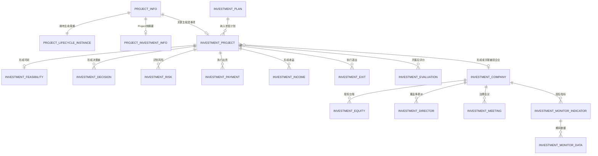

# 投资项目领域模型设计

> 版本：V1.0
> 对应阶段：Sprint 2-1.0
> 文档性质：领域设计，不修改业务代码、接口或数据库
> 前置基线：Project聚合、生命周期V2、`05_project.sql`、`07_investment.sql`

## 1. 设计目标与边界

投资项目能力采用“通用Project负责生命周期，Investment负责投资专业事实”的双域协作模型：

```text
Project聚合
  负责：项目身份、责任组织、负责人、生命周期实例、阶段、任务、成员
             |
             | projectId + 受信投资事实
             v
InvestmentProject聚合
  负责：机会、论证、尽调、风险、方案、决策、实施、收益、投后和退出
```

禁止通过面向对象继承让 `InvestmentProject extends Project`。两者是不同限界上下文中的聚合根，通过 `ProjectId`、应用端口和领域事件协作。这样投资规则变化不会污染通用Project核心，也不会让Project事务加载无界的收益、监控和股权数据。

### 1.1 事实所有权

| 业务事实 | 权威所有者 | Project侧用途 |
| --- | --- | --- |
| 项目编号、名称、组织、负责人 | Project | 权威 |
| 生命周期模板、阶段状态、进度 | Project | 权威 |
| 投资机会、可研、尽调、投资方案 | Investment | 阶段门禁事实 |
| 投资决策和三重一大结果 | Investment/审批域 | 决策阶段门禁 |
| 支付、股权、收益、分红、退出 | Investment | 展示摘要及阶段门禁 |
| 企业级风险库和预警 | Risk | Investment引用风险事实 |
| 投资项目摘要 | `project_investment_info` | Project侧只读投影 |

`project_investment_info` 不得与 `investment_project` 形成两个可独立编辑的投资台账。前者是Project侧生命周期摘要或快照，后者是投资业务权威记录。

## 2. 投资项目聚合模型

### 2.1 聚合根

```text
InvestmentProject
  investmentId
  investmentNo
  projectId
  planId
  name
  investmentType
  industry
  status
  approvalStatus
  opportunity
  argumentationSummary
  currentScheme
  decisionSummary
  implementationSummary
  postInvestmentSummary
  riskSummary
  version
```

聚合根映射现有 `investment_project`。`projectId` 必须关联 `project_info.project_type='01'`，且创建、查询、变更前必须先经过 `ProjectAccessPolicy`。

### 2.2 核心不变量

1. 只有投资类型Project（`project_type=01`）可以建立投资扩展。
2. 一个Project只能有一个有效的主投资事项；现有数据库尚未对 `investment_project.project_id` 建唯一约束，实施前必须先审计存量数据。
3. 投资编号在逻辑删除语义下唯一。
4. 投资总额、自有资金、融资金额和预计收益不得为负数。
5. 自有资金与融资金额不能超过投资总额；存在其他资金来源时必须明确资金构成。
6. 股权比例必须在0至100之间，非股权投资不强制填写持股比例。
7. 进入决策前必须有已批准的可研结论、尽调结论、风险结论和冻结版投资方案。
8. 决策结果为拒绝时不得进入实施；附条件通过必须先关闭所有前置条件。
9. 未经批准不得发生投资支付；累计支付不得超过批准额度。
10. 投资收益、分红、退出金额必须来自权威台账，不允许手工回写Project财务事实。
11. 退出完成前必须完成收益、股权变化、法律手续和风险处置核对。
12. 聚合状态只能由领域行为推进，不提供任意状态字段更新接口。

### 2.3 状态模型

建议领域状态：

```text
OPPORTUNITY
  -> ARGUMENTATION
  -> DECISION_PENDING
  -> APPROVED
  -> IMPLEMENTING
  -> POST_INVESTMENT
  -> EXITING
  -> CLOSED

任一非终态 -> SUSPENDED / CANCELLED
DECISION_PENDING -> REJECTED
```

现有数据库 `status` 默认值为 `DRAFT`。后续实施必须先冻结“领域状态—数据库状态”映射，不能在本设计阶段直接替换历史状态值。

### 2.4 聚合行为

```text
registerOpportunity()
acceptOpportunity()
rejectOpportunity()
submitFeasibility()
approveFeasibility()
completeDueDiligence()
freezeInvestmentScheme()
submitDecision()
recordDecision()
confirmDecisionConditions()
startImplementation()
confirmCapitalContribution()
enterPostInvestment()
recordIncomeSummary()
startExit()
completeExit()
cancelInvestment()
```

每个行为校验当前状态、调用人权限、必要业务事实和乐观锁版本，并产生可审计领域事件。

## 3. 投资机会模型

### 3.1 InvestmentOpportunity

```text
InvestmentOpportunity
  opportunityId
  opportunityNo
  investmentProjectId
  source
  proposedOrgId
  direction
  industry
  proposedAt
  responsiblePersonId
  partnerCandidates[]
  preliminaryReturn
  strategicFit
  screeningConclusion
  status
  version
```

#### 机会来源

```text
STRATEGIC_PLAN          战略规划
GOVERNMENT_ASSIGNMENT   政府交办
MARKET_DISCOVERY        市场发现
INTERNAL_PROPOSAL       内部提出
PARTNER_PROPOSAL        合作方提出
ASSET_RESTRUCTURING     资产重组
OTHER                   其他
```

#### 机会状态

```text
DISCOVERED -> SCREENING -> ACCEPTED -> CONVERTED
                         -> REJECTED
任一处理中状态           -> CLOSED
```

`ACCEPTED` 表示进入正式论证，`CONVERTED` 表示已形成主投资事项，不能仅凭创建一条记录自动认定机会通过。

### 3.2 合作方候选

```text
PartnerCandidate
  partnerId/referenceId
  partnerName
  creditCode
  partnerRole
  proposedContribution
  proposedRatio
  qualificationStatus
  conflictOfInterestStatus
```

合作方应支持多方参与。现有 `investment_project.partner_name` 和 `project_investment_info.partner_name` 只能承载摘要，不能作为未来合作方尽调和出资承诺的完整台账。

### 3.3 初步收益

```text
PreliminaryReturn
  estimatedInvestment
  expectedAnnualIncome
  expectedAnnualProfit
  expectedRoi
  expectedIrr
  expectedPaybackPeriod
  currency
  calculationDate
  assumptions
```

所有收益数据必须同时携带币种、测算日期、口径和假设。初步收益只用于机会筛选，不能替代正式可研测算。

### 3.4 机会筛选规则

- 投资方向必须与企业战略或年度投资计划匹配；
- 提出部门和责任人必须有效；
- 预计投资金额、资金来源和合作模式应达到最小完整度；
- 存在利益冲突或合作方黑名单命中时阻断受理；
- 被拒绝机会必须保留拒绝原因和审计记录；
- 同一来源业务键必须防止重复登记。

## 4. 投资论证模型

投资论证不是单个“大表”，而是围绕冻结版投资方案形成的专业结论组合。

### 4.1 FeasibilityStudy

映射现有 `investment_feasibility`：

```text
FeasibilityStudy
  feasibilityId
  investmentId
  marketAnalysis
  technicalAnalysis
  financialAnalysis
  investmentPeriod
  annualIncome
  annualCost
  annualProfit
  roi
  irr
  paybackPeriod
  conclusion
  status
  approvedBy/approvedAt
  reportFileId
  version
```

规则：

- 年利润必须等于年收入减年成本；
- ROI、IRR和回收期必须记录测算模型版本；
- 提交审批后内容冻结，修订形成新版本而非覆盖批准结论；
- `APPROVED` 或 `APPROVED_WITH_CONDITIONS` 才能为下一阶段提供通过事实。

### 4.2 DueDiligenceCase

```text
DueDiligenceCase
  dueDiligenceId
  investmentId
  scope
  legalConclusion
  financialConclusion
  businessConclusion
  technicalConclusion
  taxConclusion
  assetConclusion
  findings[]
  overallConclusion
  status
  completedAt
  reportFileIds[]
  version
```

尽调问题 `DueDiligenceFinding` 包含领域、严重级别、问题描述、责任人、处置措施、截止日期和关闭证据。存在未处置的阻断级问题时，尽调不得认定通过。

当前 `07_investment.sql` 没有尽调专表，本对象属于已确认的领域缺口；后续只能通过独立migration落地，本阶段不借用风险表或附件字段伪装尽调台账。

### 4.3 InvestmentRiskAssessment

`investment_risk` 维护投资事项风险，典型分类：

```text
POLICY / MARKET / LEGAL / FINANCIAL / OPERATION / PARTNER / EXIT
```

投资风险与企业风险边界：

- Investment拥有具体投资事项的风险识别、措施和处置状态；
- Risk域拥有企业风险库、统一预警和整改规则；
- 重大风险可关联Risk域ID，但不复制企业风险台账；
- `NO_OPEN_CRITICAL_RISK` 由Investment事实端口提供，不能由前端布尔值决定。

### 4.4 InvestmentScheme

```text
InvestmentScheme
  schemeId
  investmentId
  schemeVersion
  investmentSubject
  investmentType
  targetCompanyId/SPVPlan
  totalAmount
  capitalStructure
  contributionMethod
  contributionSchedule
  proposedEquityRatio
  governanceRights
  valuationBasis
  expectedReturn
  exitArrangement
  riskMitigations
  status
  frozenAt
```

状态为 `DRAFT -> REVIEWING -> FROZEN -> SUPERSEDED`。只有FROZEN版本可以提交投资决策；决策后修改金额、比例、主体、SPV、治理权或退出安排，必须触发方案变更和重新决策判断。

现有表能承载部分金额、比例、合作方和SPV摘要，但不能完整承载方案版本、出资计划和治理权条款，后续需专项持久化设计。

## 5. 投资决策模型

### 5.1 InvestmentDecisionProcess

```text
InvestmentDecisionProcess
  processId
  investmentId
  schemeId/schemeVersion
  approvalInstanceRef
  majorDecisionRef
  requiredDecisionTypes[]
  decisions[]
  conditions[]
  result
  decidedAt
  version
```

`investment_decision` 保存党委会、经理办公会、董事会和股东会等正式决策记录。审批流实例和三重一大事项由相应专业能力维护，Investment只保存不可抵赖引用和结果快照。

### 5.2 决策类型与顺序

```text
PARTY_COMMITTEE
MANAGER_MEETING
BOARD
SHAREHOLDER
SUPERVISORY_REVIEW（如适用）
```

所需决策类型由投资金额、投资类型、企业章程和权限清单计算，不在Controller硬编码。决策链必须记录规则版本，避免权限清单升级后无法解释历史项目。

### 5.3 决策结果

```text
PENDING
APPROVED
APPROVED_WITH_CONDITIONS
REJECTED
DEFERRED
WITHDRAWN
```

- 所有必需决策均批准后，聚合结论才能为APPROVED；
- 任一具有否决效力的决策为REJECTED时整体拒绝；
- 附条件批准必须形成 `DecisionCondition`，全部关闭后才能实施；
- 会议附件通过 `sys_file` 引用，业务表不保存不受控本地路径；
- 决策记录原则上只追加、更正，不允许无审计覆盖。

### 5.4 三重一大关联

```text
MajorDecisionRef
  businessType=INVESTMENT
  externalBusinessId=investmentId
  matterId
  workflowInstanceId
  ruleVersion
  result
  completedAt
  evidenceFileIds
```

现有数据库没有稳定的三重一大事项引用字段。后续设计应优先采用业务引用和事件集成，不在 `decision_content` 中拼接事项ID。

## 6. 投资实施与投后管理

### 6.1 投资实施

实施事实包括协议生效、出资审批、支付、SPV或被投企业登记和股权形成：

```text
InvestmentImplementationSummary
  approvedAmount
  paidAmount
  remainingAmount
  agreementEffective
  paymentScheduleStatus
  targetCompanyId
  equityRegistered
  implementationStatus
```

`investment_payment` 是支付事实，必须满足审批单、支付金额、账户脱敏和累计额度控制。银行账户属于敏感数据，必须加密存储并按权限脱敏，禁止进入普通操作日志。

### 6.2 被投企业边界

`InvestmentCompany` 是独立聚合根，映射 `investment_company`。股权、董监事和治理会议属于被投企业治理边界：

```text
InvestmentCompany
  -> EquityLedger
  -> DirectorAppointment
  -> CorporateMeeting
  -> MonitoringIndicator
```

它们不能作为 `InvestmentProject` 聚合内的无界集合一次加载。投资项目只保存 `targetCompanyId` 和必要摘要。

### 6.3 收益与分红

`investment_income` 是收益权威流水：

```text
DIVIDEND
EQUITY_APPRECIATION
TRANSFER
ASSET
```

分红使用 `DIVIDEND` 类型记录，投后摘要只聚合：累计收益、年度收益、最近收益日期、收益偏差和数据截止时间。收益记录不直接修改Project的经营收入。

### 6.4 经营评价

`investment_evaluation` 保存定期或专项评价：经济效益、经营管理、风险控制和综合评分。评价应引用指标期间与事实版本，不能只保存无法复核的总分。

投后监控由 `investment_monitor_indicator` 和 `investment_monitor_data` 承载，支持收入、利润、现金流、资产负债率、毛利率等指标。预警由Investment/Risk协作处理，不由Project阶段页面自行计算。

### 6.5 投资退出

```text
InvestmentExitPlan
  exitId
  investmentId
  exitType
  exitReason
  plannedDate
  expectedAmount
  expectedIncome
  approvalStatus
  status
  completedDate
  actualAmount
  actualIncome
```

退出类型：`TRANSFER / REPURCHASE / LIQUIDATION / IPO`。

退出完成必须同时满足：退出决策批准、交易或清算完成、资金到账、收益核对、股权台账更新、法律文件归档以及重大风险闭环。

## 7. 数据关系



### 7.1 当前表映射与缺口

| 领域对象 | 当前承载 | 结论 |
| --- | --- | --- |
| Project投资摘要 | `project_investment_info` | 已有，只作投影 |
| InvestmentProject | `investment_project` | 已有，作为聚合根 |
| 投资机会 | 部分散落于计划和主表 | 缺少完整机会模型 |
| 可研 | `investment_feasibility` | 已有，缺版本与正式审批引用 |
| 尽调 | 无专表 | 明确缺口 |
| 投资方案 | 主表和扩展摘要 | 缺版本化方案模型 |
| 投资决策 | `investment_decision` | 已有，缺流程/三重一大稳定引用 |
| 支付 | `investment_payment` | 已有 |
| 风险 | `investment_risk` | 已有，需关联企业风险事实 |
| 投后监控 | indicator/data | 已有 |
| 收益与分红 | `investment_income` | 已有 |
| 后评价 | `investment_evaluation` | 已有 |
| 退出 | `investment_exit` | 已有 |

本阶段不通过修改现有字段或借用备注、附件、决策内容来填补缺口。所有缺口必须在后续Sprint完成数据审计、migration设计和兼容评审。

## 8. 生命周期V2关联

### 8.1 模板

投资项目必须使用ACTIVE的 `INVESTMENT_STANDARD` 模板，项目类型为 `01`：

```text
OPPORTUNITY
FEASIBILITY
DUE_DILIGENCE
DECISION
IMPLEMENTATION
POST_INVESTMENT
EXIT
ARCHIVE
```

Project拥有阶段状态；Investment只提供受信业务事实。Investment不得直接更新 `project_stage.status`，阶段流转必须由Project生命周期应用服务执行。

### 8.2 条件事实端口

```text
InvestmentLifecycleFactPort
  opportunityAccepted(projectId)
  investmentItemExists(projectId)
  feasibilityApproved(projectId)
  dueDiligencePassed(projectId)
  noOpenCriticalRisk(projectId)
  majorDecisionApproved(projectId)
  investmentDecisionApproved(projectId)
  decisionConditionsClosed(projectId)
  agreementEffective(projectId)
  paymentCompleted(projectId)
  equityRegistrationConfirmed(projectId)
  postInvestmentMonitoringComplete(projectId, periodRequirement)
  exitApproved(projectId)
  exitCompleted(projectId)
  requiredArchivesPresent(projectId, archiveSetCode)
```

事实响应至少包含：`passed`、`factVersion`、`evaluatedAt`、`sourceSystem` 和安全错误码。禁止仅返回可由前端伪造的布尔值。

### 8.3 阶段条件设计

| 阶段 | 进入条件 | 完成条件 |
| --- | --- | --- |
| OPPORTUNITY | 项目及责任组织有效 | `INVESTMENT_OPPORTUNITY_ACCEPTED`、`INVESTMENT_ITEM_EXISTS` |
| FEASIBILITY | 机会已受理 | `FEASIBILITY_APPROVED` |
| DUE_DILIGENCE | 可研建议继续 | `DUE_DILIGENCE_PASSED`、`NO_OPEN_CRITICAL_RISK` |
| DECISION | 可研、尽调、冻结方案齐全 | `MAJOR_DECISION_APPROVED`、`INVESTMENT_DECISION_APPROVED`、`DECISION_CONDITIONS_CLOSED` |
| IMPLEMENTATION | 决策批准 | `INVESTMENT_AGREEMENT_EFFECTIVE`、`INVESTMENT_PAYMENT_COMPLETED`，股权类项目增加 `EQUITY_REGISTRATION_CONFIRMED` |
| POST_INVESTMENT | 实施完成且监控对象存在 | `POST_INVESTMENT_MONITORING_COMPLETE`、`NO_OPEN_CRITICAL_RISK` |
| EXIT | 退出方案具备条件 | `INVESTMENT_EXIT_APPROVED`、`INVESTMENT_EXIT_COMPLETED` |
| ARCHIVE | 退出完成或获准终止 | `REQUIRED_ARCHIVES_PRESENT`、后评价完成 |

### 8.4 条件执行安全

- `condition_code` 必须来自白名单注册表；
- 参数仅保存经过Schema验证的JSON数据，不保存SQL、SpEL、OGNL或脚本；
- 条件快照随项目创建冻结，模板升级不改变历史项目；
- 外部事实查询必须设置超时、熔断和幂等重试；
- 关键审批事实不可用时默认阻断，不允许静默放行；
- 条件执行记录只保存事实版本和脱敏摘要，不记录敏感决策正文或银行账户；
- 阶段完成命令必须同时校验功能权限、ProjectAccessPolicy、数据权限和乐观锁。

当前V2标准模板尚未发布条件行，阶段快照状态为 `NONE`。上述条件应在独立模板版本中评审发布，禁止原地修改已ACTIVE的V1版本。

## 9. 跨聚合协作与事件

### 9.1 依赖端口

```text
InvestmentProjectRepository
ProjectReferencePort
InvestmentLifecycleFactPort
ApprovalProcessPort
MajorDecisionPort
RiskFactPort
FileReferencePort
OutboxPort
```

Investment Application可以依赖Project提供的端口；Investment Domain不能依赖Project Mapper、Controller或Spring Security实现。

### 9.2 领域事件

建议事件：

```text
InvestmentOpportunityAccepted
FeasibilityApproved
DueDiligenceCompleted
InvestmentSchemeFrozen
InvestmentDecisionApproved
InvestmentDecisionRejected
InvestmentPaymentCompleted
PostInvestmentMonitoringCompleted
InvestmentIncomeRecorded
InvestmentExitApproved
InvestmentExitCompleted
InvestmentRiskLevelChanged
```

事件必须包含 `eventId`、`aggregateId`、`projectId`、`aggregateVersion`、`occurredAt` 和 `traceId`，通过事务Outbox发布。消费者以 `eventId + aggregateVersion` 幂等处理。

### 9.3 一致性边界

- Investment内部的根状态和当前方案在一个本地事务内一致；
- Project阶段变更是独立事务，通过事实查询或事件触发，不做跨聚合数据库大事务；
- 支付、股权、公司治理和财务收益各自维护权威台账；
- 事件失败时保留待重试状态，不允许先推进生命周期再丢失投资事实。

## 10. 权限与数据安全

建议权限：

```text
investment:project:view
investment:project:create
investment:project:update
investment:opportunity:review
investment:feasibility:review
investment:due-diligence:manage
investment:scheme:freeze
investment:decision:submit
investment:decision:record
investment:payment:view
investment:post-monitor:manage
investment:income:view
investment:exit:manage
```

安全规则：

1. 所有投资事项访问先根据 `projectId` 执行 `ProjectAccessPolicy`，再校验Investment功能权限。
2. 分页查询必须通过Project责任组织落实统一数据权限，禁止因 `investment_project` 没有组织字段而无条件全表查询。
3. 决策、支付、收益、股权和退出信息采用最小权限，不因拥有项目查看权限自动开放全部财务数据。
4. 银行账户、合作方敏感资料、尽调底稿和决策附件必须加密、脱敏并审计访问。
5. 操作日志不得记录附件正文、完整账户、Token或审批敏感意见。
6. 对外回调必须使用服务身份鉴权、签名、时间戳、防重放和业务幂等键。

## 11. 后续开发计划

### Sprint 2-1.1：投资数据基线审计

- 审计 `project_investment_info` 与 `investment_project` 重复字段；
- 核查一Project多投资事项的存量情况；
- 冻结状态、金额、币种和比例口径；
- 形成机会、尽调、方案版本和决策引用的migration建议；
- 不修改历史SQL。

### Sprint 2-1.2：投资聚合骨架

- 建立Investment的domain/application/infrastructure分层；
- 创建聚合根、值对象、Repository端口和状态规则；
- 保留现有接口兼容，不接入生命周期写操作。

### Sprint 2-1.3：机会与论证

- 实现机会登记、筛选和转化；
- 实现可研版本、尽调问题闭环、风险评估和方案冻结；
- 增加文件引用、安全和审计测试。

### Sprint 2-1.4：投资决策

- 接入审批流程和三重一大引用；
- 实现决策链、附条件批准和变更重决策；
- 建立审批回调验签、幂等和Outbox。

### Sprint 2-1.5：实施与投后

- 接入支付、SPV/被投企业、股权和治理权；
- 实现投后指标、收益、分红、评价和风险预警；
- 实现退出计划与退出核算。

### Sprint 2-1.6：生命周期条件模板

- 建立白名单条件执行器和事实端口；
- 创建投资模板新版本，不修改ACTIVE V1；
- 发布进入/完成条件并生成实例快照；
- 完成条件失败、外部超时、模板升级隔离和历史项目测试。

### Sprint 2-1.7：验收与性能

- 真实MySQL 8与国产数据库适配测试；
- ALL、ORG、ORG_AND_CHILDREN、SELF、CUSTOM数据权限测试；
- 决策、支付、收益敏感数据安全测试；
- 大数据量查询、执行计划、Outbox积压和灾难恢复演练。

## 12. 设计决策与待确认项

### 已冻结决策

1. InvestmentProject通过组合和ID引用扩展Project，不使用类继承。
2. Project拥有生命周期，Investment只提供受信阶段事实。
3. `investment_project` 是投资事项权威聚合，`project_investment_info` 是Project侧摘要。
4. 被投企业及投后明细是独立聚合，不作为InvestmentProject无界集合加载。
5. 生命周期条件使用白名单编码和不可变快照，不执行动态脚本。
6. ACTIVE模板版本不可原地修改，条件发布必须创建新版本。

### 后续需业务确认

1. 一个Project是否严格对应一个主投资事项，以及历史一对多数据如何治理；
2. 不同投资金额和类型对应的党委会、经理层、董事会及股东会权限矩阵；
3. 附条件批准的关闭责任和最大有效期；
4. 投后监控最短周期及退出阶段进入标准；
5. 收益率、IRR、估值、分红和退出收益的财务口径；
6. 多币种、含税口径、资金来源分类和融资成本规则；
7. 合作方、尽调资料和决策材料的密级与保留期限。

上述事项在确认前不得通过Controller常量或数据库状态值提前固化。
