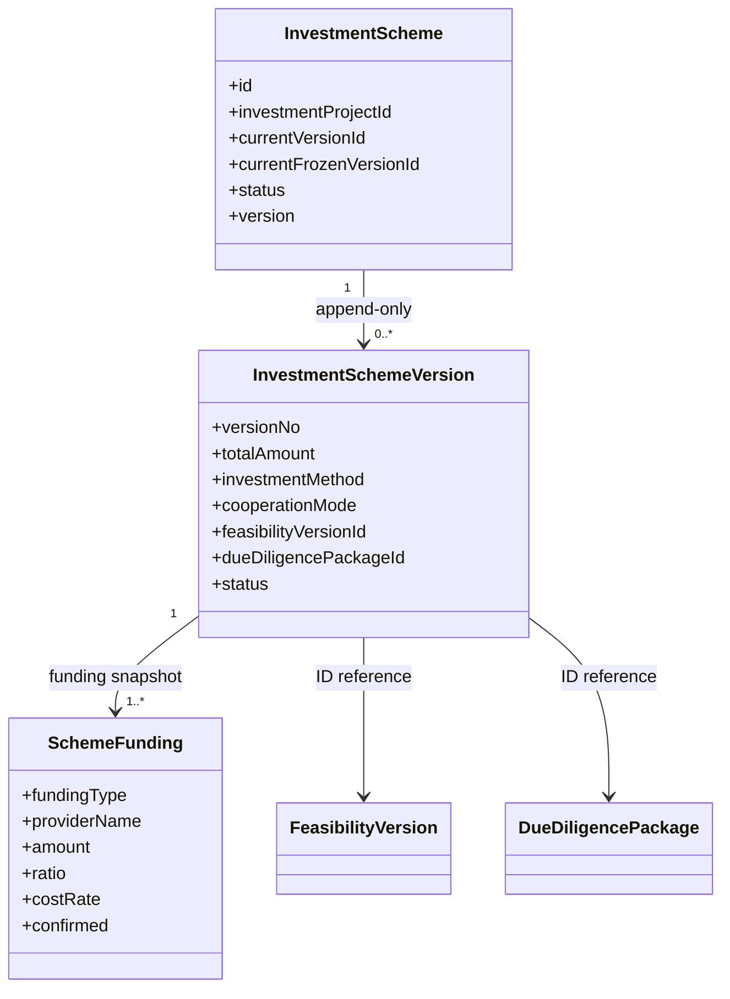

# 投资方案管理能力实施报告

## 1. 实现范围

Sprint 2-2.5 已基于V2.4.0既有表完成投资方案基础能力，未修改投资业务表结构。

### 1.1 方案管理

- 创建一个投资事项对应的`investment_scheme`方案档案；
- 查询方案档案；
- 向`investment_scheme_version`追加方案版本；
- 方案头通过数据库行锁、版本号和乐观锁原子切换`current_version_id`；
- 历史版本没有更新或删除用例，任何变更必须追加新版本；
- 方案查询批量加载全部版本资金来源，不产生逐版本N+1查询。

### 1.2 资金方案

- 一个方案版本支持多个`investment_scheme_funding`资金来源；
- 保存资金类型、提供方、金额、资金成本、可用日期、确认状态和证据文件引用；
- 所有资金来源金额合计必须严格等于方案总金额；
- 资金比例由权威金额实时计算并随API结果返回，不新增比例字段、不形成金额和比例双写；
- 出资方式使用方案版本的`investment_method`权威字段。

### 1.3 合作方案

方案版本支持：

- `cooperation_mode`合作模式；
- 投前/投后股权比例、股份类型和控制类型；
- 治理安排和合作方安排；
- 收益分配；
- 退出方式、退出安排和先决条件。

### 1.4 可研与尽调引用

方案版本只保存：

- `feasibility_version_id`；
- `due_diligence_package_id`。

不复制可研指标、尽调结论或问题明细。创建版本前强制验证：

1. 引用对象与当前投资事项一致；
2. 可研版本状态为`FROZEN`且结论为`RECOMMENDED`；
3. 尽调包状态为`FROZEN`、整体结论为`PASS`；
4. 尽调包未关闭阻断问题数为0。

## 2. 领域模型



领域层不依赖Spring、MyBatis或持久化Entity。调用链为：

```text
InvestmentSchemeController
  -> InvestmentSchemeApplicationService
     -> InvestmentLifecycleStagePolicy / ProjectAccessPolicy
     -> InvestmentSchemeRepository
        -> InvestmentSchemeRepositoryImpl
           -> MyBatis Plus Mapper
```

写入版本和多笔资金来源使用同一个`REQUIRED`事务。任何资金明细保存失败都会回滚版本写入，方案头不会切换。

## 3. 接口设计

基础路径：`/investment/schemes`

| 方法 | 路径 | 权限 | 功能 |
| --- | --- | --- | --- |
| POST | `/{investmentId}` | `investment:scheme:edit` | 创建投资方案档案 |
| GET | `/{investmentId}` | `investment:scheme:view` | 查询投资方案档案 |
| POST | `/{investmentId}/versions` | `investment:scheme:edit` | 追加方案版本和多资金来源 |
| GET | `/{investmentId}/versions` | `investment:scheme:view` | 查询全部不可变版本及资金比例 |

Controller与Application Service均声明`@PreAuthorize`。所有入口先通过生命周期策略映射到Project访问策略，数据权限不依赖前端隐藏。

权限初始化资产：

- `V2.4.3__add_investment_scheme_permissions.sql`；
- `investment:scheme:view`；
- `investment:scheme:edit`；
- SHA-256：`0918ae589df84e9c401aa695cb1b57b83937fccaad85f1c2d0507d4260bae368`；
- 当前状态：`CANONICAL_PENDING_VALIDATION / NOT_EXECUTED`。

V2.4.3只增加RBAC权限、菜单和超级管理员授权，不修改投资业务表。

## 4. 测试结果

| 测试项 | 结果 |
| --- | --- |
| Java 21编译 | 通过 |
| Investment专项测试 | 46个通过 |
| 方案版本自动追加 | 通过 |
| 历史方案版本无更新/删除入口 | 通过 |
| 多资金来源及60%/40%比例计算 | 通过 |
| 资金合计必须等于方案总金额 | 通过 |
| 非冻结可研引用拒绝 | 通过 |
| 可研/尽调同投资事项校验 | 通过 |
| 方案RBAC权限契约 | 通过 |
| 资金保存失败事务回滚 | 通过 |
| 三张Entity与V2.4.0表映射 | 通过 |
| Spring Boot Investment上下文 | 通过 |
| 后端全量回归 | 165个通过，0失败、0错误、0跳过 |

测试环境使用H2上下文时没有加载业务Schema，因此字段检查器会报告`TABLE_NOT_FOUND`；这是既有测试配置提示，不是MySQL映射失败。

## 5. 剩余风险

1. V2.4.3权限Migration尚未执行真实MySQL/Flyway验收，上线前必须完成`pre策略检查 -> migrate -> post validate -> 二次migrate`。
2. 当前可研和尽调Sprint尚未提供完整的提交、评审与冻结接口；方案模块坚持引用冻结且通过的权威结果，因此联调前必须补全或准备经过审计的状态数据，禁止降低引用校验绕过流程。
3. 本Sprint只实现方案草稿版本追加，方案提交、内部评审、内容哈希和冻结将在投资决策Sprint实现。
4. 数据库只有方案级`investment_method`，没有逐资金来源出资方式字段；当前按既有结构使用统一出资方式。如未来业务确认每个资金来源存在不同出资方式，必须通过新Migration扩展，不能复用`funding_type`混存。
5. 历史不可变由Application Service和Repository端口约束；绕过Repository直接调用MyBatis通用更新能力属于代码审查阻断项。
6. 资金来源使用“方案行锁 + 最大版本号 + 唯一约束”保证同一方案串行追加；跨实例并发冲突会安全回滚。
