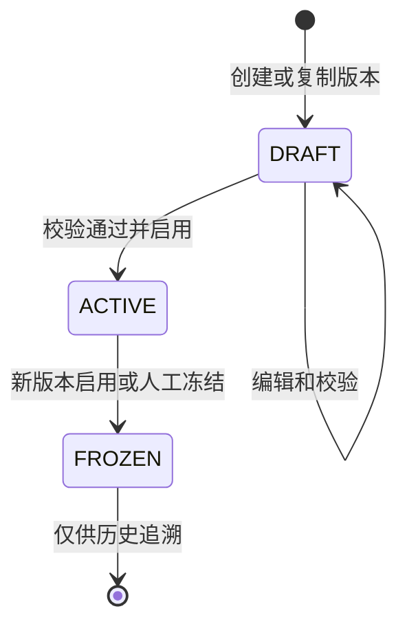
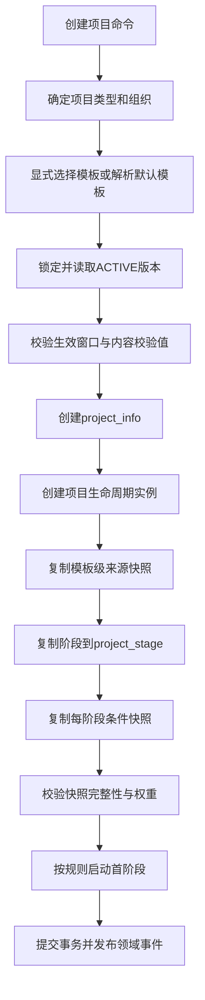
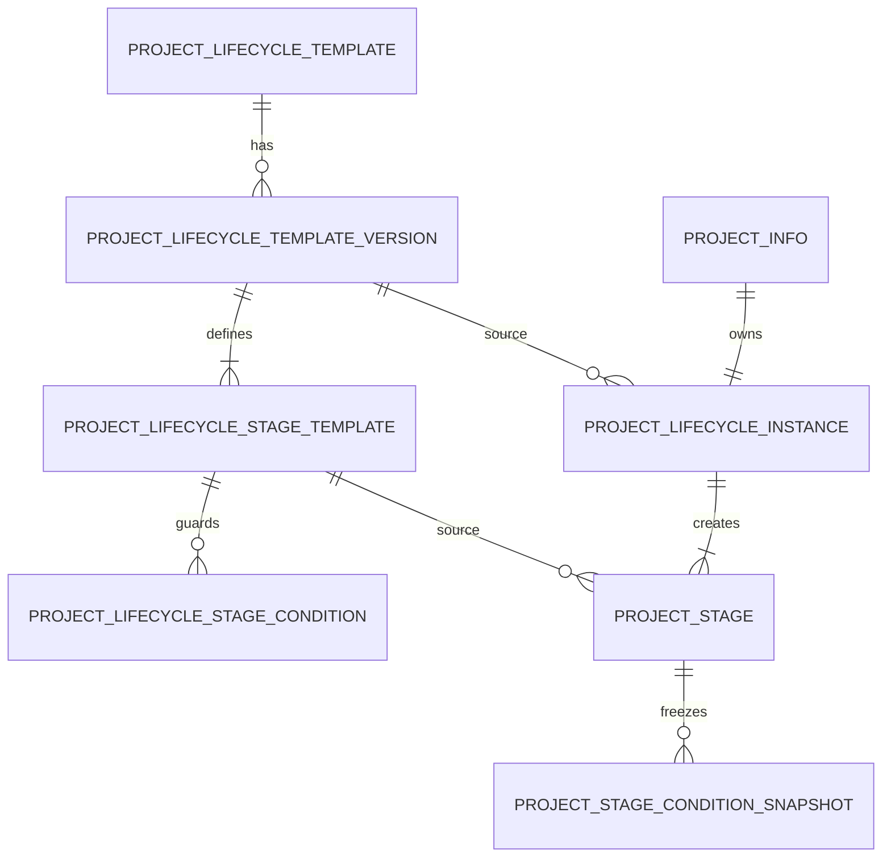

# 项目生命周期模板模型 V2

> 文档版本：V2.0
> 适用阶段：Sprint 2-0.4.1
> 数据库基线：`database/mysql/05_project.sql`
> 文档性质：领域与数据库扩展设计，不代表已实施的数据库变更

## 1. 设计目标与边界

### 1.1 目标

生命周期模板 V2 解决以下问题：

1. 用模板头表达一个稳定的生命周期产品，例如“标准投资项目生命周期”；
2. 用独立版本保存每次发布内容，支持草稿、启用和冻结；
3. 用阶段模板定义顺序、权重、进入条件、完成条件及审批策略；
4. 项目创建时生成不可变快照，使模板升级不影响历史项目；
5. 保留模板来源、版本校验值和复制审计，满足国企审计追溯要求；
6. 为审批流、三重一大、合同、财务和风险系统提供稳定扩展点。

### 1.2 本阶段边界

- 不修改 `05_project.sql` 或其他历史 SQL；
- 不创建、执行 migration；
- 不修改 Project 业务代码；
- 本文表结构均为后续 migration 的建议目标；
- `05_project.sql` 仍是当前已实施结构的唯一基线。

### 1.3 关键术语

| 术语 | 定义 |
|---|---|
| 模板头 | 生命周期模板的稳定身份，不承载可变阶段内容 |
| 模板版本 | 某次完整、可校验的生命周期定义 |
| 阶段模板 | 某个模板版本内的阶段定义 |
| 项目生命周期实例 | 项目选定模板版本后生成的运行容器 |
| 阶段实例 | 现有 `project_stage` 中可流转的业务阶段 |
| 快照 | 项目创建时复制并冻结的模板、阶段和条件定义 |

特别说明：现有表中的 `version` 字段是 MyBatis Plus 乐观锁字段，不能作为生命周期业务版本号。业务版本必须使用独立的 `version_no`。

## 2. 模板领域模型

### 2.1 聚合结构

```text
LifecycleTemplate（模板头，聚合根）
└── LifecycleTemplateVersion（不可变发布版本）
    ├── LifecycleStageTemplate（阶段模板）
    │   └── LifecycleStageCondition（阶段条件）
    └── VersionValidationResult（发布校验结果，领域对象）

ProjectLifecycleInstance（项目生命周期实例，聚合根）
├── LifecycleTemplateSnapshot（项目级来源快照）
└── ProjectStage（现有运行阶段）
    └── ProjectStageConditionSnapshot（条件快照）
```

模板定义聚合与项目实例聚合必须分开。模板负责“以后怎样创建”，实例负责“当前项目怎样运行”。实例生成后不得回查活动模板决定其阶段、权重或条件。

### 2.2 模板头 `LifecycleTemplate`

模板头只保存跨版本稳定属性：

| 属性 | 含义 |
|---|---|
| `id` | 模板ID |
| `templateCode` | 全局稳定编码，例如 `INVESTMENT_STANDARD` |
| `templateName` | 模板名称 |
| `projectType` | 适用项目类型，允许 `ALL` 作为兜底 |
| `description` | 模板用途说明 |
| `status` | `ENABLED` 或 `DISABLED` |
| `currentActiveVersionId` | 当前启用版本，仅作快速定位 |
| `orgId` | 可选，模板所属组织；为空表示平台级模板 |

不变量：

- `templateCode` 创建后不可修改；
- 一个模板头可有多个版本，但最多一个 `ACTIVE` 版本；
- 停用模板只禁止新项目选择，不影响既有项目；
- 同一项目类型可存在多个模板，由业务显式选择或默认规则决定。

### 2.3 模板版本 `LifecycleTemplateVersion`

| 属性 | 含义 |
|---|---|
| `templateId` | 所属模板头 |
| `versionNo` | 单模板内递增的业务版本号，从1开始 |
| `versionName` | 展示名称，例如 `2027版` |
| `status` | `DRAFT/ACTIVE/FROZEN` |
| `effectiveFrom/effectiveTo` | 可选生效窗口 |
| `contentChecksum` | 阶段和条件规范化后的 SHA-256 |
| `changeSummary` | 本版本变更摘要 |
| `sourceVersionId` | 从哪个版本复制创建 |
| `publishedBy/publishedTime` | 启用审计 |
| `frozenBy/frozenTime` | 冻结审计 |

发布版本是不可变值对象集合。进入 `ACTIVE` 或 `FROZEN` 后，版本、阶段和条件均不得原地修改。

### 2.4 阶段模板 `LifecycleStageTemplate`

| 属性 | 含义 |
|---|---|
| `templateVersionId` | 所属模板版本 |
| `stageCode` | 版本内稳定阶段编码 |
| `stageName` | 阶段名称 |
| `stageOrder` | 阶段顺序，从1开始连续 |
| `requiredFlag` | 是否必需阶段 |
| `allowSkip` | 是否允许经授权关闭为跳过 |
| `progressWeight` | 阶段进度权重 |
| `plannedDurationDays` | 默认计划工期 |
| `autoStart` | 前序关闭后是否自动进入 |
| `approvalRequired` | 完成或关闭前是否必须审批 |
| `approvalSceneCode` | 审批场景编码，不保存流程实例ID |
| `completionMode` | `MANUAL/AUTO/HYBRID` |
| `description` | 阶段说明 |

阶段模板不变量：

1. 同一版本内 `stageCode` 和 `stageOrder` 分别唯一；
2. `stageOrder` 必须从1开始连续；
3. 有效阶段权重合计必须精确为 `100.0000`；
4. 权重不得小于0，必需阶段权重必须大于0；
5. 必需阶段原则上不可跳过；例外必须经过专门审批场景；
6. 审批必需时必须配置有效的 `approvalSceneCode`；
7. 首阶段必须具有可满足的进入条件，末阶段完成后必须允许项目进入完成态。

## 3. 阶段权重与条件模型

### 3.1 权重规则

权重建议使用 `DECIMAL(7,4)`，避免浮点误差。

项目进度计算：

```text
projectProgress = Σ(stageWeight × stageCompletionPercent) / 100
```

其中阶段完成度取值为 `0..100`。正常完成或经授权跳过并关闭的阶段按100计入；项目取消不伪装成100%，应进入独立取消终态。权重及计算策略必须写入项目快照，不随模板后续调整。

### 3.2 条件分类

| 条件类型 | 执行时点 | 示例 |
|---|---|---|
| `ENTRY` | 阶段从未开始进入进行中之前 | 前序阶段已关闭、可研资料齐全 |
| `COMPLETION` | 阶段申请完成之前 | 必需任务全部完成、验收资料已上传 |
| `CLOSE` | 已完成阶段关闭或跳过之前 | 审批已通过、风险无阻断项 |

审批不是普通布尔条件的替代品。`approvalRequired + approvalSceneCode` 描述审批门禁，条件只读取可信审批网关返回的事实。

### 3.3 条件表达

每条条件只能引用平台注册的白名单 `conditionCode`：

| 属性 | 含义 |
|---|---|
| `stageTemplateId` | 所属阶段模板 |
| `conditionType` | `ENTRY/COMPLETION/CLOSE` |
| `groupNo` | 条件组编号 |
| `groupOperator` | 组内 `AND/OR` |
| `conditionCode` | 白名单规则编码 |
| `parameterSchemaVersion` | 参数 Schema 版本 |
| `parametersText` | 经 Schema 校验的参数文本 |
| `requiredFlag` | 是否为强制条件 |
| `sortNo` | 组内执行顺序 |
| `failureMessage` | 不满足时的安全提示 |
| `failurePolicy` | `BLOCK/WARN`；关键条件必须 `BLOCK` |

不同条件组之间固定使用 `AND`，组内按 `groupOperator` 计算。禁止在数据库保存或执行 SQL、SpEL、OGNL、JavaScript、类名或任意脚本。

建议条件编码示例：

```text
PREVIOUS_STAGE_CLOSED
REQUIRED_TASKS_COMPLETED
REQUIRED_FILES_PRESENT
APPROVAL_PASSED
MAJOR_DECISION_COMPLETED
CONTRACT_SIGNED
PAYMENT_RATIO_REACHED
NO_BLOCKING_RISK
```

### 3.4 审批流接入

- 模板只保存审批场景编码，不保存具体流程定义版本；
- 项目阶段首次发起审批时保存审批定义版本和流程实例ID；
- 只有 `ApprovalGateway` 验签后的回调可以写入审批通过事实；
- 回调必须鉴权、验签、幂等并校验项目与阶段；
- 审批系统不可用时关键门禁默认失败关闭（fail closed）；
- 已完成阶段的审批证据必须长期可追溯。

## 4. 版本机制

### 4.1 状态机



不允许 `ACTIVE/FROZEN` 回到 `DRAFT`，也不允许物理删除被引用版本。需要调整时，从目标版本复制出新的 `DRAFT`。

### 4.2 版本创建

1. 新模板从空版本创建 `versionNo=1`；
2. 已有模板从指定版本深复制阶段及条件；
3. 在锁定模板头的事务中分配 `max(version_no)+1`；
4. 草稿可编辑，编辑使用行级乐观锁字段 `version`；
5. 业务版本号一经分配不复用，删除草稿也保留号码空洞。

### 4.3 版本启用

启用必须在单个事务内完成：

1. 锁定模板头；
2. 校验模板、阶段、条件编码、参数 Schema、权重和审批场景；
3. 生成规范化内容和 `content_checksum`；
4. 将原 `ACTIVE` 版本置为 `FROZEN`；
5. 将目标草稿置为 `ACTIVE`；
6. 更新模板头的 `current_active_version_id`；
7. 写入发布审计和领域事件。

数据库应通过唯一约束或可移植的“激活槽位”机制保证一个模板最多一个活动版本，不能只依赖前端判断。

### 4.4 版本冻结

- 冻结版本禁止新项目选择；
- 已关联项目继续使用自己的实例快照；
- 冻结不能删除阶段、条件或审批证据；
- 若当前活动版本被冻结且无替代版本，模板进入“无可选版本”状态，新建项目必须失败并提示配置人员。

### 4.5 历史项目关联规则

| 场景 | 规则 |
|---|---|
| 模板升级 | 历史项目不升级，继续使用实例快照 |
| 模板停用 | 历史项目照常运行，新项目不可选择 |
| 版本冻结 | 历史项目照常运行，新项目不可引用 |
| 阶段名称调整 | 只影响新版本；历史阶段名称保持创建时快照 |
| 条件规则升级 | 条件实现必须向后兼容 Schema；破坏性变化使用新条件编码 |
| 确需迁移历史项目 | 走独立“实例迁移”流程，生成差异、审批和审计，不自动升级 |

## 5. 项目实例快照模型

### 5.1 创建流程



项目、生命周期实例、阶段实例和条件快照必须在同一数据库事务中创建。任何复制失败均整体回滚，禁止产生“有项目但无完整生命周期”的半成品。

### 5.2 项目级快照

`ProjectLifecycleInstance` 保存：

| 属性 | 含义 |
|---|---|
| `projectId` | 项目ID，一对一唯一 |
| `templateId/templateCode/templateName` | 模板头来源及显示快照 |
| `templateVersionId/versionNo/versionName` | 确切版本来源 |
| `templateChecksum` | 创建时校验值 |
| `snapshotChecksum` | 项目完整快照校验值 |
| `progressPolicy` | 进度计算策略快照 |
| `instanceStatus` | `ACTIVE/COMPLETED/CANCELLED/CLOSED` |
| `initializedTime/initializedBy` | 初始化审计 |

来源ID用于追溯，快照字段用于运行。即便来源模板被停用，项目实例仍有充分信息可独立解释。

### 5.3 阶段实例快照

现有 `project_stage` 继续承担运行状态。后续 migration 只增加必要的来源和策略快照：

```text
lifecycle_instance_id
template_stage_id
stage_code / stage_name / stage_order（现有字段即显示快照）
progress_weight_snapshot
required_flag_snapshot
allow_skip_snapshot
approval_required_snapshot
approval_scene_code_snapshot
completion_mode_snapshot
planned_duration_days_snapshot
```

运行状态、实际日期、负责人、完成度、审批状态不属于模板快照，仍由项目运行过程维护。

### 5.4 条件快照

模板条件必须复制到 `project_stage_condition_snapshot`。运行时只读取条件快照，不读取 `project_lifecycle_stage_condition`。

快照至少保存：条件类型、组号、组内逻辑、条件编码、参数 Schema 版本、参数文本、是否必需、失败策略、排序和提示。条件执行结果不覆盖定义快照；每次关键流转的评估结果应另存审计记录或事件日志。

### 5.5 快照一致性

- 模板版本校验值：对排序后的阶段及条件规范化序列计算 SHA-256；
- 项目快照校验值：对实际复制后的项目级、阶段级和条件级快照计算；
- 初始化完成前校验阶段数量、编码、顺序、权重和条件数量；
- 运行时发现快照校验失败必须阻止流转并产生安全审计；
- 不允许通过模板表级联更新项目实例。

## 6. 数据关系



关系约束：

1. 模板头与版本是一对多；
2. 版本与阶段模板是一对多；
3. 阶段模板与条件是一对多；
4. 项目与生命周期实例是一对一；
5. 生命周期实例与运行阶段是一对多；
6. 阶段实例与条件快照是一对多；
7. 模板来源外键使用 `RESTRICT`，项目运行数据禁止级联删除。

## 7. Migration 扩展方案

### 7.1 总体原则

- 不修改任何历史 SQL 文件；
- 按既有版本规范新增 forward migration 和对应 rollback；
- 先新增结构、回填和双读验证，再切换读取路径；
- migration 必须可重复识别执行状态，但不可重复产生业务数据；
- MySQL、达梦和人大金仓兼容时，主键由应用雪花算法生成，不依赖自增；
- 状态字段使用 `VARCHAR`，不使用数据库 `ENUM`；
- 条件参数为可移植的 `TEXT/CLOB`，由应用完成 JSON Schema 校验，不依赖数据库 JSON 函数；
- 时间统一 `DATETIME(3)` 语义，国产数据库脚本使用对应时间类型适配。

### 7.2 建议新增表

#### 7.2.1 `project_lifecycle_template`：模板头

| 字段 | 建议类型 | 约束/说明 |
|---|---|---|
| `id` | BIGINT | 主键，应用生成 |
| `template_code` | VARCHAR(64) | 非空，全局唯一（含删除令牌） |
| `template_name` | VARCHAR(128) | 非空 |
| `project_type` | VARCHAR(50) | 非空，匹配项目类型字典 |
| `org_id` | BIGINT | 可空，组织级模板 |
| `description` | VARCHAR(1000) | 可空 |
| `status` | VARCHAR(20) | `ENABLED/DISABLED` |
| `current_active_version_id` | BIGINT | 可空，当前活动版本 |
| 通用审计字段 | - | `create/update/deleted/delete_token/remark/version` |

索引：模板编码唯一；`project_type + org_id + status + deleted` 查询索引。`current_active_version_id` 的循环外键建议在建表后添加，或仅保留受服务层校验的逻辑引用。

#### 7.2.2 `project_lifecycle_template_version`：模板版本

| 字段 | 建议类型 | 约束/说明 |
|---|---|---|
| `id` | BIGINT | 主键 |
| `template_id` | BIGINT | 非空，关联模板头 |
| `version_no` | INT | 非空，业务版本号 |
| `version_name` | VARCHAR(100) | 可空 |
| `status` | VARCHAR(20) | `DRAFT/ACTIVE/FROZEN` |
| `active_slot` | SMALLINT | 活动时为1，其他为空；用于唯一活动版本 |
| `effective_from/effective_to` | DATETIME(3) | 可空生效窗口 |
| `content_checksum` | CHAR(64) | 发布时必填 |
| `source_version_id` | BIGINT | 可空，自关联来源版本 |
| `change_summary` | VARCHAR(1000) | 变更摘要 |
| `published_by/published_time` | VARCHAR(64)/DATETIME(3) | 发布审计 |
| `frozen_by/frozen_time` | VARCHAR(64)/DATETIME(3) | 冻结审计 |
| 通用审计字段 | - | 标准审计和乐观锁字段 |

约束：`template_id + version_no + delete_token` 唯一；`template_id + active_slot` 唯一。国产数据库不支持多个 NULL 唯一语义一致时，可改用独立 `project_lifecycle_active_version` 激活槽表，保证跨库确定性。

#### 7.2.3 `project_lifecycle_stage_template`：版本阶段模板

| 字段 | 建议类型 | 约束/说明 |
|---|---|---|
| `id` | BIGINT | 主键 |
| `template_version_id` | BIGINT | 非空 |
| `stage_code/stage_name` | VARCHAR(50)/VARCHAR(100) | 非空 |
| `stage_order` | INT | 非空，大于0 |
| `required_flag/allow_skip` | SMALLINT | 0或1 |
| `progress_weight` | DECIMAL(7,4) | 非负 |
| `planned_duration_days` | INT | 可空，非负 |
| `auto_start` | SMALLINT | 0或1 |
| `approval_required` | SMALLINT | 0或1 |
| `approval_scene_code` | VARCHAR(64) | 可空 |
| `completion_mode` | VARCHAR(20) | `MANUAL/AUTO/HYBRID` |
| `description` | VARCHAR(1000) | 可空 |
| 通用审计字段 | - | 标准字段 |

唯一约束：同版本 `stage_code` 唯一、`stage_order` 唯一。权重合计、顺序连续和审批场景有效性由发布领域服务在事务内校验。

#### 7.2.4 `project_lifecycle_stage_condition`：模板阶段条件

| 字段 | 建议类型 | 约束/说明 |
|---|---|---|
| `id` | BIGINT | 主键 |
| `stage_template_id` | BIGINT | 非空 |
| `condition_type` | VARCHAR(20) | `ENTRY/COMPLETION/CLOSE` |
| `group_no` | INT | 非空 |
| `group_operator` | VARCHAR(8) | `AND/OR` |
| `condition_code` | VARCHAR(64) | 白名单编码 |
| `parameter_schema_version` | INT | 非空 |
| `parameters_text` | TEXT/CLOB | Schema 校验后的参数 |
| `required_flag` | SMALLINT | 0或1 |
| `failure_policy` | VARCHAR(10) | `BLOCK/WARN` |
| `sort_no` | INT | 非空 |
| `failure_message` | VARCHAR(500) | 安全提示 |
| 通用审计字段 | - | 标准字段 |

索引：`stage_template_id + condition_type + group_no + sort_no + deleted`。

#### 7.2.5 `project_lifecycle_instance`：项目生命周期实例

| 字段 | 建议类型 | 约束/说明 |
|---|---|---|
| `id` | BIGINT | 主键 |
| `project_id` | BIGINT | 非空且唯一 |
| `template_id/template_version_id` | BIGINT | 来源引用 |
| `template_code_snapshot` | VARCHAR(64) | 非空 |
| `template_name_snapshot` | VARCHAR(128) | 非空 |
| `version_no_snapshot` | INT | 非空 |
| `version_name_snapshot` | VARCHAR(100) | 可空 |
| `template_checksum` | CHAR(64) | 来源版本校验值 |
| `snapshot_checksum` | CHAR(64) | 完整实例快照校验值 |
| `progress_policy_snapshot` | VARCHAR(32) | 默认 `WEIGHTED` |
| `status` | VARCHAR(20) | 实例状态 |
| `initialized_by/initialized_time` | VARCHAR(64)/DATETIME(3) | 初始化审计 |
| 通用审计字段 | - | 标准字段 |

来源引用采用 `RESTRICT`。模板名称等快照不可通过模板更新级联修改。

#### 7.2.6 `project_stage_condition_snapshot`：项目阶段条件快照

字段与模板条件核心字段一致，并增加 `project_id`、`project_stage_id`、`source_condition_id`。`project_id` 用于数据权限、分区和高效审计；`source_condition_id` 仅供追溯，运行以快照内容为准。

索引：`project_stage_id + condition_type + group_no + sort_no + deleted`；`project_id + deleted`。

### 7.3 建议扩展现有表

后续 migration 建议对 `project_stage` 增加：

| 字段 | 作用 |
|---|---|
| `lifecycle_instance_id` | 关联项目生命周期实例 |
| `template_stage_id` | 来源阶段模板 |
| `progress_weight_snapshot` | 权重快照 |
| `required_flag_snapshot` | 必需标识快照 |
| `allow_skip_snapshot` | 跳过策略快照 |
| `approval_required_snapshot` | 审批要求快照 |
| `approval_scene_code_snapshot` | 审批场景快照 |
| `completion_mode_snapshot` | 完成模式快照 |
| `planned_duration_days_snapshot` | 默认工期快照 |

不建议在第一步直接删除或改造现有 `project_stage_template`。它应先标记为 legacy，完成数据转换、双读核对和运行切换后，再通过未来 migration 决定归档。历史脚本中的定义保持不变。

### 7.4 分阶段 migration 顺序

1. **M1 新结构**：新增模板头、版本、V2阶段模板、条件、实例和条件快照表；扩展 `project_stage` 可空字段；
2. **M2 数据回填**：按现有 `project_type` 将 `project_stage_template` 转换为模板头、版本1和阶段模板，生成校验值；
3. **M3 结果核验**：逐类型比较阶段数量、编码、顺序和审批标识，异常则阻断；
4. **M4 兼容发布**：新项目使用 V2，旧项目保持原生命周期；禁止运行期混合读取模板来源；
5. **M5 历史实例登记**：如需统一审计，可将旧项目登记为 `LEGACY` 实例，但不得猜测不存在的权重和条件；
6. **M6 收口**：观察期通过后关闭旧模板写入口，将旧表声明为只读历史结构。

每个 migration 必须提供回滚方案。涉及已创建项目快照的数据迁移不可简单删除，回滚应恢复应用读取开关并保留审计数据。

## 8. 模板发布与实例化服务边界

建议后续实现以下领域服务接口：

```text
LifecycleTemplateDraftService
  - createVersion(templateId, sourceVersionId)
  - saveStage(...)
  - saveCondition(...)

LifecycleTemplatePublishService
  - validate(versionId)
  - activate(versionId)
  - freeze(versionId)

LifecycleTemplateResolver
  - resolve(projectType, orgId, requestedTemplateCode, businessDate)

ProjectLifecycleFactory
  - instantiate(projectId, templateVersionId)

StageConditionEvaluator
  - evaluate(projectStageId, conditionType, facts)

ApprovalGateway
  - startApproval(sceneCode, businessKey)
  - getTrustedResult(processInstanceId)
```

Controller 不得自行选择版本或复制阶段；项目创建应用服务必须通过 `LifecycleTemplateResolver` 和 `ProjectLifecycleFactory`，并与项目落库共用事务。

## 9. 安全、审计与国产化要求

### 9.1 安全

- 模板编辑、发布、冻结使用不同权限，例如 `project:template:edit/publish/freeze`；
- 所有模板查询和项目实例查询继续受组织数据权限与 `ProjectAccessPolicy` 约束；
- 条件参数拒绝未知字段、超长内容和任意可执行表达式；
- 外部审批和业务事实只经受信网关读取，不接受客户端直接声明“已通过”；
- 发布和历史实例迁移属于高风险操作，记录操作人、TraceId、差异摘要和审批依据。

### 9.2 审计

- 保存版本创建、编辑、校验、启用和冻结记录；
- 发布审计至少包含变更前后校验值和差异摘要；
- 项目实例保存模板来源、快照校验值和初始化人；
- 阶段流转保存条件评估结果、审批证据和失败原因；
- 任何历史实例迁移必须保存原快照、新快照和授权审批，不允许静默覆盖。

### 9.3 国产数据库兼容

- 禁用数据库 `ENUM`、存储过程脚本引擎和厂商专属 JSON 查询；
- 约束名、索引名控制长度，避免大小写依赖；
- 布尔统一用 `SMALLINT`，金额和权重用 `DECIMAL`；
- 主键由应用生成；分页、锁和 UPSERT 由数据库适配层处理；
- 外键如因国产数据库迁移策略不物理创建，也必须由服务层和一致性测试保障同等约束。

## 10. 后续开发建议

### 阶段A：模型与 migration 评审

1. 确认表命名、模板组织隔离和默认选择规则；
2. 确认 MySQL、达梦、人大金仓的数据类型映射；
3. 明确活动版本唯一约束的跨库实现；
4. 编写 forward/rollback migration 和空库、存量库测试方案。

### 阶段B：模板管理能力

1. 实现草稿复制、阶段与条件编辑；
2. 实现发布校验、启用和冻结事务；
3. 实现模板差异比较与审计；
4. 暂不允许在线编辑活动版本。

### 阶段C：项目实例化

1. 实现模板解析器和项目生命周期工厂；
2. 在同一事务内创建项目、实例、阶段及条件快照；
3. 实现快照校验值与初始化幂等；
4. 用功能开关分批切换新项目，旧项目维持原行为。

### 阶段D：条件与审批

1. 建立条件编码注册中心及参数 Schema；
2. 接入只读事实 Provider；
3. 接入审批网关、回调验签和幂等；
4. 建立条件评估和阶段流转安全测试。

### 阶段E：存量治理

1. 盘点旧项目阶段完整性；
2. 只为可证明来源的项目生成迁移快照；
3. 无法证明的项目标记 `LEGACY`，不得伪造模板版本；
4. 完成双读比对和观察期后关闭旧模板写入口。

## 11. 验收标准与剩余风险

### 11.1 后续实施验收标准

- 任一模板最多一个活动版本；
- 活动或冻结版本不能修改；
- 模板版本阶段权重合计为100；
- 新建项目的阶段和条件快照完整且校验值一致；
- 模板升级、停用或冻结不改变历史项目行为；
- 条件执行只允许注册编码，审批结果只能来自受信网关；
- migration 可在空库和含历史项目的数据库通过一致性测试；
- MySQL、达梦和人大金仓适配脚本行为一致。

### 11.2 剩余决策风险

1. 组织级模板与平台级模板冲突时的优先级尚需产品确认；
2. 同项目类型存在多个活动模板时，是否必须用户选择尚需确定；
3. 活动版本唯一约束需要选定跨数据库实现方案；
4. 存量项目缺少模板来源，不能自动推断为某个正式版本；
5. 条件编码的业务事实来源和超时策略需要各领域共同评审；
6. 历史项目实例迁移属于业务变更，必须单独审批，不能包含在普通结构 migration 中；
7. 现有 `SKIPPED` 与目标 `CLOSED + closeType` 的兼容仍需专项状态治理；
8. 模板权重变更会改变新旧项目进度口径，驾驶舱必须按实例快照解释。

## 12. 设计结论

生命周期模板 V2 采用“稳定模板头—不可变模板版本—版本内阶段与条件—项目实例快照”的四层模型。模板版本负责配置治理，项目快照负责运行稳定性；两者通过来源ID和校验值实现审计关联，但运行时不形成动态依赖。

后续只能通过新增 migration 实施该模型，不修改 `05_project.sql`。在 migration、领域服务和安全测试全部完成前，本文不改变当前生产行为。
