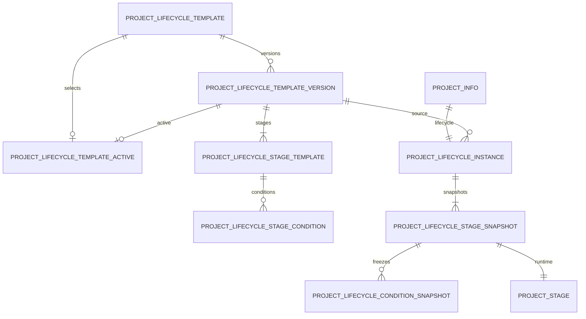
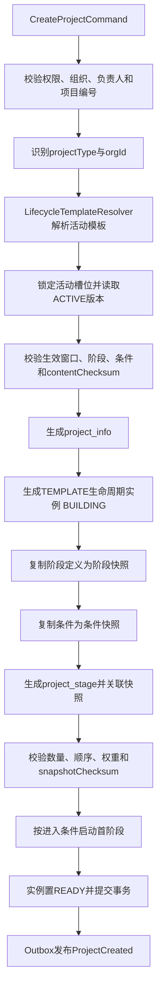

# 生命周期 V2 持久化迁移设计

> 文档版本：V1.0
> 适用阶段：Sprint 2-0.8
> 当前数据库基线：`database/mysql/05_project.sql`
> 当前最高 migration：`V2.0.0`
> 文档性质：可实施设计；本阶段不创建或执行 migration

## 1. 目标与发布边界

### 1.1 目标

本设计将项目生命周期从代码内默认8阶段升级为数据库驱动模型：

```text
模板头
  -> 不可变模板版本
  -> 阶段模板与条件
  -> 项目生命周期实例
  -> 阶段与条件快照
  -> project_stage运行状态
```

核心目标：

1. 新项目只从已启用模板版本创建生命周期；
2. 项目创建时冻结模板、阶段和条件快照；
3. 模板升级不改变历史项目；
4. 既有项目可继续按原行为运行；
5. 无法证明来源的项目明确标记 `LEGACY`；
6. 通过双读验证后分阶段切换，不进行大爆炸替换。

### 1.2 强制边界

- 禁止修改 `05_project.sql`；
- 禁止修改任何已发布 migration；
- 新结构必须放入 `database/mysql/migration` 的更高版本文件；
- 本文只设计建议版本，不占用正式版本号，创建脚本前必须再次检查全局最高版本；
- 不根据阶段名称、顺序或数量给历史项目伪造模板版本；
- 不在应用启动时自动执行生产 DDL；
- 不删除 `project_stage_template` 或 `project_stage`；
- 不在本 Sprint 切换 Project 创建代码。

## 2. 目标数据模型

### 2.1 关系模型



### 2.2 通用字段

除纯关系槽位表外，新增业务表统一包含：

```text
id BIGINT
create_time DATETIME(3)
create_by VARCHAR(64)
update_time DATETIME(3)
update_by VARCHAR(64)
deleted SMALLINT
delete_token BIGINT
remark VARCHAR(500)
version INT
```

在线业务主键由应用雪花算法生成。LEGACY回填复用来源表已有雪花ID作为新表主键，以获得确定性和幂等性，不在SQL中调用厂商专属ID函数。布尔值使用 `SMALLINT`，状态使用 `VARCHAR`，权重使用 `DECIMAL`；不使用数据库 `ENUM`。条件参数使用 `TEXT/CLOB` 并由应用进行 JSON Schema 校验，避免依赖厂商JSON函数。

## 3. 数据库 migration 设计

### 3.1 `project_lifecycle_template`：模板头

稳定标识一个模板，不保存可变阶段内容。

| 字段 | 类型 | 约束/说明 |
|---|---|---|
| `id` | BIGINT | 主键 |
| `template_code` | VARCHAR(64) | 全局稳定编码 |
| `template_name` | VARCHAR(128) | 模板名称 |
| `project_type` | VARCHAR(50) | 项目类型或 `ALL` |
| `org_id` | BIGINT | 可空；空表示平台模板 |
| `description` | VARCHAR(1000) | 可空 |
| `status` | VARCHAR(20) | `ENABLED/DISABLED` |
| 通用字段 | - | 审计、逻辑删除、乐观锁 |

约束和索引：

- `template_code + delete_token` 唯一；
- `project_type + org_id + status + deleted` 组合索引；
- `org_id` 引用 `sys_org`，跨模块物理外键需经双方评审；
- 停用只影响新项目选择，不影响历史实例。

### 3.2 `project_lifecycle_template_version`：模板版本

| 字段 | 类型 | 约束/说明 |
|---|---|---|
| `id` | BIGINT | 主键 |
| `template_id` | BIGINT | 模板头ID |
| `version_no` | INT | 单模板递增业务版本，从1开始 |
| `version_name` | VARCHAR(100) | 例如“2027版” |
| `status` | VARCHAR(20) | `DRAFT/ACTIVE/FROZEN` |
| `effective_from` | DATETIME(3) | 可空 |
| `effective_to` | DATETIME(3) | 可空 |
| `content_checksum` | CHAR(64) | 发布内容SHA-256 |
| `source_version_id` | BIGINT | 可空，复制来源版本 |
| `change_summary` | VARCHAR(1000) | 变更摘要 |
| `published_by/time` | VARCHAR(64)/DATETIME(3) | 启用审计 |
| `frozen_by/time` | VARCHAR(64)/DATETIME(3) | 冻结审计 |
| 通用字段 | - | 标准字段 |

约束：

- `template_id + version_no + delete_token` 唯一；
- `effective_to` 不早于 `effective_from`；
- `ACTIVE/FROZEN` 内容不可原地修改；
- 现有表的 `version` 是乐观锁，不能替代 `version_no`。

### 3.3 `project_lifecycle_template_active`：活动版本槽位

该表用于跨数据库确定性保证每个模板最多一个活动版本，避免依赖“唯一索引允许多个NULL”等厂商差异。

| 字段 | 类型 | 约束/说明 |
|---|---|---|
| `template_id` | BIGINT | 主键，一个模板一个槽位 |
| `template_version_id` | BIGINT | 唯一，必须属于同一模板 |
| `activated_by` | VARCHAR(64) | 启用人 |
| `activated_time` | DATETIME(3) | 启用时间 |
| `version` | INT | 乐观锁 |

活动槽位是“哪个版本可供新项目选择”的权威来源；版本表的 `ACTIVE` 状态用于展示和审计。启用事务必须锁定模板头/槽位并同时冻结旧版本。

### 3.4 `project_lifecycle_stage_template`：阶段模板

| 字段 | 类型 | 约束/说明 |
|---|---|---|
| `id` | BIGINT | 主键 |
| `template_version_id` | BIGINT | 所属模板版本 |
| `stage_code` | VARCHAR(50) | 版本内唯一 |
| `stage_name` | VARCHAR(100) | 非空 |
| `stage_order` | INT | 从1连续递增 |
| `required_flag` | SMALLINT | 0/1 |
| `allow_skip` | SMALLINT | 0/1 |
| `progress_weight` | DECIMAL(7,4) | 版本内合计100.0000 |
| `planned_duration_days` | INT | 可空、非负 |
| `auto_start` | SMALLINT | 0/1 |
| `approval_required` | SMALLINT | 0/1 |
| `approval_scene_code` | VARCHAR(64) | 审批必需时非空 |
| `completion_mode` | VARCHAR(20) | `MANUAL/AUTO/HYBRID` |
| `description` | VARCHAR(1000) | 可空 |
| 通用字段 | - | 标准字段 |

唯一约束：

- `template_version_id + stage_code + delete_token`；
- `template_version_id + stage_order + delete_token`。

权重合计、顺序连续和审批场景有效性由发布服务在同一事务内校验，数据库约束负责单行值域。

### 3.5 `project_lifecycle_stage_condition`：阶段条件

| 字段 | 类型 | 约束/说明 |
|---|---|---|
| `id` | BIGINT | 主键 |
| `stage_template_id` | BIGINT | 阶段模板ID |
| `condition_type` | VARCHAR(20) | `ENTRY/COMPLETION/CLOSE` |
| `group_no` | INT | 条件组 |
| `group_operator` | VARCHAR(8) | `AND/OR` |
| `condition_code` | VARCHAR(64) | 白名单条件编码 |
| `parameter_schema_version` | INT | 参数Schema版本 |
| `parameters_text` | TEXT/CLOB | 经Schema验证的参数 |
| `required_flag` | SMALLINT | 0/1 |
| `failure_policy` | VARCHAR(10) | `BLOCK/WARN` |
| `sort_no` | INT | 组内顺序 |
| `failure_message` | VARCHAR(500) | 安全业务提示 |
| 通用字段 | - | 标准字段 |

索引：`stage_template_id + condition_type + group_no + sort_no + deleted`。

禁止保存 SQL、SpEL、OGNL、JavaScript、Java类名或任意脚本。

### 3.6 `project_lifecycle_instance`：项目生命周期实例

| 字段 | 类型 | 约束/说明 |
|---|---|---|
| `id` | BIGINT | 主键 |
| `project_id` | BIGINT | 非空且唯一 |
| `source_type` | VARCHAR(20) | `TEMPLATE/LEGACY` |
| `template_id` | BIGINT | LEGACY必须为空 |
| `template_version_id` | BIGINT | LEGACY必须为空 |
| `template_code_snapshot` | VARCHAR(64) | 模板实例必填 |
| `template_name_snapshot` | VARCHAR(128) | 模板实例必填 |
| `version_no_snapshot` | INT | 模板实例必填 |
| `version_name_snapshot` | VARCHAR(100) | 可空 |
| `template_checksum` | CHAR(64) | 模板实例必填 |
| `snapshot_checksum` | CHAR(64) | 快照完整后必填 |
| `progress_policy_snapshot` | VARCHAR(32) | `WEIGHTED/LEGACY_EQUAL` |
| `snapshot_status` | VARCHAR(20) | `BUILDING/READY/INVALID` |
| `status` | VARCHAR(20) | `ACTIVE/COMPLETED/CANCELLED/CLOSED` |
| `initialized_by/time` | VARCHAR(64)/DATETIME(3) | 初始化审计 |
| 通用字段 | - | 标准字段 |

条件约束：

```text
source_type=TEMPLATE -> template_id、template_version_id、版本和校验值均非空
source_type=LEGACY   -> template_id、template_version_id、版本快照均为空
```

`LEGACY` 是来源分类，不是虚构模板编码。

### 3.7 `project_lifecycle_stage_snapshot`：阶段快照

该表保存不可变阶段定义；现有 `project_stage` 继续保存运行状态。

| 字段 | 类型 | 约束/说明 |
|---|---|---|
| `id` | BIGINT | 主键 |
| `lifecycle_instance_id` | BIGINT | 实例ID |
| `project_id` | BIGINT | 冗余业务键，用于权限和审计 |
| `source_stage_template_id` | BIGINT | LEGACY为空 |
| `stage_code/name/order` | VARCHAR/VARCHAR/INT | 创建时快照 |
| `progress_weight` | DECIMAL(7,4) | LEGACY无法确认时可空 |
| `weight_source` | VARCHAR(20) | `TEMPLATE/UNCONFIRMED` |
| `required_flag` | SMALLINT | LEGACY无法确认时可空 |
| `allow_skip` | SMALLINT | LEGACY无法确认时可空 |
| `approval_required` | SMALLINT | LEGACY无法确认时可空 |
| `approval_scene_code` | VARCHAR(64) | 可空 |
| `completion_mode` | VARCHAR(20) | LEGACY无法确认时可空 |
| `planned_duration_days` | INT | 可空 |
| `condition_snapshot_status` | VARCHAR(20) | `READY/NONE/UNAVAILABLE` |
| `definition_checksum` | CHAR(64) | 快照定义校验值 |
| 通用字段 | - | 标准字段 |

唯一约束：

- `lifecycle_instance_id + stage_code + delete_token`；
- `lifecycle_instance_id + stage_order + delete_token`。

历史回填时不得把等分权重写成已确认模板权重。旧系统的等权算法记录在实例 `progress_policy_snapshot=LEGACY_EQUAL`，阶段权重保持空并标识 `UNCONFIRMED`。

### 3.8 `project_lifecycle_condition_snapshot`：条件快照

字段复制模板条件核心内容，并增加：

```text
project_id
lifecycle_instance_id
stage_snapshot_id
source_condition_id
```

运行时只读快照，不回查活动模板条件。历史项目没有可证明的条件来源，因此不补造条件行，对应阶段标记 `condition_snapshot_status=UNAVAILABLE`。

### 3.9 扩展现有 `project_stage`

通过独立 migration 增加两个可空字段：

| 字段 | 类型 | 说明 |
|---|---|---|
| `lifecycle_instance_id` | BIGINT | 所属生命周期实例 |
| `stage_snapshot_id` | BIGINT | 一对一阶段快照 |

新增索引：

- `lifecycle_instance_id + deleted + stage_order`；
- `stage_snapshot_id` 唯一（保留逻辑删除语义时含 `delete_token`）。

第一阶段必须可空，以支持在线扩展和分批回填；完成回填和异常清零后再评审是否收紧。禁止修改历史 `05_project.sql` 的定义。

## 4. 建议 migration 序列

正式创建文件前应重新扫描全局版本号。以当前最高 `V2.0.0` 为前提，建议：

| 建议版本 | 文件名 | 单一目标 |
|---|---|---|
| `V2.1.0` | `V2.1.0__create_project_lifecycle_v2_structure.sql` | 新增模板、版本、阶段、条件、实例和快照表 |
| `V2.1.1` | `V2.1.1__link_project_stage_lifecycle_snapshot.sql` | 为 `project_stage` 增加可空关联和索引 |
| `V2.1.2` | `V2.1.2__backfill_legacy_project_lifecycle.sql` | 分批登记LEGACY实例和阶段快照 |
| `V2.1.3` | `V2.1.3__seed_project_lifecycle_templates.sql` | 新增经业务审批的标准模板V1，不绑定历史项目 |
| `V2.1.4` | `V2.1.4__enforce_project_lifecycle_integrity.sql` | 异常清零后增加可实施约束 |
| `V2.1.5` | `V2.1.5__add_lifecycle_read_diff_audit.sql` | 可选：新增双读差异审计表 |

拆分原因：结构扩展、数据回填、业务种子、约束收紧和可观测性可以独立验收与回滚，不形成不可逆大脚本。

建议回滚矩阵：

| 版本 | 应用切换前回滚 | 已产生数据后的处理 |
|---|---|---|
| V2.1.0 | 无引用时由DBA运行独立回滚脚本删除新表 | 保留结构，使用更高版本前向修复 |
| V2.1.1 | 旧应用忽略可空列，通常无需删除 | 禁止删除已有快照关联列 |
| V2.1.2 | 停止任务，旧读继续；可保留LEGACY审计数据 | 不删除，修复异常后续跑 |
| V2.1.3 | 冻结/停用错误模板，不绑定项目 | 已被引用版本禁止删除或改写 |
| V2.1.4 | 仅在未产生新引用且审批通过时撤销约束 | 优先更高版本修正数据和约束 |
| V2.1.5 | 关闭差异落库，日志/指标继续 | 按审计保留期管理，不随意清空 |

回滚SQL不得与升级migration混放或自动执行，应由DBA在明确截止点和备份基础上受控运行。

### 4.1 前置检查

执行 `V2.1.0` 前必须确认：

- `project_info`、`project_stage` 与 `project_stage_template` 符合05基线；
- 不存在同名V2表或半执行对象；
- 当前migration版本和校验和正确；
- 项目与阶段无孤儿记录；
- 同项目阶段编码和顺序无重复；
- `project_stage.project_id` 均指向有效项目；
- 备份完成且恢复演练通过；
- 评估 `project_stage` 规模、索引DDL锁和复制延迟。

任何前置条件不满足必须快速失败，禁止跳过异常继续回填。

### 4.2 约束实施顺序

1. 新表先建立主键和基础查询索引；
2. 回填字段和现有表关联先允许为空；
3. 分批回填并核对数量；
4. 增加外键、唯一键或条件检查前执行异常SQL；
5. 异常必须为零或有经批准的隔离清单；
6. 最后收紧约束并生成Schema指纹。

### 4.3 国产数据库适配

- 达梦、人大金仓使用相同逻辑版本号和表语义；
- `TEXT` 对应各数据库可索引策略之外的CLOB类型，不对参数全文建索引；
- CHECK、在线索引、毫秒时间类型按适配脚本实现；
- 活动槽位采用普通主键表，不依赖MySQL部分唯一索引；
- 主键统一应用生成，不依赖 `AUTO_INCREMENT/IDENTITY`；
- SQL不得依赖MySQL JSON函数、`ENUM` 或存储过程脚本引擎。

## 5. 已有项目回填方案

### 5.1 回填原则

1. 一项目生成一个 `LEGACY` 生命周期实例；
2. 一条有效 `project_stage` 生成一条阶段快照；
3. 模板ID、模板版本ID、模板阶段ID全部为空；
4. 不因“8个阶段看起来相同”而绑定标准模板；
5. 不推断审批条件、进入条件或完成条件；
6. 回填不改变 `project_stage` 的状态、日期、负责人和完成度；
7. 回填不重算 `project_info.progress/current_stage_code/status`；
8. 回填可分批、可重入、可核对，并记录批次。

### 5.2 LEGACY实例映射

```text
project_lifecycle_instance.id                 = project_info.id（确定性回填ID）
project_lifecycle_instance.project_id         = project_info.id
project_lifecycle_instance.source_type        = LEGACY
template_id/template_version_id               = NULL
template_code/name/version快照                = NULL
template_checksum                             = NULL
progress_policy_snapshot                      = LEGACY_EQUAL
snapshot_status                               = BUILDING -> READY
status                                        = 按项目当前终态映射
initialized_by                                = MIGRATION_V2_1_2
```

项目状态映射只能映射实例运行状态，不反向修改项目：

| Project状态 | 实例状态 |
|---|---|
| `COMPLETED` | `COMPLETED` |
| `CANCELLED` | `CANCELLED` |
| 其他 | `ACTIVE` |

### 5.3 阶段快照映射

从 `project_stage` 复制，并令 `project_lifecycle_stage_snapshot.id = project_stage.id`：

```text
project_id
stage_code
stage_name
stage_order
```

其他策略字段：

```text
source_stage_template_id      = NULL
progress_weight               = NULL
weight_source                 = UNCONFIRMED
required_flag                 = NULL
allow_skip                    = NULL
approval_required             = NULL
approval_scene_code           = NULL
completion_mode               = NULL
condition_snapshot_status     = UNAVAILABLE
```

然后把生成的 `lifecycle_instance_id`、`stage_snapshot_id` 回写到对应 `project_stage`。运行数据本身保持原样。

### 5.4 分批与幂等

建议按 `project_info.id` 升序游标分批，不使用大偏移分页：

```text
WHERE project_info.id > :lastId
ORDER BY project_info.id
LIMIT :batchSize
```

幂等键：

- 实例：主键和 `project_id` 均使用来源 `project_info.id`，且 `project_id` 唯一；
- 快照：主键复用来源 `project_stage.id`，并保持 `lifecycle_instance_id + stage_code + delete_token` 唯一；
- 关联：只更新 `project_stage.stage_snapshot_id IS NULL` 的记录；
- 重跑前核对已有实例 `source_type=LEGACY`，不得生成第二实例。

建议初始批次500个项目，依据锁等待、复制延迟和事务日志动态调整。每批提交后记录起止ID、项目数、阶段数、成功数、异常数和校验值，不记录敏感业务内容。

### 5.5 异常处理

以下项目不得静默回填为READY：

- 没有任何有效阶段；
- 阶段编码或名称为空；
- 同项目阶段编码/顺序重复；
- 阶段项目引用不存在；
- 当前阶段编码不在本项目阶段中；
- 阶段日期、完成度或状态值非法；
- 已存在非LEGACY实例或部分关联。

异常项目实例标记 `INVALID` 或暂不创建，写入受控异常清单，业务修复经审批后重跑。不得删除异常项目或伪造默认阶段。

### 5.6 回填验收SQL口径

```text
有效项目数
= LEGACY实例数 + TEMPLATE实例数

已回填LEGACY项目的有效project_stage数
= 对应阶段快照数

LEGACY实例模板ID非空数
= 0

LEGACY阶段source_stage_template_id非空数
= 0

READY实例未关联阶段数
= 0
```

还需核对项目状态、当前阶段、进度、阶段状态、负责人和日期在回填前后完全一致。

## 6. 新项目创建流程

### 6.1 主流程



项目、实例、快照、运行阶段和经理成员必须在同一数据库事务中完成。任一步失败整体回滚。

### 6.2 模板选择规则

优先级建议：

1. 调用方显式指定且有权使用的模板；
2. 当前组织 + 精确项目类型的活动模板；
3. 平台级 + 精确项目类型的活动模板；
4. 当前组织 + `ALL` 活动模板；
5. 平台级 + `ALL` 活动模板。

同一优先级出现多个候选必须报配置错误，禁止随机选择。没有活动模板时V2创建失败并给出安全业务提示，不在V2路径回退代码硬编码阶段。

### 6.3 一致性与并发

- 读取 `project_lifecycle_template_active` 并校验版本仍为 `ACTIVE`；
- 模板启用/冻结与创建竞争时，通过槽位行锁或乐观锁得到唯一版本；
- 复制前后验证 `content_checksum`；
- 项目编号依靠数据库唯一约束处理并发重复；
- 创建命令使用幂等键，重试不能生成第二项目或第二实例；
- 快照完成前实例为 `BUILDING`，不可被正常查询当作READY；
- 事务提交后再发布事件，使用Outbox避免消息丢失。

### 6.4 灰度切换

建议功能开关：

```text
project.lifecycle.create-mode = LEGACY | V2_CANARY | V2
```

- `LEGACY`：当前代码路径，仅用于回滚窗口；
- `V2_CANARY`：仅指定组织/用户使用V2；未命中仍走旧路径；
- `V2`：所有新项目必须使用活动模板，没有模板即失败。

同一个创建请求只允许一条写路径，禁止LEGACY与V2双写两套阶段。V2创建本身同时写快照与现有 `project_stage`，这是一个聚合事务，不是双写业务事实。

## 7. 兼容与双读验证

### 7.1 读模型定义

旧读模型：

```text
project_info + project_stage
```

V2读模型：

```text
project_info
 + project_lifecycle_instance
 + project_lifecycle_stage_snapshot
 + project_stage
 + project_lifecycle_condition_snapshot
```

V2运行状态仍以 `project_stage` 为事实，快照提供定义来源和规则解释。

### 7.2 对比字段

每次抽样计算规范化结果：

- 项目ID、状态、当前阶段、进度；
- 阶段数量、编码、名称、顺序；
- 阶段状态、计划/实际日期、负责人；
- 审批状态、完成度；
- 实例来源类型；
- `project_stage` 与阶段快照的一对一关联；
- TEMPLATE实例的权重合计、模板校验值、快照校验值；
- LEGACY实例的模板引用必须全部为空。

日期、Decimal和空字符串必须规范化后比较，避免格式差异产生假阳性。

### 7.3 双读模式

| 模式 | 主返回 | 影子读取 | 差异处理 |
|---|---|---|---|
| `OFF` | 旧读 | 无 | 迁移前 |
| `LEGACY_PRIMARY` | 旧读 | V2 | 记录差异，不影响响应 |
| `V2_PRIMARY` | V2；LEGACY项目按兼容规则 | 旧读 | 差异时告警并可降级旧读 |
| `V2_ONLY` | V2 | 无/低比例审计 | 观察期结束后 |

双读只比较，不重复执行业务写入。影子读取失败不能泄露给无权用户，必须在 `ProjectAccessPolicy` 和 `@DataScope` 通过后执行。

### 7.4 差异输出

差异对象建议：

```json
{
  "projectId": 10001,
  "instanceSource": "LEGACY",
  "oldChecksum": "...",
  "newChecksum": "...",
  "differenceTypes": ["STAGE_ORDER", "CURRENT_STAGE"],
  "traceId": "...",
  "detectedTime": "..."
}
```

禁止记录完整条件参数、审批意见、Token或人员敏感信息。

输出渠道：

1. 结构化安全日志；
2. 指标：总比较数、差异数、按类型计数、读取耗时；
3. 可选 `project_lifecycle_read_diff` 审计表，仅保存校验值和脱敏差异摘要；
4. 定时差异报告供DBA和项目模块负责人签字验收。

### 7.5 切换门槛

从 `LEGACY_PRIMARY` 切到 `V2_PRIMARY` 前必须满足：

- 回填覆盖率100%，异常项目有批准处置；
- 连续观察期核心字段差异为0；
- V2 P95读取耗时不劣化超过批准阈值；
- 跨组织、SELF、CUSTOM数据权限测试通过；
- 新项目快照完整率100%；
- 降级开关和回滚演练通过。

切到 `V2_ONLY` 前还需确认无应用、报表或脚本绕过新查询入口直接解释旧模板。

## 8. 回滚与恢复

### 8.1 应用切换前

如果仅执行结构扩展且尚无V2新项目：

- 停止回填任务；
- 应用保持旧读写；
- 新表可保留等待前向修复；
- 只有确认无引用且经DBA批准时才执行独立回滚脚本删除新结构。

### 8.2 已回填历史项目后

- 回滚应用读取模式到 `OFF/LEGACY_PRIMARY`；
- 不清除LEGACY实例和快照，避免丢失迁移审计；
- 保留 `project_stage` 新关联列，旧应用会忽略；
- 通过更高版本migration前向修复，不重写 `V2.1.x`。

### 8.3 已创建V2项目后

禁止直接删除V2表或把TEMPLATE实例伪装为LEGACY。回滚只能：

1. 停止新的V2创建；
2. 保持新表和快照数据；
3. 旧查询从现有 `project_stage` 提供兼容展示；
4. 修复后恢复V2读取；
5. 若需实例迁移，必须走专项审批和审计流程。

全量备份、binlog归档和恢复演练是生产执行前置条件。

## 9. 测试方案

### 9.1 空数据库 migration 测试

环境：全新MySQL 8实例。

步骤：

1. 执行唯一初始化入口；
2. 执行截至 `V2.0.0` 的正式链路；
3. 依次执行V2.1.x migration；
4. 使用 `information_schema` 核对表、列、索引、唯一键、外键和CHECK；
5. 创建模板、草稿版本、阶段和条件；
6. 启用版本并校验活动槽位唯一；
7. 执行Spring Boot启动和Entity映射检查。

验收：无重复对象、无SQL警告被忽略、Schema指纹与权威快照一致。

### 9.2 已有项目兼容测试

准备数据：

- 正常8阶段项目；
- 非8阶段项目；
- 已完成、进行中、取消项目；
- 有任务和成员的项目；
- SELF、ORG、ORG_AND_CHILDREN、CUSTOM范围用户；
- 人工构造的重复阶段、无阶段和孤儿异常副本。

验证：

1. 正常项目生成一个LEGACY实例；
2. 阶段快照数量与原阶段数量一致；
3. 模板和版本引用全部为空；
4. 项目/阶段运行字段前后不变；
5. 异常项目被阻断或列入异常清单；
6. 重跑不产生重复实例和快照；
7. 旧接口响应与回填前一致；
8. 数据权限和 `ProjectAccessPolicy` 结果一致；
9. 双读差异报告核心字段为0。

### 9.3 新项目创建测试

| 场景 | 预期 |
|---|---|
| 精确类型存在ACTIVE模板 | 绑定确切版本并生成快照 |
| 组织级模板覆盖平台模板 | 按优先级选中组织模板 |
| 无模板 | 创建失败且事务无残留 |
| 多个同优先级候选 | 配置错误，禁止随机选择 |
| 模板在创建期间冻结 | 锁/版本校验保证只使用一个有效版本或失败 |
| 阶段权重不为100 | 发布或创建被阻断 |
| 条件编码未注册 | 发布或创建被阻断 |
| 项目编号并发重复 | 仅一个事务成功 |
| 任一阶段/快照插入失败 | 项目、实例、快照、阶段、成员全部回滚 |
| 模板发布新版本 | 旧项目快照不变化，新项目使用新版本 |
| 审批条件存在 | 只复制场景和条件，不伪造审批通过 |

还需断言：实例为 `TEMPLATE`、模板来源ID非空、快照校验值一致、`project_stage` 与快照一对一、首阶段启动符合进入条件。

### 9.4 双读验证测试

- 相同结果无差异记录；
- 阶段缺失、顺序、状态、日期、负责人和进度差异可被逐类识别；
- Decimal和日期格式规范化不产生假差异；
- 影子读取异常不改变主响应；
- 未授权用户不会触发跨组织影子读取；
- 差异日志不包含敏感信息；
- 采样率、熔断和超时配置生效；
- `V2_PRIMARY` 差异时可以按策略降级旧读。

### 9.5 性能与运维测试

- 回填批次对锁等待、redo/binlog、复制延迟和磁盘增长的影响；
- 新旧详情查询执行计划与P50/P95/P99；
- 模板选择关键索引命中；
- 10万级项目和百万级阶段快照容量估算；
- 回填暂停、续跑、失败重试和断点恢复；
- 全量备份恢复和时间点恢复演练；
- MySQL、达梦、人大金仓Schema和行为一致性。

### 9.6 CI发布阻断项

以下任一情况阻断发布：

- `05_project.sql` 或历史migration校验和变化；
- 空库、升级库和legacy迁移后的最终Schema不一致；
- LEGACY项目存在非空模板版本引用；
- READY实例存在缺失或重复阶段快照；
- TEMPLATE实例权重不为100或快照校验失败；
- 双读核心字段存在未批准差异；
- 数据权限、安全、事务回滚或幂等测试失败；
- 未完成真实MySQL 8和国产数据库兼容评估；
- 缺少备份、回滚和恢复演练证据。

## 10. 分阶段实施路线

### 阶段A：结构扩展

- 评审并创建V2.1.0、V2.1.1；
- 新表和关联列上线，应用仍使用旧链路；
- 完成Schema与性能验收。

### 阶段B：LEGACY回填

- 执行V2.1.2分批回填；
- 异常项目单独治理；
- 开启 `LEGACY_PRIMARY` 双读。

### 阶段C：模板运营

- 执行经审批的模板种子migration；
- 上线模板草稿、校验、启用和冻结能力；
- 不绑定历史项目。

### 阶段D：新项目V2创建

- Repository支持模板解析、实例和快照持久化；
- 先 `V2_CANARY`，再全量 `V2`；
- 删除Application层默认8阶段硬编码需单独代码Sprint完成。

### 阶段E：读路径切换

- 双读差异清零后切 `V2_PRIMARY`；
- 观察期结束后切 `V2_ONLY`；
- 旧表保持历史兼容，不在本阶段删除。

## 11. 主要风险与决策项

1. 模板组织级覆盖规则需要产品和数据权限负责人确认；
2. 历史项目缺少条件、权重和模板来源，只能以LEGACY兼容运行；
3. 大规模 `project_stage` 新增索引可能产生DDL锁和复制延迟；
4. 回填后的新关联列是否最终NOT NULL需根据LEGACY异常治理结果决定；
5. 模板种子属于业务规则发布，必须由业务负责人审批，不能由开发自行认定；
6. 双读会增加数据库负载，必须采样、超时和熔断；
7. 新旧查询使用同一 `project_stage` 运行事实，快照损坏仍需专门校验和告警；
8. V2新项目出现后，数据库结构回滚不再安全，只能应用降级和前向修复；
9. 条件参数Schema升级必须向后兼容，破坏性变化使用新条件编码；
10. 当前Sprint 2-0.7的默认8阶段代码必须在V2创建灰度完成后才可移除。

## 12. 结论

生命周期V2采用“扩展—回填—双读—灰度—收口”路径：

- 新结构通过高于 `V2.0.0` 的分版本migration增加；
- 历史项目只登记LEGACY来源，不推断模板或权重；
- 新项目从活动模板复制不可变阶段及条件快照；
- 运行状态继续由 `project_stage` 承载，保证现有接口兼容；
- 双读差异清零后才允许切换主读；
- 任何时点都不修改 `05_project.sql`，不静默改变历史项目行为。

下一步应先由数据库、Project、权限、安全和国产化适配负责人评审本文，再创建正式migration文件和空库/存量库自动化测试。
