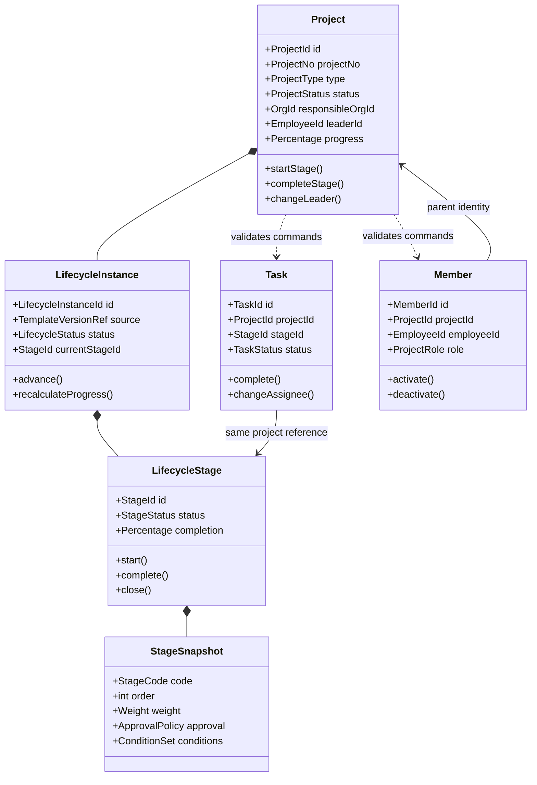

# 通用 Project 聚合重构设计

> 文档版本：V1.0
> 适用阶段：Sprint 2-0.5
> 前置设计：`project-domain-design.md`、`lifecycle-template-model-v2.md`
> 文档性质：架构设计；本阶段不修改业务代码和数据库

## 1. 设计背景与目标

### 1.1 当前结构

当前 Project 模块按 Controller、Service、Mapper、Entity 组织，核心能力集中在 `ProjectLifecycleServiceImpl`：

- 项目、阶段、任务、成员以 CRUD 服务为主；
- 持久化实体同时承担业务数据载体；
- 生命周期状态、阶段生成和进度反算由过程式服务控制；
- `ProjectTaskCommandService`、`ProjectMemberCommandService` 已初步拆出命令职责；
- `ProjectAccessPolicy` 已形成项目及子资源访问入口；
- 领域规则、用例编排和持久化细节仍未形成清晰边界。

这套结构可以支撑基础管理，但在接入生命周期模板、投资项目、中标项目、审批和财务事实后，容易形成超大 Service、跨表直接更新和规则分散。

### 1.2 重构目标

1. 以 `Project` 作为统一业务入口，集中维护项目级不变量；
2. 将领域规则、应用编排、持久化和外部集成分层；
3. 生命周期实例及阶段快照不再作为普通 CRUD 数据；
4. 任务、成员受项目边界保护，同时避免一次加载无界集合；
5. 投资和中标交付通过扩展契约挂载，不污染通用 Project 核心；
6. 风险、成本、收入、利润和投资收益保持事实所有权清晰；
7. 保留现有接口和数据库的渐进迁移路径。

### 1.3 设计原则

- 聚合通过行为维护一致性，不公开任意 Setter；
- Controller 只处理协议、鉴权声明和参数转换；
- 应用层负责用例、事务、权限和跨聚合编排；
- 领域层不依赖 Spring、MyBatis Plus、HTTP、Redis 或数据库实体；
- 基础设施层实现仓储和外部系统端口；
- 写模型必须经过聚合或受控子聚合，查询模型可针对页面优化；
- 跨域只通过ID、应用端口、可信事实和领域事件协作；
- 所有项目及子资源访问必须经过 `ProjectAccessPolicy`，查询同时强制应用数据权限。

## 2. Project 聚合边界

### 2.1 业务边界与事务边界

“Project 聚合”需要区分两种边界：

| 边界 | 范围 | 目的 |
|---|---|---|
| Project 业务边界 | 基础信息、生命周期、阶段、任务、成员及项目级摘要 | 对外提供统一项目语义和访问入口 |
| 强一致事务聚合 | Project 根、LifecycleInstance、阶段运行状态与快照 | 保证状态、当前阶段、进度和生命周期一致 |
| 受控子聚合 | Task、Member | 避免无界集合导致大事务和并发冲突 |

任务和成员属于 Project 业务边界，但不要求每次修改项目时全量加载。它们以 `projectId` 为父级身份，在应用服务完成项目访问校验后，通过自己的聚合行为修改。任何 Task 或 Member 命令均不能绕过 Project 存在性、状态和访问策略。

### 2.2 聚合根 `Project` 职责

`Project` 负责：

1. 维护 `ProjectId`、项目编号、名称、类型和来源等身份；
2. 维护责任组织、项目负责人、计划周期及项目状态；
3. 创建并持有唯一的 `LifecycleInstance`；
4. 控制当前阶段、项目进度、开始、暂停、恢复、完成、取消和关闭；
5. 校验阶段流转是否符合实例快照、任务门禁、审批和外部事实；
6. 为任务和成员命令提供项目状态约束；
7. 保证负责人具有有效的项目经理成员身份；
8. 维护预算、风险等级、收入和利润等项目摘要投影，但不拥有专业台账；
9. 记录领域事件，如项目创建、负责人变更、阶段完成和项目关闭；
10. 禁止客户端直接覆盖状态、当前阶段、进度和实际完成日期。

建议聚合行为：

```text
Project.create(command, lifecycleSnapshot)
Project.changeBasicInfo(name, planPeriod, description)
Project.changeLeader(employeeId, memberCapability)
Project.startStage(stageId, conditionFacts)
Project.completeStage(stageId, conditionFacts, approvalEvidence)
Project.closeStage(stageId, closeReason)
Project.suspend(reason)
Project.resume()
Project.cancel(reason, approvalEvidence)
Project.refreshFinancialSummary(financialFact)
Project.refreshRiskSummary(riskFact)
```

### 2.3 聚合内数据

Project 强一致事务内包含：

- 项目基础信息和审计版本；
- 唯一 `LifecycleInstance`；
- 生命周期内有限、有序的阶段集合；
- 每个阶段的不可变 `StageSnapshot`；
- 当前阶段、项目状态和加权进度；
- 本次命令所需的 Task/Member 摘要事实，而非所有明细。

Task 和 Member 的完整集合通过独立仓储按命令加载。Project 根只接收经过验证的领域事实，例如：

```text
RequiredTaskSummary(total=8, completed=8, blocked=0)
ProjectManagerMembership(employeeId=1001, active=true)
```

### 2.4 不属于 Project 核心的能力

| 能力 | 事实所有者 | Project 使用方式 |
|---|---|---|
| 投资计划、投资决策、出资、股权、投后监管、退出 | Investment 域 | ID关联、事实查询、领域事件 |
| 商机、投标、客户主数据、经营合同 | Operation/CRM 域 | 关联ID和合同签署事实 |
| 会计凭证、应收、回款、成本明细 | Finance/Operation 域 | 只读财务事实和摘要投影 |
| 企业级风险库、预警规则、整改 | Risk 域 | 风险门禁和风险摘要 |
| 三重一大事项及会议决议 | 治理/审批域 | 受信决策事实 |
| 流程定义、审批实例和审批意见 | Workflow 域 | `ApprovalGateway` |
| 文件二进制、版本和病毒扫描 | File 域 | 文件ID和必备资料事实 |
| 用户、员工、组织主数据 | System/HR 域 | ID引用和有效性校验 |
| BI指标、驾驶舱宽表 | BI 域 | 消费领域事件构建读模型 |

Project 不直接写上述领域的表，也不在聚合内复制其完整业务模型。

### 2.5 核心不变量

1. 有效项目编号唯一，创建后不可通过普通编辑修改；
2. 项目类型在扩展实例创建后不可直接改变；
3. 责任组织和负责人必须有效且调用人具有相应数据权限；
4. 每个项目恰有一个主生命周期实例；
5. 生命周期模板版本与快照创建后不能被模板升级覆盖；
6. 当前阶段必须属于本项目且与阶段状态一致；
7. 阶段必须按快照规则流转，不满足任务、条件或审批门禁不得完成；
8. 项目进度由阶段快照权重和阶段完成度反算；
9. 最后必需阶段未关闭时项目不得完成；
10. 项目负责人必须拥有唯一有效的项目经理成员关系；
11. Task 不得引用其他项目的阶段或父任务；
12. Member 不得重复占用同一受唯一约束的项目角色；
13. 已完成、取消或关闭项目禁止普通结构变更；
14. 所有子资源命令先验证 Project 可访问、可变更；
15. 聚合更新必须进行乐观锁并发检查。

## 3. 领域对象

### 3.1 对象关系



### 3.2 `Project`

类型：聚合根。

主要属性：

```text
ProjectId, ProjectNo, ProjectName, ProjectType, ProjectMode, ProjectSource
OrgId, EmployeeId, DateRange, ProjectStatus
LifecycleInstance, ProjectFinancialSummary, RiskSummary
AuditMetadata, AggregateVersion
```

`Project` 不返回可修改的阶段集合。外部只能调用语义化命令；状态和进度在行为完成后由聚合内部重算。

### 3.3 `LifecycleInstance`

类型：Project 聚合内实体。

职责：

- 保存模板头、模板版本和校验值来源快照；
- 管理有限、有序的 `LifecycleStage`；
- 定位当前阶段并执行状态机；
- 根据阶段快照计算进度；
- 在最终阶段关闭时形成项目完成事实；
- 保证模板变化不影响实例。

生命周期实例由 `ProjectLifecycleFactory` 创建，普通更新流程不能替换。确需迁移模板时使用独立、高权限、可审计的实例迁移用例。

### 3.4 `StageSnapshot` 与 `LifecycleStage`

`StageSnapshot` 是不可变值对象，保存：

```text
stageCode, stageName, stageOrder
progressWeight, requiredFlag, allowSkip
approvalPolicy, completionMode, plannedDuration
entryConditions, completionConditions, closeConditions
sourceTemplateStageId, schemaVersion
```

`LifecycleStage` 是可变实体，保存阶段运行状态、计划/实际日期、负责人、完成度和审批引用。二者必须分离：模板规则是创建时快照，运行状态随业务命令变化。

### 3.5 `Task`

类型：Project 业务边界内的受控子聚合根。

职责：

- 维护任务名称、内容、阶段、父任务、负责人和计划周期；
- 保证阶段与父任务属于同一 Project；
- 防止任务层级循环；
- 控制开始、完成、取消和重开；
- 输出阶段门禁需要的任务完成事实。

Task 不得修改 Project 状态。任务变化后发布 `ProjectTaskChanged`，由应用服务同步刷新阶段条件或项目进度；关键阶段完成命令仍在同一用例中读取最新任务摘要并校验。

### 3.6 `Member`

类型：Project 业务边界内的受控子聚合根。

职责：

- 管理员工在项目中的角色、有效期和状态；
- 避免重复成员关系；
- 维护项目经理等唯一角色约束；
- 为任务指派和项目访问提供成员事实；
- 负责人变更时与 Project 根保持一致。

删除负责人对应成员前必须先变更负责人，或由一个应用事务同时完成负责人和成员调整。

### 3.7 值对象

建议值对象：

| 值对象 | 规则 |
|---|---|
| `ProjectId/StageId/TaskId/MemberId` | 强类型ID，避免跨资源误传 |
| `ProjectNo` | 长度和格式校验，创建后不可变 |
| `ProjectType` | 受控编码，不在领域对象中散落字符串 |
| `ProjectStatus/StageStatus/TaskStatus` | 封装允许的状态迁移 |
| `DateRange` | 开始日期不晚于结束日期 |
| `Money` | 币种和精度明确，不使用浮点数 |
| `Percentage/StageWeight` | 取值范围及精度受控 |
| `TemplateVersionRef` | 模板头ID、版本ID、版本号和校验值 |
| `ConditionSet` | 只包含白名单条件定义快照 |
| `ApprovalEvidence` | 来源、流程实例、结果、时间和验签信息 |
| `AuditMetadata` | 创建/修改审计信息 |

### 3.8 领域事件

```text
ProjectCreated
ProjectBasicInfoChanged
ProjectLeaderChanged
ProjectStageStarted
ProjectStageCompleted
ProjectStageClosed
ProjectSuspended
ProjectResumed
ProjectCompleted
ProjectCancelled
ProjectTaskChanged
ProjectMemberChanged
ProjectRiskSummaryChanged
ProjectFinancialSummaryChanged
```

事件在聚合事务成功后通过 Outbox 发布。事件只包含业务键和必要快照，不包含密码、Token、完整审批意见或敏感个人信息。

## 4. 领域分层设计

### 4.1 目标目录

以下为后续重构目标，不在本 Sprint 创建目录：

```text
modules/project
├── interfaces
│   └── rest
│       ├── ProjectController
│       ├── ProjectStageController
│       ├── ProjectTaskController
│       ├── ProjectMemberController
│       ├── request
│       └── response
├── application
│   ├── command
│   │   ├── project
│   │   ├── lifecycle
│   │   ├── task
│   │   └── member
│   ├── query
│   ├── service
│   ├── assembler
│   ├── dto
│   └── port
│       ├── ApprovalPort
│       ├── OrganizationPort
│       ├── EmployeePort
│       ├── FinancialFactPort
│       ├── RiskFactPort
│       └── ProjectExtensionPort
├── domain
│   ├── model
│   │   ├── project
│   │   ├── lifecycle
│   │   ├── task
│   │   └── member
│   ├── repository
│   ├── service
│   ├── policy
│   ├── event
│   └── exception
└── infrastructure
    ├── persistence
    │   ├── entity
    │   ├── mapper
    │   ├── repository
    │   └── converter
    ├── integration
    │   ├── approval
    │   ├── investment
    │   ├── operation
    │   ├── finance
    │   └── risk
    ├── event
    ├── cache
    └── config
```

如果项目坚持只使用 `domain/application/infrastructure` 三层，可将 `interfaces/rest` 保留在现有 `controller` 包；但 Controller 仍属于入站适配器，不属于 application 或 domain。

### 4.2 Domain 层

包含：

- 聚合根、实体、值对象、状态机和不变量；
- 领域服务，如生命周期工厂、阶段流转策略；
- 仓储接口，不包含 MyBatis Mapper；
- 领域事件；
- 只描述业务语义的异常。

禁止依赖：Spring 注解、MyBatis Plus 注解、Controller DTO、Redis、JWT、数据库 Entity。

### 4.3 Application 层

包含：

- 命令和查询用例；
- 事务边界；
- `ProjectAccessPolicy`、功能权限和数据权限协调；
- 聚合仓储调用；
- 跨域端口调用和幂等控制；
- DTO 与领域对象转换；
- Outbox 事件提交。

典型命令流程：

```text
Controller
 -> Command Handler
 -> ProjectAccessPolicy.requireAccessible/requireMutable
 -> Repository.load aggregate
 -> external facts/child summaries
 -> aggregate behavior
 -> Repository.save
 -> Outbox
 -> commit
```

### 4.4 Infrastructure 层

包含：

- MyBatis Plus Entity 和 Mapper；
- 聚合仓储实现及领域/持久化转换器；
- 数据权限 SQL 适配；
- Redis 缓存；
- 审批、投资、合同、财务和风险端口实现；
- Outbox 发布器与技术配置。

Mapper 只处理数据库，不能返回领域命令结果，也不能被 Controller 直接调用。

### 4.5 读写模型

命令侧必须加载满足规则所需的聚合状态。页面分页、列表和驾驶舱查询可以使用专门 Query Service/Read Mapper 直接构造 VO，避免加载完整聚合，但必须同时满足：

1. `@DataScope` 后端过滤；
2. `ProjectAccessPolicy` 对详情和子资源的访问检查；
3. 不通过读模型执行更新；
4. 不向前端泄露内部条件参数、审批密文和敏感成员信息。

### 4.6 事务与并发

- 一个命令原则上只修改一个强一致聚合；
- Project 根使用乐观锁版本；
- Task 和 Member 使用各自乐观锁，不与 Project 无关字段竞争；
- 负责人及经理成员同步变更可在同库应用事务内完成；
- 跨域更新使用事件和最终一致性，不使用跨模块大事务；
- 外部回调必须鉴权、验签、幂等并校验业务键；
- 领域事件通过事务 Outbox 防止“数据库成功、消息丢失”。

## 5. 投资项目扩展方式

### 5.1 定位

`project_investment` 是 Project 域内针对 `ProjectType=01` 的生命周期扩展，不等同于企业 Investment 域。建议领域对象命名为 `ProjectInvestmentProfile`，持久化可映射 `project_investment_info`。

关系：一个投资型 Project 最多一个有效扩展档案；非投资项目禁止创建该扩展。

### 5.2 扩展契约

```text
ProjectExtensionHandler
  + supports(ProjectType type)
  + validateCreation(ProjectCreationContext context)
  + initialize(ProjectId projectId, ExtensionCreateCommand command)
  + collectStageFacts(ProjectId projectId, StageCode stageCode)
  + validateBeforeStageTransition(ProjectStageContext context)
  + summarize(ProjectId projectId)
```

投资实现 `InvestmentProjectExtensionHandler`，负责：

- 校验投资主体、合作方、投资金额和股权比例摘要；
- 初始化 Project 域投资扩展档案；
- 通过 `InvestmentFactPort` 获取可研、尽调、决策、出资、投后和退出事实；
- 将受信事实提供给生命周期条件执行器；
- 不直接维护 Investment 域台账。

### 5.3 事实所有权

| 数据 | 所有者 |
|---|---|
| 项目类型、责任组织、生命周期阶段 | Project |
| 投资扩展展示摘要 | Project 投资扩展 |
| 投资事项、决策、测算、股权、投后指标、投资收益、退出 | Investment |

若双方存在相同金额或SPV名称，Project 侧字段应标识为快照/投影，由 Investment 事件刷新，禁止两边分别人工维护。

### 5.4 依赖方向

Project 核心不依赖具体投资实现。Application 层通过扩展注册表按 `ProjectType` 查找 Handler；投资扩展依赖 Project 提供的端口和公共值对象。这样新增投资规则不会修改 Project 聚合的通用代码。

## 6. 中标项目扩展方式

### 6.1 定位

`project_delivery` 是 `ProjectType=02` 的交付扩展，建议领域对象 `ProjectDeliveryProfile`，持久化映射 `project_delivery_info`。它表达项目生命周期所需的客户、商机、投标、合同、实施、验收、回款和利润摘要，不替代 Operation 域的正式台账。

### 6.2 扩展实现

`DeliveryProjectExtensionHandler` 实现同一 `ProjectExtensionHandler`：

- 创建时校验客户、商机/中标来源和责任组织；
- 初始化交付扩展档案；
- 通过 `OperationFactPort` 获取中标、合同签署、验收和回款事实；
- 通过 `FinancialFactPort` 获取成本、收入和利润事实；
- 为 `CONTRACT/ACCEPTANCE/COLLECTION/PROFIT_REVIEW` 阶段提供门禁；
- 合同、发票、回款和会计凭证仍由其事实域维护。

### 6.3 多合同与分期回款

Project 核心不假定一项目只有一合同。交付扩展向核心提供聚合事实：

```text
ContractSummary(signedCount, effectiveAmount, allRequiredSigned)
AcceptanceSummary(passed, acceptanceDate)
CollectionSummary(receivable, collected, collectionRatio)
ProfitSummary(income, cost, profit, calculatedAt)
```

阶段条件依据摘要和模板参数判断，例如“有效合同金额大于0”或“回款比例达到95%”，不在 Project 核心查询合同或财务明细表。

## 7. 风险、成本和收益边界

### 7.1 Project 核心保留内容

| 内容 | 作用 |
|---|---|
| `budgetAmount` | 项目批准预算基线摘要 |
| `expectedIncome/expectedProfit` | 立项时经营目标摘要 |
| `actualIncome/actualProfit` | 来自权威事实域的只读投影 |
| `riskLevel` | 项目当前综合风险等级投影 |
| `progress` | Project 根据生命周期快照计算的项目进度 |

这些字段用于列表、访问决策和生命周期门禁，不构成会计或风险台账。

### 7.2 项目风险与企业风险

- Project 域可管理与具体项目执行直接相关的问题/风险引用和处置状态；
- Risk 域拥有企业风险库、规则、预警、审计问题和整改；
- Project 只保存风险摘要或 `riskId` 引用；
- Risk 域发布 `ProjectRiskLevelChanged`，Project 更新摘要；
- 阶段门禁通过 `RiskFactPort.noBlockingRisk(projectId)` 获取可信结果。

### 7.3 成本、收入和利润

- 成本明细、收入确认、应收和回款由 Operation/Finance 域拥有；
- Project 不提供财务台账 CRUD；
- Project 的实际收入和利润由权威事件刷新，记录来源时间与事实版本；
- 预算变更由 Project 变更流程管理，但实际支出来自财务事实；
- 驾驶舱从事实域和 Project 事件构建读模型，不反向写 Project。

### 7.4 投资收益

- 分红、股权增值和退出收益由 Investment 域拥有；
- 投资收益不得混入普通经营收入明细；
- Project 可展示投资收益摘要，但阶段门禁读取 Investment 的受信事实；
- 跨域金额口径必须包含币种、含税口径、统计时间和数据来源。

### 7.5 边界矩阵

| 能力 | Project核心 | Project扩展 | 专业模块 |
|---|---|---|---|
| 项目身份、组织、负责人、状态 | 权威 | - | 引用 |
| 生命周期、阶段、进度 | 权威 | 提供门禁事实 | 引用 |
| 任务、成员 | 权威业务边界 | - | 引用 |
| 投资摘要 | 展示投影 | 投资扩展 | Investment权威台账 |
| 交付摘要 | 展示投影 | 交付扩展 | Operation权威台账 |
| 风险等级 | 投影 | 风险门禁 | Risk权威台账 |
| 预算目标 | 权威基线 | - | Finance引用 |
| 实际成本、收入、利润 | 投影 | 财务门禁 | Finance/Operation权威 |
| 投资收益 | 展示投影 | 投资门禁 | Investment权威 |

## 8. 应用用例与访问控制

### 8.1 命令用例

建议拆分：

```text
CreateProjectHandler
UpdateProjectBasicInfoHandler
ChangeProjectLeaderHandler
StartProjectStageHandler
CompleteProjectStageHandler
SuspendProjectHandler
CancelProjectHandler
CreateProjectTaskHandler
CompleteProjectTaskHandler
AddProjectMemberHandler
ChangeProjectMemberRoleHandler
```

命令对象表达业务意图，不复用数据库 Entity 或通用 Update DTO。对于状态、进度和当前阶段不提供任意修改字段。

### 8.2 查询用例

```text
ProjectPageQueryService
ProjectDetailQueryService
ProjectLifecycleQueryService
ProjectTaskQueryService
ProjectMemberQueryService
```

详情聚合展示可以并行读取 Project、生命周期、任务摘要、成员摘要和扩展摘要；这属于查询组合，不代表将所有数据加载进写聚合。

### 8.3 安全入口

| 操作 | 必须检查 |
|---|---|
| 项目分页/列表 | 功能权限 + `@DataScope` |
| 项目详情 | 功能权限 + 数据权限 + `ProjectAccessPolicy.requireAccessible` |
| 阶段/任务/成员查询 | 先按 projectId 执行 ProjectAccessPolicy，再查子资源 |
| 项目及子资源命令 | 对应按钮权限 + `requireAccessible/requireMutable` + 聚合规则 |
| 扩展查询/命令 | 先验证 Project，再验证扩展模块权限 |
| 外部回调 | 服务身份鉴权 + 验签 + 幂等 + Project/Stage关联校验 |

禁止 Controller 直接调用 Mapper、子服务绕过 ProjectAccessPolicy、Repository 暴露跨组织无条件查询。

## 9. 仓储设计

### 9.1 仓储接口

```text
ProjectRepository
  - findById(ProjectId)
  - existsByProjectNo(ProjectNo)
  - save(Project)

ProjectTaskRepository
  - findById(ProjectId, TaskId)
  - findRequiredSummary(ProjectId, StageId)
  - save(Task)

ProjectMemberRepository
  - findById(ProjectId, MemberId)
  - findManagerMembership(ProjectId)
  - save(Member)
```

所有子仓储方法必须包含 `projectId`，防止只凭子资源ID造成越权或跨项目引用。

### 9.2 聚合重建

`ProjectRepository` 重建 Project 时加载项目根、生命周期实例和有限阶段集合，不加载全部 Task、Member、风险、成本或合同。领域对象与 MyBatis Entity 通过 Infrastructure Converter 显式转换。

### 9.3 保存策略

- 新建 Project 在同一事务保存根、生命周期实例和阶段快照；
- 更新只持久化命令触及的实体，并校验聚合版本；
- 不依赖 ORM 级联魔法；
- 逻辑删除必须处理子资源可见性并保留审计；
- 领域事件随聚合保存进入 Outbox。

## 10. 渐进重构路线

### 阶段0：契约冻结

1. 冻结现有 REST 路径、DTO 行为和权限编码；
2. 补齐回归测试、安全测试和数据库映射测试；
3. 明确生命周期 V2 migration 尚未落地时的兼容边界。

### 阶段1：引入领域内核

1. 建立无框架依赖的值对象、状态和规则；
2. 将阶段转换、日期和进度规则迁入领域对象；
3. 现有 Service 通过适配器调用新领域能力，接口保持不变；
4. 使用特征测试证明新旧行为一致。

### 阶段2：仓储与应用层

1. 定义仓储端口和持久化转换器；
2. 将 `ProjectLifecycleServiceImpl` 按命令/查询用例拆分；
3. 保留 MyBatis Entity 在 Infrastructure；
4. 将事务、安全和跨域编排集中到 Application。

### 阶段3：生命周期实例化

1. 待 V2 migration 评审通过后实现模板解析与实例工厂；
2. 新项目创建快照，历史项目保持原行为；
3. 通过功能开关灰度切换；
4. 完成快照校验、模板升级隔离和回滚测试。

### 阶段4：Task/Member 子聚合

1. 将任务和成员规则迁入各自聚合；
2. 所有子命令强制携带 ProjectId；
3. 建立负责人—经理成员同步事务；
4. 验证大任务量、并发指派和成员调整性能。

### 阶段5：类型扩展

1. 建立 `ProjectExtensionHandler` 注册机制；
2. 先接入投资扩展，再接入交付扩展；
3. 使用端口和领域事件连接专业模块；
4. 禁止扩展直接操作 Project Mapper。

### 阶段6：专业事实与读模型

1. 接入风险、合同、财务和投资事实；
2. 建立来源版本、幂等和对账机制；
3. 建设 Project 详情组合读模型和 BI 投影；
4. 完成跨域故障、延迟和补偿测试。

## 11. 验收标准与风险

### 11.1 后续实施验收标准

- Domain 层不依赖 Spring、MyBatis Plus 和基础设施类；
- 项目状态、阶段和进度只能由聚合行为修改；
- Project 仓储不全量加载无界任务和成员集合；
- 子资源访问全部经过 ProjectAccessPolicy，查询具备数据权限；
- 投资/交付扩展通过统一契约挂载，核心不依赖具体实现；
- 专业台账只有一个事实所有者，Project 侧字段明确为基线或投影；
- 跨域事件可幂等重放且 Outbox 不丢失；
- 现有 REST API、权限语义和历史项目行为在迁移期间保持兼容。

### 11.2 剩余风险

1. 生命周期 V2 尚未 migration，聚合实例化只能在结构落地后实现；
2. 现有 `ProjectLifecycleServiceImpl` 同时承担读写职责，重构需有充足特征测试；
3. Task/Member 是子聚合而非根内全量集合，需要团队统一 DDD 语义；
4. Project 与 Investment/Operation 中重复摘要字段的事实来源需逐字段确认；
5. 跨域事件基础设施和 Outbox 当前能力需专项审计；
6. 历史项目缺少模板来源，不能伪造成正式生命周期实例；
7. SELF 数据范围固定为项目创建人，不得因成员模型引入而改变；
8. 扩展 Handler 不能成为新的万能 Service，需要限制为类型规则和端口协调；
9. 多合同、分期回款、负利润和多币种口径需在交付扩展 Sprint 冻结；
10. 聚合拆分后仍需维护 Project 根与唯一经理成员关系的一致性。

## 12. 设计结论

通用 Project 应升级为“统一业务入口 + 有限强一致核心 + 受控子聚合 + 类型扩展”的领域模型：

- `Project` 聚合根拥有基础信息、生命周期实例、阶段运行与整体状态；
- `StageSnapshot` 冻结创建时规则，模板升级不影响历史项目；
- `Task`、`Member` 属于 Project 业务边界，但作为受控子聚合避免无界加载；
- 投资和中标交付通过 `ProjectExtensionHandler` 与应用端口挂载；
- 风险、成本、收入和投资收益由专业域维护权威事实，Project 只保存必要基线和投影；
- 重构采用兼容式分阶段路线，不直接替换现有接口、数据库和安全入口。

本文只冻结目标架构。任何目录调整、代码迁移或数据库扩展都必须进入后续专项 Sprint，并先通过 migration、安全和兼容性评审。
