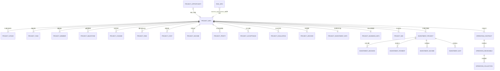

# 项目生命周期领域模型设计

版本：Sprint 2-0.3
日期：2026-08-03
状态：领域设计稿，不包含代码、接口或数据库变更

## 0. 设计边界

本设计以 `database/mysql/05_project.sql` 为Project域唯一结构基线，面向两类优先项目：

- `01`：投资项目；
- `02`：中标项目。

设计遵循以下约束：

1. `project_info` 是项目身份、类型和生命周期状态的聚合根；
2. 类型扩展不得复制一套项目主表；
3. Project域负责项目执行过程，Investment、Operation、Risk域分别维护各自专业事实；
4. 跨域数据通过ID引用、应用服务或领域事件协作，不允许跨域直接写表；
5. 阶段模板是定义，`project_stage` 是创建项目时生成的实例快照；
6. 状态、阶段和进度由领域规则驱动，不能由客户端任意赋值；
7. 本文提出的存储缺口必须先走数据库migration评审，本Sprint不修改05。

## 1. 项目聚合模型

### 1.1 聚合根

领域聚合名称：`Project`
持久化主表：`project_info`

`Project` 负责：

- 维护项目唯一身份和项目类型；
- 维护责任组织、项目负责人和项目计划周期；
- 控制项目状态和当前阶段；
- 选择生命周期模板并创建阶段实例；
- 校验阶段流转、项目完成、暂停、取消和归档；
- 为任务、成员、风险、成本、收益等子对象提供项目访问边界；
- 发布跨域事实，例如项目立项、阶段完成、项目验收和项目关闭。

### 1.2 公共字段

| 领域属性 | 数据字段 | 类型/值对象 | 规则 |
|---|---|---|---|
| 项目ID | `id` | `ProjectId` | 雪花ID，不可变 |
| 项目编号 | `project_no` | `ProjectNo` | 最大50字符；有效项目唯一；创建后不可普通编辑 |
| 项目名称 | `project_name` | String | 必填，最大200字符 |
| 项目类型 | `project_type` | `ProjectType` | `01`至`06`；类型扩展创建后原则上不可变 |
| 项目模式 | `project_mode` | `ProjectMode` | 自营、合作等受控字典 |
| 项目来源 | `source_type` | `ProjectSource` | 商机、计划、投资计划、内部任务等 |
| 客户 | `customer_id` | `CustomerId` | 可空；逻辑/外键引用经营客户主数据 |
| 责任组织 | `department_id` | `OrgId` | 必须是有效行政组织；也是组织数据权限字段 |
| 项目负责人 | `leader_id` | `EmployeeId` | 必须是有效员工并满足组织任职规则 |
| 计划周期 | `start_date/end_date` | `DateRange` | 开始日期不得晚于结束日期 |
| 实际周期 | `actual_start_date/actual_end_date` | `DateRange` | 实际开始不得晚于实际结束 |
| 项目状态 | `status` | `ProjectStatus` | 由生命周期规则改变 |
| 预算金额 | `budget_amount` | `Money` | 非负；项目批准预算 |
| 合同金额 | `contract_amount` | `Money` | 非负；经营合同汇总/快照 |
| 预期收入 | `expected_income` | `Money` | 非负 |
| 预期利润 | `expected_profit` | `Money` | 可为负，代表预期亏损 |
| 实际收入 | `actual_income` | `Money` | 非负；来自专业域事实的项目投影 |
| 实际利润 | `actual_profit` | `Money` | 可为负；来自项目利润快照 |
| 当前阶段 | `current_stage_code` | `StageCode` | 必须对应当前项目有效阶段实例 |
| 风险等级 | `risk_level` | `RiskLevel` | 项目风险汇总等级，不替代风险台账 |
| 项目进度 | `progress` | `Percentage` | 0至100，由阶段/任务完成情况计算 |
| 项目说明 | `description` | String | 项目业务说明 |
| 审计字段 | 公共审计列 | `AuditMetadata` | 创建/更新人和时间、逻辑删除、版本、备注 |

核心公共字段可概括为：

```text
项目编号 + 项目名称 + 项目类型 + 负责人 + 责任组织
       + 项目状态 + 当前阶段 + 生命周期进度
```

### 1.3 项目状态

建议统一状态：

| 状态 | 含义 | 允许来源 |
|---|---|---|
| `RESERVED` | 储备/机会阶段 | 项目创建或尚未进入正式实施 |
| `IN_PROGRESS` | 正在推进 | 首个正式执行阶段开始 |
| `SUSPENDED` | 已暂停 | 经授权的暂停命令 |
| `COMPLETED` | 生命周期完成 | 最后必需阶段完成且关闭条件满足 |
| `CANCELLED` | 已取消 | 经授权的取消命令 |

状态转换必须由领域命令执行。阶段完成、项目进度和实际日期应由后端反算，不接受客户端
直接覆盖。

### 1.4 聚合内实体与关联对象

| 对象 | 表 | 聚合关系 | 一致性要求 |
|---|---|---|---|
| 阶段 | `project_stage` | 聚合内生命周期实体 | 阶段顺序、状态转换和当前阶段必须与根一致 |
| 任务 | `project_task` | 受Project根保护的任务实体 | 不得跨项目引用阶段/父任务 |
| 成员 | `project_member` | 受Project根保护的成员实体 | 项目负责人必须有经理成员身份 |
| 里程碑 | `project_milestone` | 项目计划实体 | 里程碑状态与实际日期一致 |
| 变更 | `project_change` | 项目变更记录 | 影响预算、周期或范围的变更必须审批后生效 |
| 项目风险 | `project_risk` | 项目风险台账 | 访问继承项目数据权限 |
| 验收 | `project_acceptance` | 项目验收记录 | 通过验收才允许进入后续结算/评价 |
| 评价 | `project_evaluation` | 项目后评价 | 项目完成后形成 |
| 档案 | `project_archive` | 项目档案 | 归档阶段校验必备材料 |

成本、收入、利润及跨域专业对象不要求随Project根一次性加载。它们通过 `project_id`
关联并受项目访问策略保护，避免形成超大事务聚合。

### 1.5 聚合不变量

1. 项目编号在有效数据中唯一且创建后不可普通修改；
2. 项目类型扩展存在后不得直接改变项目类型；
3. 负责人、阶段负责人、任务负责人和成员必须引用有效员工；
4. 责任组织必须有效，创建人必须有权在该组织创建项目；
5. 当前阶段必须属于本项目，阶段只能按模板顺序推进；
6. 未完成必需任务、必需审批或必备材料时不得完成阶段；
7. 项目进度为0至100，并由阶段和任务规则计算；
8. 最后阶段未完成时项目不得标记 `COMPLETED`；
9. 逻辑删除项目时必须处理子资源可见性，不能留下可独立访问的孤儿数据；
10. 所有项目及子资源操作必须先通过 `ProjectAccessPolicy`。

## 2. 投资项目领域模型

### 2.1 模型定位

领域模型名称：`ProjectInvestmentInfo`
持久化扩展表：`project_investment_info`
与Project关系：一个 `Project(type=01)` 最多一个有效投资扩展。

该模型用于表达投资型项目在Project生命周期中的摘要和阶段判断，不替代Investment域的
投资事项、决策、支付、股权、投后监管、收益和退出台账。

### 2.2 领域属性

| 领域属性 | 当前持久化来源 | 领域含义 | 当前状态 |
|---|---|---|---|
| `projectId` | `project_id` | 所属项目 | 已具备 |
| `investmentSubjectOrgId` | 可从项目/投资事项关联解析 | 投资主体企业组织ID | 05扩展表无独立字段，待持久化方案评审 |
| `partnerName` | `partner_name` | 合作方名称快照 | 已具备 |
| `investmentAmount` | `investment_amount` | 批准投资金额 | 已具备 |
| `equityRatio` | `investment_ratio` | 持股/投资比例，0至100 | 已具备 |
| `contributionMethod` | 无 | 现金、实物、知识产权、数据资产等出资方式 | 存储缺口，后续migration候选 |
| `capitalSource` | `capital_source` | 自有资金、融资、基金等资金来源 | 已具备 |
| `spvNameSnapshot` | `spv_company` | SPV名称快照 | 已具备 |
| `spvCompanyId` | `investment_project.spv_company_id` | Investment域被投企业/SPV主数据ID | 跨域引用，不在Project扩展表重复维护 |
| `expectedRoi` | `expected_roi` | 预计投资回报率 | 已具备 |
| `irr` | `irr` | 内部收益率 | 已具备 |
| `paybackPeriod` | `payback_period` | 投资回收期 | 已具备 |

投资主体与责任组织必须区分：`department_id` 是项目责任组织，投资主体通常是具有投资
资格的企业法人组织，不能默认将责任部门等同于投资主体。

### 2.3 Project域与Investment域职责

| 能力 | 事实所有者 | Project侧使用方式 |
|---|---|---|
| 投资计划、投资事项 | Investment域 | 通过 `investment_project.project_id` 关联 |
| 可研测算 | Investment域 | 阶段完成条件读取批准结果 |
| 投资决策 | Investment域 | 决策阶段门禁 |
| 出资支付 | Investment域 | 实施阶段门禁 |
| SPV、股权和董监事 | Investment域 | Project详情只展示引用/摘要 |
| 投后指标 | Investment域 | 投后阶段状态和预警输入 |
| 投资收益 | Investment域 | 只展示，不计入普通项目经营收入台账 |
| 投资退出 | Investment域 | 退出阶段门禁 |
| 项目阶段、任务、成员和档案 | Project域 | Project聚合直接管理 |

`project_investment_info` 中与Investment域重复的金额、比例、SPV和测算指标应视为项目
生命周期投影。建立主投资事项关联后，由Investment域批准事实驱动更新，禁止两边独立编辑。

### 2.4 投资流程

```text
机会
  -> 可研
  -> 尽调
  -> 决策
  -> 实施
  -> 投后
  -> 退出
  -> 归档
```

流程含义：

- 机会：形成投资事项初步判断并建立项目责任主体；
- 可研：完成市场、技术、财务、风险和经济测算；
- 尽调：完成法律、财务、业务和资产尽职调查；
- 决策：履行党委会、经理层、董事会或股东会等治理程序；
- 实施：签署协议、完成出资、设立或关联SPV、登记股权；
- 投后：采集经营指标、风险、收益和治理事项；
- 退出：执行转让、回购、清算或上市退出；
- 归档：形成完整投资决策和投后档案。

### 2.5 投资领域规则

1. 只有 `project_type=01` 才能创建投资扩展；
2. 投资金额非负，股权比例为0至100；
3. 股权投资进入实施前必须明确投资主体、合作方、出资方式及SPV方案；
4. 决策未批准不得出资；
5. 实际累计支付不得超过批准额度，超额必须先走变更和重新决策；
6. 投后阶段必须存在有效SPV/被投企业及监控指标；
7. 未完成退出审批不得确认退出；
8. 退出收益以Investment域 `investment_income/investment_exit` 为事实源；
9. 投资高风险必须同步进入企业风险治理流程，但不直接跨域写表。

## 3. 中标项目领域模型

### 3.1 模型定位

领域组合模型名称：`ProjectDeliveryInfo`
适用项目：`Project(type=02)`

05当前没有 `project_delivery_info` 物理表。本设计将其定义为领域组合/查询模型：

- 一对一的中标交付摘要由 `project_business_info` 承载；
- 客户、商机、投标、合同、验收、回款和利润从各自事实表组装；
- 不因领域模型名称新增重复表，也不重命名现有表。

### 3.2 模型组成

| 领域部分 | 数据来源 | 事实所有者 |
|---|---|---|
| 项目身份、组织、负责人、状态、进度 | `project_info` | Project域 |
| 交付摘要、投标编号、投标金额、中标日期、交付周期、付款方式 | `project_business_info` | Project域 |
| 客户ID及客户主数据 | `project_info.customer_id`、`operation_customer` | Operation域客户主数据 |
| 商机 | `project_opportunity` | Project域机会管理 |
| 投标记录 | `project_bid` | Project域投标过程 |
| 合同 | `operation_contract` | Operation域 |
| 实施 | `project_stage/task/milestone/change` | Project域 |
| 验收 | `project_acceptance` | Project域 |
| 应收和回款 | `operation_receivable/operation_collection` | Operation域 |
| 项目成本、收入、利润快照 | `project_cost/project_income/project_profit` | Project域投影/分析 |

### 3.3 领域属性

`ProjectDeliveryInfo` 建议包含：

```text
projectId
customerId
customerNameSnapshot
opportunityId / opportunityNo / opportunityStatus
latestBidId / bidNo / bidAmount / bidResult / winDate
contracts[] / contractAmount
deliveryPeriodDays / paymentMethod
implementationStage / progress / milestoneSummary
acceptanceStatus / acceptanceDate
receivableAmount / collectedAmount / remainingAmount
totalIncome / totalCost / profit / profitRate
```

合同按现有DDL是项目一对多关系，领域模型不得假定一个项目永远只有一份合同。可指定一个
主合同用于摘要，但合同集合仍由Operation域维护。

### 3.4 中标交付流程

```text
客户与商机
  -> 投标
  -> 中标及合同
  -> 项目实施
  -> 客户验收
  -> 应收及回款
  -> 利润复盘
  -> 归档
```

### 3.5 中标项目规则

1. 只有 `project_type=02` 才能创建中标交付扩展；
2. 商机转项目必须保存 `converted_project_id`，禁止重复转化；
3. 投标结果为中标后才能进入合同阶段；
4. 合同必须关联同一项目和客户，合同金额汇总形成项目合同金额投影；
5. 未批准的重大变更不能改变项目预算、范围和计划周期；
6. 实施任务和必需里程碑未完成不得发起最终验收；
7. 验收未通过不得进入正式结算关闭；
8. 回款事实以Operation域为准，Project只展示汇总；
9. 项目利润是管理分析口径，不替代财务总账；
10. 未完成利润复盘和必备材料归档不得关闭项目。

## 4. 生命周期模型

### 4.1 模板与实例

模板表：`project_stage_template`
实例表：`project_stage`

模板字段承担：

- `project_type`：适用项目类型；
- `stage_code`：稳定阶段编码；
- `stage_name`：展示名称；
- `stage_order`：顺序；
- `requires_approval`：是否需要审批；
- `status`：模板启停。

项目创建时复制启用模板生成阶段实例。后续模板调整只影响新项目，不反向修改历史项目的
阶段名称、顺序或审批要求。

05当前没有模板进入条件和完成条件字段。本文将条件定义为领域策略；如后续要求运营人员
配置，必须先设计受控规则模型并新增migration，禁止把可执行表达式直接写入备注或拼接SQL。

### 4.2 阶段通用状态

```text
NOT_STARTED -> IN_PROGRESS -> COMPLETED
                         \-> SKIPPED（仅允许非必需阶段且经过授权）
```

通用规则：

- 前置必需阶段完成后才能开始下一阶段；
- `requires_approval=1` 时必须存在批准事实；
- 阶段内阻断任务未完成时不能完成阶段；
- 完成百分比与状态一致：完成阶段为100；
- 跳过必须记录理由、操作人和审批依据；
- 阶段完成后原则上不可直接回退，应通过变更流程重新打开；
- 当前阶段和项目进度由阶段实例反算。

### 4.3 投资项目模板（`project_type=01`）

| 顺序 | 阶段编码 | 阶段名称 | 审批 | 进入条件 | 完成条件 |
|---:|---|---|---|---|---|
| 1 | `OPPORTUNITY` | 投资机会 | 否 | 项目类型为01；责任组织和负责人有效 | 明确投资主体候选、合作方、初步金额、资金来源和机会结论 |
| 2 | `FEASIBILITY` | 可行性研究 | 否 | 机会阶段完成；投资事项已建立 | 市场、技术、财务、风险分析完成；ROI、IRR、回收期通过评审 |
| 3 | `DUE_DILIGENCE` | 尽职调查 | 否 | 可研结论建议继续 | 法律、财务、业务、资产尽调完成；重大问题有处置结论 |
| 4 | `DECISION` | 投资决策 | 是 | 可研和尽调材料齐全；风险可接受 | 按权限完成党委会、经理层、董事会/股东会程序且最终结果为批准 |
| 5 | `IMPLEMENTATION` | 投资实施 | 是 | 决策批准；协议、额度和支付条件具备 | 出资完成；SPV/被投企业和股权登记完成；无未批准超额支付 |
| 6 | `POST_INVESTMENT` | 投后管理 | 否 | 投资实施完成；监控对象存在 | 完成规定监控周期；重大风险闭环；满足继续持有或退出判断条件 |
| 7 | `EXIT` | 投资退出 | 是 | 退出方案形成并具备决策条件 | 退出批准且完成；退出金额、收益、股权变化和法律手续确认 |
| 8 | `ARCHIVE` | 投资项目归档 | 否 | 退出阶段完成或批准终止 | 决策、协议、支付、投后、收益、退出资料齐全并完成后评价 |

### 4.4 中标项目模板（`project_type=02`）

| 顺序 | 阶段编码 | 阶段名称 | 审批 | 进入条件 | 完成条件 |
|---:|---|---|---|---|---|
| 1 | `OPPORTUNITY` | 客户与商机 | 否 | 客户/潜在客户明确；负责人有效 | 商机评估通过，预计金额和需求范围明确，完成项目转化 |
| 2 | `BID` | 投标管理 | 是 | 商机批准参与；招标信息齐全 | 投标记录完整；结果为中标才进入合同，未中标则关闭/取消 |
| 3 | `CONTRACT` | 合同签订 | 是 | 已中标或获准直接签约 | 合同审批并生效；金额、周期、范围、付款方式和客户一致 |
| 4 | `IMPLEMENTATION` | 项目实施 | 否 | 合同生效；计划、团队和预算已建立 | 必需任务与里程碑完成；重大变更已批准；交付物齐全 |
| 5 | `ACCEPTANCE` | 项目验收 | 是 | 实施完成且具备验收材料 | 客户验收通过；确认文件和附件归档；遗留问题有关闭计划 |
| 6 | `COLLECTION` | 应收与回款 | 否 | 验收/合同付款条件已触发 | 应收余额为0或存在经批准的关闭处理；回款记录与合同一致 |
| 7 | `PROFIT_REVIEW` | 利润复盘 | 是 | 收入、成本和回款数据已对账 | 形成批准的利润快照；偏差原因、责任和改进措施完成复盘 |
| 8 | `ARCHIVE` | 中标项目归档 | 否 | 利润复盘完成 | 商机、投标、合同、变更、验收、回款、利润资料齐全并归档 |

### 4.5 模板选择规则

1. `project_type=01` 必须选择投资模板；
2. `project_type=02` 必须选择中标模板；
3. 其他类型在专项设计前继续使用通用模板；
4. 同一项目类型只能有一个当前启用的主模板版本；
5. 模板发布后应形成版本标识。05当前缺少模板版本字段，需在模板运营化前提出migration；
6. 模板变化不能直接重写进行中项目，若需调整必须走项目变更。

## 5. 数据关系



### 5.1 关系约束

- `project_info` 到投资/中标扩展均为一对零或一；
- 项目到阶段、任务、成员、风险、成本、收入等为一对多；
- 机会可以尚未转项目，转化后记录 `converted_project_id`；
- 项目到投标、合同、验收和利润快照允许一对多；
- Investment与Operation域对象通过 `project_id` 引用Project，不成为Project聚合内实体；
- `risk_info.business_id` 是多态逻辑引用，Risk服务必须验证项目存在及当前用户数据权限。

## 6. 风险、成本、收益边界

### 6.1 项目风险与企业风险

| 对象 | 表 | 所属模块 | 边界 |
|---|---|---|---|
| 项目风险 | `project_risk` | Project | 项目执行过程风险、措施和状态；随项目访问权限 |
| 企业风险 | `risk_info` | Risk | 企业风险库、分类、责任、评估、预警和整改 |

项目风险达到上报阈值后，通过应用服务/领域事件在Risk域创建企业风险。两个模块不直接更新
对方表。05是 `project_risk` 的唯一结构所有者，09中的兼容重复定义后续由风险域治理收敛。

### 6.2 项目成本与经营财务

| 对象 | 表 | 所属模块 | 定位 |
|---|---|---|---|
| 项目执行成本 | `project_cost` | Project | 按项目、成本类型和发生日期归集的管理成本 |
| 经营成本事实 | `operation_cost` | Operation | 合同/经营口径成本事实 |
| 项目收入 | `project_income` | Project | 项目管理口径收入投影 |
| 合同收入/回款 | Operation相关表 | Operation | 合同、应收、回款事实源 |

专业经营事实由Operation域维护。Project域可保存带 `source_type/source` 的项目投影或项目
直接管理成本，但同一笔业务必须有稳定来源ID和幂等规则，禁止重复计入。

### 6.3 项目利润与投资收益

| 对象 | 表 | 所属模块 | 计算口径 |
|---|---|---|---|
| 项目利润 | `project_profit` | Project | `total_income - total_cost` 的项目管理快照 |
| 经营利润分析 | `operation_profit_analysis` | Operation | 合同/经营管理口径 |
| 投资收益 | `investment_income`、`investment_exit` | Investment | 分红、股权增值、转让及退出收益 |

项目利润不是财务总账。投资项目的分红和退出收益不得作为普通中标项目回款处理；如需要在
项目驾驶舱展示，只同步汇总投影，不改变Investment域事实。

## 7. 权限模型

统一目标权限：

| 权限 | 作用范围 | 典型操作 |
|---|---|---|
| `project:view` | 项目及授权子资源只读 | 列表、详情、阶段/任务/成员/风险查看 |
| `project:create` | 项目创建 | 在有权组织创建项目和初始阶段 |
| `project:update` | 项目基础资料和受控变更 | 修改名称、负责人、计划等非专属操作 |
| `project:delete` | 项目逻辑删除 | 删除未受禁止规则约束的项目 |
| `project:stage` | 生命周期阶段管理 | 开始、完成、跳过、重新打开阶段 |
| `project:task` | 项目任务管理 | 任务新增、修改、删除、状态更新 |
| `project:member` | 项目成员管理 | 添加、修改、移除成员和角色 |

### 7.1 授权规则

1. 功能权限与数据权限同时满足才允许操作；
2. 所有详情和子资源入口必须经过 `ProjectAccessPolicy.requireAccessible()`；
3. 列表必须执行统一 `@DataScope`，组织字段为 `project_info.department_id`，SELF字段为
   `project_info.create_by`；
4. `project:create` 还必须验证目标责任组织在当前数据范围内；
5. `project:stage` 不隐含 `project:update`，阶段审批还需结合审批身份和治理规则；
6. `project:member` 属于高风险权限，不能因拥有任务编辑权限而自动获得；
7. 管理员ALL范围也必须拥有相应功能权限；
8. 接口、菜单、按钮、初始化角色和文档必须使用同一权限编码。

### 7.2 现有权限迁移原则

当前历史编码包括 `project:lifecycle:*`、`project:add`、`project:edit`。后续权限专项Sprint
应通过初始化数据migration和兼容窗口迁移到上述目标编码，不在Controller中长期并列两套
权限，也不在本设计Sprint修改现有接口。

## 8. 领域事件与跨域契约

建议事件：

| 事件 | 发布方 | 订阅方 | 用途 |
|---|---|---|---|
| `ProjectCreated` | Project | Investment/Operation/Risk | 建立专业域关联准备 |
| `ProjectStageCompleted` | Project | 驾驶舱/消息 | 更新进度、触发待办 |
| `InvestmentDecisionApproved` | Investment | Project | 完成投资决策阶段门禁 |
| `InvestmentPaymentCompleted` | Investment | Project | 更新实施阶段事实 |
| `InvestmentExited` | Investment | Project | 完成退出阶段门禁 |
| `ContractActivated` | Operation | Project | 完成合同阶段门禁及金额投影 |
| `ProjectAccepted` | Project | Operation | 触发结算/应收条件 |
| `CollectionReceived` | Operation | Project | 更新回款汇总和阶段判断 |
| `ProjectRiskEscalated` | Project | Risk | 创建/关联企业风险 |

事件必须包含事件ID、业务对象ID、发生时间、版本和幂等键。跨域失败进入重试/异常队列，
禁止以分布式事务直接同时写多个模块表。

## 9. 后续开发路线

### 阶段1：领域契约冻结

- 评审本文术语、聚合边界、状态和阶段编码；
- 确认投资主体、出资方式、SPV引用和尽调资料的存储缺口；
- 确认一个项目关联一个还是多个投资事项的规则；
- 确认中标项目多合同和主合同规则；
- 形成数据库migration建议，但不直接修改05历史基线。

### 阶段2：生命周期模板治理

- 为01、02类型准备阶段模板初始化migration；
- 设计模板版本和规则配置方式；
- 建立模板到实例的复制及历史隔离测试；
- 保持现有项目阶段不被模板变更覆盖。

### 阶段3：通用Project聚合重构

- 引入Project类型、状态、阶段、金额、进度等值对象；
- 将项目状态和进度回算集中到领域服务；
- 拆分现有过大的生命周期编排职责；
- 保持现有REST路径兼容，先做内部模型替换。

### 阶段4：投资项目能力

- 实现 `ProjectInvestmentInfo` 映射和领域规则；
- 对接Investment域的可研、决策、支付、投后、收益和退出事实；
- 增加七阶段加归档的门禁测试；
- 验证CUSTOM组织范围和投资专业权限。

### 阶段5：中标交付能力

- 实现 `ProjectDeliveryInfo` 组合模型；
- 打通机会、投标、合同、实施、验收、应收、回款和利润；
- 明确多合同、分批验收和分期回款规则；
- 建立项目利润与Operation事实的幂等同步。

### 阶段6：风险与经营分析

- 建立项目风险上报企业风险契约；
- 收敛09对 `project_risk` 的重复定义；
- 建立成本、收入、利润来源追踪和防重规则；
- 完成真实MySQL、数据权限、性能及安全验收。

## 10. 设计待决项

进入实现前必须确认：

1. 投资主体是否使用 `sys_org` 中COMPANY类型，还是Investment独立主体主数据；
2. 出资方式采用单值字典还是一项投资允许多种出资明细；
3. SPV是否只允许关联 `investment_company`，历史名称如何迁移；
4. 尽调结果采用专用模型、审批模型还是受控文档清单；
5. 一个Project是否允许关联多个 `investment_project`；
6. 中标项目的主合同选择规则和跨合同汇总口径；
7. 分批验收、部分回款是否允许阶段完成；
8. 项目利润使用累计快照还是期间快照；
9. 阶段模板版本和条件规则如何持久化；
10. 历史权限编码迁移窗口和回滚方案。
