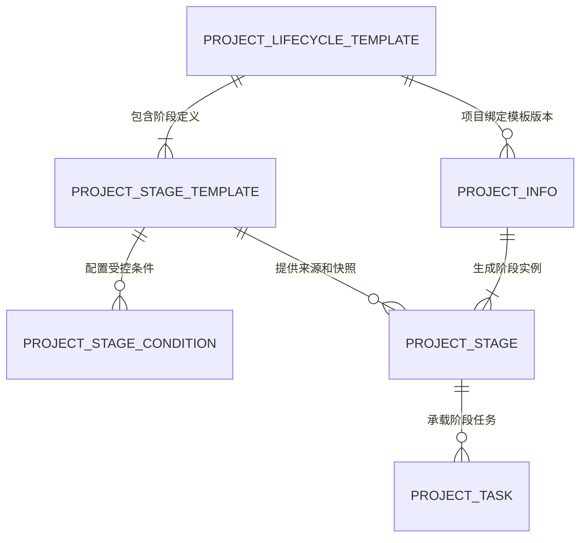
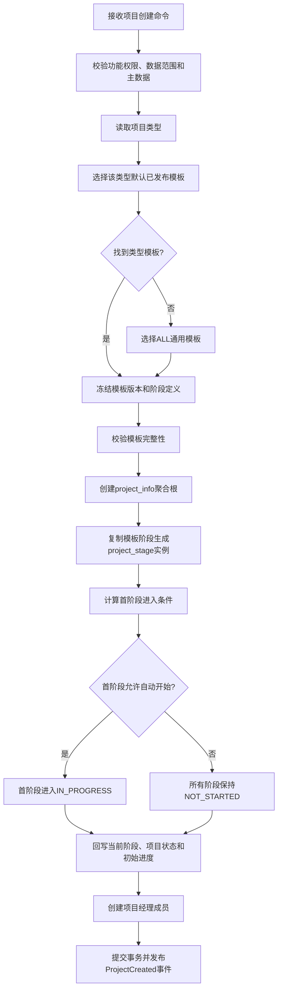
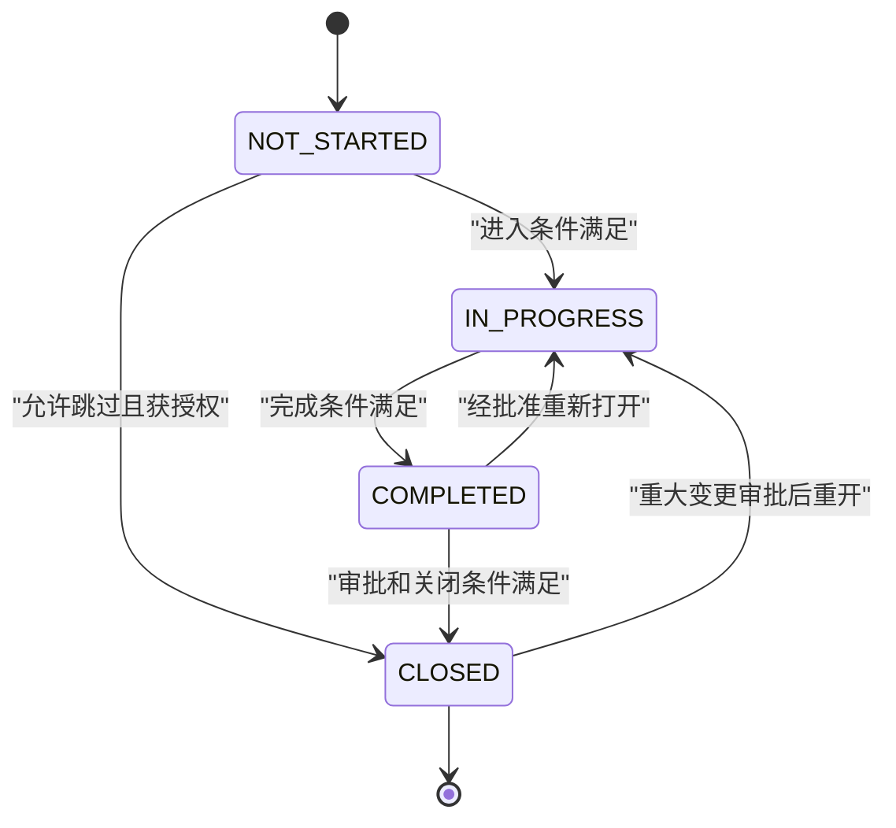

# 项目生命周期模板治理设计

版本：Sprint 2-0.4
日期：2026-08-03
状态：设计稿，不包含代码、接口或数据库变更

## 1. 当前问题

### 1.1 当前实现位置

当前生命周期逻辑主要位于：

```text
backend/src/main/java/cn/gov/enterprise/modules/project/
├── service/impl/ProjectLifecycleServiceImpl.java
└── service/ProjectStageTransitionPolicy.java
```

硬编码点如下：

| 位置 | 当前实现 | 问题 |
|---|---|---|
| `ProjectLifecycleServiceImpl` 33至41行 | `DEFAULT_STAGES`固定8阶段 | 所有项目类型共用同一生命周期，数据库模板不生效 |
| 120至121行 | 初始阶段固定 `RESERVE`，状态固定 `RESERVED` | 无法由模板决定首阶段和初始状态 |
| 126至140行 | 遍历 `DEFAULT_STAGES`生成阶段 | 未读取 `project_stage_template` |
| 132至136行 | 第一阶段自动开始、负责人固定为项目负责人，首尾阶段绑定项目日期 | 初始化行为与模板解耦不足 |
| 293至298行 | 所有阶段完成百分比等权平均 | 无法按阶段权重或里程碑计算项目进度 |
| 299至303行 | 第一个非完成/跳过阶段作为当前阶段 | 未区分已完成、已关闭和等待审批 |
| 306至315行 | 终态固定 `ARCHIVE`，是否储备固定判断 `RESERVE` | 类型模板无法定义首尾阶段 |
| `ProjectStageTransitionPolicy` | 状态转换Map固定在代码 | 不支持模板级跳过、关闭和重开策略 |
| `ProjectStageTransitionPolicy` | 审批阶段固定为 `INITIATION/ACCEPTANCE` | `requires_approval`数据库字段未使用 |
| `ProjectStageTransitionPolicy` | 完成条件只有“前序完成、任务完成、审批通过” | 无法接入合同、财务、风险和三重一大门禁 |

### 1.2 数据库已有但未使用的能力

`project_stage_template` 已包含：

```text
project_type
stage_code
stage_name
stage_order
requires_approval
status
```

`10_init_data.sql` 已初始化 `project_type='ALL'` 的8个通用阶段，但创建项目时没有查询该表。

### 1.3 当前模型缺口

1. 没有模板头、模板编码和模板名称；
2. 没有模板版本、草稿/发布状态和生效时间；
3. 只能按 `project_type` 逻辑分组，不能同类型维护多个模板；
4. 阶段实例没有模板、模板版本和模板阶段来源；
5. 进入、完成、审批、关闭条件没有结构化配置；
6. 没有阶段权重、是否必需、是否允许跳过、自动开始/关闭策略；
7. 没有正式的 `CLOSED` 状态和关闭类型；
8. 审批状态由请求直接提交，尚未与真实审批事实绑定；
9. 模板变化后无法证明历史项目使用的是哪个版本；
10. 缺少模板发布校验和模拟运行能力。

## 2. 设计目标与原则

目标流程：

```text
项目类型
  -> 选择已发布模板版本
  -> 复制/绑定阶段定义
  -> 生成项目阶段实例
  -> 条件驱动阶段流转
  -> 反算项目状态与进度
```

原则：

1. 数据库决定“有哪些阶段、顺序、审批要求和规则引用”，代码只提供受控规则执行器；
2. 模板发布后不可原地修改，新变化创建新版本；
3. 项目创建时绑定确定模板版本，后续模板升级不改变历史项目；
4. 阶段实例保留名称、顺序等快照，同时记录模板来源；
5. 规则只能引用白名单条件代码，禁止存储SQL、SpEL或任意脚本；
6. 功能权限、项目访问策略、审批权限和数据权限必须同时满足；
7. 项目、阶段实例和首阶段初始化在同一事务内完成；
8. 外部系统事实通过Provider/Gateway或领域事件接入，不跨域直接写表；
9. 数据库基线仍为05，本文的目标模型需在后续Sprint通过migration实施。

## 3. 模板模型

### 3.1 两层落地方案

#### 第一层：05基线兼容接入

不新增表时，将相同 `project_type` 的有效 `project_stage_template` 行视为一个逻辑模板：

```text
LogicalTemplateKey = project_type
StageDefinitions   = status=1 AND deleted=0 ORDER BY stage_order
Fallback           = project_type无配置时使用ALL
```

这一层可以先消除 `DEFAULT_STAGES`，但仍缺少版本、条件、来源和多模板能力，只适合作为过渡。

#### 第二层：可运营模板目标模型

目标模型由模板头、模板阶段、阶段条件和项目阶段实例组成。所有结构调整必须新增migration，
本Sprint不执行。

### 3.2 模板头模型

建议领域对象：`ProjectLifecycleTemplate`

建议未来独立表：`project_lifecycle_template`

| 属性 | 建议含义 |
|---|---|
| `id` | 模板ID |
| `templateCode` | 稳定模板编码，例如 `INVESTMENT_STANDARD` |
| `templateName` | 模板名称 |
| `projectType` | 适用项目类型，`01`、`02`或 `ALL` |
| `versionNo` | 模板业务版本，例如1、2、3 |
| `status` | `DRAFT/PUBLISHED/DISABLED` |
| `isDefault` | 是否为该项目类型默认模板 |
| `effectiveFrom/effectiveTo` | 生效区间 |
| `description` | 模板说明 |
| `auditMetadata` | 创建、更新、逻辑删除和乐观锁字段 |

模板不变量：

1. `templateCode + versionNo` 唯一；
2. 同一项目类型、同一时点只能有一个默认已发布模板；
3. 模板至少有一个有效阶段；
4. 已发布模板不可编辑，只能复制为新版本；
5. 已被项目引用的模板版本不得物理删除；
6. 停用模板只禁止新项目选择，不影响历史项目。

### 3.3 模板阶段模型

现有表：`project_stage_template`

当前字段继续承载阶段编码、名称、顺序和是否审批。目标模型建议补充以下概念，但需后续
migration评审：

| 属性 | 当前状态 | 目标作用 |
|---|---|---|
| `templateId` | 缺失 | 关联模板头，替代只靠 `project_type` 分组 |
| `stageCode` | 已有 | 模板内稳定编码 |
| `stageName` | 已有 | 阶段名称 |
| `stageOrder` | 已有 | 阶段顺序 |
| `required` | 缺失 | 是否必需阶段 |
| `allowSkip` | 缺失 | 是否允许受控跳过 |
| `requiresApproval` | 已有 | 是否必须审批 |
| `progressWeight` | 缺失 | 项目进度权重 |
| `autoStart` | 缺失 | 前序关闭后是否自动开始 |
| `autoClose` | 缺失 | 完成且满足条件后是否自动关闭 |
| `plannedDurationDays` | 缺失 | 默认计划工期 |
| `status` | 已有 | 阶段定义启停 |

模板阶段不变量：

- 同一模板版本内 `stageCode` 和 `stageOrder` 分别唯一；
- 顺序必须从1开始连续递增；
- 阶段权重合计必须为100，或统一使用系统归一化策略；
- 必需阶段不得允许无审批跳过；
- 首阶段至少有一种可满足的进入方式；
- 末阶段关闭后必须允许Project进入完成状态。

### 3.4 阶段条件模型

建议领域对象：`StageConditionDefinition`

建议未来表：`project_stage_condition`

| 属性 | 含义 |
|---|---|
| `templateStageId` | 所属模板阶段 |
| `conditionType` | `ENTRY/COMPLETION/APPROVAL/CLOSE` |
| `conditionCode` | 白名单规则编码 |
| `parameters` | 受Schema校验的JSON参数 |
| `required` | 是否强制满足 |
| `sortNo` | 执行顺序 |
| `failureMessage` | 不满足时的业务提示模板 |

禁止把以下内容保存为条件：

- SQL片段；
- SpEL、OGNL或任意脚本；
- 可直接访问Bean、文件或网络的表达式；
- 未经Schema校验的自由JSON；
- 密码、Token、账户等敏感数据。

条件代码由后端注册表实现，例如：

```text
PREVIOUS_STAGES_CLOSED
ALL_REQUIRED_TASKS_COMPLETED
APPROVAL_APPROVED
CONTRACT_ACTIVE
ACCEPTANCE_PASSED
RECEIVABLE_CLEARED
NO_OPEN_CRITICAL_RISK
INVESTMENT_DECISION_APPROVED
INVESTMENT_PAYMENT_COMPLETED
INVESTMENT_EXIT_COMPLETED
REQUIRED_ARCHIVES_PRESENT
```

### 3.5 阶段实例模型

现有表：`project_stage`

阶段实例继续保存：

```text
project_id
stage_code / stage_name / stage_order
计划和实际日期
status
responsible_person
approval_status
completion_percent
审计和版本字段
```

目标模型建议增加来源和关闭快照：

| 属性 | 作用 |
|---|---|
| `templateId` | 项目选择的模板ID |
| `templateVersion` | 模板版本快照 |
| `templateStageId` | 来源模板阶段ID |
| `requiresApprovalSnapshot` | 创建时审批要求快照 |
| `progressWeightSnapshot` | 进度权重快照 |
| `closeType` | `NORMAL/SKIPPED/CANCELLED` |
| `closeReason` | 受控关闭原因 |
| `closedBy/closedTime` | 关闭审计 |

阶段名称、顺序等保留实例快照，规则来源绑定不可变的已发布模板版本。即使模板后来停用，
历史阶段仍可解释和审计。

## 4. 模板、定义与实例关系



关系规则：

1. 一个已发布模板版本包含一个或多个阶段定义；
2. 一个模板阶段包含零至多个进入、完成、审批或关闭条件；
3. 一个项目只绑定一个主生命周期模板版本；
4. 项目创建时，每个模板阶段生成一个阶段实例；
5. 阶段实例通过来源ID解释规则，同时保留业务快照；
6. 项目阶段实例不得在运行中自动切换到新模板版本；
7. 模板迁移必须通过项目变更，生成差异计划并保留审计记录。

## 5. 项目创建流程

### 5.1 主流程



### 5.2 模板选择规则

1. 只选择 `PUBLISHED`、在生效期内且未逻辑删除的模板；
2. 优先选择与 `project_type` 精确匹配的默认模板；
3. 精确模板不存在时才回退到 `ALL`；
4. 同时匹配多个默认模板时快速失败，禁止随机选择；
5. 请求不得直接提交任意模板ID绕过项目类型约束；
6. 若允许显式选择非默认模板，必须校验模板类型、发布状态和专门权限；
7. 模板选择结果和版本必须写入项目审计记录。

### 5.3 模板发布前校验

- 阶段非空；
- 编码和顺序唯一；
- 顺序连续；
- 条件代码均已注册且参数通过Schema验证；
- 权重合法；
- 首阶段可进入；
- 末阶段可关闭；
- 审批阶段已配置审批类型；
- 必需阶段不可无理由跳过；
- 不存在循环依赖；
- 对选定项目类型的模拟运行通过。

### 5.4 阶段实例复制规则

- 复制阶段编码、名称、顺序、审批要求、权重和计划工期快照；
- 默认状态为 `NOT_STARTED`；
- 首阶段满足条件且配置自动开始时进入 `IN_PROGRESS`；
- 首阶段负责人默认项目负责人，其余阶段按模板角色策略或后续分配；
- 项目计划开始日期可赋给首阶段，计划结束日期可赋给末阶段；
- 模板有默认工期时按工作日策略生成阶段计划，不能简单平均分配；
- 任一步失败必须回滚项目、阶段和初始成员创建；
- 项目编号唯一性和请求幂等必须在事务外入口及数据库唯一键双重保证。

## 6. 阶段模型与状态流转

### 6.1 目标状态

| 状态 | 中文 | 含义 |
|---|---|---|
| `NOT_STARTED` | 未开始 | 阶段尚未进入，进度必须为0 |
| `IN_PROGRESS` | 进行中 | 阶段工作正在执行，允许更新任务和材料 |
| `COMPLETED` | 完成 | 阶段业务工作已完成，等待审批/关闭确认 |
| `CLOSED` | 关闭 | 阶段已正式关门，默认不可再编辑 |

当前代码还使用 `SKIPPED`。目标模型将“跳过”定义为关闭类型而非长期主状态：

```text
status    = CLOSED
closeType = SKIPPED
```

在 `closeType/closeReason` 持久化能力完成前，现有 `SKIPPED` 需要兼容保留，不能直接转换。

### 6.2 状态机



正常情况下 `CLOSED` 是终态。重新打开是独立高风险命令，必须记录原因、审批、原关闭版本，
并重新校验后续阶段影响，不能作为普通更新操作。

### 6.3 进入条件

进入 `IN_PROGRESS` 前至少校验：

1. 项目未取消、未暂停、未逻辑删除；
2. 当前用户有 `project:stage` 权限并可访问项目；
3. 所有前置必需阶段已 `CLOSED`；
4. 阶段负责人有效；
5. 模板定义的ENTRY条件全部通过；
6. 无阻断该阶段的重大变更或关键风险；
7. 使用乐观锁防止重复启动。

进入成功后：

- 状态变为 `IN_PROGRESS`；
- 首次进入时设置 `actual_start_time`；
- 更新项目当前阶段和状态；
- 发布 `ProjectStageStarted`；
- 若需要，创建待办和外部审批准备事项。

### 6.4 完成条件

从 `IN_PROGRESS` 到 `COMPLETED` 至少校验：

1. 阶段内所有必需任务完成或依法取消；
2. 必需里程碑已达到；
3. 必备材料存在且可访问；
4. COMPLETION条件全部通过；
5. 无未处理的阻断性项目变更；
6. 完成百分比置为100；
7. 设置实际完成时间，但尚未代表正式关闭。

完成成功后发布 `ProjectStageCompleted`。需要审批的阶段随后进入审批等待，阶段主状态保持
`COMPLETED`，审批进度由 `approval_status` 表达。

### 6.5 审批条件

当模板 `requires_approval=1`：

- 必须由审批Gateway创建真实审批实例；
- 阶段只保存审批业务键和状态投影，不能由普通更新请求直接声称 `APPROVED`；
- 审批回调必须验签、校验业务对象、版本和幂等键；
- `PENDING`期间禁止关闭阶段；
- `REJECTED`后阶段返回可整改状态，保留审批意见；
- 只有可信审批事实为 `APPROVED` 才满足审批条件；
- 三重一大阶段还必须满足治理会议序列和决策结果。

审批状态建议继续使用：

```text
NOT_SUBMITTED -> PENDING -> APPROVED
                         \-> REJECTED
```

### 6.6 关闭条件

从 `COMPLETED` 到 `CLOSED`：

1. 所有必需完成条件仍然成立；
2. 需要审批时审批已通过；
3. CLOSE条件全部通过；
4. 关闭人具有阶段关闭权限；
5. 设置关闭类型、原因、关闭人和时间；
6. 后续自动开始阶段需再次评估其进入条件；
7. 若末阶段关闭，项目进入 `COMPLETED` 并设置实际结束日期。

非审批阶段可配置 `autoClose=true`，完成后自动关闭；审批阶段默认人工/回调关闭。

### 6.7 项目进度和状态反算

目标进度：

```text
projectProgress = SUM(stageProgress × stageWeight) / SUM(stageWeight)
```

阶段进度约束：

- `NOT_STARTED`：0；
- `IN_PROGRESS`：0至99.99；
- `COMPLETED`：100；
- 正常 `CLOSED`：100；
- 跳过关闭：按模板策略排除权重或重新归一化，不得默认计100。

项目状态建议：

- 所有阶段未开始：`RESERVED`；
- 任一阶段进行中/完成待关：`IN_PROGRESS`；
- 项目暂停命令生效：`SUSPENDED`；
- 末阶段正常关闭：`COMPLETED`；
- 项目取消命令生效：`CANCELLED`。

当前阶段是第一个尚未正常关闭且需要处理的阶段，不再硬编码判断 `RESERVE/ARCHIVE`。

## 7. 投资项目标准模板

模板编码建议：`INVESTMENT_STANDARD`
项目类型：`01`

| 顺序 | 阶段编码 | 阶段名称 | 审批 | 核心进入条件 | 核心完成/关闭条件 |
|---:|---|---|---|---|---|
| 1 | `OPPORTUNITY` | 投资机会 | 否 | 投资主体候选、责任组织和负责人有效 | 合作方、初步金额、资金来源、机会结论明确 |
| 2 | `FEASIBILITY` | 可行性研究 | 否 | 机会关闭，投资事项已建立 | 市场/技术/财务/风险分析完成，ROI、IRR、回收期评审通过 |
| 3 | `DUE_DILIGENCE` | 尽职调查 | 否 | 可研建议继续 | 法律、财务、业务、资产尽调完成，重大问题有结论 |
| 4 | `DECISION` | 投资决策 | 是 | 可研和尽调材料齐全，无不可接受风险 | 三重一大及对应治理会议批准，决策结果有效 |
| 5 | `IMPLEMENTATION` | 投资实施 | 是 | 决策批准，协议和支付条件具备 | 出资支付、SPV/被投企业、股权登记完成，无未批准超额支付 |
| 6 | `POST_INVESTMENT` | 投后管理 | 否 | 投资实施关闭，监控对象存在 | 完成规定监控周期，重大风险闭环，形成持有/退出结论 |
| 7 | `EXIT` | 投资退出 | 是 | 退出方案和决策材料具备 | 退出批准并执行，金额、收益、股权和法律手续确认 |
| 8 | `ARCHIVE` | 投资项目归档 | 否 | 退出关闭或项目获准终止 | 决策、协议、支付、投后、收益、退出和后评价档案齐全 |

典型条件代码：

```text
INVESTMENT_ITEM_EXISTS
FEASIBILITY_APPROVED
DUE_DILIGENCE_PASSED
MAJOR_DECISION_APPROVED
INVESTMENT_DECISION_APPROVED
INVESTMENT_PAYMENT_COMPLETED
POST_INVESTMENT_MONITORING_COMPLETE
NO_OPEN_CRITICAL_RISK
INVESTMENT_EXIT_COMPLETED
REQUIRED_ARCHIVES_PRESENT
```

## 8. 中标项目标准模板

模板编码建议：`DELIVERY_STANDARD`
项目类型：`02`

| 顺序 | 阶段编码 | 阶段名称 | 审批 | 核心进入条件 | 核心完成/关闭条件 |
|---:|---|---|---|---|---|
| 1 | `OPPORTUNITY` | 客户与商机 | 否 | 客户/潜在客户、负责人有效 | 商机评估通过，预计金额、需求范围明确并完成项目转化 |
| 2 | `BID` | 投标管理 | 是 | 商机批准参与，招标信息齐全 | 投标记录完整；中标进入合同，未中标受控关闭项目 |
| 3 | `CONTRACT` | 合同签订 | 是 | 已中标或获准直接签约 | 合同审批生效，客户、金额、范围、周期和付款条件一致 |
| 4 | `IMPLEMENTATION` | 项目实施 | 否 | 合同生效，团队、预算和计划就绪 | 必需任务/里程碑完成，重大变更已批准，交付物齐全 |
| 5 | `ACCEPTANCE` | 项目验收 | 是 | 实施关闭并具备验收材料 | 客户验收通过，确认材料有效，遗留问题有关闭结论 |
| 6 | `COLLECTION` | 应收与回款 | 否 | 验收或合同付款条件触发 | 应收余额为0或存在经批准的关闭处理，回款与合同一致 |
| 7 | `PROFIT_REVIEW` | 利润复盘 | 是 | 收入、成本、回款完成对账 | 利润快照批准，偏差原因和改进措施完成复盘 |
| 8 | `ARCHIVE` | 中标项目归档 | 否 | 利润复盘关闭 | 商机、投标、合同、变更、验收、回款和利润资料齐全 |

典型条件代码：

```text
OPPORTUNITY_CONVERTED
BID_WON
CONTRACT_ACTIVE
ALL_REQUIRED_TASKS_COMPLETED
ALL_REQUIRED_MILESTONES_COMPLETED
ACCEPTANCE_PASSED
RECEIVABLE_CLEARED
PROJECT_PROFIT_RECONCILED
REQUIRED_ARCHIVES_PRESENT
```

## 9. 未来扩展接口预留

本节定义内部领域扩展契约，不新增本Sprint接口。

### 9.1 条件执行器

```text
StageConditionEvaluator
  supports(conditionCode)
  evaluate(StageEvaluationContext, parameters)
    -> PASS / FAIL / PENDING + reason + evidenceRefs
```

`StageEvaluationContext` 至少包含：

```text
projectId
projectType
stageId / stageCode
templateId / templateVersion
currentUser
evaluationTime
```

执行器必须只读查询专业域事实，不能在条件判断时产生跨域写操作。

### 9.2 审批流

建议契约：`ApprovalGateway`

能力：

- 发起阶段审批；
- 查询可信审批状态；
- 处理验签后的幂等回调；
- 撤回、驳回、重新提交；
- 返回审批实例ID、决策人、决策时间和意见引用。

审批主题统一为：

```text
subjectType = PROJECT_STAGE
subjectId   = project_stage.id
businessKey = projectId + stageCode + stageVersion
```

### 9.3 三重一大

建议契约：`MajorDecisionFactProvider`

提供：

- 是否属于三重一大事项；
- 所需治理会议序列；
- 各会议决策结果；
- 决策文件和有效性；
- 是否满足投资决策/重大合同阶段门禁。

Project域只读取决策事实，不复制党建会议业务流程。

### 9.4 合同

建议契约：`ContractFactProvider`

提供：

- 项目关联合同集合；
- 主合同及客户一致性；
- 合同审批和生效状态；
- 合同金额、周期、付款条件；
- 合同变更是否批准。

事件预留：`ContractActivated`、`ContractChanged`、`ContractClosed`。

### 9.5 财务

建议契约：`FinancialFactProvider`

提供：

- 投资批准额度和累计支付；
- 项目收入、成本和利润汇总；
- 应收、已收和剩余金额；
- 对账和利润复盘状态；
- 数据截止时间及来源。

财务金额必须带币种、口径和数据时间，禁止仅以一个无口径数字通过阶段门禁。

### 9.6 风险

建议契约：`RiskGateProvider`

提供：

- 项目开放风险数量；
- 高/重大风险是否存在；
- 风险应对和整改状态；
- 企业风险上报状态；
- 当前阶段是否被风险阻断。

事件预留：`ProjectRiskEscalated`、`RiskMitigationCompleted`。

### 9.7 扩展安全规则

1. 所有Provider/Gateway调用必须带项目身份和调用主体；
2. 外部结果需要来源、时间、版本和证据引用；
3. 回调必须验签并幂等；
4. 条件失败默认拒绝流转，不能因外部系统超时自动放行；
5. 可配置“人工应急确认”，但必须独立权限、双人复核和完整审计；
6. 不记录密码、完整Token、银行账号等敏感信息；
7. 跨域事件采用Outbox/可靠消息，禁止用数据库触发器同步。

## 10. 模板变更与项目迁移

### 10.1 模板版本生命周期

```text
DRAFT -> PUBLISHED -> DISABLED
```

- 草稿可编辑和模拟；
- 发布前完成结构、条件和回归校验；
- 发布后不可修改；
- 新版本从已发布版本复制；
- 停用只影响新建项目。

### 10.2 运行中项目模板迁移

默认禁止自动迁移。确需迁移时：

1. 比对旧、新模板阶段编码、顺序、规则和权重；
2. 已关闭阶段不得被删除或改变事实；
3. 新增阶段生成新实例，明确计划日期和负责人；
4. 删除的未开始阶段采用受控关闭，不物理删除；
5. 进行中阶段规则变化必须人工确认；
6. 重新计算项目进度并展示迁移前后差异；
7. 通过项目变更审批后执行；
8. 保存模板迁移记录、操作人、原因和差异快照。

## 11. 实施路线建议

### Sprint A：基线兼容去硬编码

- 建立模板读取服务；
- 按项目类型读取 `project_stage_template`，无精确模板时回退ALL；
- 创建项目时从数据库复制阶段；
- 使用 `requires_approval` 替代审批阶段常量；
- 保持现有API和状态兼容；
- 增加无模板、重复顺序、空模板和事务回滚测试。

### Sprint B：模板版本化

- 先设计并执行模板头、模板来源和版本字段migration；
- 建立草稿、发布、停用规则；
- 项目绑定不可变模板版本；
- 建立模板一致性和历史解释测试。

### Sprint C：条件引擎

- 建立白名单条件注册表和参数Schema；
- 接入任务、里程碑、档案等Project内部条件；
- 禁止动态SQL/脚本；
- 增加条件超时、失败默认拒绝和审计测试。

### Sprint D：专业域集成

- 依次接入审批、三重一大、合同、财务、风险Provider/Gateway；
- 使用可靠事件同步事实；
- 完成投资、中标两类模板真实场景验收。

### Sprint E：关闭状态与进度治理

- 设计并迁移 `CLOSED`、关闭类型和关闭审计字段；
- 将SKIPPED兼容数据迁移为关闭语义；
- 引入阶段权重和跳过重算策略；
- 建立模板迁移和阶段重开高风险权限。

## 12. 待决事项与风险

1. 05当前没有模板头、版本、条件、权重和实例来源字段；
2. `CLOSED` 与当前 `SKIPPED` 的兼容迁移尚未设计为可执行SQL；
3. 阶段审批尚无可信审批实例字段，当前请求可直接传审批状态；
4. 投资尽调没有明确事实表或受控材料清单；
5. 三重一大事项与项目阶段的关联键尚未冻结；
6. 多合同、分批验收、部分回款的阶段关闭口径需业务确认；
7. 投后管理阶段持续时间可能跨多年，需要周期性状态而非一次性完成判断；
8. 模板条件外部依赖不可用时采用严格拒绝还是授权应急放行需安全评审；
9. 当前项目进度是阶段等权平均，迁移到权重模型会改变历史展示值；
10. 模板运营管理页面、发布权限和审批流程尚未设计；
11. 数据库变更必须遵循 `docs/database-version-rule.md`，不得修改已发布历史SQL。
