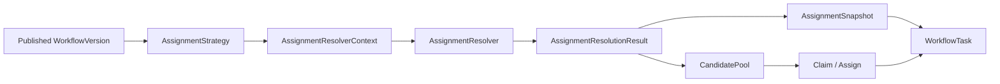
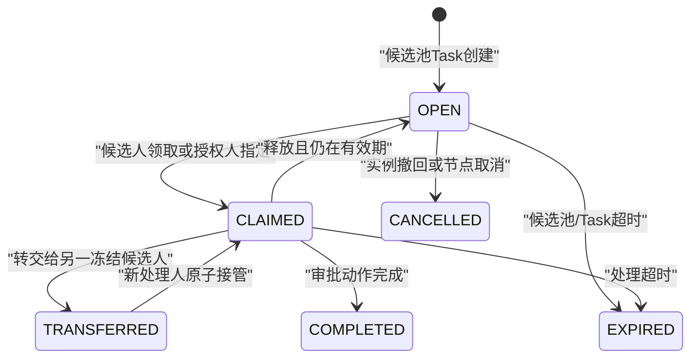

# Workflow Assignment Resolver设计

> Sprint：2-3.7-WF3.5
> 基线：V2.6.2 / `ASSIGNMENT_SNAPSHOT_FOUNDATION_FROZEN`
> 状态：`DESIGN_FROZEN / NO_CODE / NO_MIGRATION`
> 范围：多策略解析、候选池和Claim机制设计；不实现ROLE/POSITION/ORG解析。

## 1. 设计结论

1. 保留现有 `AssignmentStrategy`、`AssignmentSnapshot` 和 `workflow_task`，Resolver是策略与主数据之间的新端口，不替代Task或Snapshot。
2. `Strategy`回答“按什么规则分配”，`Resolver`回答“规则在当前目录水位下解析出哪些候选人”，`Snapshot`冻结解析证据，`Task`承载当前可处理状态。
3. USER显式分配保持兼容：输入唯一userId，结果仍写入 `workflow_task.assignee_user_id`，并生成V2.6.2快照。
4. ROLE、POSITION、ORG仅冻结接口和语义；未经独立实现、数据权限审计和真实数据库验收不得注册到运行时ResolverRegistry。
5. 多候选解析不等于自动选人。Resolver只能产生冻结候选池，最终处理人必须通过Claim或受审计的Assign确定。
6. RBAC权限、候选资格和具体Task处理权相互独立，任何一项均不能替代其他门禁。

## 2. 领域模型

### 2.1 模型关系



依赖方向：

- Domain只定义Strategy、Resolver端口、上下文、结果和候选值对象；禁止依赖Spring、MyBatis或系统Entity。
- Application负责选择Resolver、建立事务边界、规范化结果、生成Snapshot和Task。
- Infrastructure Adapter只读访问用户、角色、岗位和组织主数据。
- Resolver不得保存Task、推进NodeExecution、授予权限或修改业务模块状态。

### 2.2 AssignmentResolver

建议领域端口：

```text
interface AssignmentResolver {
    AssignmentType supportedType();
    String resolverVersion();
    AssignmentResolutionResult resolve(
        AssignmentResolverContext context,
        AssignmentTarget target
    );
}
```

约束：

- 一个Resolver只处理一种明确类型。
- `supportedType + resolverVersion`必须稳定且可审计。
- 输入相同、目录修订号相同，规范化结果必须相同。
- 不支持的类型必须返回稳定错误，不允许回退为任意用户或发起人。
- Resolver输出候选集合，不选择“第一个”“最年轻”或其他隐式最终处理人。

### 2.3 AssignmentResolverContext

在现有 `AssignmentContext` 基础上扩展解析所需只读上下文，建议包含：

| 字段 | 说明 |
| --- | --- |
| `taskId/instanceId/versionId/nodeId/nodeExecutionId` | Workflow运行归属 |
| `enterpriseId` | 企业隔离边界 |
| `initiatorUserId/initiatorOrgId` | 发起上下文 |
| `currentOrgId/allowedOrgIds` | 数据权限边界快照 |
| `businessType/businessId` | 只用于规则上下文，不允许Resolver跨域修改业务 |
| `strategyType/selectionMode` | 策略及DIRECT/CANDIDATE_POOL模式 |
| `ruleSnapshot/ruleHash` | 已发布版本中的规范化规则 |
| `directoryRevision` | 主数据目录修订号或一致性水位 |
| `resolveTime` | 解析时间 |
| `resolvedBy/traceId` | 服务身份与链路标识 |

上下文不得携带密码、Token、身份证号等敏感数据。业务变量只允许白名单字段。

### 2.4 AssignmentResolutionResult

Resolver成功结果建议包含：

| 字段 | 说明 |
| --- | --- |
| `strategyType/targetType` | USER/ROLE/POSITION/ORG |
| `resolverVersion` | 实际解析器版本 |
| `assignmentReason` | 稳定原因代码及脱敏说明 |
| `ruleSnapshot/ruleHash` | 本次解析使用的规则证据 |
| `targetSnapshot` | 稳定业务键和显示信息快照 |
| `candidates` | 规范化、去重、稳定排序的候选集合 |
| `candidateSnapshot/candidateSetHash` | 候选集合证据 |
| `generatedTime/validUntil` | 生成时间和可Claim有效期 |
| `directoryRevision` | 解析所依据的主数据水位 |
| `filterSummary` | 失效、停用、越界等过滤计数，不暴露敏感详情 |

失败结果不生成Task；以稳定错误码区分目标不存在、候选为空、目录不可用、越界、配置非法和结果过大。

## 3. 流程模型

### 3.1 解析与任务创建

```text
NodeExecution进入
  -> 读取发布版本中的AssignmentStrategy
  -> 构造AssignmentResolverContext
  -> ResolverRegistry按类型和版本选择Resolver
  -> Resolver读取目录并返回AssignmentResolutionResult
  -> 规范化、去重、排序、限额和Hash校验
  -> 生成AssignmentSnapshot及CandidatePool
  -> DIRECT：写入唯一assignee
     CANDIDATE_POOL：assignee暂空，等待Claim/Assign
  -> 同事务保存Task、Snapshot、Candidate明细
```

V2.6.2当前生产行为仍仅走USER + DIRECT。候选池模式必须等后续Task状态、Claim事务和数据库结构完成后才能启用。

### 3.2 Strategy、Resolver、Snapshot、Task职责

| 对象 | 权威职责 | 禁止职责 |
| --- | --- | --- |
| Strategy | 冻结目标类型、目标键、选择模式、范围和失败策略 | 查询人员、创建Task |
| Resolver | 将目标规则解析为候选集合 | 自动选定最终处理人、授予RBAC |
| Snapshot | 不可变保存规则、解析器和候选证据 | 表示当前Claim状态 |
| CandidatePool | 表示谁在有效期内可Claim | 覆盖初始解析证据 |
| Task | 保存当前assignee、状态、时限和可执行动作 | 动态重算历史候选来源 |

### 3.3 失败与重试

- 目录临时不可用：整体回滚，返回可重试错误；不得生成开放Task。
- 规则无效或候选为空：整体回滚，返回不可重试业务错误。
- 解析超时：取消本次解析，不接受迟到结果。
- 重试必须使用相同业务幂等键；相同目录修订号的结果Hash应一致。
- 若目录修订号变化，必须形成新的解析尝试审计，不能覆盖已经创建的Task快照。

## 4. 策略扩展方案

### 4.1 USER

- 输入：稳定userId或userCode。
- Resolver职责：校验用户存在、启用、企业及组织边界有效。
- 结果：必须恰好一个候选，选择模式固定DIRECT。
- 兼容：现有 `ExplicitUserAssignmentStrategy` 行为保持不变；后续可用UserResolver增强有效性校验，但不得改变已冻结Task。

### 4.2 ROLE

- 输入：稳定roleCode、可选组织范围和成员口径。
- Resolver接口：`RoleAssignmentResolver`。
- 结果：该角色下满足账号、企业、组织和数据范围条件的候选集合。
- 限制：ROLE是业务分配目标；拥有该角色不等于拥有 `workflow:approve`。
- 本Sprint不实现，也不加入ResolverRegistry。

### 4.3 POSITION

- 输入：稳定positionCode、组织范围、是否接受代理岗等显式规则。
- Resolver接口：`PositionAssignmentResolver`。
- 结果：在岗、有效且满足组织边界的用户集合。
- 多岗、空岗、兼职、代理和任期失效必须有确定语义，禁止按岗位名称模糊匹配。
- 本Sprint不实现，也不加入ResolverRegistry。

### 4.4 ORG

- 输入：稳定orgCode、成员口径和是否包含下级。
- Resolver接口：`OrgAssignmentResolver`。
- 默认仅直属有效成员；包含下级必须显式配置并参与ruleHash。
- 必须限制最大组织节点数和候选人数，防止全企业误授权。
- 本Sprint不实现，也不加入ResolverRegistry。

### 4.5 ResolverRegistry

Registry属于Application装配能力：

- 按 `AssignmentType + resolverVersion` 唯一注册；重复注册启动失败。
- 未注册类型发布校验失败或运行时硬失败，不允许fallback。
- 只注册已通过安全测试和数据权限测试的Resolver。
- 禁止Domain通过Spring容器动态查找Bean。

## 5. Candidate Pool设计

### 5.1 候选人模型

建议值对象 `AssignmentCandidate`：

| 字段 | 说明 |
| --- | --- |
| `candidateUserId` | 用户逻辑ID |
| `candidateUserKey` | 稳定用户业务键快照 |
| `candidateNameSnapshot` | 脱敏显示名称，仅审计展示 |
| `sourceType` | USER/ROLE/POSITION/ORG |
| `sourceKey` | roleCode/positionCode/orgCode/userCode |
| `sourceRuleHash` | 候选来源规则Hash |
| `generatedTime` | 候选生成时间 |
| `validUntil` | 可Claim截止时间；DIRECT可为空 |
| `rank` | 稳定展示顺序，不代表自动择优 |
| `rankBasis` | 排序依据代码，如USER_ID_ASC |
| `directoryRevision` | 目录水位 |

### 5.2 规范化规则

- 按userId去重；同一用户多来源时保留来源列表或独立来源明细。
- 排序必须显式、稳定并写入 `rankBasis`；禁止依赖数据库无序返回。
- `candidateSetHash`只包含稳定字段，不包含数据库行ID、创建时间、显示名称或审计时间。
- 候选池一旦绑定Task即不可重算覆盖。人员离职、停用或权限撤销时，由Claim门禁进行实时资格复核并记录拒绝原因。
- 候选列表API必须分页、脱敏且仅对有权用户开放。

### 5.3 有效期

- `generatedTime`记录解析完成时间。
- `validUntil`由发布版本规则明确；为空表示跟随Task截止时间。
- Claim时同时校验候选快照有效期、Task `due_time` 和用户当前有效状态。
- 过期不自动把资格转给任意人；必须进入超时策略或人工处置流程。

## 6. Claim状态模型

### 6.1 状态机



CandidatePool状态是分配子域状态；Task继续使用现有 `PENDING/CLAIMED/APPROVED/REJECTED/CANCELLED/EXPIRED`。两者必须在同一事务保持一致。

### 6.2 领取Claim

领取必须同时满足：

```text
workflow:claim 功能权限
AND 用户存在于冻结候选池
AND 候选池及Task未过期
AND Task为PENDING且assignee为空
AND Instance数据范围允许
AND 用户当前账号有效
AND 职责分离/风险门禁允许
AND 幂等键与乐观锁成功
```

成功后原子更新Task为CLAIMED、写入 `assignee_user_id/claimed_time/version` 并追加Claim审计事件。两个用户并发领取时只能一人成功。

### 6.3 指定Assign

- 仅具备专用 `workflow:assign` 权限且在该Task管理范围内的用户可指定。
- 被指定人必须属于冻结候选池；禁止任意输入userId绕过Resolver。
- `workflow:manage`不自动包含Assign权限，更不包含审批权。
- 必须记录指定人、被指定人、原因、依据、时间和traceId。

### 6.4 超时

- OPEN超时：Task转EXPIRED或进入明确的升级策略；不得静默扩大候选池。
- CLAIMED超时：记录超时事件，后续是否释放由发布版本策略决定。
- 自动升级、催办和重新解析不属于WF3.6默认范围。

### 6.5 转交Transfer

- 当前assignee或有专用权限的管理人可发起。
- 新处理人必须是原冻结候选池成员且实时有效。
- 在同一事务中结束原Claim、追加TRANSFER事件并建立新Claim。
- 不修改初始AssignmentSnapshot和Candidate快照。
- 禁止转交给发起人或其他受职责分离规则限制的人员。

## 7. 审计设计

每次解析必须保存：

| 审计项 | 说明 |
| --- | --- |
| `assignment_reason` | `EXPLICIT_USER/ROLE_MEMBERSHIP/POSITION_HOLDER/ORG_MEMBER`等稳定代码 |
| `resolver_version` | 解析器语义版本，不使用应用构建时间代替 |
| `rule_snapshot` | 发布版本中的规范化规则 |
| `rule_hash` | 规则SHA-256 |
| `candidate_snapshot` | 规范化候选摘要或候选明细引用 |
| `candidate_set_hash` | 稳定候选字段摘要 |
| `directory_revision` | 用户/角色/岗位/组织主数据水位 |
| `resolved_by/resolve_time` | 服务身份和解析时间 |
| `trace_id` | 跨服务审计关联 |

Claim、指定、释放、转交、超时和拒绝均采用追加事件，禁止覆盖原始快照或删除历史事件。审计日志不得记录Token、手机号、身份证号或完整目录响应。

## 8. V2.6.3数据库规划

V2.6.3仅为规划，本Sprint不创建SQL、不登记候选资产。

### 8.1 扩展 `workflow_task_assignment_snapshot`

建议以可空兼容列补充：

- `resolver_version VARCHAR(40)`
- `assignment_reason VARCHAR(64)`
- `selection_mode VARCHAR(30)`：DIRECT/CANDIDATE_POOL
- `rule_snapshot TEXT`
- `rule_hash CHAR(64)`
- `candidate_snapshot TEXT`
- `candidate_set_hash CHAR(64)`
- `candidate_generated_time DATETIME(3)`
- `candidate_valid_until DATETIME(3)`
- `directory_revision VARCHAR(100)`

V2.6.2历史USER快照保持NULL扩展字段，不根据当前目录自动回填。新写入要求完整字段，由更高版本CHECK约束按新旧记录类型兼容校验。

### 8.2 新表 `workflow_task_assignment_candidate`

| 字段组 | 主要字段 |
| --- | --- |
| 归属 | `id/snapshot_id/task_id/node_execution_id` |
| 候选 | `candidate_user_id/candidate_user_key/candidate_name_snapshot` |
| 来源 | `source_type/source_key/source_rule_hash` |
| 时效 | `generated_time/valid_until/directory_revision` |
| 排序 | `candidate_rank/rank_basis` |
| 审计 | created/updated、deleted、delete_token、version、trace_id |

约束与索引规划：

- 唯一 `(snapshot_id, candidate_user_id, delete_token)`；
- 唯一 `(snapshot_id, candidate_rank, delete_token)`；
- 索引 `(candidate_user_id, valid_until, deleted)` 支持本人候选待办；
- 复合外键确保Candidate、Snapshot、Task及NodeExecution归属一致；
- CHECK约束类型、rank、有效期、逻辑删除和乐观锁。

不建立到 `sys_user/sys_role/sys_org/hr_position` 的数据库外键，保持限界上下文隔离。

### 8.3 新表 `workflow_task_claim_event`

采用追加事件保留领取历史，当前处理人仍以 `workflow_task.assignee_user_id` 为权威。

建议字段：

- `id/event_no/task_id/assignment_snapshot_id`
- `event_type`：CLAIM/ASSIGN/RELEASE/TRANSFER/EXPIRE/CANCEL
- `from_user_id/to_user_id/operator_user_id/operator_org_id`
- `reason_code/reason/occurred_time`
- `idempotency_key/request_hash/trace_id`
- 通用审计、逻辑删除和乐观锁字段

约束规划：唯一 `(task_id, idempotency_key, delete_token)`；Task与Snapshot归属外键；事件类型、用户组合、逻辑删除和Hash格式CHECK；索引 `(task_id, occurred_time)` 与 `(to_user_id, event_type, occurred_time)`。

### 8.4 Migration边界

V2.6.3只允许：

1. 追加兼容字段；
2. 新增Candidate和Claim Event表；
3. 增加内部Workflow外键、唯一键、CHECK和索引；
4. 保存USER新任务的等价候选明细；
5. 不修改V2.6.2历史内容，不推断历史ROLE/POSITION/ORG来源；
6. 不包含Investment表变更，不实现Resolver或Claim业务代码；
7. RBAC新增权限建议使用独立更高Migration，避免结构和授权资产混合。

## 9. API规划

以下为后续规划，本Sprint不实现：

| 方法 | 路径 | 权限 | 说明 |
| --- | --- | --- | --- |
| GET | `/workflow/tasks/{taskId}/assignment` | `workflow:view` | 扩展返回Resolver版本、规则Hash和候选摘要 |
| GET | `/workflow/tasks/{taskId}/candidates` | `workflow:view` + Task范围 | 分页查询脱敏候选人 |
| GET | `/workflow/tasks/candidates/mine` | `workflow:view` | 查询本人仍有效的候选Task |
| POST | `/workflow/tasks/{taskId}/claim` | `workflow:claim` | 候选人原子领取 |
| POST | `/workflow/tasks/{taskId}/assign` | `workflow:assign` | 授权用户指定冻结候选人 |
| POST | `/workflow/tasks/{taskId}/release` | `workflow:claim` | 当前处理人释放未处理Task |
| POST | `/workflow/tasks/{taskId}/transfer` | `workflow:transfer` | 受审计转交给冻结候选人 |

所有命令要求幂等键；Controller不得直接更新Task、Candidate或Claim Event。

## 10. Investment三重一大适配

Investment保持业务限界上下文，不感知Resolver实现：

```text
InvestmentDecision提交
  -> WorkflowGateway启动已发布流程
  -> Workflow进入党委前置/董事会/经理层节点
  -> 节点AssignmentStrategy声明ROLE/POSITION/ORG目标
  -> Workflow Resolver在节点进入时解析并冻结候选池
  -> 候选人Claim或授权人Assign
  -> Workflow完成审批并通过事件回传结果
```

边界规则：

- Investment只传业务ID、快照ID、发起人、发起组织和白名单流程变量。
- Investment不得传最终审批人列表，也不得直接调用Resolver。
- 党委前置、董事会、经理层人员来源由Workflow发布版本定义。
- Workflow不直接修改Investment状态，只发送带幂等键和审计信息的流程事件。
- 三重一大节点可使用不同Resolver，但候选解析失败必须阻断节点进入，禁止跳过审批。

## 11. 风险控制

| 风险 | 等级 | 控制措施 |
| --- | --- | --- |
| RBAC被当作具体Task处理权 | P0 | RBAC、候选资格、Claim归属、数据范围和职责分离联合校验 |
| Resolver隐式自动选人 | P0 | Resolver只返回候选集合；禁止first/random/score自动选择 |
| 目录变化污染历史Task | P0 | 冻结目录水位、规则、候选集合和Hash，禁止覆盖重算 |
| ORG范围过大 | P0 | 显式下级规则、节点/候选限额、企业边界和数据权限过滤 |
| 并发Claim产生双处理人 | P0 | Task行锁、状态CAS、乐观锁、幂等事件和唯一约束 |
| 过期候选继续领取 | P1 | Claim时校验validUntil、Task dueTime和当前账号状态 |
| 角色/岗位名称模糊匹配 | P1 | 只接受稳定业务键，发布时校验 |
| Candidate API泄露人员数据 | P1 | 分页、最小字段、脱敏、数据范围和访问审计 |
| Resolver故障阻塞流程 | P1 | 稳定错误分类、超时、熔断和显式重试；禁止开放Task降级 |
| 历史数据被伪造回填 | P1 | V2.6.2记录保持原样；无来源不推断 |

## 12. WF3.6实施边界

建议WF3.6只实现Resolver框架和USER兼容路径：

1. 新增 `AssignmentResolver`、`AssignmentResolverContext`、`AssignmentResolutionResult` 纯领域对象；
2. 实现受控ResolverRegistry与Application协调器；
3. 实现USER Resolver并与现有 `ExplicitUserAssignmentStrategy` 做等价双读/契约验证；
4. 为ROLE/POSITION/ORG仅提供端口或未注册占位，不提供主数据查询Adapter；
5. 如需数据库增量，仅生成V2.6.3候选，不执行或晋级；
6. 覆盖确定性、候选去重排序、超限、候选为空、越界、超时和事务回滚测试；
7. 不开放Claim/Assign/Transfer写接口，Claim落地应进入后续独立Sprint；
8. 不修改Investment，不实现三重一大具体人员解析。

WF3.6完成前，运行时仍只允许显式USER + DIRECT。ROLE/POSITION/ORG、候选池和Claim均保持关闭。

## 13. 设计冻结结论

多策略Assignment Resolver、Candidate Pool、Claim状态机、审计字段、V2.6.3数据库边界和Investment适配方式已完成设计。当前系统行为不变：V2.6.2继续使用显式USER分配快照；任何多策略解析或多人候选处理必须经过后续独立实现和验收。
