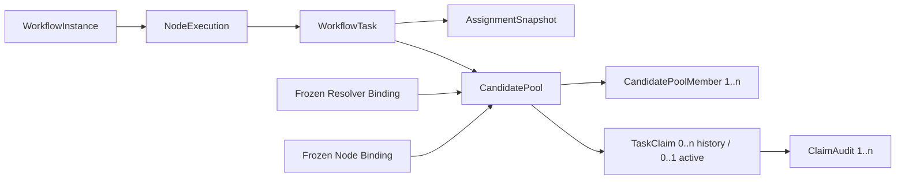
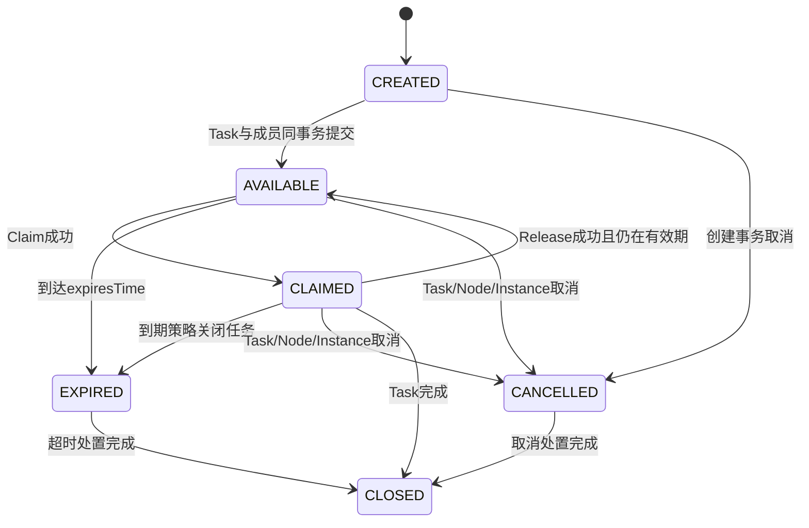
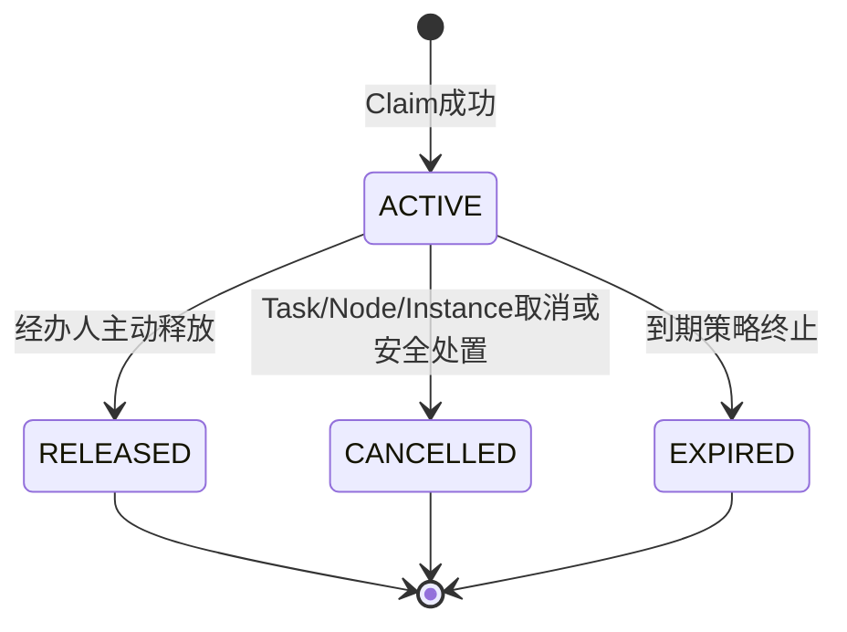

# Workflow Candidate Pool + Claim Governance Design

> Sprint：2-3.7-WF4.0
> 基线：V2.6.5 Multi-Resolver Binding Foundation Frozen
> 状态：`DESIGN_FROZEN / IMPLEMENTATION_NOT_STARTED`

## 1. 背景

V2.6.5 已具备实例级 Resolver Binding Set、节点级 Resolver Binding、Resolver 版本与契约冻结、线性多节点运行和 Assignment Snapshot。现有可执行路径仍是 `EXPLICIT_USER_V1 + USER + DIRECT`：Resolver 得到单一用户，Task 创建时直接写入 `assignee_user_id`。

ROLE、POSITION、ORG Resolver 将产生多名候选人，不能隐式选择最终审批人，也不能把 RBAC 权限等同于任务经办资格。因此需要在 Resolver 与 Task 经办人之间建立 Candidate Pool，并通过 Claim 在运行时竞争取得经办权。

本设计冻结以下不变量：

1. Resolver 只生成候选集合，不选择最终审批人。
2. Candidate Pool 是 Task 创建事务内冻结的解析结果，提交后不可增补或重算。
3. 人员新增、调岗不能进入旧池；池中人员在 Claim 时仍需通过实时资格校验。
4. Claim 只授予当前 Task 经办权，不授予业务决策权，不代表集体决策结论。
5. `workflow:approve` 只是功能准入，不能替代候选资格、任务归属、数据权限和职责分离校验。
6. USER + DIRECT 与 Legacy 路径保持原行为，不补造 Candidate Pool。

## 2. Candidate Pool领域模型

### 2.1 CandidatePool

CandidatePool 是某个 Task 在某次节点执行中的不可变候选解析结果。

| 属性 | 语义 |
|---|---|
| poolId | 候选池技术标识，不参与 Hash |
| taskId | 唯一归属 Task |
| nodeExecutionId | 节点执行记录 |
| instanceId | Workflow Instance |
| resolverBindingId | V2.6.5 冻结 Resolver Binding |
| assignmentSnapshotId | 对应 Assignment Snapshot |
| strategyType | ROLE/POSITION/ORG；未来扩展值必须版本化 |
| resolverCode/resolverVersion | 实例冻结的 Resolver 精确版本 |
| contractHash | Resolver 契约摘要 |
| ruleHash | 节点冻结规则摘要 |
| candidateCount | 冻结成员数量，必须大于零 |
| generatedTime | 解析完成时间，仅审计，不参与 Pool Hash |
| effectiveTime/expiresTime | 池的生效与失效窗口 |
| poolHash | 规范化候选集合 SHA-256 |
| status | CREATED/AVAILABLE/CLAIMED/EXPIRED/CANCELLED/CLOSED |

聚合约束：

- 一个 `CANDIDATE_POOL` Task 只能有一个活动 CandidatePool。
- Pool 必须与 Task、NodeExecution、Instance、Definition Version、Node Binding 属于同一冻结链。
- Pool 保存的 Resolver Code、Version、Contract Hash、Rule Hash 必须与 V2.6.5 Binding 完全一致。
- 候选人数为零时不得创建可领取 Task；节点启动事务失败并回滚。
- Pool 发布为 AVAILABLE 后，成员和 Pool Hash 均不可修改。

### 2.2 CandidatePoolMember

| 属性 | 语义 |
|---|---|
| candidateUserId | 用户逻辑标识；参与 Hash |
| sourceType | ROLE/POSITION/ORG |
| sourceRef | 冻结来源业务键，不动态关联当前关系 |
| orgIdSnapshot | 生成时组织快照 |
| positionIdSnapshot | 生成时岗位快照，可空 |
| roleIdSnapshot | 生成时角色快照，可空 |
| eligibilitySnapshot | 生成时资格事实的规范化快照 |
| eligibilityHash | 资格快照 SHA-256 |
| sortOrder | 确定性排序序号 |
| generatedTime | 生成时间 |
| status | INCLUDED/CANCELLED/SECURITY_BLOCKED |

人员离职、停用或调岗不会删除或改写 INCLUDED 记录。其历史候选资格仍可审计，但实时资格校验会拒绝 Claim。只有安全处置或整个 Pool 取消时，才允许以审计命令将成员标记为 SECURITY_BLOCKED/CANCELLED；不得用该状态模拟人员主数据变化。

### 2.3 聚合关系



## 3. Candidate生命周期

### 3.1 状态机



### 3.2 生命周期语义

- **生成**：Resolver 在 NodeExecution 创建 Task 的同一事务中解析候选人、排序、生成成员快照和 Pool Hash。
- **生效**：Task、Assignment Snapshot、Pool 和全部成员持久化成功后，Pool 从 CREATED 变为 AVAILABLE；CREATED 不对 API 可见。
- **领取**：AVAILABLE 且处于有效时间窗时可以 Claim；成功后 Pool 变为 CLAIMED。
- **释放**：未产生审批动作、任务仍可处理且实时规则允许时，活动 Claim 变为 RELEASED，Pool 回到 AVAILABLE。
- **失效**：到期后变为 EXPIRED，不自动加入新人、不自动重算。
- **关闭**：Task 完成、节点取消或实例终止后进入 CLOSED；CANCELLED/EXPIRED 是业务原因状态，CLOSED 是处置完成状态。

禁止从 EXPIRED、CANCELLED、CLOSED 恢复到 AVAILABLE。确需恢复时应创建新的任务轮次和新的 Candidate Pool。

## 4. Claim领域模型

### 4.1 TaskClaim

TaskClaim 是对一次领取生命周期的记录。一个 Task 可有多次历史 Claim，但最多一个活动 Claim。

| 属性 | 语义 |
|---|---|
| claimId/claimNo | 技术标识和稳定业务编号 |
| taskId/poolId/memberId | 任务、候选池、候选成员 |
| claimantUserId | Claim 用户，必须等于成员用户 |
| status | ACTIVE/RELEASED/CANCELLED/EXPIRED |
| claimTime | 成功领取时间 |
| releaseTime/terminalTime | 释放或终止时间 |
| idempotencyKey | 客户端幂等键，大小写敏感 |
| eligibilityResultSnapshot | 实时资格校验结果摘要 |
| assignmentReason | 分配与领取原因 |
| traceId | 链路标识 |
| taskVersionBefore/After | CAS 与审计依据 |

### 4.2 ClaimContext

ClaimContext 至少包含：当前用户、Task、NodeExecution、Instance、CandidatePool、CandidateMember、当前时间、RBAC 权限、实时账号/员工/组织/岗位事实、数据范围、职责分离事实、TraceId 和 IdempotencyKey。它是 Application 层组装的命令上下文，不由 Controller 信任客户端传入的身份事实。

### 4.3 ClaimResult

返回 `CLAIMED`、`IDEMPOTENT_REPLAY` 或明确拒绝码。拒绝不得返回其他候选人的手机号、组织关系等敏感信息。成功结果包含 Task ID、Claim ID、Task/Pool 状态、经办用户和版本，不返回可修改的规则快照。

### 4.4 强制门禁顺序

Claim 必须依次校验：

1. Workflow 功能 RBAC（例如 `workflow:approve`）；
2. Candidate Pool 成员资格；
3. Candidate Member 冻结状态为 INCLUDED；
4. 用户账号及员工实时启用状态；
5. 当前组织、岗位/任职有效状态；
6. 当前数据范围允许处理该业务关联；
7. SegregationOfDutiesPolicy 通过；
8. Task 为 PENDING 且 assignmentMode=CANDIDATE_POOL；
9. NodeExecution 为 ACTIVE；
10. WorkflowInstance 为可运行状态；
11. Pool 为 AVAILABLE、未过期且 Hash 校验通过。

任一项失败均拒绝 Claim，记录脱敏拒绝审计，不改变 Task、Pool 或 assignee。

## 5. Claim状态机



- ACTIVE Claim 与 Task.CLAIMED、`assignee_user_id=claimantUserId` 必须同时提交。
- RELEASE 后 Task 从 CLAIMED 回到 PENDING、清空 assignee/claimed_time，Pool 回到 AVAILABLE；审批动作产生后禁止释放。
- 本阶段不开放转办。未来转办必须是“终止旧 Claim + 创建新 Claim”的单事务显式动作，不能直接更新 assignee。
- 管理员强制指定不进入首期实现。未来如引入，仍必须具备候选资格或走单独的安全例外审批，并生成完整审计，禁止直接改库。
- Claim 后的业务审批仍需再次校验 Task 归属、账号状态、RBAC、数据权限和职责分离。权限或人员状态变化不会自动转交，只会阻断处理并进入人工处置。

## 6. 并发模型

### 6.1 单赢家协议

多个候选人同时 Claim 时只能一个成功。推荐同时使用：

1. `SELECT workflow_task ... FOR UPDATE` 锁定 Task；
2. 按固定顺序锁定 NodeExecution、CandidatePool、CandidateMember；
3. 校验 Task 版本和状态；
4. 写入具有“每 Task 至多一个活动 Claim”唯一约束的 TaskClaim；
5. CAS 更新 Task 为 CLAIMED 并写入 assignee；
6. 更新 Pool 为 CLAIMED；
7. 写入 Claim Audit；
8. 同一事务提交。

固定锁顺序：`WorkflowInstance → NodeExecution → WorkflowTask → CandidatePool → CandidatePoolMember → TaskClaim`。其他 Workflow 命令必须遵守相同顺序，降低死锁风险。

### 6.2 幂等与冲突

- `(task_id, idempotency_key)` 唯一；相同用户、相同键重试返回原 Claim 结果。
- 不同用户并发时，活动 Claim 唯一键和 Task 乐观锁提供最终防线。
- 先查后写但不加锁属于禁止实现。
- 唯一键冲突后必须重新读取已提交 Claim：若属于同一幂等请求则返回幂等结果，否则返回 `TASK_ALREADY_CLAIMED`。
- 任一资格审计、Claim、Task 或 Pool 写入失败时全部回滚。

## 7. DIRECT兼容

任务明确分为两种 Assignment Mode：

| 模式 | Task创建 | assignee_user_id | Candidate Pool | Claim |
|---|---|---:|---|---|
| DIRECT | Resolver 得到唯一用户 | 创建时非空 | 不创建 | 不需要 |
| CANDIDATE_POOL | Resolver 得到冻结候选集合 | 创建时为空 | 必须存在 | 成功后写入 |

`EXPLICIT_USER_V1 + USER + DIRECT` 行为完全不变，继续沿用现有 Task、Assignment Snapshot 和审批权限校验。DIRECT Task 调用 Claim API 必须返回 `CLAIM_NOT_REQUIRED`，不得偷偷创建 Pool 或改写任务模式。

为避免通过字段空值猜测模式，V2.6.6 规划给 `workflow_task` 增加显式 `assignment_mode`。历史数据只做确定性回填为 DIRECT，不补造 Candidate Pool。

## 8. ROLE/POSITION/ORG边界

本 Sprint 不实现任何 Resolver，仅冻结统一输出契约：

```text
ROLE Resolver      ┐
POSITION Resolver  ├─> CandidatePoolDraft -> freeze -> CandidatePool
ORG Resolver       ┘
```

- Resolver 输入只能使用实例和节点冻结的 Binding/Rule Snapshot，以及有版本或有效时间语义的主数据查询端口。
- Resolver 输出 CandidatePoolDraft，包含候选逻辑用户、来源、资格事实和确定性排序；不得输出最终 assignee。
- Workflow 校验、去重、Hash、冻结并持久化候选池。
- 解析为空、主数据不可用、契约 Hash 不匹配或 Resolver 退役但实例绑定不可执行时，节点启动失败，不允许 fallback。
- ROLE/POSITION/ORG 的实际语义、主数据权威来源和人员解析实现属于后续独立 Sprint。

## 9. 实时资格校验

候选资格分为两个正交维度：

- **Frozen Eligibility**：Pool 生成时“谁符合规则”，是不可变审计事实。
- **Runtime Executability**：Claim/审批动作发生时“此人现在是否仍可执行”，是实时安全判断。

| 变化 | 旧Pool成员记录 | Claim结果 | 是否加入替代人员 |
|---|---|---|---|
| 新员工/新任职 | 不变 | 原候选照常校验 | 否 |
| 离职/账号停用 | 保留 INCLUDED | 拒绝 | 否 |
| 调离目标组织/岗位 | 保留快照 | 拒绝 | 否 |
| 角色撤销 | 保留快照 | ROLE来源或RBAC不满足时拒绝 | 否 |
| 数据范围收窄 | 保留快照 | 拒绝 | 否 |
| Resolver版本退役 | Pool不变 | 已冻结且运行策略允许时按精确版本；不可用则安全阻断 | 否 |

所有实时校验应返回稳定 reason code；审计保存判定摘要，不保存密码、Token、身份证或完整敏感主数据。

## 10. 职责分离

定义纯领域端口 `SegregationOfDutiesPolicy.evaluate(context)`，返回 allow/deny、策略代码、策略版本、命中规则和证据摘要。Workflow 只执行结果并留痕，不内置 Investment 业务语义。

至少预留：

- 发起人不能审批；
- 同一人不能连续处理敏感节点；
- 方案编制人与审批人分离；
- 尽调人员与最终决策人员分离。

Investment 负责定义三重一大相关策略、业务身份和事实；通过版本化策略引用/事实快照传给 Workflow。Workflow 不回查或修改 Investment 决策数据，策略不可用时对敏感节点 fail closed。

## 11. 审计模型

每次 Claim 尝试（成功、拒绝、幂等重放、释放、取消、过期）均生成不可变审计事件，至少记录：

- operator/claimant、Task、Pool、Member、Instance、NodeExecution；
- Resolver Code/Version、Contract Hash、Rule Hash、Pool Hash；
- 冻结资格摘要与实时资格摘要；
- RBAC、数据权限、职责分离的结果及 reason code；
- Claim 前后 Task/Pool 状态和版本；
- action、event_time、TraceId、IdempotencyKey；
- 管理操作的原因、授权人和关联审批依据（未来预留）。

审计记录只追加，不允许业务删除或覆盖。展示层按权限脱敏；IdempotencyKey 与 TraceId 使用大小写敏感字符集。

## 12. Hash规则

`candidate_pool_hash = SHA-256(UTF-8(canonical-json))`，输出严格为64位小写十六进制，数据库使用 `CHAR(64) CHARACTER SET ascii COLLATE ascii_bin`。

规范化对象按以下顺序组成：

1. Hash schema version；
2. Instance/Definition Version/Node 的稳定业务标识；
3. Resolver Code、Resolver Version、Contract Hash；
4. Strategy Type、Rule Version、Rule Hash；
5. Assignment Mode；
6. 成员数组，按 `sortOrder → candidateUserId → sourceType → sourceRef` 稳定排序；
7. 每个成员的 candidateUserId、sourceType、sourceRef、组织/岗位/角色逻辑快照、eligibilityHash、sortOrder。

不纳入 Hash：Pool/Member 数据库主键、created/updated time、generatedTime、操作人、TraceId、审计字段和数据库自增值。candidateUserId 等领域逻辑标识不是候选池行的技术主键，必须纳入成员身份摘要。

Hash 生成前统一 Unicode NFC、去除无语义空白、固定字段顺序、禁止浮点数和本地化时间格式。查询时可校验 Hash，发现漂移立即标记 SECURITY_BLOCKED 并禁止 Claim。

## 13. Legacy兼容

| 类型 | 识别方式 | 运行与展示 |
|---|---|---|
| SINGLE_NODE_LEGACY | 旧引擎模式/无新绑定 | 保持原处理路径，展示 `LEGACY_DIRECT_ASSIGNMENT` |
| USER + DIRECT | assignment_mode=DIRECT；已有 assignee | 不创建Pool、不需要Claim，展示 `DIRECT_ASSIGNMENT` |
| 新 Candidate Pool Task | assignment_mode=CANDIDATE_POOL | 必须存在完整Pool和成员，缺失即阻断 |

禁止为历史 Task 回填或推断 Candidate Pool，禁止根据 `candidate_snapshot` 伪造候选成员。查询投影允许统一返回 assignmentMode 和 compatibilityMode，但不得把 Legacy 数据包装成已冻结候选池。

## 14. API规划

### 14.1 查询候选池

`GET /workflow/tasks/{taskId}/candidates`

返回 Pool 状态、有效时间、候选总数、当前用户是否为候选及不可处理 reason code。候选明细只对具备任务管理审计权限的用户开放；普通候选人不能枚举其他候选人的敏感资料。

### 14.2 Claim

`POST /workflow/tasks/{taskId}/claim`

Header/Body 必须提供 IdempotencyKey；身份来自安全上下文。返回 ClaimResult。不得接受客户端提交 assigneeUserId、资格结果或 Pool Hash 覆盖值。

### 14.3 Release

`POST /workflow/tasks/{taskId}/release`

仅活动 Claim 经办人且尚未产生审批动作时允许；管理员处置未来使用独立 API 和权限，不复用该接口。

### 14.4 Claim历史

`GET /workflow/tasks/{taskId}/claim-history`

返回脱敏审计投影，要求 `workflow:view` 加任务可见性；完整安全判定仅审计角色可见。

所有写接口由 Application Service 执行状态机，Controller 不得直接修改 Task、Pool 或 assignee。

## 15. 数据库规划

本节仅规划，不创建 Migration。

### 15.1 V2.6.6：Candidate Pool Foundation

#### V2.6.5绑定约束增量兼容

V2.6.5 当前通过 CHECK 将 `workflow_instance_resolver_binding.resolver_mode` 限制为 DIRECT，并将 `workflow_node_resolver_binding_snapshot` 限制为 `USER + USER + DIRECT`。V2.6.6 若落地 Candidate Pool，必须在新增 Migration 中先按名称删除旧 CHECK，再创建受控组合约束：

- `USER + USER + DIRECT`：保持现有路径；
- `ROLE + ROLE + CANDIDATE_POOL`；
- `POSITION + POSITION + CANDIDATE_POOL`；
- `ORG + ORG + CANDIDATE_POOL`。

不得开放任意 strategy/target/mode 组合，不得修改 V2.6.5 文件本身。数据库允许组合不等于对应 Resolver 已可运行；Application 层仍须按已发布能力清单拒绝尚未实现的 ROLE/POSITION/ORG。V2.6.6 首轮可使用测试专用 Adapter 验证 Candidate Pool 基础设施，但不得把 Stub 注册到生产 Registry。

#### workflow_task增量

- 新增 `assignment_mode VARCHAR(30) NOT NULL DEFAULT 'DIRECT'`，CHECK：DIRECT/CANDIDATE_POOL。
- 历史 Task 确定性回填 DIRECT；迁移后移除依赖默认值的新写入歧义。
- 增加一致性 CHECK：DIRECT 必须遵循现有 assignee 语义；CANDIDATE_POOL 在 PENDING 时允许 assignee 为空，在 CLAIMED 时必须非空。跨表“必须存在Pool”由事务服务与一致性测试保证。

#### workflow_task_candidate_pool

核心字段：`id, pool_no, task_id, node_execution_id, instance_id, definition_version_id, node_id, resolver_binding_id, assignment_snapshot_id, strategy_type, resolver_code, resolver_version, contract_hash, rule_hash, candidate_count, generated_time, effective_time, expires_time, pool_hash, status, audit_info, created_by, created_time, updated_by, updated_time, deleted, delete_token, version`。

索引与约束：

- PK(id)，UNIQUE(pool_no)，UNIQUE(task_id, delete_token)；
- Owner复合唯一键供成员/Claim外键引用；
- Task、NodeExecution、Resolver Binding、Assignment Snapshot复合外键，阻断跨实例/版本引用；
- Hash为ascii_bin并有小写SHA-256 CHECK；
- strategy_type首期数据库可预留ROLE/POSITION/ORG，但代码未实现前禁止生成；
- status、candidate_count、时间窗口、deleted/delete_token、version CHECK；
- 常用索引：`(instance_id,status,deleted)`、`(expires_time,status,deleted)`。

#### workflow_task_candidate_member

核心字段：`id, pool_id, task_id, candidate_user_id, source_type, source_ref_snapshot, org_id_snapshot, position_id_snapshot, role_id_snapshot, eligibility_snapshot, eligibility_hash, sort_order, generated_time, status, audit_info`及统一审计/逻辑删除/乐观锁字段。

索引与约束：

- UNIQUE(pool_id, candidate_user_id, delete_token)；
- UNIQUE(pool_id, sort_order, delete_token)，保证确定性顺序；
- 复合外键保证 Pool 与 Task 一致；
- eligibility_hash使用ascii_bin和SHA-256 CHECK；
- source/status/deleted/delete_token/version CHECK；
- 查询索引：`(candidate_user_id,status,deleted)`、`(pool_id,status,sort_order,deleted)`。

V2.6.6 回滚边界：发布前备份；尚无 CANDIDATE_POOL Task 时可通过受控逆向脚本删除新增表、索引与 assignment_mode。产生候选池业务数据后禁止结构回滚，只允许前向修复。

### 15.2 V2.6.7：Claim Governance

#### workflow_task_claim

核心字段：`id, claim_no, task_id, pool_id, member_id, claimant_user_id, status, claim_time, release_time, terminal_time, assignment_reason, eligibility_result_snapshot, task_version_before, task_version_after, idempotency_key, trace_id, active_token`及统一审计/逻辑删除/乐观锁字段。

索引与约束：

- UNIQUE(claim_no)；
- UNIQUE(task_id, active_token)：活动Claim的active_token=0，终态设置为id，从数据库层保证单活动Claim；
- UNIQUE(task_id, idempotency_key, delete_token)，idempotency_key使用ascii_bin；
- 复合外键确保 Claim、Pool、Member、Task 属于同一链；
- status、时间组合、active_token、deleted/delete_token、version CHECK；
- 查询索引：`(claimant_user_id,status,claim_time,deleted)`、`(pool_id,status,deleted)`。

#### workflow_task_claim_audit

核心字段：`id, event_no, task_id, pool_id, claim_id(nullable), member_id(nullable), operator_user_id, event_type, result, reason_code, frozen_eligibility_snapshot, runtime_eligibility_snapshot, rbac_result, data_scope_result, sod_result, task_status_before, task_status_after, pool_status_before, pool_status_after, event_time, trace_id, idempotency_key, previous_event_hash, event_hash`及统一审计字段。

约束：UNIQUE(event_no)、事件幂等唯一键、必要外键、event/result/status/Hash CHECK。该表为追加式审计；业务服务禁止UPDATE/DELETE。`previous_event_hash/event_hash`用于未来审计链校验，不代表电子签名。

V2.6.7 回滚边界：产生 Claim 后不得删除表或恢复 Task assignee；发布失败采用关闭 Claim入口、保留审计、前向修复。严禁自动 Flyway repair/clean。

## 16. Investment边界

Investment 继续负责：三重一大业务路线、党委/董事会/经理层业务身份、职责分离规则、决策快照与结果、条件整改、风险门禁和业务审计。

Workflow 负责：Resolver Binding、Candidate Pool、Claim、Task、NodeExecution、Assignment Snapshot和Claim审计。Workflow 通过业务无关的策略契约接收职责分离结果，不直接读取或修改 Investment 表。

Claim 只表示某个自然人取得当前 Task 的经办权，不表示党委会、董事会或经理层已形成集体决策。集体决策需要独立的会议、表决、法定人数和决议模型，不能由单个 Claim/Approve 替代。

## 17. 风险清单

| 风险 | 控制措施 |
|---|---|
| 多人同时Claim | 行锁、固定锁序、活动Claim唯一键、Task CAS、幂等键 |
| 用户离职/停用 | Claim和审批动作时实时校验，fail closed |
| 用户调岗/权限撤销/数据范围变化 | 不改旧Pool；实时资格不通过即阻断 |
| Claim后角色变化 | 不自动转交；处理动作再次校验，进入审计处置 |
| 重复Claim | 幂等唯一键；同请求返回原结果，异请求返回冲突 |
| Claim释放 | 仅未产生审批动作时允许，单事务恢复Task/Pool |
| 任务撤回、节点或实例取消 | 终止活动Claim和Pool，禁止再次领取 |
| Resolver版本退役 | 继续使用实例冻结精确版本；实现不可用时安全阻断，不fallback |
| Pool Hash漂移 | 读取/Claim时校验，漂移即SECURITY_BLOCKED并告警 |
| 空候选池 | 节点启动失败并回滚，不创建悬空Task |
| 候选隐私泄露 | 候选列表最小披露、字段脱敏、审计权限隔离 |
| 历史任务不可解释 | 明确Legacy兼容状态，不补造Pool，保留原快照 |
| 死锁 | 全部写命令遵守统一锁顺序，有限重试并记录TraceId |
| 管理员绕过 | 不提供直接改assignee接口；例外处置必须独立授权与审计 |
| 主数据瞬时不可用 | 对Claim fail closed；不缓存为“允许”，保留可重试拒绝码 |

## 18. WF4.1实施准入条件

进入实现前必须全部满足：

1. 本文领域模型、状态机、锁顺序和 Investment 边界完成评审并冻结；
2. 明确 V2.6.6 只实现 Candidate Pool 数据底座，V2.6.7 再实现 Claim，禁止混合历史 Migration；
3. 完成 workflow_task assignment_mode 与现有状态约束的真实数据兼容审计；
4. 对 V2.6.5 的 DIRECT/USER CHECK 做真实 Schema 审计，冻结“按名称替换约束”的 V2.6.6 SQL 方案；
5. 确认候选用户、员工、组织、岗位和角色的权威查询端口及实时有效性语义；
6. 定义 `workflow:claim`、`workflow:claim:release`、`workflow:claim:audit` 权限，但确认权限不替代候选资格；
7. 定义 Pool/Member/Claim/Audit 的规范化JSON与Hash测试向量；
8. 准备并发双会话、事务回滚、人员状态变化和跨实例/版本负向测试；
9. 准备 Fresh 与 V2.6.5 Upgrade 的一次性 MySQL 8/Flyway 验收方案；
10. 明确首个实现仍不包含ROLE/POSITION/ORG Resolver业务解析，可使用受控Stub验证池机制；
11. 禁止在候选池/Claim稳定前接入Investment真实三重一大流程。

## 19. 验收矩阵

| 编号 | 验收项 | 预期 |
|---|---|---|
| CP-01 | 相同Binding、规则、成员与排序生成Pool | Hash完全一致 |
| CP-02 | 修改Resolver版本/规则/成员/排序/资格摘要 | Hash必须变化 |
| CP-03 | Pool发布后增删成员 | 拒绝 |
| CP-04 | 新员工加入目标组织后查询旧Pool | 不进入旧Pool |
| CP-05 | 候选人离职/停用/调岗后Claim | 拒绝且记录原因 |
| CP-06 | DIRECT Task执行 | 不创建Pool、不要求Claim、行为不变 |
| CP-07 | Legacy Task查询 | 显示LEGACY_DIRECT_ASSIGNMENT，不补造Pool |
| CL-01 | 合法候选人Claim | Task/Pool/Claim同事务成功 |
| CL-02 | 非候选人但有workflow:approve | 拒绝 |
| CL-03 | 候选人但无RBAC/数据权限 | 拒绝 |
| CL-04 | 职责分离命中 | 拒绝 |
| CL-05 | 两候选并发Claim | 仅一个成功，无重复聚合 |
| CL-06 | 相同IdempotencyKey重试 | 返回原结果，不重复写入 |
| CL-07 | Claim写入中途失败 | Task、Pool、Claim、Audit全部回滚 |
| CL-08 | 未产生审批动作时Release | Claim终态、Task回PENDING、Pool回AVAILABLE |
| CL-09 | 已产生审批动作后Release | 拒绝 |
| CL-10 | Claim后账号/权限失效再审批 | 阻断，不自动转交 |
| CL-11 | Task/Node/Instance取消 | 活动Claim和Pool终止，禁止再Claim |
| DB-01 | 跨Instance/Version/Task引用 | 外键或应用门禁拒绝 |
| DB-02 | 非法状态/Hash/delete_token/version | CHECK拒绝 |
| DB-03 | Fresh与Upgrade | Flyway validate/no-op通过且Schema指纹一致 |
| SEC-01 | 候选列表越权访问 | 拒绝或最小披露 |
| AUD-01 | 成功、拒绝、释放、并发冲突 | TraceId和判定摘要完整可追溯 |

## 20. 冻结声明

本 Sprint 只完成治理设计：未创建 V2.6.6/V2.6.7，未修改 Workflow 或 Investment 代码，未实现 Candidate Pool、Claim、ROLE/POSITION/ORG Resolver、转办、委托、超时、会签、条件路由或三重一大真实流程。

最终状态：`DESIGN_FROZEN / IMPLEMENTATION_NOT_STARTED`。
