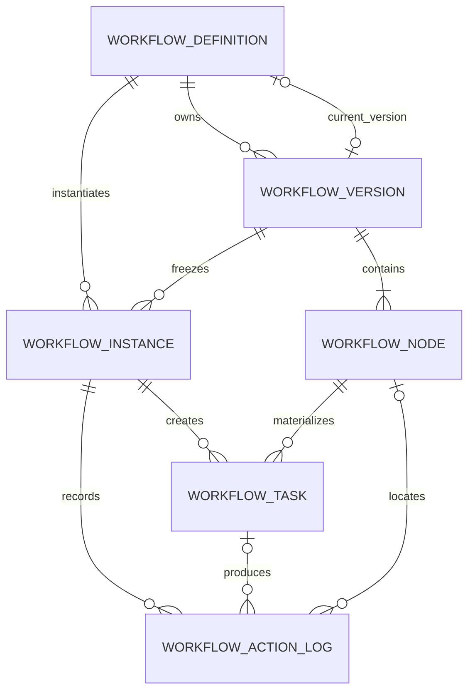

# 流程治理中心（Workflow Lite）数据库设计

> Sprint：2-3.7-WF0
> 状态：设计稿，不是可执行 Migration
> 基线约束：不得修改 V2.4.0—V2.4.9；本 Sprint 未创建、未执行任何数据库脚本。

## 1. 设计原则

- 表前缀统一为 `workflow_`，数据仍位于 `enterprise_platform`，通过模块边界而非跨库查询隔离；
- 主键 `BIGINT` 由平台 ID 生成器提供，不依赖数据库自增；
- 时间使用 `DATETIME(3)`，金额等业务字段不进入 Workflow 核心表；
- 状态值使用 `VARCHAR` + 应用枚举，MySQL 8 Migration 可增加 `CHECK`，国产库适配脚本使用等价约束；
- 规则和变量快照使用 `TEXT/LONGTEXT` 保存规范化 JSON，避免依赖 MySQL 原生 `JSON` 类型；
- 核心表统一保留 `create_time/create_by/update_time/update_by/deleted/delete_token/remark/version`；
- 有效数据唯一约束必须带 `delete_token`；逻辑删除时把 `delete_token` 更新为该行 ID；
- 外键只连接 Workflow 内部表。`sys_user`、`sys_org`、Investment 等跨模块引用均为逻辑引用，避免跨域耦合；
- `workflow_action_log` 逻辑上只追加，即使保留统一审计字段也禁止业务更新和删除。

## 2. ER 模型

循环引用处理：`workflow_definition.current_version_id` 初始允许为空，在 `workflow_version` 创建后通过后置 `ALTER TABLE` 增加外键；发布事务最后更新指针。

## 3. 统一审计字段

以下字段进入六张核心表；个别不可变表在应用层施加更严格规则。

| 字段 | 类型 | 空值/默认 | 说明 |
| --- | --- | --- | --- |
| `id` | `BIGINT` | PK, NOT NULL | 平台分布式主键 |
| `create_time` | `DATETIME(3)` | NOT NULL, CURRENT_TIMESTAMP(3) | 创建时间 |
| `create_by` | `VARCHAR(64)` | NULL | 创建人账号/稳定标识 |
| `update_time` | `DATETIME(3)` | NOT NULL, CURRENT_TIMESTAMP(3) | 更新时间，由应用填充 |
| `update_by` | `VARCHAR(64)` | NULL | 更新人 |
| `deleted` | `SMALLINT` | NOT NULL, 0 | 0 有效、1 已删除 |
| `delete_token` | `BIGINT` | NOT NULL, 0 | 有效行固定 0，删除后写入行 ID |
| `remark` | `VARCHAR(500)` | NULL | 非敏感备注 |
| `version` | `INT` | NOT NULL, 0 | 乐观锁，约束 `version >= 0` |

## 4. 表结构设计

### 4.1 workflow_definition

流程定义头，保存稳定身份及当前发布版本引用。

| 字段 | 类型 | 约束 | 说明 |
| --- | --- | --- | --- |
| `definition_code` | `VARCHAR(100)` | NOT NULL | 稳定流程编码，如 `investment-decision` |
| `definition_name` | `VARCHAR(200)` | NOT NULL | 流程名称 |
| `business_type` | `VARCHAR(64)` | NOT NULL | 适用业务类型 |
| `enterprise_id` | `BIGINT` | NOT NULL | 企业隔离标识，逻辑关联组织中心 |
| `owner_org_id` | `BIGINT` | NULL | 管理归属组织，逻辑关联组织中心 |
| `status` | `VARCHAR(20)` | NOT NULL | `DRAFT/ACTIVE/INACTIVE/ARCHIVED` |
| `current_version_id` | `BIGINT` | NULL | 当前发布版本，内部外键 |
| `description` | `VARCHAR(1000)` | NULL | 用途和边界说明 |

约束与索引：

- PK：`id`；
- UK：`(enterprise_id, definition_code, delete_token)`；
- IDX：`(business_type, status, deleted)`；
- IDX：`(owner_org_id, status, deleted)`；
- FK：`(id, current_version_id) -> workflow_version(definition_id, id)`，保证当前版本确属本定义，`ON DELETE RESTRICT`；
- CHECK：`deleted IN (0,1)`、状态白名单。

### 4.2 workflow_version

流程定义版本。发布后只读，内容哈希覆盖版本元数据与全部节点规范化内容。

| 字段 | 类型 | 约束 | 说明 |
| --- | --- | --- | --- |
| `definition_id` | `BIGINT` | NOT NULL, FK | 流程定义 ID |
| `version_no` | `INT` | NOT NULL, >0 | 定义内递增版本号 |
| `status` | `VARCHAR(20)` | NOT NULL | `DRAFT/PUBLISHED/RETIRED` |
| `schema_version` | `VARCHAR(30)` | NOT NULL | 节点/规则 Schema 版本 |
| `content_hash` | `VARCHAR(128)` | NULL | 发布时生成，草稿可空 |
| `change_note` | `VARCHAR(1000)` | NULL | 版本变更说明 |
| `effective_from` | `DATETIME(3)` | NULL | 生效时间 |
| `effective_to` | `DATETIME(3)` | NULL | 停止新实例时间 |
| `published_by` | `BIGINT` | NULL | 发布用户逻辑引用 |
| `published_time` | `DATETIME(3)` | NULL | 发布时间 |
| `source_version_id` | `BIGINT` | NULL, FK | 复制来源版本 |

约束与索引：

- UK：`(definition_id, version_no, delete_token)`；
- UK：`(definition_id, content_hash, delete_token)`，允许草稿空值；
- UK：`(definition_id, id)`，供定义当前版本和实例版本使用复合外键；
- IDX：`(definition_id, status, effective_from, deleted)`；
- FK：`definition_id -> workflow_definition.id`；
- FK：`source_version_id -> workflow_version.id`，可空；
- CHECK：版本号大于 0、生效区间合法、发布状态必须具有 `content_hash/published_by/published_time`。

### 4.3 workflow_node

已发布版本中的节点模板。

| 字段 | 类型 | 约束 | 说明 |
| --- | --- | --- | --- |
| `version_id` | `BIGINT` | NOT NULL, FK | 流程版本 ID |
| `node_code` | `VARCHAR(100)` | NOT NULL | 版本内稳定节点编码 |
| `node_name` | `VARCHAR(200)` | NOT NULL | 节点名称 |
| `node_type` | `VARCHAR(30)` | NOT NULL | `APPROVAL/COUNTERSIGN/CONDITION` |
| `node_order` | `INT` | NOT NULL | 展示和线性基准顺序 |
| `governance_node_type` | `VARCHAR(40)` | NOT NULL | `GENERAL_APPROVAL/PARTY_PRE_STUDY/BOARD_DECISION/MANAGEMENT_DECISION` |
| `approval_mode` | `VARCHAR(30)` | NOT NULL | `SINGLE/ALL/ANY/QUORUM` |
| `approval_threshold` | `DECIMAL(5,2)` | NULL | QUORUM 比例，0—100 |
| `assignment_rule_type` | `VARCHAR(30)` | NOT NULL | `USER/ORG/POSITION/ORG_POSITION/RULE` |
| `assignment_rule_config` | `TEXT` | NOT NULL | 规范化 JSON，按 `schema_version` 校验 |
| `entry_condition_config` | `TEXT` | NULL | 进入条件白名单配置 |
| `completion_condition_config` | `TEXT` | NULL | 完成条件白名单配置 |
| `timeout_minutes` | `INT` | NULL | 超时分钟数 |
| `withdraw_allowed` | `SMALLINT` | NOT NULL, 0 | 当前节点是否允许撤回 |
| `enabled` | `SMALLINT` | NOT NULL, 1 | 草稿节点启停标识 |

约束与索引：

- UK：`(version_id, node_code, delete_token)`；
- UK：`(version_id, node_order, delete_token)`；
- IDX：`(version_id, node_type, enabled, deleted)`；
- IDX：`(governance_node_type, deleted)`；
- FK：`version_id -> workflow_version.id`；
- CHECK：节点/审批/分配类型白名单，比例范围，布尔字段为 0/1，超时为正数。

首期用 `node_order` 支持线性和条件跳转预留；若后续出现复杂图结构，新增 `workflow_transition`，禁止把边集合塞入节点字符串。

### 4.4 workflow_instance

一次审批运行的权威记录。

| 字段 | 类型 | 约束 | 说明 |
| --- | --- | --- | --- |
| `instance_no` | `VARCHAR(100)` | NOT NULL | 对外稳定实例号 |
| `definition_id` | `BIGINT` | NOT NULL, FK | 定义 ID |
| `version_id` | `BIGINT` | NOT NULL, FK | 冻结版本 ID |
| `definition_code_snapshot` | `VARCHAR(100)` | NOT NULL | 定义编码快照 |
| `definition_version_no` | `INT` | NOT NULL | 版本号快照 |
| `business_type` | `VARCHAR(64)` | NOT NULL | 业务类型 |
| `business_id` | `VARCHAR(100)` | NOT NULL | 跨域业务 ID，按不透明字符串处理 |
| `business_key` | `VARCHAR(200)` | NOT NULL | 稳定业务键 |
| `enterprise_id` | `BIGINT` | NOT NULL | 企业隔离标识 |
| `snapshot_ref` | `VARCHAR(100)` | NULL | 业务不可变快照引用 |
| `snapshot_hash` | `VARCHAR(128)` | NULL | 业务快照哈希 |
| `attempt_no` | `INT` | NOT NULL, 1 | 同一业务重新提交序号 |
| `initiator_user_id` | `BIGINT` | NOT NULL | 发起人逻辑引用 |
| `initiator_org_id` | `BIGINT` | NOT NULL | 发起组织逻辑引用 |
| `current_node_id` | `BIGINT` | NULL, FK | 当前节点；并行节点时仅作主展示指针 |
| `status` | `VARCHAR(30)` | NOT NULL | `CREATED/RUNNING/APPROVED/REJECTED/WITHDRAWN/COMPLETED/EXCEPTION` |
| `result` | `VARCHAR(40)` | NULL | 最终流程结论 |
| `variables_snapshot` | `LONGTEXT` | NULL | 白名单流程变量规范化 JSON |
| `idempotency_key` | `VARCHAR(200)` | NOT NULL | 启动幂等键 |
| `request_hash` | `VARCHAR(128)` | NOT NULL | 启动请求哈希 |
| `event_sequence` | `BIGINT` | NOT NULL, 0 | 已生成事件水位 |
| `trace_id` | `VARCHAR(64)` | NULL | 启动链路 ID |
| `started_time` | `DATETIME(3)` | NULL | 开始时间 |
| `completed_time` | `DATETIME(3)` | NULL | 完成时间 |
| `withdrawn_time` | `DATETIME(3)` | NULL | 撤回时间 |

约束与索引：

- UK：`(instance_no, delete_token)`；
- UK：`(enterprise_id, idempotency_key, delete_token)`；
- UK：`(enterprise_id, business_type, business_id, attempt_no, delete_token)`；
- IDX：`(enterprise_id, status, update_time, deleted)`；
- IDX：`(business_type, business_key, attempt_no, deleted)`；
- IDX：`(initiator_user_id, status, update_time, deleted)`；
- FK：`definition_id -> workflow_definition.id`；
- 复合 FK：`(definition_id, version_id) -> workflow_version(definition_id, id)`，数据库强制版本归属；
- FK：`current_node_id -> workflow_node.id`；应用及一致性测试继续确保当前节点属于该版本。

### 4.5 workflow_task

节点实际任务，支持单签和会签并发。

| 字段 | 类型 | 约束 | 说明 |
| --- | --- | --- | --- |
| `task_no` | `VARCHAR(100)` | NOT NULL | 对外稳定任务号 |
| `instance_id` | `BIGINT` | NOT NULL, FK | 实例 ID |
| `node_id` | `BIGINT` | NOT NULL, FK | 节点模板 ID |
| `node_code_snapshot` | `VARCHAR(100)` | NOT NULL | 节点编码快照 |
| `node_name_snapshot` | `VARCHAR(200)` | NOT NULL | 节点名称快照 |
| `task_round` | `INT` | NOT NULL, 1 | 退回/重开后的任务轮次 |
| `participant_key` | `VARCHAR(128)` | NOT NULL | 会签参与人或候选集合稳定键 |
| `assignee_user_id` | `BIGINT` | NULL | 已指定/签收办理人逻辑引用 |
| `candidate_snapshot` | `TEXT` | NOT NULL | 组织岗位解析依据与候选人快照 |
| `status` | `VARCHAR(30)` | NOT NULL | `PENDING/CLAIMED/APPROVED/REJECTED/CANCELLED/EXPIRED` |
| `allowed_actions` | `VARCHAR(200)` | NOT NULL | 动作白名单快照 |
| `claimed_time` | `DATETIME(3)` | NULL | 签收时间 |
| `due_time` | `DATETIME(3)` | NULL | 到期时间 |
| `completed_by` | `BIGINT` | NULL | 完成人逻辑引用 |
| `completed_time` | `DATETIME(3)` | NULL | 完成时间 |
| `decision_result` | `VARCHAR(40)` | NULL | 审批结果 |

约束与索引：

- UK：`(task_no, delete_token)`；
- UK：`(instance_id, node_id, task_round, participant_key, delete_token)`；
- IDX：`(assignee_user_id, status, due_time, deleted)`；
- IDX：`(instance_id, status, create_time, deleted)`；
- IDX：`(node_id, status, deleted)`；
- FK：`instance_id -> workflow_instance.id`、`node_id -> workflow_node.id`；
- CHECK：轮次大于 0、状态白名单。

`candidate_snapshot` 只保存稳定 ID、规则版本和解析时间，避免保存手机号等个人敏感信息。

### 4.6 workflow_action_log

不可变审批行为与状态迁移记录。

| 字段 | 类型 | 约束 | 说明 |
| --- | --- | --- | --- |
| `instance_id` | `BIGINT` | NOT NULL, FK | 实例 ID |
| `task_id` | `BIGINT` | NULL, FK | 任务 ID |
| `node_id` | `BIGINT` | NULL, FK | 节点 ID |
| `action_type` | `VARCHAR(40)` | NOT NULL | `START/CLAIM/APPROVE/REJECT/WITHDRAW/CANCEL/TIMEOUT/SYSTEM_TRANSITION` |
| `actor_user_id` | `BIGINT` | NULL | 操作用户，系统动作可空 |
| `actor_org_id` | `BIGINT` | NULL | 操作时组织快照 |
| `actor_position_id` | `BIGINT` | NULL | 操作时岗位快照 |
| `from_status` | `VARCHAR(30)` | NULL | 迁移前状态 |
| `to_status` | `VARCHAR(30)` | NOT NULL | 迁移后状态 |
| `opinion_summary` | `VARCHAR(1000)` | NULL | 脱敏意见摘要 |
| `opinion_hash` | `VARCHAR(128)` | NULL | 完整意见哈希 |
| `reference_type` | `VARCHAR(50)` | NULL | 会议/文件等引用类型 |
| `reference_id` | `VARCHAR(100)` | NULL | 外部稳定引用 |
| `event_id` | `VARCHAR(100)` | NOT NULL | 对应领域事件 ID |
| `event_sequence` | `BIGINT` | NOT NULL | 实例内事件序号 |
| `request_id` | `VARCHAR(100)` | NULL | 幂等请求 ID |
| `payload_hash` | `VARCHAR(128)` | NULL | 动作请求规范化哈希 |
| `trace_id` | `VARCHAR(64)` | NULL | 链路 ID |
| `action_time` | `DATETIME(3)` | NOT NULL | 业务动作时间 |

约束与索引：

- UK：`(event_id, delete_token)`；
- UK：`(instance_id, event_sequence, delete_token)`；
- UK：`(request_id, action_type, delete_token)`，`request_id` 可空；
- IDX：`(instance_id, action_time, deleted)`；
- IDX：`(task_id, action_time, deleted)`；
- IDX：`(actor_user_id, action_time, deleted)`；
- IDX：`(action_type, action_time, deleted)`；
- FK：`instance_id -> workflow_instance.id`、`task_id -> workflow_task.id`、`node_id -> workflow_node.id`；
- 应用规则：INSERT ONLY，禁止 UPDATE/DELETE；修正采用新的补偿日志。

## 5. 外键与模块边界

| 来源 | 目标 | 类型 | 删除策略 |
| --- | --- | --- | --- |
| Version.definition_id | Definition.id | 物理外键 | RESTRICT |
| Node.version_id | Version.id | 物理外键 | RESTRICT |
| Instance.definition_id/version_id | Definition/Version.id | 物理复合外键，强制版本归属 | RESTRICT |
| Task.instance_id/node_id | Instance/Node.id | 物理外键 | RESTRICT |
| ActionLog.instance_id/task_id/node_id | Instance/Task/Node.id | 物理外键 | RESTRICT |
| enterprise/user/org/position/business/snapshot | 其他模块 | 逻辑引用 | 不建立外键；通过端口校验与对账 |

不使用级联删除。已发布版本、运行实例、任务和行为日志不允许物理删除。

## 6. Outbox/Inbox 兼容设计

六张核心表不承担消息队列职责。生产接入前必须增量设计 Workflow 自有可靠消息表：

- `workflow_event_outbox`：在实例/任务事务中保存待发布事件；
- `workflow_command_inbox`：保存启动、撤回、动作等外部命令的幂等处理结果；
- 可选 `workflow_reliability_audit`：重试、死信、重放和安全拒绝记录。

这些表不得复用 Investment 的 `investment_workflow_outbox/inbox`，也不得跨模块写入。字段规范沿用已验证的状态、租约、指数退避、哈希和重放审计设计。详细 SQL 留到 WF1，不在本 Sprint 创建。

## 7. Migration 规划

以下仅为版本计划，不代表已创建或已批准执行：

| 候选版本 | 内容 | 依赖 |
| --- | --- | --- |
| `V2.5.0` | definition、version、node | V2.4.9 |
| `V2.5.1` | instance、task、action_log 及内部外键 | V2.5.0 |
| `V2.5.2` | Workflow 自有 Outbox/Inbox 与可靠性审计 | V2.5.1 |
| `V2.5.3` | RBAC 权限与基础菜单种子 | V2.5.2 |
| `V2.5.4` | 标准模板种子（如投资决策模板），单独审批 | V2.5.3 |

规则：

- 历史 Migration 不可修改，候选 SQL 经评审后晋级正式扫描目录；
- 生产不随应用启动 Migration；按 pre-policy check → migrate → post strict validate 执行；
- 每版验证空库完整迁移与 V2.4.9 升级迁移，记录 checksum、Flyway history 和 Schema 指纹；
- 发布前备份；仅建表且无业务数据时可经审批回退，已有流程数据后采用前向修复，不 DROP；
- 国产数据库通过独立方言脚本转换 CHECK、时间默认值和索引语法，领域模型保持一致。

## 8. 数据库设计变化结论

本 Sprint 的数据库变化为 **0**。本文仅形成六张核心表和后续可靠消息表的设计候选；未创建 Migration、未修改数据库、未调整 V2.4.0—V2.4.9 checksum。

## 9. 风险清单

| 风险 | 处理建议 |
| --- | --- |
| Definition 与 current version 循环外键增加初始化复杂度 | 后置增加可空外键，发布事务最后更新 |
| `TEXT` 规则缺少数据库级 Schema 校验 | 应用白名单 Schema + 发布时内容哈希 + 契约测试 |
| 会签任务量增长 | 任务分页索引、批量生成、按实例归档 |
| 跨模块逻辑引用失效 | 启动时校验、保存快照、定期对账，不跨域级联删除 |
| CHECK 在国产库行为不一致 | 方言适配与应用枚举双重校验 |
| ActionLog 统一逻辑删除字段被误用 | Repository 仅暴露 append，审计规则禁止删改 |
