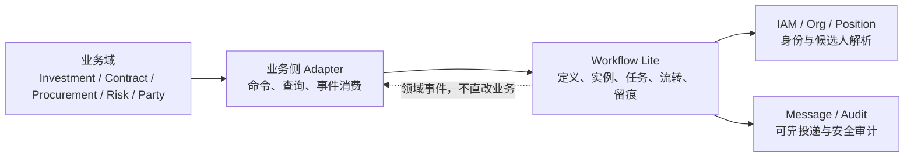

# 流程治理中心（Workflow Lite）领域设计

> Sprint：2-3.7-WF0
> 文档状态：架构设计冻结候选
> 适用版本：`v2.4.9-workflow-integration-rc1` 之后的增量能力
> 本文不授权修改冻结代码、Investment 代码或 V2.4.0—V2.4.9 历史 Migration。

## 1. 建设背景与定位

现有 Investment 模块已经通过 `WorkflowGateway`、`WorkflowAdapter`、Outbox/Inbox 和 HMAC 回调契约隔离外部流程中心，但当前环境没有可交付的 Workflow 服务。三重一大、合同、招采、风险整改、内控和党建事项均需要一致的审批运行能力，因此在基础平台内新增 `modules.workflow` 限界上下文。

Workflow Lite 的定位是“县域国企审批治理基础能力”，负责可版本化流程定义、任务分配、节点流转和不可抵赖留痕；它不是通用 BPM 产品。首期不提供自由画布、任意脚本、复杂表达式、跨库编排、业务规则引擎或低代码表单引擎。

设计目标：

- 复用现有 Java 21、Spring Boot、RBAC、组织岗位、日志、Redis 和可靠消息底座；
- 保持业务域与流程域分离，Workflow 只表达审批事实，不裁定业务状态；
- 定义发布后不可变，实例始终绑定明确版本；
- 任务权限由节点分配规则解析，RBAC 只控制能力入口；
- 所有状态变化经 Application 用例和领域规则完成，禁止 Controller 直接改状态；
- 通过 Outbox/Inbox、幂等键、事件序号和审计哈希支撑可靠集成。

## 2. 限界上下文与职责



Workflow 负责：

- 流程定义、版本、节点配置及发布冻结；
- 启动实例、激活节点、生成任务、执行审批动作；
- 解析组织、岗位、用户等任务分配规则并保存解析快照；
- 保存审批意见摘要、哈希、操作人、时间和状态迁移记录；
- 发布 `STARTED`、`APPROVED`、`REJECTED`、`WITHDRAWN`、`COMPLETED` 等事件。

Workflow 不负责：

- Investment 的决策快照、投资风险、附条件整改和业务最终状态；
- 合同、招采、党建等业务数据的校验与持久化；
- 直接更新任一业务模块数据库；
- 替业务模块选择最新材料版本或推断业务结论；
- 以流程管理员身份绕过具体任务授权。

## 3. 领域分层与目录规划

本 Sprint 仅冻结目录设计，不创建代码目录。

```text
modules/workflow
├── domain
│   ├── definition
│   │   ├── model
│   │   ├── repository
│   │   ├── service
│   │   └── event
│   ├── runtime
│   │   ├── model
│   │   ├── repository
│   │   ├── service
│   │   └── event
│   └── shared
│       ├── valueobject
│       └── exception
├── application
│   ├── command
│   ├── query
│   ├── service
│   ├── port
│   └── dto
├── infrastructure
│   ├── persistence
│   │   ├── entity
│   │   ├── mapper
│   │   ├── repository
│   │   └── converter
│   ├── messaging
│   ├── locking
│   └── config
├── interfaces
│   ├── rest
│   ├── internal
│   └── assembler
└── adapter
    ├── inbound
    │   └── investment
    └── outbound
        ├── identity
        ├── organization
        ├── notification
        └── audit
```

分层约束：

| 层 | 职责 | 允许依赖 | 禁止事项 |
| --- | --- | --- | --- |
| `domain` | 聚合、值对象、状态机、领域事件、Repository 端口 | Java 标准库和本域纯 Java 类型 | Spring、MyBatis、Entity、HTTP DTO、其他模块实现 |
| `application` | 用例编排、事务边界、幂等协调、端口调用 | Domain、Application Port | 直接依赖 Mapper、直接拼 SQL、绕过聚合改状态 |
| `infrastructure` | MyBatis Plus、Repository Adapter、Redis 锁、Outbox 持久化 | Application Port、Domain | 向 Domain 暴露 Entity |
| `interfaces` | REST/Internal API、参数校验、RBAC 入口、VO 组装 | Application | Controller 写流程规则或直接调用 Mapper |
| `adapter` | 对 Investment 兼容入口及 IAM/组织/通知等适配 | Application Port | 跨模块数据库访问、传播第三方模型到 Domain |

## 4. 聚合与领域对象

为避免一个超大聚合，六个核心对象按两个一致性边界组织：

1. **定义聚合**：`WorkflowDefinition` 为聚合根，`WorkflowVersion` 和 `WorkflowNode` 属于版本化定义边界。发布操作一次性冻结版本及全部节点。
2. **运行聚合**：`WorkflowInstance` 为聚合根；`WorkflowTask` 是高并发子聚合，通过实例版本号和任务版本号分别控制并发；`WorkflowActionLog` 是只追加审计事实。

### 4.1 WorkflowDefinition

职责：

- 维护稳定的流程编码、名称、业务类型、归属企业/组织和启停状态；
- 指向当前发布版本，但不使历史实例漂移；
- 控制创建草稿版本、发布版本、停用和归档。

关键值对象：`DefinitionCode`、`BusinessType`、`DefinitionStatus`、`CurrentVersionRef`。

状态建议：`DRAFT`、`ACTIVE`、`INACTIVE`、`ARCHIVED`。只有 `ACTIVE` 且存在已发布版本的定义可以启动新实例。

### 4.2 WorkflowVersion

职责：保存一个可执行且可审计的定义版本。规则如下：

- `DRAFT` 可修改；`PUBLISHED` 后定义元数据、节点、分配规则和条件全部不可修改；
- 修改已发布流程必须从其复制新草稿并使用递增 `versionNo`；
- `RETIRED` 只阻止新实例，历史实例仍绑定原版本继续运行；
- 发布时生成规范化内容哈希 `contentHash`，用于部署和运行时一致性校验；
- 实例启动必须显式指定 `definitionCode + versionNo`，不得自动漂移到“最新版本”。

状态建议：`DRAFT`、`PUBLISHED`、`RETIRED`。

### 4.3 WorkflowNode

首期节点类型：

| 类型 | 语义 | 首期策略 |
| --- | --- | --- |
| `APPROVAL` | 单人或候选人中一人审批 | 支持 |
| `COUNTERSIGN` | 多人会签 | 支持 `ALL`、`ANY`、`QUORUM` |
| `CONDITION` | 条件路由 | 只预留白名单条件模型，不执行任意脚本 |

节点保存稳定 `nodeCode`、顺序、审批模式、任务分配规则、进入/完成条件、超时配置及三重一大治理语义。节点配置随版本发布冻结。

任务分配规则不直接绑定 RBAC 角色，支持：

- `USER`：指定用户；
- `ORG`：指定组织内符合条件的用户；
- `POSITION`：指定岗位；
- `ORG_POSITION`：指定组织与岗位组合；
- `RULE`：受控规则编码与版本，不能包含任意可执行表达式。

启动或激活节点时解析规则，并把解析依据和候选人快照固化到任务，避免组织变更悄然改变进行中的审批权。

### 4.4 WorkflowInstance

职责：表示一次业务审批运行，维护：

- 明确的定义/版本、业务类型/业务 ID/业务键、企业隔离标识；
- 发起人、业务快照引用及哈希、尝试序号、幂等键；
- 当前节点、实例状态、事件序号水位和流程变量快照；
- 启动、完成、撤回、异常时间。

状态建议：

```text
CREATED -> RUNNING -> APPROVED -> COMPLETED
                   \-> REJECTED -> COMPLETED
          \-> WITHDRAWN
          \-> EXCEPTION
```

`APPROVED`/`REJECTED` 表示流程结论，`COMPLETED` 表示全部流程收尾与事件落盘完成。业务域收到事件后自行决定业务状态。

不变量：

- 同一幂等键只允许得到一个实例；相同幂等键但请求哈希不同必须拒绝并记录安全事件；
- 运行实例的定义版本、业务绑定、快照引用和企业标识不可变；
- 事件序号单调递增；终态不可重新激活；
- 撤回需同时满足流程可撤回、发起人/授权人权限和当前节点规则。

### 4.5 WorkflowTask

职责：表示某节点下的具体审批工作。状态建议：

`PENDING`、`CLAIMED`、`APPROVED`、`REJECTED`、`CANCELLED`、`EXPIRED`。

核心规则：

- `workflow:approve` 只是入口权限，执行动作还必须验证当前用户是任务办理人或候选人；
- 会签节点为每个参与人生成独立任务，通过 `taskRound + participantKey` 保证唯一；
- 任务完成使用乐观锁，重复动作返回原结果或幂等响应，不得重复推进节点；
- 组织、岗位和候选人解析结果以快照保存；
- 完整意见按权限保护，普通日志仅保存摘要与哈希，禁止记录敏感材料正文。

### 4.6 WorkflowActionLog

审批行为日志是不可变、只追加事实，记录实例、节点、任务、动作、操作人、组织/岗位、前后状态、意见摘要与哈希、事件 ID、序号、TraceId 和时间。

虽然表结构保留统一的审计字段、`deleted`、`delete_token` 和 `version`，应用层禁止更新或逻辑删除审批记录。归档和保留期治理应通过独立受控流程完成，不允许管理员直接删除。

## 5. 流转规则

### 5.1 定义发布

1. 管理员创建 Definition 和草稿 Version；
2. 配置节点、顺序、会签策略和分配规则；
3. 校验首尾节点、节点编码唯一、路径可达、分配规则可解析；
4. 生成内容哈希并原子发布；
5. 更新 Definition 的当前版本引用；
6. 发布后对象冻结，变更必须创建新版本。

### 5.2 实例启动

1. 校验调用方 `workflow:start`、企业边界和业务幂等键；
2. 校验指定定义版本为 `PUBLISHED` 且未停用；
3. 保存业务引用、不可变快照引用/哈希和白名单变量快照；
4. 创建实例、首节点任务、ActionLog 和 Outbox 事件；
5. 同一事务提交后异步发布 `STARTED`。

### 5.3 审批动作

1. 校验 RBAC 能力、任务参与权、任务版本和幂等请求；
2. 追加动作日志并更新任务；
3. 按单签/会签规则判断节点是否完成；
4. 激活下一节点或形成最终结论；
5. 在同一事务写入领域事件 Outbox；
6. Workflow 不调用业务 Service 修改业务状态。

## 6. 权限模型

| 权限 | 用途 | 二次业务校验 |
| --- | --- | --- |
| `workflow:view` | 查看授权范围内的定义、实例和日志摘要 | 企业/组织范围、业务查看权、任务参与权 |
| `workflow:create` | 创建定义和草稿版本 | 流程管理范围 |
| `workflow:start` | 启动流程 | 业务域启动授权、业务对象访问权、定义适用范围 |
| `workflow:approve` | 执行审批动作 | 必须是该任务办理人/候选人并满足职责分离 |
| `workflow:withdraw` | 申请撤回 | 发起人或被授权人、实例状态、节点撤回规则 |
| `workflow:manage` | 发布/停用定义、异常治理 | 不自动获得任何业务审批权 |

RBAC 决定“可调用哪类能力”，任务分配决定“可处理哪一个任务”，数据权限决定“可查看哪些流程数据”。三者必须同时满足。禁止将角色代码直接写入节点，也禁止赋予 Workflow 管理员全局审批权。

## 7. 三重一大适配预留

节点增加治理语义 `governanceNodeType`：

- `PARTY_PRE_STUDY`：党委前置研究，形成研究意见，不等同最终投资批准；
- `BOARD_DECISION`：董事会决策；
- `MANAGEMENT_DECISION`：经理层决策；
- `GENERAL_APPROVAL`：普通审批节点。

顺序由发布版本冻结。例如 `PARTY_PRE_STUDY -> BOARD_DECISION`，但 Workflow 不自行判断某事项法定决策主体。业务域在启动前依据制度版本生成 `nodePlan`，Workflow 校验其与已发布模板一致。

审批留痕记录会议/事项稳定引用、节点顺序、参与人快照、表决规则、结论、意见哈希和时间。会议正文、议案材料和签章文件仍由党建、董事会治理或文件中心保存，Workflow 只保存引用与完整性哈希。

## 8. 领域事件与可靠消息

首期对外事件：

| 事件 | 触发点 | 说明 |
| --- | --- | --- |
| `STARTED` | 实例与首任务事务提交 | 对应现有 `PROCESS_STARTED` 兼容映射 |
| `APPROVED` | 节点或流程形成批准结果 | 信封必须带 `eventScope=NODE/PROCESS` |
| `REJECTED` | 节点或流程形成驳回结果 | 不直接改变业务状态 |
| `WITHDRAWN` | 撤回完成 | 终止未完成任务 |
| `COMPLETED` | 流程收尾完成 | 携带最终结果与事件序号 |

事件信封至少包含 `eventId`、`eventType`、`eventVersion`、`sequence`、`occurredAt`、实例/定义/版本、业务类型/ID/键、企业 ID、快照引用/哈希、节点/任务引用、结果、操作人、尝试序号和 `traceId`。

Workflow Center 必须拥有自己的 Outbox；消费外部命令时必须使用自己的 Inbox/幂等记录。不得复用或直接写入 `investment_workflow_outbox/inbox`。可靠消息基础表在后续增量 Migration 中设计，V2.4.0—V2.4.9 保持不变。

## 9. 接口规划

管理接口（规划）：

- `GET /system/workflow/definition/page`
- `POST /system/workflow/definition`
- `PUT /system/workflow/definition/{id}`
- `POST /system/workflow/definition/{id}/version`
- `POST /system/workflow/version/{id}/publish`
- `GET /system/workflow/version/{id}/nodes`

运行接口保持已冻结 Investment 契约兼容：

- `POST /api/workflow/v1/process-instances`
- `GET /api/workflow/v1/process-instances/{workflowInstanceId}`
- `GET /api/workflow/v1/tasks`
- `POST /api/workflow/v1/tasks/{taskId}/actions`
- `POST /api/workflow/v1/process-instances/{workflowInstanceId}/withdrawals`
- `GET /api/workflow/v1/process-instances/{workflowInstanceId}/events`

本 Sprint 不创建 Controller、DTO 或 OpenAPI 文件；接口路径在实现 Sprint 进行契约测试后冻结。

## 10. 后续开发路线

1. **WF1：数据库候选设计与 Flyway 验证**——创建 V2.5.x 候选 Migration、空库/升级库验证，不接业务。
2. **WF2：定义中心**——Definition/Version/Node 领域与管理 API，发布冻结测试。
3. **WF3：运行中心**——Instance/Task/ActionLog、任务分配、单签/会签状态机。
4. **WF4：可靠消息与安全**——Workflow 自有 Outbox/Inbox、HMAC、Nonce、重试和审计。
5. **WF5：Investment 契约适配**——使用现有 Adapter 契约进行双端契约测试和灰度切换。
6. **WF6：三重一大模板试点**——只配置标准模板，不在 Workflow 内实现投资规则。

## 11. 风险与控制

| 风险 | 影响 | 控制措施 |
| --- | --- | --- |
| 流程中心演变为通用 BPM | 范围失控、维护成本上升 | 首期仅白名单节点、规则和动作，不执行脚本 |
| RBAC 被误当任务授权 | 越权审批 | RBAC + 任务参与权 + 数据范围三重校验 |
| 定义更新影响运行实例 | 历史审批不可复现 | 显式版本、发布冻结、内容哈希和实例绑定 |
| 组织岗位变化导致权限漂移 | 审批人不一致 | 节点激活时解析并固化任务分配快照 |
| Workflow 直接改业务状态 | 双主和跨域事务 | 只发事件，业务 Inbox 幂等消费后自行更新 |
| 事件重复/乱序 | 状态回退或重复推进 | eventId、单调 sequence、Inbox、差异对账 |
| 审批意见泄露 | 数据合规风险 | 最小化传输、摘要/哈希、细粒度查看权、日志脱敏 |

