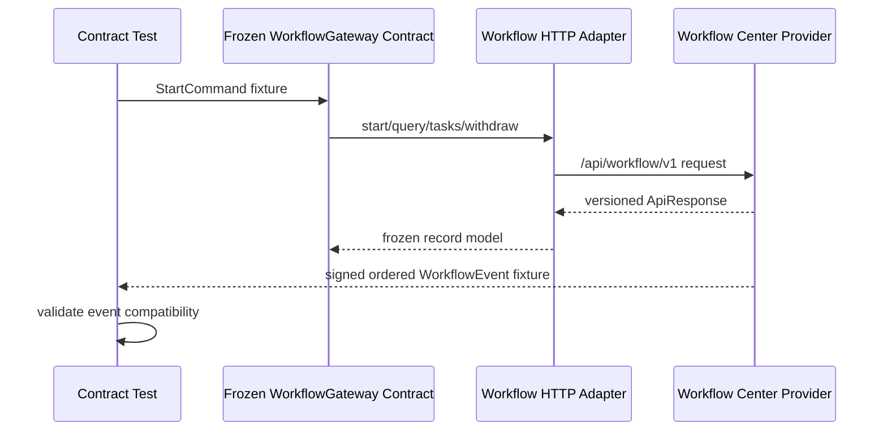

# Workflow Lite V2.5 Migration 与基础设施实施准备方案

> Sprint：2-3.7-WF1
> 状态：`DESIGN_READY / SQL_NOT_CREATED / NOT_EXECUTED`
> 上游基线：`v2.4.9-workflow-integration-rc1`
> 设计依据：[Workflow Center领域设计](workflow-center-domain-design.md)、[Workflow Center数据库设计](workflow-center-database-design.md)、[Investment集成V2设计](workflow-investment-integration-v2-design.md)

## 1. 范围与冻结声明

本 Sprint 把 Workflow Lite 的数据库和集成基础设施细化到可直接编写 SQL、建立契约测试的程度，但不创建正式 Migration、不连接数据库、不执行 Flyway，也不修改 Investment。

冻结边界：

- V2.4.0—V2.4.9 保持 `CANONICAL_IMMUTABLE`，文件、SHA-256 和 Flyway checksum 不变；
- 新增版本只能从 V2.5.0 开始，必须位于 `database/migration/mysql` 正式扫描目录；
- Workflow 数据只能由 `modules.workflow` 通过本域 Repository 管理；
- 不跨域读取或写入 `investment_*` 表，不复用 `investment_workflow_outbox/inbox`；
- Domain 层只使用纯 Java 模型和 Repository Port，禁止依赖 Spring、MyBatis、Entity；
- 生产环境不随应用启动 Migration，禁止 `clean` 和自动 `repair`。

本方案对 WF0 的候选版本链作一次明确收敛：V2.5.2 专用于审批行为日志，Workflow 自有 Outbox/Inbox 放入 V2.5.4 Integration 准备版本。

## 2. Migration 总体规划

| 版本 | 候选文件名 | 内容 | 前置依赖 | 当前状态 |
| --- | --- | --- | --- | --- |
| V2.5.0 | `V2.5.0__create_workflow_definition_model.sql` | `workflow_definition`、`workflow_version`、`workflow_node` | V2.4.9 | `DESIGNED_NOT_CREATED` |
| V2.5.1 | `V2.5.1__create_workflow_runtime_model.sql` | `workflow_instance`、`workflow_task` | V2.5.0 | `DESIGNED_NOT_CREATED` |
| V2.5.2 | `V2.5.2__create_workflow_action_log.sql` | `workflow_action_log` | V2.5.1 | `DESIGNED_NOT_CREATED` |
| V2.5.3 | `V2.5.3__bootstrap_workflow_rbac.sql` | Workflow权限、菜单元数据和最小管理员授权 | V2.5.2 | `DESIGNED_NOT_CREATED` |
| V2.5.4 | `V2.5.4__prepare_workflow_integration.sql` | `workflow_command_inbox`、`workflow_event_outbox` | V2.5.3 | `DESIGNED_NOT_CREATED` |

执行顺序必须连续，`outOfOrder=false`。V2.5.0—V2.5.4 不允许合并成单文件，以便结构、权限和可靠消息分别验收及前向修复。

## 3. 通用数据库规范

### 3.1 通用审计列

每张表统一包含：

| 字段 | MySQL 8类型 | 约束 | 说明 |
| --- | --- | --- | --- |
| `id` | `BIGINT` | PK, NOT NULL | 平台ID生成器分配，不自增 |
| `create_time` | `DATETIME(3)` | NOT NULL DEFAULT CURRENT_TIMESTAMP(3) | 创建时间 |
| `create_by` | `VARCHAR(64)` | NULL | 创建人稳定标识 |
| `update_time` | `DATETIME(3)` | NOT NULL DEFAULT CURRENT_TIMESTAMP(3) | 更新时间，由应用填充 |
| `update_by` | `VARCHAR(64)` | NULL | 更新人稳定标识 |
| `deleted` | `SMALLINT` | NOT NULL DEFAULT 0 | 0有效、1删除 |
| `delete_token` | `BIGINT` | NOT NULL DEFAULT 0 | 有效数据为0，逻辑删除时写行ID |
| `remark` | `VARCHAR(500)` | NULL | 非敏感备注 |
| `version` | `INT` | NOT NULL DEFAULT 0 | MyBatis Plus乐观锁 |

统一 CHECK：`deleted IN (0,1)`、`version >= 0`。所有业务唯一索引包含 `delete_token`；不使用级联删除。

### 3.2 可移植性约束

- 规则和快照使用 `TEXT/LONGTEXT` 存规范化 JSON，不使用 MySQL `JSON` 专有类型；
- 布尔值使用 `SMALLINT`；时间使用 `DATETIME(3)`；
- MySQL 8 使用 CHECK，达梦/人大金仓由后续方言包提供等价约束；
- ID、用户、组织、岗位和业务引用使用 `BIGINT` 或稳定字符串，不依赖 unsigned、enum、set；
- 跨模块引用只做逻辑校验，不对 `sys_*`、`investment_*` 建物理外键。

## 4. V2.5.0：流程定义模型

### 4.1 workflow_definition

| 字段 | 类型 | 必填/默认 | 说明 |
| --- | --- | --- | --- |
| `definition_code` | `VARCHAR(100)` | NOT NULL | 企业内稳定流程编码 |
| `definition_name` | `VARCHAR(200)` | NOT NULL | 流程名称 |
| `business_type` | `VARCHAR(64)` | NOT NULL | 适用业务类型 |
| `enterprise_id` | `BIGINT` | NOT NULL | 企业隔离标识，逻辑关联组织中心 |
| `owner_org_id` | `BIGINT` | NULL | 管理归属组织 |
| `status` | `VARCHAR(20)` | NOT NULL DEFAULT `DRAFT` | `DRAFT/ACTIVE/INACTIVE/ARCHIVED` |
| `current_version_id` | `BIGINT` | NULL | 当前发布版本 |
| `description` | `VARCHAR(1000)` | NULL | 定义说明 |
| 通用审计列 | 见3.1 | 必须 | 含 `delete_token/version` |

索引和约束：

- PK `id`；
- UK `uk_workflow_definition_code(enterprise_id, definition_code, delete_token)`；
- UK `uk_workflow_definition_current(id, current_version_id)`，供复合外键所有权校验；
- IDX `idx_workflow_definition_business(business_type, status, deleted)`；
- IDX `idx_workflow_definition_owner(owner_org_id, status, deleted)`；
- CHECK `status IN ('DRAFT','ACTIVE','INACTIVE','ARCHIVED')`。

创建时暂不增加 `current_version_id` 外键，待 `workflow_version` 建成后通过同一 Migration 的后置 `ALTER TABLE` 添加复合外键。

### 4.2 workflow_version

| 字段 | 类型 | 必填/默认 | 说明 |
| --- | --- | --- | --- |
| `definition_id` | `BIGINT` | NOT NULL | 所属定义 |
| `version_no` | `INT` | NOT NULL | 定义内递增版本，从1开始 |
| `status` | `VARCHAR(20)` | NOT NULL DEFAULT `DRAFT` | `DRAFT/PUBLISHED/RETIRED` |
| `schema_version` | `VARCHAR(30)` | NOT NULL | 节点及规则Schema版本 |
| `content_hash` | `VARCHAR(128)` | NULL | 发布内容SHA-256，草稿可空 |
| `change_note` | `VARCHAR(1000)` | NULL | 变更说明 |
| `effective_from` | `DATETIME(3)` | NULL | 生效时间 |
| `effective_to` | `DATETIME(3)` | NULL | 停止新实例时间 |
| `published_by` | `BIGINT` | NULL | 发布用户逻辑引用 |
| `published_time` | `DATETIME(3)` | NULL | 发布时间 |
| `source_version_id` | `BIGINT` | NULL | 复制来源版本 |
| 通用审计列 | 见3.1 | 必须 | 含乐观锁 |

索引和约束：

- UK `uk_workflow_version_no(definition_id, version_no, delete_token)`；
- UK `uk_workflow_version_hash(definition_id, content_hash, delete_token)`；
- UK `uk_workflow_version_owner(definition_id, id)`，供复合外键引用；
- IDX `idx_workflow_version_status(definition_id, status, effective_from, deleted)`；
- FK `definition_id -> workflow_definition.id ON DELETE RESTRICT`；
- FK `source_version_id -> workflow_version.id ON DELETE RESTRICT`；
- 后置复合FK `workflow_definition(id,current_version_id) -> workflow_version(definition_id,id)`；
- CHECK `version_no > 0`、状态白名单、`effective_to IS NULL OR effective_from IS NULL OR effective_to > effective_from`；
- 发布一致性由 CHECK 和应用共同保证：`PUBLISHED` 必须具有 `content_hash/published_by/published_time`。

### 4.3 workflow_node

| 字段 | 类型 | 必填/默认 | 说明 |
| --- | --- | --- | --- |
| `version_id` | `BIGINT` | NOT NULL | 所属定义版本 |
| `node_code` | `VARCHAR(100)` | NOT NULL | 版本内节点编码 |
| `node_name` | `VARCHAR(200)` | NOT NULL | 节点名称 |
| `node_type` | `VARCHAR(30)` | NOT NULL | `APPROVAL/COUNTERSIGN/CONDITION` |
| `node_order` | `INT` | NOT NULL | 线性基准顺序 |
| `governance_node_type` | `VARCHAR(40)` | NOT NULL DEFAULT `GENERAL_APPROVAL` | 三重一大治理语义 |
| `approval_mode` | `VARCHAR(30)` | NOT NULL DEFAULT `SINGLE` | `SINGLE/ALL/ANY/QUORUM` |
| `approval_threshold` | `DECIMAL(5,2)` | NULL | 会签通过百分比 |
| `assignment_rule_type` | `VARCHAR(30)` | NOT NULL | `USER/ORG/POSITION/ORG_POSITION/RULE` |
| `assignment_rule_config` | `TEXT` | NOT NULL | 规范化规则JSON |
| `entry_condition_config` | `TEXT` | NULL | 白名单进入条件 |
| `completion_condition_config` | `TEXT` | NULL | 白名单完成条件 |
| `timeout_minutes` | `INT` | NULL | 超时时长 |
| `withdraw_allowed` | `SMALLINT` | NOT NULL DEFAULT 0 | 当前节点允许撤回 |
| `enabled` | `SMALLINT` | NOT NULL DEFAULT 1 | 草稿节点启用状态 |
| 通用审计列 | 见3.1 | 必须 | 发布版本节点由应用禁止修改 |

索引和约束：

- UK `uk_workflow_node_code(version_id, node_code, delete_token)`；
- UK `uk_workflow_node_order(version_id, node_order, delete_token)`；
- UK `uk_workflow_node_owner(version_id, id)`，供运行表校验版本归属；
- IDX `idx_workflow_node_type(version_id, node_type, enabled, deleted)`；
- IDX `idx_workflow_node_governance(governance_node_type, deleted)`；
- FK `version_id -> workflow_version.id ON DELETE RESTRICT`；
- CHECK 节点类型、治理类型、审批模式、分配类型白名单；
- CHECK `approval_threshold IS NULL OR approval_threshold > 0 AND approval_threshold <= 100`；
- CHECK `timeout_minutes IS NULL OR timeout_minutes > 0`、布尔列 `IN (0,1)`。

## 5. V2.5.1：流程运行模型

### 5.1 workflow_instance

| 字段 | 类型 | 必填/默认 | 说明 |
| --- | --- | --- | --- |
| `instance_no` | `VARCHAR(100)` | NOT NULL | 对外实例号 |
| `definition_id` | `BIGINT` | NOT NULL | 定义ID |
| `version_id` | `BIGINT` | NOT NULL | 冻结的发布版本ID |
| `definition_code_snapshot` | `VARCHAR(100)` | NOT NULL | 定义编码快照 |
| `definition_version_no` | `INT` | NOT NULL | 定义版本号快照 |
| `business_type` | `VARCHAR(64)` | NOT NULL | 业务类型 |
| `business_id` | `VARCHAR(100)` | NOT NULL | 不透明业务ID，兼容现有Gateway String |
| `business_key` | `VARCHAR(200)` | NOT NULL | 稳定业务键 |
| `enterprise_id` | `BIGINT` | NOT NULL | 企业隔离标识 |
| `snapshot_ref` | `VARCHAR(100)` | NULL | 业务快照引用 |
| `snapshot_hash` | `VARCHAR(128)` | NULL | 业务快照哈希 |
| `attempt_no` | `INT` | NOT NULL DEFAULT 1 | 业务重新提交序号 |
| `initiator_user_id` | `BIGINT` | NOT NULL | 发起用户 |
| `initiator_org_id` | `BIGINT` | NOT NULL | 发起组织快照 |
| `current_node_id` | `BIGINT` | NULL | 当前主展示节点 |
| `status` | `VARCHAR(30)` | NOT NULL DEFAULT `CREATED` | 实例状态 |
| `result` | `VARCHAR(40)` | NULL | 最终流程结果 |
| `variables_snapshot` | `LONGTEXT` | NULL | 白名单变量快照 |
| `idempotency_key` | `VARCHAR(200)` | NOT NULL | 启动幂等键 |
| `request_hash` | `VARCHAR(128)` | NOT NULL | 规范化启动请求哈希 |
| `event_sequence` | `BIGINT` | NOT NULL DEFAULT 0 | 已生成事件水位 |
| `trace_id` | `VARCHAR(64)` | NULL | 跨域TraceId |
| `started_time` | `DATETIME(3)` | NULL | 启动时间 |
| `completed_time` | `DATETIME(3)` | NULL | 完成时间 |
| `withdrawn_time` | `DATETIME(3)` | NULL | 撤回时间 |
| 通用审计列 | 见3.1 | 必须 | 含乐观锁 |

索引和约束：

- UK `uk_workflow_instance_no(instance_no, delete_token)`；
- UK `uk_workflow_instance_idempotency(enterprise_id, idempotency_key, delete_token)`；
- UK `uk_workflow_instance_business(enterprise_id, business_type, business_id, attempt_no, delete_token)`；
- UK `uk_workflow_instance_owner(version_id, id)`，供任务复合外键；
- IDX `idx_workflow_instance_status(enterprise_id, status, update_time, deleted)`；
- IDX `idx_workflow_instance_key(business_type, business_key, attempt_no, deleted)`；
- IDX `idx_workflow_instance_initiator(initiator_user_id, status, update_time, deleted)`；
- 复合FK `(definition_id,version_id) -> workflow_version(definition_id,id)`；
- 复合FK `(version_id,current_node_id) -> workflow_node(version_id,id)`；
- CHECK `attempt_no > 0`、`event_sequence >= 0`、实例状态白名单。

状态白名单：`CREATED/RUNNING/APPROVED/REJECTED/WITHDRAWN/COMPLETED/EXCEPTION`。

### 5.2 workflow_task

为让数据库强制任务节点属于实例冻结版本，任务显式保存 `version_id`。

| 字段 | 类型 | 必填/默认 | 说明 |
| --- | --- | --- | --- |
| `task_no` | `VARCHAR(100)` | NOT NULL | 对外任务号 |
| `instance_id` | `BIGINT` | NOT NULL | 实例ID |
| `version_id` | `BIGINT` | NOT NULL | 实例冻结版本冗余键 |
| `node_id` | `BIGINT` | NOT NULL | 节点模板ID |
| `node_code_snapshot` | `VARCHAR(100)` | NOT NULL | 节点编码快照 |
| `node_name_snapshot` | `VARCHAR(200)` | NOT NULL | 节点名称快照 |
| `task_round` | `INT` | NOT NULL DEFAULT 1 | 任务轮次 |
| `participant_key` | `VARCHAR(128)` | NOT NULL | 单签/会签参与者稳定键 |
| `assignee_user_id` | `BIGINT` | NULL | 签收或指定办理人 |
| `candidate_snapshot` | `TEXT` | NOT NULL | 分配规则和候选ID快照 |
| `status` | `VARCHAR(30)` | NOT NULL DEFAULT `PENDING` | 任务状态 |
| `allowed_actions` | `VARCHAR(200)` | NOT NULL | 动作白名单快照 |
| `claimed_time` | `DATETIME(3)` | NULL | 签收时间 |
| `due_time` | `DATETIME(3)` | NULL | 到期时间 |
| `completed_by` | `BIGINT` | NULL | 完成人 |
| `completed_time` | `DATETIME(3)` | NULL | 完成时间 |
| `decision_result` | `VARCHAR(40)` | NULL | 审批结果 |
| 通用审计列 | 见3.1 | 必须 | 任务动作使用乐观锁 |

索引和约束：

- UK `uk_workflow_task_no(task_no, delete_token)`；
- UK `uk_workflow_task_participant(instance_id, node_id, task_round, participant_key, delete_token)`；
- IDX `idx_workflow_task_assignee(assignee_user_id, status, due_time, deleted)`；
- IDX `idx_workflow_task_instance(instance_id, status, create_time, deleted)`；
- IDX `idx_workflow_task_node(node_id, status, deleted)`；
- 复合FK `(version_id,instance_id) -> workflow_instance(version_id,id)`；
- 复合FK `(version_id,node_id) -> workflow_node(version_id,id)`；
- CHECK `task_round > 0`、任务状态白名单。

任务状态：`PENDING/CLAIMED/APPROVED/REJECTED/CANCELLED/EXPIRED`。

## 6. V2.5.2：审批行为日志

### 6.1 workflow_action_log

| 字段 | 类型 | 必填/默认 | 说明 |
| --- | --- | --- | --- |
| `instance_id` | `BIGINT` | NOT NULL | 实例ID |
| `task_id` | `BIGINT` | NULL | 系统动作可无任务 |
| `node_id` | `BIGINT` | NULL | 节点引用 |
| `action_type` | `VARCHAR(40)` | NOT NULL | 动作类型 |
| `actor_user_id` | `BIGINT` | NULL | 操作用户，系统动作可空 |
| `actor_org_id` | `BIGINT` | NULL | 操作时组织快照 |
| `actor_position_id` | `BIGINT` | NULL | 操作时岗位快照 |
| `from_status` | `VARCHAR(30)` | NULL | 迁移前状态 |
| `to_status` | `VARCHAR(30)` | NOT NULL | 迁移后状态 |
| `opinion_summary` | `VARCHAR(1000)` | NULL | 脱敏意见摘要 |
| `opinion_hash` | `VARCHAR(128)` | NULL | 完整意见哈希 |
| `reference_type` | `VARCHAR(50)` | NULL | 会议、文件等引用类型 |
| `reference_id` | `VARCHAR(100)` | NULL | 跨域稳定引用 |
| `event_id` | `VARCHAR(100)` | NOT NULL | 对应领域事件ID |
| `event_sequence` | `BIGINT` | NOT NULL | 实例内单调事件序号 |
| `request_id` | `VARCHAR(100)` | NULL | 动作幂等请求ID |
| `payload_hash` | `VARCHAR(128)` | NULL | 规范化动作请求哈希 |
| `trace_id` | `VARCHAR(64)` | NULL | 链路ID |
| `action_time` | `DATETIME(3)` | NOT NULL | 业务动作时间 |
| 通用审计列 | 见3.1 | 必须 | 表保留统一字段，但Repository只允许追加 |

索引和约束：

- UK `uk_workflow_action_event(event_id, delete_token)`；
- UK `uk_workflow_action_sequence(instance_id, event_sequence, delete_token)`；
- UK `uk_workflow_action_request(request_id, action_type, delete_token)`，允许 `request_id` 为空；
- IDX `idx_workflow_action_instance(instance_id, action_time, deleted)`；
- IDX `idx_workflow_action_task(task_id, action_time, deleted)`；
- IDX `idx_workflow_action_actor(actor_user_id, action_time, deleted)`；
- IDX `idx_workflow_action_type(action_type, action_time, deleted)`；
- FK `instance_id -> workflow_instance.id`、`task_id -> workflow_task.id`、`node_id -> workflow_node.id`；
- CHECK `event_sequence > 0`、动作类型白名单。

动作类型首期：`START/CLAIM/APPROVE/REJECT/WITHDRAW/CANCEL/TIMEOUT/SYSTEM_TRANSITION`。应用层执行 INSERT ONLY；历史纠错追加补偿记录，禁止 UPDATE/DELETE。

## 7. V2.5.3：Workflow RBAC

### 7.1 权限定义

| 权限码 | 类型 | 用途 | 任务级二次校验 |
| --- | --- | --- | --- |
| `workflow:view` | MENU/BUTTON | 查询定义、实例、任务和日志摘要 | 企业范围、业务查看权、任务参与权 |
| `workflow:create` | BUTTON | 创建定义和草稿版本 | 流程管理范围 |
| `workflow:start` | BUTTON/API | 启动流程 | 业务启动权、定义适用范围、企业隔离 |
| `workflow:approve` | BUTTON/API | 执行任务动作 | 必须是任务办理人或候选人 |
| `workflow:withdraw` | BUTTON/API | 申请撤回 | 发起人/授权人及节点规则 |
| `workflow:manage` | BUTTON | 发布、停用和异常治理 | 不自动获得审批权 |

审批任务不通过角色直接分配。RBAC 仅决定用户是否具有“使用审批功能”的基础能力；具体任务必须由 Workflow 根据组织、岗位、用户和受控规则解析。即使是 `SUPER_ADMIN`，也不能仅凭管理角色处理未分配给自己的任务。

### 7.2 初始化策略

V2.5.3 只使用已有 `sys_permission/sys_menu/sys_role_permission/sys_role_menu`：

- 幂等 `INSERT ... SELECT ... WHERE NOT EXISTS`，业务键使用 `permission_code`；
- 创建“流程治理”目录和定义管理、实例审计、我的待办菜单节点；
- 默认只为 `SUPER_ADMIN` 初始化 `workflow:view/create/manage` 的治理入口；`workflow:start/approve/withdraw` 不因系统管理身份自动授予；
- 不用 `workflow:approve` 绕过任务授权。若现有 Security 对所有接口都要求 Authority，实现 Sprint 必须提供“RBAC能力 + task authorization”组合鉴权器；
- 菜单 ID、权限 ID 必须在 SQL 实现前核对当前保留号段，禁止猜测或覆盖已有 ID；
- Migration 不初始化具体投资审批人，不绑定组织岗位，不创建通用业务角色。

## 8. V2.5.4：Integration准备

V2.5.4 提供 Workflow 自有可靠消息设施，使现有调用链保持：

```text
Investment Outbox -> WorkflowGateway/Adapter -> Workflow Command Inbox
Workflow Instance/Task transaction -> Workflow Event Outbox -> Investment Inbox
```

### 8.1 workflow_command_inbox

接收启动、撤回和任务动作命令，负责幂等与可审计响应，不保存敏感Token。

| 字段 | 类型 | 说明 |
| --- | --- | --- |
| `source_system` | `VARCHAR(64)` NOT NULL | 命令来源，如 `investment-service` |
| `command_type` | `VARCHAR(40)` NOT NULL | `START_PROCESS/WITHDRAW_PROCESS/COMPLETE_TASK` |
| `idempotency_key` | `VARCHAR(200)` NOT NULL | 来源侧幂等键 |
| `request_hash` | `VARCHAR(128)` NOT NULL | 规范化请求SHA-256 |
| `instance_id` | `BIGINT` NULL | 成功后实例引用 |
| `process_status` | `VARCHAR(20)` NOT NULL | `RECEIVED/PROCESSING/PROCESSED/DUPLICATE/FAILED` |
| `response_code` | `VARCHAR(100)` NULL | 稳定结果/错误码 |
| `response_snapshot` | `TEXT` NULL | 脱敏响应快照，用于同键重放 |
| `received_time` | `DATETIME(3)` NOT NULL | 接收时间 |
| `processed_time` | `DATETIME(3)` NULL | 完成时间 |
| `failure_code` | `VARCHAR(100)` NULL | 失败分类 |
| `trace_id` | `VARCHAR(64)` NULL | 链路ID |
| 通用审计列 | 见3.1 | 含逻辑删除和乐观锁 |

约束：

- UK `(source_system, command_type, idempotency_key, delete_token)`；
- IDX `(process_status, received_time, deleted)`；
- IDX `(instance_id, command_type, deleted)`；
- FK `instance_id -> workflow_instance.id`；
- CHECK 命令类型和处理状态白名单；
- 同幂等键不同 `request_hash` 必须拒绝，不能覆盖原响应。

### 8.2 workflow_event_outbox

| 字段 | 类型 | 说明 |
| --- | --- | --- |
| `event_id` | `VARCHAR(100)` NOT NULL | 全局事件ID |
| `instance_id` | `BIGINT` NOT NULL | 流程实例 |
| `event_sequence` | `BIGINT` NOT NULL | 实例内事件序号 |
| `event_type` | `VARCHAR(40)` NOT NULL | `STARTED/APPROVED/REJECTED/WITHDRAWN/COMPLETED` |
| `event_scope` | `VARCHAR(20)` NOT NULL | `NODE/PROCESS` |
| `event_version` | `VARCHAR(20)` NOT NULL | 事件契约版本 |
| `destination` | `VARCHAR(100)` NOT NULL | 目标业务消费者 |
| `payload_json` | `TEXT` NOT NULL | 最小化事件信封 |
| `payload_hash` | `VARCHAR(128)` NOT NULL | 规范化负载SHA-256 |
| `status` | `VARCHAR(20)` NOT NULL | `PENDING/PROCESSING/PUBLISHED/FAILED/DEAD` |
| `retry_count` | `INT` NOT NULL DEFAULT 0 | 重试次数 |
| `next_retry_time` | `DATETIME(3)` NULL | 下次重试时间 |
| `worker_id` | `VARCHAR(100)` NULL | 抢占Worker |
| `locked_at` | `DATETIME(3)` NULL | 抢占时间 |
| `lock_until` | `DATETIME(3)` NULL | 租约截止 |
| `published_time` | `DATETIME(3)` NULL | 成功时间 |
| `dead_time` | `DATETIME(3)` NULL | 死信时间 |
| `last_error_code` | `VARCHAR(100)` NULL | 稳定失败码 |
| `trace_id` | `VARCHAR(64)` NULL | 链路ID |
| 通用审计列 | 见3.1 | 含逻辑删除和乐观锁 |

约束：

- UK `(event_id, destination, delete_token)`；
- UK `(instance_id, event_sequence, destination, delete_token)`；
- IDX `(status, next_retry_time, create_time, deleted)`；
- IDX `(status, lock_until, deleted)`；
- IDX `(instance_id, event_sequence, deleted)`；
- FK `instance_id -> workflow_instance.id`；
- CHECK 事件、scope、状态白名单，`event_sequence > 0`、`retry_count >= 0`。

本 Sprint 不设计 Worker 业务实现。正式实现需复用 V2.4.9 已验证的租约、指数退避、死信、HMAC、Nonce 和人工重放安全规则，但不得调用 Investment 的 Mapper。

## 9. 外键创建顺序

```text
workflow_definition（current_version_id暂不加FK）
  -> workflow_version（definition FK、自引用FK）
  -> workflow_node（version FK）
  -> 回补 definition-current_version 复合FK
  -> workflow_instance（definition/version/node FK）
  -> workflow_task（instance/version/node复合FK）
  -> workflow_action_log（instance/task/node FK）
  -> workflow_command_inbox（instance FK）
  -> workflow_event_outbox（instance FK）
```

所有 FK 使用 `ON DELETE RESTRICT`。V2.5.3 RBAC 只引用既有系统表；实现前必须确认这些表已经处于目标基线。

## 10. Flyway治理和Inventory设计

### 10.1 资产生命周期

```text
DESIGNED_NOT_CREATED
  -> CANDIDATE_NOT_EXECUTED
  -> REVIEWED_NOT_EXECUTED
  -> EPHEMERAL_MYSQL8_VALIDATED
  -> CANONICAL_IMMUTABLE
  -> MANAGED_ENV_APPLIED（逐环境独立记录）
```

真实 SQL 创建后，Inventory 为每个版本记录：

```yaml
- version: "2.5.0"
  canonical_file: "database/migration/mysql/V2.5.0__create_workflow_definition_model.sql"
  module: "workflow"
  asset_status: "CANDIDATE"
  execution_status: "NOT_EXECUTED"
  automatic_scan: true
  sha256: "<冻结文件SHA-256>"
  flyway_checksum: null
  depends_on: ["2.4.9"]
  scope: "Workflow definition, version and node model"
```

V2.5.1—V2.5.4 使用相同结构，并分别依赖前一版本。SQL 未创建前不得在 `canonical_assets` 中伪造 SHA 或执行状态；本方案本身只描述 Inventory 条目模板。

### 10.2 SHA和checksum方案

1. SQL 经评审冻结为 UTF-8、统一 LF，不再做格式化改写；
2. 使用平台工具计算文件字节级 SHA-256，写入 `database/migration/mysql/SHA256SUMS`；
3. Inventory 中保存相同 SHA-256，CI 校验“扫描目录SQL、SHA256SUMS、Inventory”三者双向一一对应；
4. 迁移前重新计算全部受管 SQL，任一差异立即阻断；
5. Flyway checksum 只从真实 `flyway_schema_history`/`info` 获取，不能用 SHA-256 替代；
6. 迁移后登记 Flyway checksum、执行时间、history rank 和 Schema 指纹；
7. 禁止为消除 checksum mismatch 执行 `repair`，修复必须创建更高版本。

### 10.3 验收路径

必须在隔离 MySQL 8 环境验证两条路径：

- Fresh：当前受管基线完整迁移至 V2.5.4；
- Upgrade：从已验证 V2.4.9 Schema 升级至 V2.5.4。

每条路径执行：

```text
资产SHA-256/命名/顺序/禁止操作策略检查
  -> flyway info
  -> flyway migrate
  -> post strict flyway validate
  -> flyway info/history核查
  -> 第二次 migrate 必须 no-op
  -> 表/列/索引/FK/CHECK/权限核查
  -> schema_fingerprint.sql
```

两条路径的最终 Schema 指纹必须一致。验收报告只允许标记 `EPHEMERAL_MYSQL8_VALIDATED`，不得推断开发、测试、预生产或生产已执行。

## 11. Gateway契约测试设计

### 11.1 测试边界

不修改 Investment 源代码。以冻结的 `WorkflowGateway`、`WorkflowEvent` 和 `/api/workflow/v1` HTTP 契约作为 Consumer Contract，在 Workflow 模块测试目录建立 Provider Contract Test。

建议测试资产：

```text
backend/src/test/resources/contracts/workflow/v1
├── start-request.json
├── start-response.json
├── instance-response.json
├── tasks-response.json
├── approval-event.json
└── error-cases.json

modules/workflow（后续实现）
└── interfaces/contract
    └── InvestmentWorkflowProviderContractTest
```

测试只依赖契约Fixture和Workflow接口，不导入 Investment Entity/Mapper。必要时把当前 Investment 编译产物作为黑盒Consumer执行，不能复制或修改其业务逻辑。

### 11.2 调用链验证



### 11.3 契约测试矩阵

| 场景 | 输入 | 预期 |
| --- | --- | --- |
| 启动成功 | 明确definition/version、snapshot、attempt、幂等键 | 返回唯一instanceId和RUNNING |
| 启动重复 | 相同幂等键和相同request hash | 返回原实例，不新增记录 |
| 幂等冲突 | 相同幂等键、不同hash | HTTP 409，安全审计 |
| 版本错误 | 不存在、草稿或停用版本 | 明确4xx错误，不回退最新版本 |
| 企业错配 | 请求企业与定义/业务不一致 | 403/业务拒绝 |
| 查询实例 | 有权业务绑定 | 字段可映射到现有 `WorkflowInstance` |
| 查询任务 | 用户、业务、状态分页条件 | 只返回授权任务，可映射现有 `WorkflowTask` |
| 审批动作 | RBAC + 任务参与权 + 幂等键 | 单次推进并产生有序事件 |
| 越权审批 | 仅有`workflow:approve`但非参与人 | 403，不写ActionLog业务动作 |
| 撤回 | 发起人且节点允许 | 状态WITHDRAWN，未完成任务取消 |
| 重复回调 | 相同eventId/hash | Investment兼容结果DUPLICATE |
| 乱序回调 | sequence存在缺口 | BUFFERED，不越序推进 |
| 事件兼容 | STARTED/APPROVED/REJECTED/WITHDRAWN/COMPLETED | 映射现有PROCESS/NODE事件 |
| HMAC失败 | 错误签名、过期时间、重复Nonce | 401/403，不进入业务处理 |

### 11.4 通过标准

- 请求/响应字段、类型、空值语义与冻结 Gateway 完全兼容；
- 相同Fixture在Provider测试和黑盒Consumer测试均通过；
- 不允许Workflow模型泄漏到Investment Domain；
- 不允许通过数据库Fixture跨域写入Investment表；
- Contract version不兼容时明确失败，不静默忽略字段；
- 契约测试通过不等同真实联调通过，真实联调仍需独立环境准入。

## 12. 实现准备清单

进入SQL实现前必须确认：

- [ ] V2.5.0—V2.5.4文件名和职责评审通过；
- [ ] ID号段与RBAC菜单父节点核对完成；
- [ ] MySQL 8复合外键索引顺序验证完成；
- [ ] 状态枚举与Domain设计一致；
- [ ] 规则JSON Schema版本冻结；
- [ ] Gateway V1 Fixture去敏并冻结；
- [ ] Outbox Worker默认关闭；
- [ ] 没有数据库密码、Token或HMAC Secret进入SQL/Fixture；
- [ ] 达梦、人大金仓方言差异已登记；
- [ ] V2.4.0—V2.4.9 SHA-256复核无变化。

## 13. 风险清单

| 风险 | 级别 | 控制措施 |
| --- | --- | --- |
| 复合外键顺序或索引不满足MySQL要求 | 高 | WF2先做最小DDL验证，再生成正式SQL |
| `current_version_id`循环引用导致初始化失败 | 中 | 定义先建、版本后建、最后后置ALTER |
| RBAC被误当任务授权 | 高 | Authority与任务参与权双校验，管理员不自动审批 |
| Integration表与Investment可靠表混用 | 高 | Workflow自有Inbox/Outbox，只通过契约交互 |
| 同幂等键不同负载被覆盖 | 高 | request_hash冲突返回409并留安全审计 |
| CHECK在国产库语义不一致 | 中 | Vendor方言脚本 + 应用枚举双校验 |
| ActionLog被逻辑删除或修改 | 高 | Repository只追加、数据库账号限制、补偿日志 |
| 规则TEXT不可被数据库验证 | 中 | 发布前JSON Schema校验、规范化哈希、契约测试 |
| Fixture包含敏感审批内容 | 高 | 最小字段、虚构ID、自动密钥扫描 |
| 契约测试被误报为真实联调 | 中 | 报告显式区分Contract、Integration和Production |

## 14. 本Sprint结论

- V2.5.0—V2.5.4职责、表字段、索引、约束、外键和CHECK已设计；
- Workflow RBAC和任务级授权边界已冻结；
- Inventory、SHA-256、Flyway checksum和双路径验收方案已明确；
- Investment → WorkflowGateway → Workflow Center契约测试方案已明确；
- 实际新增Migration：0；实际数据库执行：0；Investment代码修改：0。

下一步建议进入 **Sprint 2-3.7-WF2：V2.5.0—V2.5.4 Candidate SQL生成与静态验证**。只有在评审批准后才创建正式候选SQL、更新SHA256SUMS/Inventory并进行隔离MySQL 8验收。
