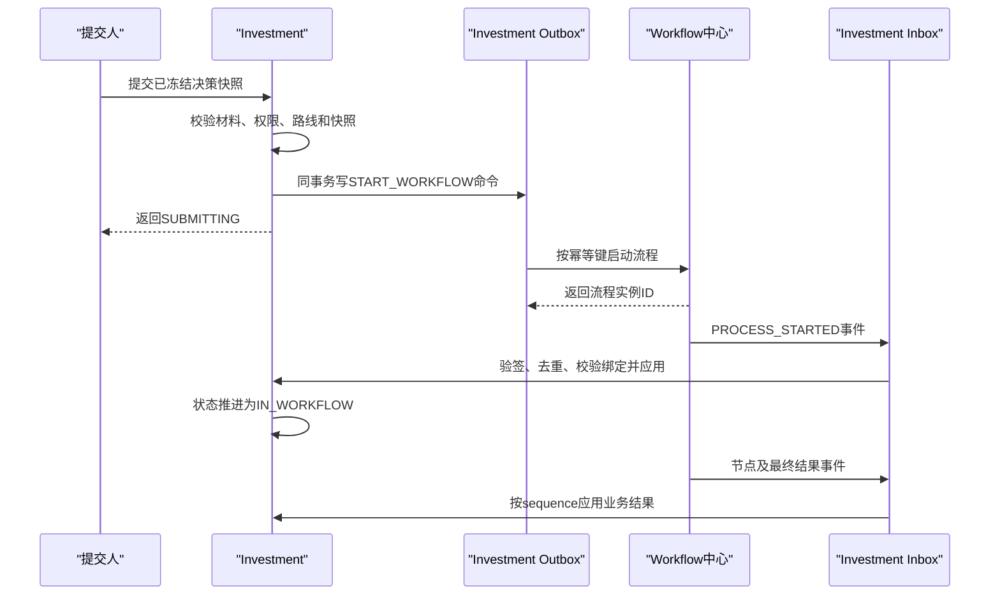

# Workflow中心与Investment集成契约（冻结版）

项目：县域国企数字化运营治理平台

版本：Sprint 2-3.1

状态：**CONTRACT_FROZEN**

## 0. 契约结论

1. Investment是投资决策业务、决策快照、决策路线和业务状态的权威来源；Workflow是流程定义、流程实例、任务、审批原始记录和流程状态的权威来源。
2. Investment不得实现审批引擎，不得直查或直写Workflow数据库；Workflow不得直写Investment数据库。
3. 每次提交必须绑定唯一的`decisionId + snapshotId + attemptNo`。同一流程尝试内不得更换快照。
4. 跨系统提交采用本地事务、Outbox和幂等启动，不使用分布式数据库事务。
5. Workflow通过带签名、可重试、可排序的事件回调同步结果；Investment通过Inbox去重后推进业务状态。
6. Workflow返回的流程状态只表示流程运行事实，Investment业务状态由投资决策聚合根据流程事实和业务门禁计算。
7. 审批意见属于敏感流程数据。Investment默认只保存必要摘要、摘要哈希和Workflow稳定引用，不复制完整意见和附件。
8. 本文只冻结接口和语义，不新增代码、数据库或Migration。

## 1. 通用接口约定

### 1.1 协议与版本

- 协议：HTTPS + JSON，字符集UTF-8；
- 时间：ISO-8601 UTC，例如`2026-08-08T08:30:00Z`；
- 标识：跨系统标识使用不透明字符串，调用方不得解析其组成；
- 金额：十进制定点字符串，不使用JSON浮点数；
- Workflow服务路径：`/api/workflow/v1`；
- Investment回调路径：`/api/internal/investment/workflow/v1/events`；
- 破坏性修改必须发布新主版本，新增可选字段保持向后兼容。

### 1.2 请求头

| 请求头 | 必填 | 说明 |
| --- | --- | --- |
| `Authorization` | 是 | 服务间访问令牌，不使用终端用户JWT代替服务身份 |
| `X-Request-Id` | 是 | 单次请求标识 |
| `X-Trace-Id` | 是 | 全链路追踪标识 |
| `Idempotency-Key` | 写接口是 | 幂等键，启动格式见下文 |
| `X-Timestamp` | 是 | 请求发出时间，用于防重放 |
| `X-Nonce` | 是 | 一次性随机值 |
| `X-Signature` | 是 | 请求体和关键头的签名 |
| `X-Contract-Version` | 是 | 固定为`1.0` |

服务令牌、签名密钥和终端用户凭据必须分离。日志不得记录令牌、签名密钥、完整审批意见或敏感附件地址。

### 1.3 统一响应

```json
{
  "code": 200,
  "message": "success",
  "data": {},
  "traceId": "8d54c6e9f3ab4ec4aab54e79ef8a07b5",
  "timestamp": "2026-08-08T08:30:00Z"
}
```

业务拒绝使用明确的4xx错误码；未知系统故障使用5xx。调用方只根据`code`和约定的`errorCode`处理，不解析`message`。

### 1.4 通用错误码

| HTTP | `errorCode` | 含义 | 是否可自动重试 |
| --- | --- | --- | --- |
| 400 | `WORKFLOW_REQUEST_INVALID` | 字段、枚举或流程变量不合法 | 否 |
| 401 | `SERVICE_UNAUTHENTICATED` | 服务身份无效 | 否 |
| 403 | `SERVICE_UNAUTHORIZED` | 服务无接口权限 | 否 |
| 404 | `PROCESS_DEFINITION_NOT_FOUND` | 流程定义或版本不存在 | 否 |
| 404 | `PROCESS_INSTANCE_NOT_FOUND` | 流程实例不存在 | 否 |
| 409 | `IDEMPOTENCY_CONFLICT` | 同一幂等键对应不同请求体 | 否，人工核查 |
| 409 | `BUSINESS_BINDING_CONFLICT` | 业务键已绑定其他有效实例 | 否 |
| 409 | `PROCESS_STATE_CONFLICT` | 当前状态不允许操作 | 否 |
| 422 | `PROCESS_VARIABLE_REJECTED` | 变量不满足流程定义约束 | 否 |
| 429 | `WORKFLOW_RATE_LIMITED` | 请求被限流 | 是 |
| 500 | `WORKFLOW_INTERNAL_ERROR` | Workflow内部错误 | 是 |
| 503 | `WORKFLOW_UNAVAILABLE` | Workflow暂不可用 | 是 |

重试仅适用于未获得确定业务结果的技术性故障，并必须沿用原`Idempotency-Key`。

## 2. 流程启动契约

### 2.1 接口

`POST /api/workflow/v1/process-instances`

用途：为已冻结的投资决策快照启动一个Workflow流程实例。

幂等键：

```text
INVESTMENT_DECISION:{decisionId}:{snapshotId}:{attemptNo}
```

同一幂等键重复提交相同请求必须返回同一`workflowInstanceId`；请求摘要不同必须返回`409 IDEMPOTENCY_CONFLICT`。

### 2.2 启动请求

```json
{
  "businessType": "INVESTMENT_DECISION",
  "businessId": "180000000000000001",
  "businessKey": "INVESTMENT_DECISION:180000000000000001",
  "title": "某新能源项目投资决策",
  "initiator": {
    "userId": "10001",
    "orgId": "20001",
    "enterpriseId": "30001"
  },
  "processDefinition": {
    "definitionKey": "investment-decision",
    "definitionVersion": 3
  },
  "snapshot": {
    "snapshotId": "190000000000000001",
    "snapshotVersion": 1,
    "snapshotHash": "sha256:..."
  },
  "attemptNo": 1,
  "variables": {
    "decisionRouteCode": "PARTY_THEN_BOARD",
    "decisionRouteVersion": "2026.1",
    "investmentType": "EQUITY",
    "amount": "10000000.00",
    "currency": "CNY",
    "riskLevel": "MEDIUM",
    "majorDecision": true,
    "requiresPartyPreStudy": true,
    "finalDecisionBody": "BOARD"
  },
  "nodePlan": [
    {
      "businessNodeId": "195000000000000001",
      "nodeCode": "PARTY_COMMITTEE_PRE_STUDY",
      "nodeOrder": 10,
      "required": true
    },
    {
      "businessNodeId": "195000000000000002",
      "nodeCode": "BOARD_DECISION",
      "nodeOrder": 20,
      "required": true
    }
  ],
  "callback": {
    "eventEndpoint": "/api/internal/investment/workflow/v1/events",
    "eventContractVersion": "1.0"
  },
  "requestedAt": "2026-08-08T08:30:00Z",
  "traceId": "8d54c6e9f3ab4ec4aab54e79ef8a07b5"
}
```

### 2.3 字段约束

| 字段 | 约束 |
| --- | --- |
| `businessType` | 本契约固定为`INVESTMENT_DECISION` |
| `businessId` | Investment决策聚合ID，创建后不可变 |
| `businessKey` | 同一决策的稳定业务键，不包含快照版本 |
| `initiator.userId` | 实际提交人，不允许用服务账号冒充 |
| `enterpriseId` | 强制隔离字段，必须与决策所属企业一致 |
| `definitionKey/version` | 必须显式指定，不允许Workflow自动漂移到最新版 |
| `snapshotId/version/hash` | 必须对应已冻结快照，三者共同校验 |
| `attemptNo` | 首次为1；退回后重新提交递增，不复用旧实例 |
| `variables` | 只包含路由和审批所需的最小数据，不传业务正文和敏感附件 |
| `nodePlan` | Investment冻结的业务决策路线；Workflow校验并编排，不得静默增删法定决策节点 |

流程变量采用白名单和版本化Schema。Workflow不得依靠未声明变量决定投资业务结论。

### 2.4 启动响应

```json
{
  "code": 200,
  "message": "success",
  "data": {
    "workflowInstanceId": "wf-ins-20260808-000001",
    "definitionKey": "investment-decision",
    "definitionVersion": 3,
    "businessKey": "INVESTMENT_DECISION:180000000000000001",
    "snapshotId": "190000000000000001",
    "attemptNo": 1,
    "status": "RUNNING",
    "startedAt": "2026-08-08T08:30:01Z"
  },
  "traceId": "8d54c6e9f3ab4ec4aab54e79ef8a07b5",
  "timestamp": "2026-08-08T08:30:01Z"
}
```

HTTP成功响应只表示Workflow接受并建立了实例。Investment仍以`PROCESS_STARTED`回调完成最终绑定确认；若响应丢失，使用原幂等键重试或按业务绑定查询，不得另起实例。

## 3. 任务与流程查询契约

### 3.1 查询流程实例

`GET /api/workflow/v1/process-instances/{workflowInstanceId}`

返回流程运行事实：

```json
{
  "workflowInstanceId": "wf-ins-20260808-000001",
  "businessType": "INVESTMENT_DECISION",
  "businessId": "180000000000000001",
  "snapshotId": "190000000000000001",
  "attemptNo": 1,
  "status": "RUNNING",
  "currentNodes": [
    {
      "nodeInstanceId": "wf-node-001",
      "nodeCode": "PARTY_COMMITTEE_PRE_STUDY",
      "nodeName": "党委前置研究",
      "status": "ACTIVE",
      "startedAt": "2026-08-08T08:31:00Z"
    }
  ],
  "version": 4,
  "updatedAt": "2026-08-08T08:31:00Z"
}
```

### 3.2 查询用户待办

`GET /api/workflow/v1/tasks?assigneeId={userId}&businessType=INVESTMENT_DECISION&businessId={businessId}&status=PENDING&pageNo=1&pageSize=20`

该接口由Workflow按服务身份和用户上下文鉴权。Investment不得读取全量任务后自行过滤。

任务摘要模型：

| 字段 | 说明 |
| --- | --- |
| `taskId` | Workflow任务稳定ID |
| `workflowInstanceId` | 流程实例ID |
| `nodeInstanceId` | 节点实例ID |
| `nodeCode/nodeName` | 节点标识和展示名 |
| `businessType/businessId` | 业务绑定 |
| `snapshotId/attemptNo` | 决策提交版本绑定 |
| `status` | `PENDING/CLAIMED/COMPLETED/CANCELLED/EXPIRED` |
| `assignee` | 当前办理人；候选任务未签收时可为空 |
| `candidateUsers/candidateGroups` | 仅返回调用人有权查看的候选摘要 |
| `delegation` | 委托来源及代理状态，不暴露无关人员信息 |
| `createdAt/claimedAt/dueAt/completedAt` | 任务时间 |
| `allowedActions` | 当前身份可执行的动作白名单 |

任务处理、签收、转办、委托和审批意见提交由Workflow中心接口负责，不属于Investment接口。本契约不定义审批引擎内部操作API。

### 3.3 查询约束

- 查询接口用于页面展示、对账和故障恢复，不能代替事件驱动的业务状态同步；
- Investment只缓存非权威摘要，并标记`workflowSyncedAt`；
- 完整审批意见、任务参与人和流程附件由Workflow按权限提供；
- 查询结果与本地绑定不一致时进入对账告警，不得自动覆盖决策快照或业务结论。

## 4. 审批结果事件契约

### 4.1 回调接口

`POST /api/internal/investment/workflow/v1/events`

Workflow至少投递以下事件：

| 事件类型 | 触发时机 |
| --- | --- |
| `PROCESS_STARTED` | 实例建立并开始运行 |
| `NODE_ACTIVATED` | 决策节点进入办理 |
| `NODE_COMPLETED` | 节点形成有效结果 |
| `PROCESS_RETURNED` | 流程退回业务补充材料 |
| `PROCESS_COMPLETED` | 流程形成最终结果 |
| `PROCESS_WITHDRAWN` | 撤回完成 |
| `PROCESS_CANCELLED` | 管理性取消或实例作废 |
| `PROCESS_TERMINATED` | 异常终止且不可继续 |

### 4.2 事件信封

```json
{
  "eventId": "wf-event-20260808-000099",
  "eventType": "NODE_COMPLETED",
  "eventVersion": "1.0",
  "sequence": 8,
  "occurredAt": "2026-08-08T10:20:30Z",
  "producer": "workflow-center",
  "workflow": {
    "workflowInstanceId": "wf-ins-20260808-000001",
    "definitionKey": "investment-decision",
    "definitionVersion": 3,
    "status": "RUNNING"
  },
  "business": {
    "businessType": "INVESTMENT_DECISION",
    "businessId": "180000000000000001",
    "businessKey": "INVESTMENT_DECISION:180000000000000001",
    "enterpriseId": "30001",
    "snapshotId": "190000000000000001",
    "attemptNo": 1
  },
  "node": {
    "nodeInstanceId": "wf-node-001",
    "businessNodeId": "195000000000000001",
    "nodeCode": "PARTY_COMMITTEE_PRE_STUDY",
    "nodeName": "党委前置研究",
    "result": "APPROVED"
  },
  "task": {
    "taskId": "wf-task-001",
    "status": "COMPLETED"
  },
  "operator": {
    "userId": "10086",
    "displayName": "已脱敏展示名",
    "orgId": "21001",
    "delegatedFromUserId": null
  },
  "decision": {
    "action": "APPROVE",
    "opinionSummary": "同意按方案实施",
    "opinionHash": "sha256:...",
    "conditionRefs": []
  },
  "traceId": "5f4bfc514f3b4bfca691fb1db6061cd7"
}
```

### 4.3 枚举冻结

节点结果：

- `APPROVED`：同意；
- `APPROVED_WITH_CONDITIONS`：附条件同意，必须携带非空`conditionRefs`；
- `REJECTED`：否决；
- `RETURNED`：退回补充；
- `DEFERRED`：暂缓；
- `CANCELLED`：节点因流程撤销而取消。

最终流程结果：

- `APPROVED`；
- `APPROVED_WITH_CONDITIONS`；
- `REJECTED`；
- `RETURNED`；
- `WITHDRAWN`；
- `CANCELLED`；
- `TERMINATED`。

### 4.4 回调响应

```json
{
  "code": 200,
  "message": "accepted",
  "data": {
    "eventId": "wf-event-20260808-000099",
    "processingResult": "APPLIED",
    "lastAppliedSequence": 8
  },
  "traceId": "5f4bfc514f3b4bfca691fb1db6061cd7",
  "timestamp": "2026-08-08T10:20:31Z"
}
```

`processingResult`取值：

- `APPLIED`：已推进业务状态；
- `DUPLICATE`：事件已处理，返回200阻止无意义重试；
- `BUFFERED`：前序事件缺失，已安全暂存并触发补偿查询；
- `IGNORED_STALE`：来自已作废流程尝试，不改变当前业务状态；
- `REJECTED`：绑定、签名或不可变字段冲突，返回明确4xx并告警。

## 5. 状态同步机制

### 5.1 状态职责

Workflow状态：

```text
CREATED -> RUNNING -> COMPLETED
                   -> RETURNED
                   -> WITHDRAWN
                   -> CANCELLED
                   -> TERMINATED
```

Investment决策状态：

```text
DRAFT -> MATERIAL_REVIEW -> ROUTE_CONFIRMED -> SUBMITTING
      -> IN_WORKFLOW -> APPROVED / CONDITION_PENDING / REJECTED / RETURNED
      -> WITHDRAWN / SUPERSEDED
```

两套状态不要求一一同名。Workflow不判断投资材料是否可提交，也不判断投资业务条件是否全部关闭；Investment不判断任务候选人、委托关系或流程实例能否流转。

### 5.2 状态映射

| Workflow事件/状态 | Investment处理 |
| --- | --- |
| 启动请求已写Outbox | `SUBMITTING`，尚不能标记`IN_WORKFLOW` |
| `PROCESS_STARTED/RUNNING` | 校验绑定后进入`IN_WORKFLOW` |
| `NODE_COMPLETED` | 更新对应`DecisionNode`结果摘要，不直接推断总结果 |
| `PROCESS_COMPLETED + APPROVED` | 业务门禁均满足后进入`APPROVED` |
| `PROCESS_COMPLETED + APPROVED_WITH_CONDITIONS` | 创建或绑定条件任务，进入`CONDITION_PENDING` |
| `PROCESS_COMPLETED + REJECTED` | 进入`REJECTED` |
| `PROCESS_RETURNED` | 进入`RETURNED`；原快照保持冻结 |
| `PROCESS_WITHDRAWN` | 进入`WITHDRAWN` |
| `PROCESS_CANCELLED/TERMINATED` | 进入人工核查或约定终态，不自动视为否决 |

### 5.3 一致性模式



禁止采用以下方式：

- 同时提交Investment和Workflow数据库事务；
- Controller收到Workflow响应后绕过聚合直接改状态；
- 定时查询任务表作为唯一同步机制；
- 前端传入审批结果修复回调失败；
- Workflow回调携带新快照ID替换已绑定快照。

## 6. 撤回契约

### 6.1 请求撤回

`POST /api/workflow/v1/process-instances/{workflowInstanceId}/withdrawals`

```json
{
  "businessType": "INVESTMENT_DECISION",
  "businessId": "180000000000000001",
  "snapshotId": "190000000000000001",
  "attemptNo": 1,
  "requestedBy": "10001",
  "reasonCode": "MATERIAL_CORRECTION",
  "reason": "需要修正投资方案材料",
  "requestedAt": "2026-08-08T11:00:00Z",
  "traceId": "..."
}
```

Investment先校验业务撤回权限，但不提前将决策标记为`WITHDRAWN`。只有收到`PROCESS_WITHDRAWN`事件后才能完成状态转换。

撤回被Workflow拒绝时，Investment保持原状态并记录失败审计。已形成不可撤销法定决策的实例不得通过普通撤回接口篡改结果，应走作废或变更决策业务流程。

## 7. 异常处理

### 7.1 流程启动失败

| 情况 | 处理 |
| --- | --- |
| 参数、快照或定义版本错误 | 标记Outbox不可重试失败；决策保留在`SUBMITTING`并记录失败事实，随后通过受控补偿命令退回`ROUTE_CONFIRMED`，不得引入临时状态 |
| 超时、网络、429或5xx | 指数退避重试，始终复用原幂等键 |
| 响应丢失 | 使用原幂等键重试；必要时按业务键、快照和尝试号查询 |
| 幂等冲突 | 停止自动重试，安全告警并人工核查请求摘要 |
| 长时间无`PROCESS_STARTED` | 触发对账，不自动创建第二个实例 |

### 7.2 回调失败

- Workflow使用至少一次投递，保留失败队列和告警；
- Investment只有在本地Inbox事件与业务变更同事务提交后返回成功；
- Investment 5xx或超时：Workflow重试同一`eventId`；
- Investment明确4xx：进入死信和人工处置，不进行无限重试；
- 故障恢复后按实例事件序列补投，不能只补最终状态。

### 7.3 重复和乱序回调

- `eventId`全局唯一，是第一去重键；
- `(workflowInstanceId, sequence)`是顺序与第二唯一约束；
- 同一`eventId`内容哈希不同视为安全事件；
- 重复事件返回`DUPLICATE`，不得重复创建条件或审计记录；
- 序号大于`lastSequence + 1`时返回`BUFFERED`并发起缺口补偿；
- 旧`attemptNo`事件只补充其历史记录，不得推进当前尝试。

### 7.4 流程撤回、取消和终止

- 撤回是业务发起的协同操作，必须通过Workflow确认；
- 取消是管理性操作，必须携带原因和授权主体；
- 终止表示流程无法继续，不等同于投资决策否决；
- 所有三类事件保留流程引用、操作人、时间、原因码和审计哈希；
- 已审批节点的原始记录不可删除，历史快照不可解冻覆盖。

### 7.5 对账机制

定时对账仅用于发现差异，不替代回调：

1. 比较业务绑定、快照ID、尝试号和流程实例ID；
2. 比较Workflow实例状态、本地状态摘要和最后事件序号；
3. 发现缺失事件时请求Workflow按序重放；
4. 发现不可解释冲突时冻结自动推进并告警；
5. 人工修复必须使用受控补偿命令，禁止直接改库。

## 8. 安全要求

### 8.1 身份与传输

- 生产环境强制HTTPS，建议服务间mTLS；
- 使用独立服务身份和最小权限，不透传用户JWT作为系统互信凭证；
- 回调服务身份只允许调用指定内部端点；
- 密钥由密钥管理设施提供，禁止写入代码、配置仓库和日志；
- 密钥支持轮换，签名头携带`keyId`但不携带密钥。

### 8.2 签名与防重放

签名覆盖：HTTP方法、路径、请求体SHA-256、时间戳、Nonce、RequestId和ContractVersion。接收方必须：

1. 校验服务身份和接口权限；
2. 校验签名及密钥有效期；
3. 限制时间偏差；
4. 拒绝已使用Nonce；
5. 校验`enterpriseId`、业务键、快照、实例和尝试号绑定；
6. 使用恒定时间比较签名。

### 8.3 数据最小化与脱敏

- 流程变量不得包含身份证号、银行卡号、完整合同、完整尽调报告或访问密钥；
- Workflow附件使用文件中心稳定引用和短期授权，不传永久公网URL；
- Investment只保存意见摘要、哈希和原始记录引用；
- 详情查询按任务参与权、业务查看权和数据范围共同控制；
- 普通日志禁止记录完整请求体；安全审计日志记录摘要哈希和字段白名单。

### 8.4 授权与职责分离

- Investment负责验证`investment:decision:submit`、撤回权限、项目访问权和数据范围；
- Workflow负责验证任务办理人、候选组、委托链和节点决策权；
- `investment:decision:approve`不得作为绕过Workflow任务授权的通用权限；
- 发起人、审批人、复核人及系统管理员按职责分离矩阵校验；
- Workflow系统管理员不得因技术管理身份自动获得投资业务审批权。

## 9. 数据模型冻结

### 9.1 `WorkflowBusinessBinding`

| 字段 | 说明 |
| --- | --- |
| `businessType/businessId/businessKey` | Investment稳定业务身份 |
| `enterpriseId` | 企业隔离标识 |
| `decisionId/snapshotId/snapshotHash` | 决策及不可变快照绑定 |
| `attemptNo` | 提交尝试序号 |
| `workflowInstanceId` | Workflow实例稳定ID |
| `definitionKey/definitionVersion` | 流程定义及版本 |
| `idempotencyKey/requestHash` | 启动幂等证据 |
| `workflowStatus` | 流程状态摘要，非业务权威状态 |
| `lastEventSequence/lastSyncedAt` | 同步水位 |

### 9.2 `WorkflowTaskSummary`

仅用于查询展示，权威数据仍在Workflow。包括任务、实例、节点、业务绑定、快照、办理人、委托摘要、状态、允许动作和时间信息。

### 9.3 `WorkflowDecisionEvent`

不可变事件包括事件身份、序号、流程定义/实例、业务绑定、快照与尝试号、节点、任务、结果、操作人、发生时间、意见摘要与哈希、条件引用和TraceId。

### 9.4 `WorkflowConditionReference`

Workflow只返回附条件批准形成的稳定条件引用、来源节点和必要摘要。条件整改、复核和关闭状态由Investment决策域权威维护；如豁免需要审批，则启动独立Workflow流程并保存新实例绑定。

## 10. 调用流程

### 10.1 首次提交

```text
冻结DecisionSnapshot
  -> 冻结DecisionNode路线
  -> Investment状态SUBMITTING
  -> 同事务写Outbox
  -> 幂等启动Workflow
  -> 接收PROCESS_STARTED
  -> 绑定实例并进入IN_WORKFLOW
  -> 接收节点事件
  -> 接收最终事件
  -> 校验业务门禁并形成Investment业务状态
```

### 10.2 退回后重新提交

```text
原流程PROCESS_RETURNED
  -> 原DecisionSnapshot永久保留
  -> Investment状态RETURNED
  -> 修订业务材料并生成新快照版本
  -> attemptNo + 1
  -> 使用新幂等键和新Workflow实例提交
  -> 旧实例事件仅进入历史，不影响当前尝试
```

### 10.3 附条件批准

```text
Workflow返回APPROVED_WITH_CONDITIONS
  -> Investment校验conditionRefs非空
  -> 创建或绑定DecisionCondition
  -> 状态CONDITION_PENDING
  -> 条件完成并复核
  -> 全部阻断条件关闭后进入APPROVED
```

## 11. 后续开发计划

### Sprint 2-3.2：契约适配与Migration设计

- 设计`WorkflowCommandPort`、`WorkflowQueryPort`和`WorkflowEventConsumer`代码接口；
- 设计Outbox、Inbox、Workflow绑定和审计事件的增量Migration；
- 冻结错误码、事件Schema和签名规范。

### Sprint 2-3.3：Workflow模拟器与契约测试

- 建立独立测试替身，不实现审批引擎；
- 完成启动幂等、响应丢失、回调验签、重复与乱序事件契约测试；
- 完成消费者驱动契约兼容检查。

### Sprint 2-3.4：Investment适配器实现

- 实现端口适配、Outbox投递、Inbox消费及补偿查询；
- 保证适配器不侵入领域模型，不允许Controller直接调用Workflow客户端；
- 接入TraceId、安全日志和指标告警。

### Sprint 2-3.5：联调与故障演练

- 联调三重一大、党委前置研究、董事会和经理层流程；
- 演练Workflow不可用、回调丢失、重复乱序、撤回竞争和密钥轮换；
- 验证多企业隔离、数据权限和职责分离。

### Sprint 2-3.6：生产前验收

- 完成容量、延迟、重试、死信、对账、审计和灾难恢复验收；
- 冻结Workflow定义版本、接口SLA、告警阈值和运行手册；
- 未通过真实环境契约验收前，不开放投资决策正式提交。

## 12. 进入编码前置门禁

1. Workflow中心负责人确认本文接口、状态和事件语义；
2. Workflow流程定义键和版本选择机制确定；
3. 服务认证、签名、密钥轮换和回调网络边界通过安全评审；
4. Outbox、Inbox、重试、死信和对账存储方案通过架构评审；
5. 三重一大路线与Workflow节点映射通过业务和法务确认；
6. 审批意见、会议材料、附件和个人信息的数据分级规则确定；
7. 错误码、SLA、告警和人工补偿责任人确定；
8. 任何未明确事项不得通过Investment本地状态机模拟审批引擎。
