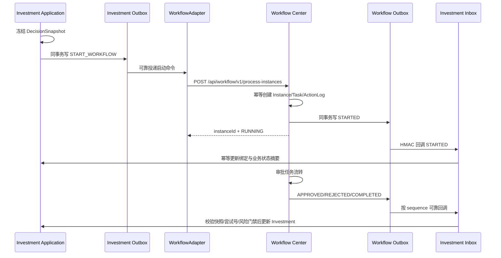

# Investment 与 Workflow Center V2 集成设计

> Sprint：2-3.7-WF0
> 状态：架构设计，不实施切换
> 兼容基线：`v2.4.9-workflow-integration-rc1` / commit `abb5fc9eb3a075b723eb5e98d9d9d7932429b8c8`

## 1. 建设背景

Investment 已完成决策快照、`WorkflowGateway`、`WorkflowAdapter`、绑定表、Outbox/Inbox、回调 HMAC 和可靠性治理。V2 设计不改动这些冻结能力，而是在其契约另一端提供平台内独立的 Workflow Center。

目标是替换“资源未交付的外部 Workflow 服务”，不是把 Workflow 逻辑嵌入 Investment。两域仍通过端口、HTTP 契约和事件集成，禁止直接调用对方 Mapper、Repository 或数据库表。

## 2. 职责边界

| Investment 权威职责 | Workflow Center 权威职责 |
| --- | --- |
| 投资机会、项目、可研、尽调、投资方案 | 流程定义、版本和节点配置 |
| 决策事项及不可变 DecisionSnapshot | 流程实例和运行状态 |
| 风险门禁、附条件任务、整改与复核 | 审批任务、候选人解析和节点流转 |
| 投资业务状态和最终业务结论 | 审批动作记录和流程结论 |
| Investment 侧绑定、Outbox/Inbox 和业务审计 | Workflow 侧幂等、Outbox/Inbox 和流程审计 |

硬性规则：

- Workflow 不直接修改 `investment_decision` 或任何 Investment 表；
- Investment 不读取 Workflow 表推导状态，只通过 Adapter 查询摘要或消费事件；
- Workflow 的 `APPROVED` 只是流程事实，Investment 仍需校验风险门禁、快照和附条件规则后决定业务状态；
- Workflow 不动态读取“最新”可研、尽调或方案版本，只保存 Investment 提交的冻结快照引用和哈希；
- 两域之间不使用分布式事务，也不建立跨域物理外键。

## 3. V2 调用架构



当前 `WorkflowGateway.StartCommand` 字段可直接映射：

| 现有字段 | Workflow Center V2 落点 |
| --- | --- |
| `businessType/businessId/businessKey` | Instance 业务绑定 |
| `enterpriseId` | 企业隔离键 |
| `snapshotId/snapshotHash` | Instance 不可变业务快照引用 |
| `attemptNo` | 重新提交序号 |
| `definitionKey/definitionVersion` | 明确发布版本，不允许漂移 |
| `initiatorId` | 发起人；组织信息由请求上下文/受控变量补齐并校验 |
| `variables` | 白名单变量规范化快照 |
| `idempotencyKey` | Workflow 命令 Inbox 与实例唯一键 |
| `traceId` | 跨域链路标识 |

现有 `WorkflowGateway.WorkflowInstance`、`WorkflowTask` 和 `WorkflowEvent` 可继续作为最小兼容模型。Workflow Center 内部模型更丰富，但不得泄漏到 Investment Domain。

## 4. Adapter 兼容策略

### 4.1 保持不变

- Investment Controller、Application Service、Domain 模型不因 Workflow Center 建设而修改；
- `WorkflowGateway` 仍是 Investment-facing Port；
- `WorkflowAdapter` 仍负责把 Port 转为 HTTP Client 调用，并把回调交给 Investment Inbox；
- `investment_workflow_binding/outbox/inbox` 和 V2.4.9 可靠性结构保持不变；
- HMAC、时间戳、Nonce、服务 Token、事件序号和 TraceId 规则保持不变。

### 4.2 新增但不侵入

Workflow Center 的 `adapter/inbound/investment` 暴露既有 `/api/workflow/v1` 契约，将请求转换为 Workflow Application Command。它是兼容层，不包含投资规则，也不依赖 Investment Entity。

未来其他业务模块通过各自 Adapter 复用同一通用命令模型：

```text
InvestmentWorkflowAdapter ─┐
ContractWorkflowAdapter ───┼─> Workflow Application Ports
RiskWorkflowAdapter ───────┤
PartyWorkflowAdapter ──────┘
```

## 5. 接口契约规划

### 5.1 服务间运行接口

继续兼容已冻结契约：

| 方法 | URL | 用途 | 幂等/权限 |
| --- | --- | --- | --- |
| POST | `/api/workflow/v1/process-instances` | 启动明确版本流程 | `Idempotency-Key` + 服务身份 + `workflow:start` |
| GET | `/api/workflow/v1/process-instances/{id}` | 查询实例摘要 | 服务身份 + 企业/业务绑定校验 |
| GET | `/api/workflow/v1/tasks` | 查询当前用户任务 | 服务身份 + 用户上下文 + 任务参与权 |
| POST | `/api/workflow/v1/tasks/{id}/actions` | 同意/驳回等动作 | 请求幂等键 + `workflow:approve` + 任务授权 |
| POST | `/api/workflow/v1/process-instances/{id}/withdrawals` | 撤回流程 | 请求幂等键 + `workflow:withdraw` + 撤回规则 |
| GET | `/api/workflow/v1/process-instances/{id}/events` | 缺口补偿/对账 | 受控服务权限，按序分页 |

标准错误至少区分：定义/版本不存在、版本未发布、幂等冲突、快照绑定冲突、无任务权限、非法状态迁移、事件序号冲突和系统暂不可用。

### 5.2 Workflow 管理接口

管理接口属于 Workflow Center，不放入 Investment：

- 定义分页/详情/新建；
- 草稿版本创建/查询；
- 节点维护与校验；
- 版本发布/停用；
- 实例、任务和审批日志审计查询。

这些接口分别使用 `workflow:view/create/manage`，且受企业和组织数据范围控制。

## 6. 事件兼容与映射

Workflow Center 内部事件采用简明名称，对 Investment V1 回调使用兼容映射：

| Workflow V2 | Investment 兼容事件 | 说明 |
| --- | --- | --- |
| `STARTED` | `PROCESS_STARTED` | 实例和首任务已建立 |
| `APPROVED` + `scope=NODE` | `NODE_COMPLETED` / result `APPROVED` | 节点审批通过 |
| `REJECTED` + `scope=NODE` | `NODE_COMPLETED` / result `REJECTED` | 节点驳回 |
| `WITHDRAWN` | `PROCESS_WITHDRAWN` | 撤回完成 |
| `COMPLETED` | `PROCESS_COMPLETED` | 携带最终流程结果 |

`NODE_ACTIVATED`、`PROCESS_RETURNED`、`PROCESS_CANCELLED`、`PROCESS_TERMINATED` 继续作为兼容扩展事件。禁止用一个无 scope 的 `APPROVED` 同时表示节点和流程结论。

事件信封继续包含 `eventId`、`eventVersion`、单调 `sequence`、实例/定义/版本、业务绑定、企业 ID、快照 ID、attemptNo、节点/任务、操作者、结果、意见摘要/哈希和 TraceId。

## 7. 可靠性与一致性

### 7.1 启动幂等

- Investment Outbox 重试必须复用原 `idempotencyKey`；
- Workflow 以 `enterpriseId + idempotencyKey` 去重并校验 `requestHash`；
- 相同键和相同哈希返回原实例；相同键但不同哈希返回 409 并记录安全审计；
- 响应丢失不得另起实例，可按幂等键或业务绑定查询。

### 7.2 回调一致性

- Workflow 状态变更与其 Outbox 同事务；
- Investment 以 `eventId` 去重，以 `workflowInstanceId + sequence` 保序；
- 缺口进入 BUFFERED 并通过事件查询补偿，不允许跳号推进；
- 已作废 attempt 的迟到事件标记 `IGNORED_STALE`；
- 对账只发现差异，不替代事件，也不直接覆盖业务状态。

### 7.3 事务边界

```text
Investment 本地事务：业务状态 + Snapshot/Binding + Investment Outbox
Workflow 本地事务：Instance/Task/ActionLog + Workflow Outbox
Investment 消费事务：Investment Inbox + 绑定水位 + 业务状态迁移
```

跨事务通过至少一次投递和幂等消费实现最终一致，不引入 XA。

## 8. 安全与权限

- 用户操作使用现有 JWT/RBAC；服务间调用使用独立服务身份，禁止把用户 JWT 当服务凭据；
- HTTP 生产链路使用 HTTPS，建议 mTLS；请求/回调使用 HMAC-SHA256、时间窗口、Nonce、Key ID 和恒定时间比较；
- `workflow:approve` 必须叠加任务参与权，`workflow:manage` 不得获得审批权；
- 启动时 Investment 先校验 `investment:decision:submit` 和项目数据权限，Workflow 再校验 `workflow:start`、企业边界和定义适用范围；
- 查询详情需同时满足业务查看权、流程查看权和企业数据范围；
- 流程变量只允许路由所需最小字段，不传报告正文、密码、Token、身份证或永久文件 URL；
- 日志不记录完整 Token、HMAC Secret、完整请求正文或敏感审批意见。

## 9. 三重一大适配

Investment 仍负责基于制度版本计算并冻结：

- 是否属于三重一大；
- 是否需要党委前置研究；
- 最终决策主体；
- `nodePlan` 及业务节点引用。

Workflow Center 负责把已冻结计划映射到已发布版本中的：

1. `PARTY_PRE_STUDY`；
2. `BOARD_DECISION`；
3. `MANAGEMENT_DECISION`。

Workflow 校验计划与模板一致但不擅自增加、删除或改变法定节点。每个节点保存审批顺序、任务参与人快照、动作、意见哈希和会议/文件引用；业务结论由 Investment 根据流程事件和自身门禁形成。

## 10. Migration 规划

Workflow Center 使用 V2.5.x 新增 Migration，V2.4.0—V2.4.9 保持 `CANONICAL_IMMUTABLE`：

- V2.5.0：定义、版本、节点；
- V2.5.1：实例、任务、审批日志；
- V2.5.2：Workflow 自有 Outbox/Inbox 与可靠性审计；
- V2.5.3：Workflow RBAC 权限和菜单；
- V2.5.4：经制度评审批准后的投资决策模板种子。

Investment 既有表不需要为 V2 接入做结构修改。若契约演进需要新字段，优先采用向后兼容的可选字段和新 contract version，不修改历史 Migration。

## 11. 灰度接入路线

1. 使用固定契约测试替身验证 Workflow Center 接口与现有 `WorkflowClient` 一致；
2. 在测试环境导入已审批的投资决策流程定义版本；
3. 关闭 Investment Outbox Worker，完成配置和 HMAC 双端校验；
4. 仅路由测试业务到 Workflow Center，验证启动、任务、回调、重复/乱序/超时；
5. 对账通过后小流量开启 Worker；
6. 任一安全、序号或数据绑定异常立即关闭 Worker，冻结自动推进；
7. 稳定后再扩展合同、招采、风险和党建 Adapter。

## 12. 风险清单

| 风险 | 影响 | 控制 |
| --- | --- | --- |
| 内置 Center 与冻结外部契约语义偏差 | Adapter 不兼容 | Consumer-driven contract test，保留 `/api/workflow/v1` |
| 双侧 Outbox/Inbox 职责混淆 | 跨模块写表 | 每个限界上下文只写自己的可靠消息表 |
| Workflow 批准被直接当成投资批准 | 绕过风险门禁 | Investment 消费事件后再次执行业务校验 |
| 三重一大模板配置错误 | 法定流程缺失 | 模板发布双人复核、内容哈希、nodePlan 一致性校验 |
| 用户有 RBAC 但无任务权仍可审批 | 越权 | 能力权限与任务参与权双校验 |
| 事件模型过度简化 | 节点/流程结果混淆 | `eventScope`、eventVersion 和兼容映射 |
| 切换时重复启动 | 双实例 | 原幂等键、绑定唯一约束、切换前停 Worker |

## 13. 下一 Sprint 建议

进入 **Sprint 2-3.7-WF1：Workflow Center 数据库候选与契约测试设计**：先把 V2.5.0—V2.5.2 SQL 作为候选资产进行评审和真实 MySQL 8 空库/升级库验证，同时建立针对现有 `WorkflowGateway` 的契约测试；仍不切换 Investment 生产调用。

