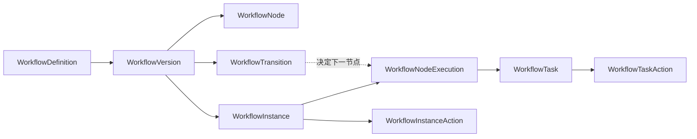
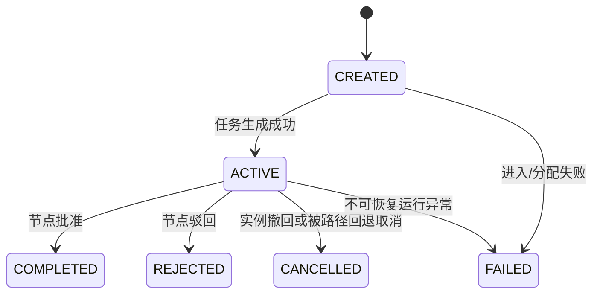
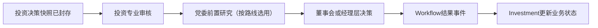

# Workflow 多节点运行引擎领域设计

## 1. 文档信息

| 项目 | 内容 |
|---|---|
| Sprint | 2-3.7-WF3.0 |
| 设计状态 | DESIGN ONLY / NOT IMPLEMENTED |
| 当前数据库基线 | V2.5.5 |
| 目标版本规划 | V2.6.x |
| 适用模块 | `modules.workflow` |

本 Sprint 只冻结多节点运行领域设计，不创建 Migration、不修改代码、不实现多节点，也不修改 Investment。V2.5.0—V2.5.5 继续作为不可变历史资产。

## 2. 建设背景与现状

当前 Workflow Lite 已具备流程定义、版本、节点、实例、任务、任务动作、RBAC 和版本发布能力，但运行语义仍为单审批节点：

1. 启动时按已发布版本的第一个启用节点创建实例和一个任务；
2. 首节点必须是 `APPROVAL`；
3. 任务 `APPROVE/REJECT/WITHDRAW` 会直接把整个实例推进到终态；
4. `workflow_instance.current_node_id` 只是当前单节点指针；
5. 没有显式节点连线、节点执行记录和跨节点推进证据；
6. `COUNTERSIGN`、`CONDITION` 已在定义模型中预留，但没有运行实现。

多节点引擎的首要目标是支持确定性的串行审批链，不把 Workflow Lite 扩张为通用 BPM。会签、条件路由和自动选人本阶段只保留边界和扩展点。

## 3. 设计原则

1. **定义与运行分离**：发布版本保存不可变流程图；实例只绑定已发布版本及其内容哈希。
2. **历史不可变**：已完成的节点执行、任务和动作只追加，不回写成新路径。
3. **显式迁移**：节点推进必须由已发布的 `Transition` 决定，禁止继续依赖 `node_order + 1`。
4. **单事务推进**：完成任务、完成节点、选择迁移、创建下一节点执行和任务必须在同一数据库事务内完成。
5. **幂等与并发安全**：命令幂等键、任务唯一键、实例乐观锁共同保证一个节点只推进一次。
6. **RBAC 不等于任务授权**：`workflow:approve` 只是功能准入；实际操作仍校验任务处理人、候选范围、企业、组织和职责分离。
7. **跨域事件同步**：Workflow 不直接修改 Investment 状态，只发布带顺序号的结果事件。
8. **兼容优先**：V2.5 历史实例继续走冻结的单节点兼容路径，不强制伪造 Transition 或节点执行历史。

## 4. 多节点流程模型

### 4.1 聚合边界

定义域：

- `WorkflowDefinition`：稳定业务定义；
- `WorkflowVersion`：不可变发布版本；
- `WorkflowNode`：版本内节点快照；
- `WorkflowTransition`：版本内节点之间的有向迁移；
- `WorkflowVersionRelease`：发布事实及图内容哈希。

运行域：

- `WorkflowInstance`：一次业务流程运行的聚合根；
- `WorkflowNodeExecution`：某个节点在实例中的一次进入和执行；
- `WorkflowTask`：节点执行产生的人工任务；
- `WorkflowTaskAction`：任务动作证据；
- `WorkflowInstanceAction`：撤回、异常终止等实例级动作证据。



### 4.2 图模型约束

V2.6 首期只执行确定性串行有向图：

- 一个发布版本必须且只能有一个入口节点；
- 至少有一个终止节点；
- 正常审批出口最多一个；
- 不允许不可达节点、自环和循环；
- `from_node_id`、`to_node_id` 必须属于同一 `version_id`；
- `node_order` 只用于展示和稳定排序，不参与运行寻路；
- 无正常出口的已批准节点代表流程正常结束；
- 驳回出口和正常出口分开建模，不得复用模糊状态字符串。

入口节点通过图的入度计算：启用节点中没有启用正常入边的唯一节点。首期不新增物理 `START/END` 节点，避免改变 V2.5 节点类型约束。若未来需要可视化开始/结束事件，应以更高版本显式扩展，而不是用伪审批节点代替。

## 5. Node 类型设计

### 5.1 类型矩阵

| `node_type` | 领域语义 | V2.6 运行状态 | 说明 |
|---|---|---|---|
| `APPROVAL` | 单处理人或单任务认领审批 | 启用 | V2.6 唯一可执行类型 |
| `COUNTERSIGN` | 多参与人会签并聚合结果 | 仅预留 | 发布校验拒绝进入 V2.6 可执行图 |
| `CONDITION` | 基于白名单变量选择出口 | 仅预留 | 发布校验拒绝进入 V2.6 可执行图 |

现有 `governance_node_type` 保持：

- `GENERAL_APPROVAL`；
- `PARTY_PRE_STUDY`；
- `BOARD_DECISION`；
- `MANAGEMENT_DECISION`。

治理类型是业务语义标签，不决定任务处理人，也不替代 Transition。

### 5.2 APPROVAL 节点规则

- 首期要求 `approval_mode=SINGLE`；
- `assignment_rule_type/config` 在进入节点时解析并冻结到任务候选快照；
- 任务处理人必须是明确受理人，或从冻结候选集合合法认领；
- `entry_condition_config`、`completion_condition_config` 仅做白名单校验扩展点，V2.6 不执行任意表达式；
- `withdraw_allowed` 参与实例撤回门禁；
- 超时只产生 `EXPIRED` 或告警建议，不自动跳过审批节点。

### 5.3 禁止事项

- 禁止 Controller 直接设置节点、任务或实例状态；
- 禁止把 Java/SQL/SpEL/脚本存入条件配置并动态执行；
- 禁止以 `node_order` 推断审批路径；
- 禁止发布包含当前引擎不支持类型的“可执行”版本；
- 禁止系统管理员仅凭 RBAC 审批任意任务。

## 6. Transition 模型

### 6.1 领域对象

`WorkflowTransition` 建议字段：

| 字段 | 含义 |
|---|---|
| `id` | 主键 |
| `version_id` | 所属不可变流程版本 |
| `transition_code` | 版本内稳定编码 |
| `transition_name` | 展示名称 |
| `from_node_id` | 来源节点 |
| `to_node_id` | 目标节点 |
| `trigger_type` | `APPROVE/REJECT` |
| `route_type` | `DIRECT/CONDITIONAL_RESERVED` |
| `priority` | 多出口稳定优先级；首期固定为 1 |
| `condition_config` | 条件路由预留配置；首期必须为空 |
| `enabled` | 是否启用 |
| 审计/删除/锁字段 | 与现有统一规范一致 |

建议唯一约束：

- `(version_id, transition_code, delete_token)`；
- `(version_id, from_node_id, trigger_type, priority, delete_token)`；
- 复合外键 `(version_id, from_node_id)`、`(version_id, to_node_id)` 指向同版本节点。

### 6.2 路由选择

```text
任务动作成功
  -> 计算节点结果
  -> CAS 完成当前 NodeExecution
  -> 按 version_id + from_node_id + trigger_type 读取已发布 Transition
  -> 校验唯一确定目标
  -> 无目标：实例进入对应终态
  -> 有目标：创建下一 NodeExecution 与任务
```

Transition 读取必须以实例冻结的 `version_id` 为条件；禁止读取 Definition 当前版本，也禁止在运行中切换新发布版本。

## 7. Task 生成规则

### 7.1 生成时机

任务只在节点成功进入后生成。实例启动和节点推进复用同一 `enterNode` 领域操作：

1. 校验实例为 `RUNNING`；
2. 校验目标节点属于实例冻结版本且可执行；
3. 创建唯一 `WorkflowNodeExecution`；
4. 解析分配规则，形成候选人和规则快照；
5. 创建任务；
6. 更新实例当前节点/当前执行指针及事件序号；
7. 写入审计/Outbox 事件。

上述步骤处于同一事务。任何一步失败均不得留下无任务的活动节点。

### 7.2 唯一性与轮次

- `visit_no`：同一实例再次进入同一节点时递增；
- `task_round`：同一次节点执行内的任务轮次；首期固定为 1；
- `participant_key`：稳定参与者键，首期单任务可用 `nodeCode:visitNo:1`；
- 建议唯一键：`(instance_id,node_id,visit_no,delete_token)` 和 `(node_execution_id,task_round,participant_key,delete_token)`；
- 重复命令命中相同幂等键时返回既有结果，不再创建任务；
- 实例和任务更新都必须带 `version` 乐观锁条件。

### 7.3 分配与权限

V2.6 不开发自动选人。现有分配规则只允许产生以下两种确定结果：

- 明确的单一 `assignee_user_id`；
- 可审计的候选快照，任务进入 `PENDING`，由合法候选人认领。

若解析结果为空、多义或依赖不可用外部组织数据，节点进入失败并将实例标记为 `EXCEPTION`，不得默认分配给管理员。

## 8. 节点执行状态机

### 8.1 WorkflowNodeExecution

建议状态：



规则：

- `COMPLETED/REJECTED/CANCELLED/FAILED` 均为单次执行终态；
- 节点回退后重新进入必须创建新 `visit_no`，禁止重开旧执行记录；
- 同一实例同一时刻 V2.6 串行模式只允许一个 `ACTIVE` 节点执行；
- `workflow_instance.current_node_id` 保留为展示指针，权威运行状态来自活动 `WorkflowNodeExecution`；
- 未来并行/会签启用后，实例可有多个活动执行，届时 `current_node_id` 仍只作主展示指针。

### 8.2 实例状态兼容

继续使用现有状态：`CREATED/RUNNING/APPROVED/REJECTED/WITHDRAWN/COMPLETED/EXCEPTION`。

- 中间节点完成：实例保持 `RUNNING`；
- 最终审批节点通过且无正常出口：实例为 `APPROVED`；
- 终止型驳回：实例为 `REJECTED`；
- 合法撤回：实例为 `WITHDRAWN`；
- `COMPLETED` 预留给非审批型正常终止，不在 V2.6 首期主动产生；
- 基础设施或数据完整性故障：实例为 `EXCEPTION`，必须人工处置，禁止自动判定通过。

## 9. 驳回规则设计

### 9.1 驳回策略

| 策略 | 行为 | V2.6 建议 |
|---|---|---|
| `TERMINATE` | 当前节点驳回后实例终止为 `REJECTED` | 首期默认，兼容 V2.5 |
| `RETURN_PREVIOUS` | 返回实际执行路径上的上一个已完成节点 | 可在 V2.6 后续批次启用 |
| `RETURN_SPECIFIED` | 返回已发布图中明确指定节点 | 可在 V2.6 后续批次启用 |

首期若没有 `REJECT` Transition，按 `TERMINATE` 处理。若存在 `REJECT` Transition，则只能有一个确定目标，不执行条件选择。

### 9.2 回退语义

回退不是修改历史：

1. 完成当前任务为 `REJECTED` 并写入动作记录；
2. 当前节点执行进入 `REJECTED`；
3. 取消当前节点之后仍开放的任务；
4. 根据冻结 Transition 或实际执行轨迹确定目标；
5. 为目标节点创建新的 `WorkflowNodeExecution.visit_no` 和新任务；
6. 实例仍为 `RUNNING`，事件序号递增；
7. Investment 只接收“节点驳回/流程继续”事件，不得误判为最终拒绝。

禁止返回未执行且不在合法回退路径上的节点，禁止返回其他版本节点，禁止覆盖原审批意见。

## 10. 撤回规则设计

撤回属于实例级命令，不应长期绑定某个任意任务。V2.5 的任务撤回接口保留兼容适配，V2.6 领域入口统一为 `withdrawInstance`。

必须同时满足：

1. 实例为 `RUNNING`；
2. 操作人为发起人或有明确委托授权的主体；
3. 当前活动节点 `withdraw_allowed=true`；
4. 尚未发生配置为不可逆的治理决策节点；
5. 命令幂等键未被其他请求使用；
6. 所有活动任务可以在同一事务中取消。

成功后：活动任务变为 `CANCELLED`，活动节点执行变为 `CANCELLED`，实例变为 `WITHDRAWN`，写入不可变 `WorkflowInstanceAction` 并发出 `WITHDRAWN` 事件。撤回后重新提交应创建新的 Workflow 实例/attempt，不得复活原实例。

## 11. 会签扩展点（仅预留）

本设计不实现会签。预留边界如下：

- `node_type=COUNTERSIGN`；
- `approval_mode=ALL/ANY/QUORUM`；
- 一个 NodeExecution 下允许多个 participant task；
- 候选集合、参与人集合和阈值在节点进入时冻结；
- 聚合器基于任务结果计算节点结果，不能由单个任务直接推进实例；
- 职责分离、弃权、代理、加签、减签另行设计；
- 并发最后一票通过时以 NodeExecution/Instance 乐观锁保证只推进一次。

V2.6 发布校验必须拒绝 `COUNTERSIGN` 进入可执行版本，直到专门 Sprint 完成数据库、聚合算法和并发验收。

## 12. 条件路由扩展点（仅预留）

本设计不实现条件路由。预留边界如下：

- `node_type=CONDITION` 或 `transition.route_type=CONDITIONAL_RESERVED`；
- 条件只读取实例启动时冻结的白名单变量快照；
- 条件采用受控 DSL/决策表，不执行 JavaScript、SpEL、SQL 或任意代码；
- 发布时校验条件互斥性、默认出口和可达性；
- 运行时记录命中的 Transition、规则版本、输入摘要和结果哈希；
- 无命中、多命中或解析失败进入 `EXCEPTION`，不得任意选择第一条边。

V2.6 首期所有可执行 Transition 必须为 `DIRECT`，且 `condition_config` 为空。

## 13. 与 Investment 三重一大流程映射

### 13.1 职责边界

Investment 负责：决策事项、冻结快照、可研/尽调/投资方案引用、三重一大路线判定、风险门禁和业务状态。

Workflow 负责：冻结版本绑定、节点执行、任务分配、审批动作、节点推进和流程结果事件。

Workflow 禁止直接更新 Investment 表。Investment 通过现有 binding、Outbox/Inbox 和顺序事件消费结果。

### 13.2 标准映射



| Investment 语义 | Workflow 节点编码建议 | 治理类型 |
|---|---|---|
| 投资专业审核 | `INVESTMENT_REVIEW` | `GENERAL_APPROVAL` |
| 党委前置研究 | `PARTY_PRE_STUDY` | `PARTY_PRE_STUDY` |
| 董事会决策 | `BOARD_DECISION` | `BOARD_DECISION` |
| 经理层决策 | `MANAGEMENT_DECISION` | `MANAGEMENT_DECISION` |

党委前置研究是前置程序，不等于最终投资批准。董事会与经理层节点由 Investment 在提交前依据冻结的章程、授权清单和三重一大规则确定。

### 13.3 条件路由未实现前的落地方式

在条件路由未启用前，不允许 Workflow 根据金额等业务字段动态选择董事会或经理层。Investment 的 `DecisionRoutePolicy` 应先冻结路线，再选择与路线匹配的已发布 Workflow Definition/Version，例如：

- 党委前置研究 + 董事会；
- 党委前置研究 + 经理层；
- 董事会；
- 经理层。

启动请求携带 `decisionId`、`snapshotId`、`routeSnapshotHash` 等稳定引用。Workflow 只校验定义业务类型和快照引用，不重新计算投资决策路线。

### 13.4 事件映射

| Workflow 事件 | Investment 处理 |
|---|---|
| `INSTANCE_STARTED` | 绑定实例，业务保持审批中 |
| `NODE_COMPLETED` | 更新对应决策节点摘要，不直接批准投资事项 |
| `NODE_REJECTED_CONTINUING` | 记录退回，等待新一轮节点任务 |
| `INSTANCE_APPROVED` | 校验 snapshot/binding/sequence 后进入业务批准逻辑 |
| `INSTANCE_REJECTED` | 业务进入驳回状态 |
| `INSTANCE_WITHDRAWN` | 业务进入撤回状态，原快照保留 |
| `INSTANCE_EXCEPTION` | 标记流程异常并阻断后续实施 |

所有事件必须包含 `eventId`、`eventSequence`、`instanceId`、`versionId`、`businessType`、`businessId`、快照引用、节点/任务引用、结果、发生时间和 `traceId`。

## 14. V2.6.x Migration 规划

以下仅为规划，不在本 Sprint 创建 SQL：

| 版本 | 建议名称 | 范围 | 兼容策略 |
|---|---|---|---|
| V2.6.0 | `create_workflow_transition_graph` | 新建 `workflow_transition`；为版本增加引擎模式和内容哈希算法标识 | 历史版本标记 `SINGLE_NODE_LEGACY/NODE_V1`，不重算旧 hash |
| V2.6.1 | `create_workflow_node_execution` | 新建 `workflow_node_execution`；实例增加当前执行引用；任务增加可空 `node_execution_id` | 历史任务保持 NULL，由兼容读取处理，禁止伪造执行记录 |
| V2.6.2 | `add_workflow_instance_action_and_transition_audit` | 新建实例动作记录；为任务动作补充可空节点执行/迁移引用 | 旧动作不回推 Transition |
| V2.6.3 | `initialize_workflow_multi_node_governance` | 必要字典、审计事件类型和最小权限映射 | 复用现有 RBAC，不默认授权普通角色 |
| V2.6.4 | `tighten_workflow_multi_node_integrity` | 在 Fresh/Upgrade 和数据回填验收后收紧新数据约束、索引和 CHECK | 只约束 V2.6 新模式；历史兼容行保留 |

Migration 规则：

- 不修改 V2.5.0—V2.5.5；
- 每个版本分别进行 Fresh 与 V2.5.5 Upgrade 真实 MySQL 验收；
- 采用扩展、回填、验证、收紧四步法；
- 禁止根据节点名称猜测历史 Transition；
- 只有“单个启用 APPROVAL 节点”的历史版本可明确标记为 `SINGLE_NODE_LEGACY`；
- 任何无法确认的历史结构保持旧引擎模式并输出治理报告；
- 内容哈希 V2 必须覆盖节点、Transition、执行策略及规范化配置，但排除数据库 ID、审计时间和审计人员；
- 已发布 V2.5 版本 hash 永不重算。

## 15. 与现有 Workflow 结构兼容性

### 15.1 表级兼容

| 现有结构 | 处理方式 |
|---|---|
| `workflow_definition` | 原样复用，不改变当前版本指针语义 |
| `workflow_version` | 仅未来 Migration 增加引擎/哈希算法标识；历史状态不变 |
| `workflow_node` | 原样复用；`node_order` 降为展示属性 |
| `workflow_version_release` | 原发布事实保留；未来记录 hash 算法快照，不修改历史事实 |
| `workflow_instance` | 保留 `current_node_id`；新增执行指针后它继续作展示兼容字段 |
| `workflow_task` | 保留既有字段和接口；V2.6 任务关联 NodeExecution |
| `workflow_task_action` | 原动作不可变；未来仅追加可空运行引用 |

### 15.2 双引擎兼容策略

- `SINGLE_NODE_LEGACY`：所有 V2.5 历史实例及其重放查询继续使用现有语义；
- `MULTI_NODE_V1`：仅新发布、通过图完整性校验且使用 GRAPH_V2 hash 的版本可启动；
- 实例启动时冻结 `engine_mode`、版本号、版本 hash 和 hash 算法；
- 一个实例生命周期内禁止改变引擎模式；
- 查询接口可统一返回实例、节点执行和任务视图；旧实例的节点执行视图由兼容投影生成，但不得持久化伪造历史数据；
- V2.5 任务动作接口保留，内部按实例模式路由；多节点模式下任务通过只完成当前节点，不直接批准实例。

### 15.3 API兼容

现有启动、实例查询、任务查询和任务动作 URL 不改。未来新增：

- 节点执行时间线查询；
- 实例级撤回命令；
- 图校验/发布预检结果查询。

响应可新增可选字段，禁止改变现有字段含义。对 `MULTI_NODE_V1`，审批响应必须区分 `taskResult`、`nodeResult` 和 `instanceStatus`，避免调用方把中间节点通过误认为流程批准。

## 16. 发布与运行门禁

多节点版本发布前必须验证：

1. 只有一个入口节点，至少一个终止节点；
2. 所有启用节点可达且可到达终点；
3. V2.6 首期无环、自环、并行分支和条件出口；
4. 每个 APPROVAL 节点分配规则可解析且满足职责分离；
5. 正常/驳回出口确定且同版本；
6. 未启用 COUNTERSIGN、CONDITION；
7. 图规范化 hash 与发布记录一致；
8. Definition 当前版本切换保持单一 PUBLISHED；
9. 真实 MySQL Fresh/Upgrade、并发推进、幂等和故障恢复测试通过。

运行时任何图结构与发布 hash 不一致必须拒绝启动或推进，并产生 `EXCEPTION` 审计事件，禁止静默修复。

## 17. 测试设计

后续实现至少覆盖：

- 三节点顺序通过，前两节点通过时实例仍为 `RUNNING`；
- 最后节点通过时实例仅完成一次；
- 中间节点终止驳回；
- 返回上一节点产生新 visit/task，不修改旧历史；
- 撤回取消所有开放任务；
- 同一任务重复提交幂等；
- 两管理员并发完成同一任务仅一个成功；
- 两线程同时推进节点仅生成一组下一任务；
- 非 assignee/候选人即使有 `workflow:approve` 仍被拒绝；
- 跨企业、跨组织和跨版本访问被拒绝；
- 不可达、循环、多入口、多正常出口图发布失败；
- V2.5 历史单节点实例查询和动作保持兼容；
- Investment 绑定、事件序列、重复/乱序事件和快照引用校验。

## 18. 风险清单

| 风险 | 等级 | 控制措施 |
|---|---|---|
| 中间节点审批误终结实例 | P0 | 任务、节点、实例三层结果分离；事务测试阻断发布 |
| 并发推进重复创建任务 | P0 | 实例/执行乐观锁、唯一键、命令幂等 |
| 历史版本被重新计算 hash | P0 | 双 hash 算法标识；旧 hash 永不重算 |
| RBAC 被误当作任务审批权 | P0 | 强制 assignee/candidate、数据范围和职责分离校验 |
| Investment 路线与 Workflow 动态分支冲突 | P0 | 条件路由前由 Investment 冻结路线并选择确定版本 |
| 驳回覆盖审批历史 | P1 | 每次回退创建新 NodeExecution/task round |
| `current_node_id` 在未来并行场景失真 | P1 | 明确其为展示字段，运行权威迁移至 NodeExecution |
| 自动选人错误导致越权 | P1 | 本阶段不实现；解析不确定即失败 |
| 条件配置演变为任意代码执行 | P0 | 仅允许受控 DSL/决策表，V2.6 首期禁止执行 |

## 19. 后续开发路线

1. WF3.1：冻结 `WorkflowTransition`、`WorkflowNodeExecution` 详细数据库设计和状态迁移矩阵；
2. WF3.2：创建并真实验收 V2.6.0 定义图 Migration；
3. WF3.3：实现串行多节点运行内核及兼容路由；
4. WF3.4：实现节点回退、实例撤回和并发可靠性；
5. WF3.5：进行 Investment 三重一大契约测试，不修改 Investment 业务边界；
6. 会签、条件路由、自动选人必须各自进入独立设计与验收 Sprint，不纳入 V2.6 首期。

本设计完成后保持 `DESIGN_READY / CODE_NOT_STARTED / MIGRATION_NOT_CREATED`。
