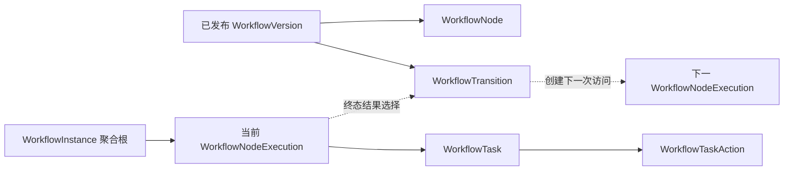
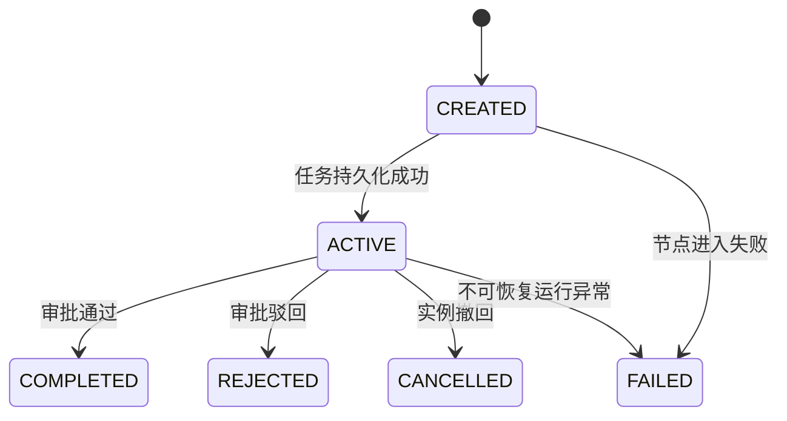

# Workflow 多节点运行模型治理补强设计

## 1. 文档信息

| 项目 | 内容 |
|---|---|
| Sprint | 2-3.7-WF3.1.2 |
| 状态 | DESIGN FROZEN / NOT IMPLEMENTED |
| 数据库基线 | V2.6.0 `CANONICAL_IMMUTABLE / EPHEMERAL_MYSQL8_VALIDATED` |
| 适用模块 | `modules.workflow` |
| 下一实施阶段 | WF3.2 线性节点推进引擎 |

本 Sprint 只补强执行模型治理设计，不修改代码、不创建 Migration、不修改 Investment。会签、条件路由、自动选人继续保持未实现状态。

## 2. 目标与边界

本设计在 WF3.0 领域设计和 V2.6.0 数据底座之上，冻结 WF3.2 可以实施的最小、确定、安全的线性推进模型：

1. 明确实例、节点执行、任务、动作和迁移之间的权威关系；
2. 消除“任务通过即流程通过”的单节点语义；
3. 定义启动、审批、驳回、撤回、异常处理的事务边界；
4. 定义幂等、并发、故障恢复和审计证据要求；
5. 给出后续 V2.6.x 增量 Migration 规划，但本 Sprint 不生成 SQL；
6. 为 WF3.2、WF3.3 和 WF4.0 划清职责。

本阶段不设计通用 BPM，不支持并行分支、会签聚合、动态条件计算、脚本执行、自动组织/岗位选人或运行中变更流程版本。

## 3. 当前模型审计

### 3.1 已具备能力

- `workflow_transition` 已能表达同一冻结版本内的显式有向边，并用复合外键阻断跨版本节点引用；
- `workflow_node_execution` 已记录节点访问次数、前序执行、来源 Transition、状态和时间证据；
- V2.6.0 已通过 Fresh/Upgrade、约束负向测试和双路径 Schema 指纹验收；
- `WorkflowTransition`、`WorkflowNodeExecution` 领域模型及 Repository 链路已存在；
- 只读 API 已能查询版本迁移关系和实例执行轨迹；
- V2.5 的实例、任务、任务动作、版本发布和 RBAC 能力保持兼容。

### 3.2 阻断 WF3.2 的缺口

| 编号 | 缺口 | 风险 | 等级 |
|---|---|---|---|
| G-01 | `workflow_task` 未关联 `workflow_node_execution` | 无法证明任务属于哪一次节点访问，回退重访时任务轮次可能混淆 | P0 |
| G-02 | `workflow_instance` 只有 `current_node_id` | 不能稳定指向权威执行记录，也无法区分旧单节点与新线性引擎 | P0 |
| G-03 | 当前任务动作直接终结实例 | 中间节点批准会被误判为整个流程批准 | P0 |
| G-04 | Transition 未纳入发布内容哈希 | 已发布图可能被修改，实例无法验证运行图与发布事实一致 | P0 |
| G-05 | 发布校验仍是单节点规则 | 无法保证唯一入口、可达、无环、单一 APPROVE 出口 | P0 |
| G-06 | Transition 缺少受控定义写入口 | 不能形成完整、可发布、不可变的图配置链路 | P1 |
| G-07 | `assignee_user_id` 为空时当前校验过宽 | 仅有 `workflow:approve` 的用户可能处理非本人任务 | P0 |
| G-08 | 节点状态更新和任务动作仍是两条独立链路 | 可能出现任务终态、节点仍活动或重复推进 | P0 |

## 4. 权威执行模型

### 4.1 聚合与职责

`WorkflowInstance` 是运行域聚合根。其内部一致性边界包含：

- 一个冻结的 `WorkflowVersion` 绑定；
- 当前权威 `WorkflowNodeExecution`；
- 当前执行下的 `WorkflowTask`；
- 产生决策证据的 `WorkflowTaskAction`；
- 用于进入下一执行的 `WorkflowTransition`。

定义域的 Node/Transition 是不可变运行输入，运行域不得修改它们。Repository 可分表实现，但推进命令必须由一个 Application Service 事务统一编排。

### 4.2 权威关系



权威顺序如下：

1. 实例冻结的 `version_id + definition_content_hash_snapshot + hash_algorithm` 决定可运行图；
2. 活动 `WorkflowNodeExecution` 是当前运行位置的权威来源；
3. `workflow_instance.current_node_id` 仅为兼容展示字段；
4. 新增的 `current_node_execution_id` 是线性引擎的权威游标；
5. 任务必须关联节点执行；任务动作只能影响其关联执行；
6. 下一节点只可由该执行所属版本中的有效 DIRECT Transition 决定。

### 4.3 运行模式

冻结两种模式：

| 模式 | 适用数据 | 行为 |
|---|---|---|
| `SINGLE_NODE_LEGACY` | V2.5 历史实例和未具备图发布证据的版本 | 继续走原兼容链，不伪造节点执行历史 |
| `MULTI_NODE_LINEAR_V1` | 通过 GRAPH_V2 发布校验的新版本和新实例 | 必须使用 NodeExecution + Transition 推进 |

运行模式必须在实例启动时持久化，禁止根据是否存在 Transition、节点数量或名称动态猜测。历史实例统一回填 `SINGLE_NODE_LEGACY`。

## 5. 线性图约束

WF3.2 只接受确定性线性图：

1. 仅允许启用的 `APPROVAL` 节点；
2. 仅允许 `DIRECT` Transition，`condition_config` 必须为空；
3. 仅有一个入度为 0 的入口节点；
4. 至少一个无 APPROVE 出边的终点节点；
5. 每个非终点节点恰有一个启用的 APPROVE 出边；
6. REJECT 首期固定为终止流程，不通过 REJECT Transition 回退；
7. 所有启用节点从入口可达；
8. 不允许自环、环路、并行分叉、汇聚或跨版本引用；
9. `node_order` 只负责展示，不参与运行寻路；
10. 发布后 Node 和 Transition 均不可修改或逻辑删除。

发布校验必须在事务内完成，并将规范化图内容计算为 `GRAPH_V2_SHA256`。规范化输入包含稳定业务字段、节点顺序与配置、Transition 编码/起终节点编码/触发类型/优先级；排除数据库 ID、审计字段和时间字段。

## 6. 节点执行与任务关联

### 6.1 NodeExecution 状态机



- `COMPLETED` 表示当前节点完成，不等于实例 `APPROVED`；
- `REJECTED` 在 WF3.2 表示当前节点驳回且实例最终 `REJECTED`；
- 所有终态不可重开；重访必须创建新的 `visit_no`；
- 线性模式同一实例同一时刻只能有一个权威活动执行；该规则由实例行锁/乐观锁和当前执行游标保证。

### 6.2 Task 约束

新线性实例的任务必须满足：

- `node_execution_id` 非空，且与任务的 `instance_id/version_id/node_id` 一致；
- 唯一键以 `(node_execution_id, task_round, participant_key, delete_token)` 为准；
- `task_round=1`，WF3.2 不实现加签或多轮会签；
- 每个 NodeExecution 只生成一个活动任务；
- 任务关闭后禁止覆盖，重新进入节点创建新的 Execution 和 Task；
- Legacy 任务允许 `node_execution_id=NULL`，只能由兼容服务处理。

### 6.3 最小安全分配边界

WF3.2 不实现自动选人，但不得延续“assignee 为空即可由任意有 RBAC 权限用户审批”的行为：

- 线性图只允许可确定为单一用户的 `EXPLICIT_USER` 分配结果；
- 节点进入时冻结 `assignee_user_id` 和候选快照；
- `workflow:approve` 仅是功能准入，审批时仍必须满足 `operator_user_id == assignee_user_id`；
- 无法解析出唯一有效用户时，节点不得激活，实例进入可审计的 `EXCEPTION`；
- 组织、岗位、候选池、认领和委托策略归 WF3.3，不在 WF3.2 扩展。

## 7. WF3.2 命令模型

### 7.1 启动命令

`startLinearWorkflow(command)` 必须在同一事务内：

1. 校验幂等键及请求哈希；
2. 加载 Definition 当前已发布 Version 和发布事实；
3. 校验 `MULTI_NODE_LINEAR_V1 + GRAPH_V2_SHA256`；
4. 重新计算图哈希并与发布事实比对；
5. 找到唯一入口节点；
6. 创建 RUNNING 实例并冻结运行模式、版本和图哈希；
7. 创建入口 NodeExecution；
8. 解析唯一明确处理人并创建 Task；
9. 激活 NodeExecution，更新实例当前执行游标；
10. 写审计/Outbox 事件后提交。

任一步失败必须整体回滚，不允许出现“实例存在但无活动节点”或“活动节点无任务”。

### 7.2 审批通过命令

`approveTask(taskId, idempotencyKey, expectedTaskVersion)`：

1. 验证 RBAC、数据范围、任务处理人和幂等请求哈希；
2. 按固定顺序锁定 Instance → NodeExecution → Task；
3. 校验三者版本、归属和活动状态；
4. 追加 APPROVE TaskAction，CAS 关闭 Task；
5. CAS 将 NodeExecution 置为 COMPLETED；
6. 查询唯一启用的 APPROVE DIRECT Transition；
7. 无出边：实例进入 APPROVED，清空当前执行游标，产生流程完成事件；
8. 有出边：创建下一 NodeExecution 和 Task，激活执行并切换实例游标，实例保持 RUNNING；
9. 增加 `event_sequence`，追加审计/Outbox 后提交。

中间节点响应必须区分：`taskStatus`、`nodeExecutionStatus`、`instanceStatus`、`nextNodeCode`。禁止返回会被调用方解释为“整个流程 APPROVED”的模糊结果。

### 7.3 驳回与撤回

- WF3.2 的 REJECT 固定终止：Task=`REJECTED`、NodeExecution=`REJECTED`、Instance=`REJECTED`；不执行回退；
- WITHDRAW 是实例级动作，只允许发起人在当前节点允许撤回且尚未产生不可逆治理决策时执行；
- 撤回必须取消活动 Task 和 NodeExecution，并将 Instance 置为 `WITHDRAWN`；
- 驳回回退、指定节点回退和重新提交复用旧实例均不属于 WF3.2。

## 8. 幂等与并发治理

### 8.1 幂等层级

| 层级 | 稳定键 | 冲突处理 |
|---|---|---|
| 实例启动 | `enterprise_id + idempotency_key` | 同请求返回原实例；不同请求哈希拒绝 |
| 任务动作 | `task_id + idempotency_key` | 同请求返回原动作；不同动作/操作者/哈希拒绝 |
| 节点访问 | `instance_id + node_id + visit_no` | 同路径证据返回原执行；不同路径拒绝 |
| 节点任务 | `node_execution_id + task_round + participant_key` | 唯一约束阻断重复任务 |

### 8.2 并发策略

- 数据库事务隔离按现有平台配置执行，但推进必须显式锁定实例聚合根；
- 所有更新携带 `version`，更新行数为 0 视为并发冲突；
- 锁顺序固定为 Instance → NodeExecution → Task，避免死锁；
- Transition/Node 只读且必须来自冻结版本；
- 两个审批请求并发时，仅一个可关闭任务并推进；另一个返回幂等结果或明确的并发冲突；
- 唯一键是最后防线，捕获重复键后必须回读并校验路径，禁止盲目吞异常。

## 9. 一致性与故障恢复

### 9.1 事务内失败

任务动作、节点终态、下一执行、下一任务、实例游标和 Outbox 必须同事务提交。任何数据库/分配/哈希异常均整体回滚。

### 9.2 提交结果未知

客户端超时后使用原幂等键重试。服务端回读 TaskAction 和请求哈希：已提交则返回既有推进结果，未提交才重新执行。

### 9.3 提交后事件失败

业务事务只写 Outbox，不在事务内同步调用 Investment。Worker 重试不得重复推进流程；Investment 依据实例 ID + `event_sequence` 幂等消费。

### 9.4 异常实例

仅以下不可恢复错误进入 `EXCEPTION`：发布图哈希漂移、无唯一入口/出口、分配结果不安全、运行路径证据损坏。数据库瞬时异常应回滚重试，不得先把实例标记为 EXCEPTION。

人工处置首期只允许查询和审计，不提供直接改状态接口。恢复/重放需后续独立设计。

## 10. 增量数据库规划（仅规划）

不得修改 V2.5.0—V2.6.0。建议后续仅通过新增 Migration 实施：

### V2.6.1：运行关联与引擎标识

- `workflow_version` 增加 `engine_mode`、`content_hash_algorithm`；历史值为 Legacy；
- `workflow_version_release` 冻结引擎模式和哈希算法；
- `workflow_instance` 增加 `engine_mode`、`content_hash_algorithm_snapshot`、可空 `current_node_execution_id`；
- `workflow_task` 增加可空 `node_execution_id`；
- 增加同实例/版本/节点复合外键及任务执行索引；
- 历史记录保持 NULL/Legacy，禁止伪造关联。

### V2.6.2：运行证据增强（按 WF3.2 实现需要评审）

- `workflow_task_action` 增加可空 `node_execution_id` 和 `transition_id` 快照引用，Legacy 保持 NULL；
- 如现有 Outbox 不能表达节点事件，再新增最小事件字段或事件类型，不重复建设消息表；
- 不新增通用脚本、条件、会签或候选人业务表。

任何 Migration 候选都必须经过 Fresh、V2.6.0 Upgrade、严格 validate、二次 no-op、Schema 指纹、外键/CHECK/唯一键负向测试后方可晋级。

## 11. 服务与接口治理

### 11.1 服务边界

建议新增内部编排器 `LinearWorkflowEngineApplicationService`，统一启动和任务处理。现有服务按兼容模式路由：

- Legacy 实例继续调用原单节点兼容服务；
- Linear 实例必须调用新引擎；
- 禁止 Controller、Mapper 或独立 NodeExecution Service 绕过聚合编排器推进状态；
- 当前 `createNodeExecution/updateNodeExecutionState` 只能作为内部基础能力，WF3.2 后不得被业务编排直接拆散调用。

### 11.2 API 兼容

保留既有 URL。请求增加的幂等键/期望版本必须有明确校验；响应可新增兼容字段：

- `taskStatus`；
- `nodeExecutionStatus`；
- `instanceStatus`；
- `currentNodeCode`；
- `nextTaskId`（有下一节点时）；
- `eventSequence`。

查询接口应展示完整执行轨迹，但不得泄露未授权组织、候选人明细或敏感审批意见。

## 12. 发布与启动门禁

WF3.2 编码前必须满足：

1. V2.6.0 保持不可变且验收资产无漂移；
2. V2.6.1 数据设计评审通过；
3. GRAPH_V2 规范化规则有确定测试向量；
4. Transition 纳入版本发布、冻结与内容哈希；
5. 唯一入口、可达、无环、单 APPROVE 出口校验可自动执行；
6. Legacy/Linear 路由规则不可由数据形态猜测；
7. 任务到 NodeExecution 的归属可由数据库约束验证；
8. `workflow:approve` 与任务处理人双重校验测试具备；
9. 单事务推进、幂等重试、双线程竞争和故障注入测试方案完成；
10. 不需要 Investment 改造即可独立验收 Workflow 线性引擎。

## 13. WF3.2 验收矩阵

至少覆盖：

- 1、2、3 个审批节点顺序推进；
- 中间节点通过后实例仍为 RUNNING；
- 最后节点通过后实例才为 APPROVED；
- 中间节点驳回后实例为 REJECTED，且不创建下一任务；
- 撤回取消当前执行和任务；
- 相同幂等键重复审批不重复推进；
- 相同幂等键不同请求哈希被拒绝；
- 两线程审批同一任务只创建一组下一执行/任务；
- 非 assignee 即使有 `workflow:approve` 也被拒绝；
- Transition 缺失、多个出口、跨版本或 hash 漂移均拒绝启动/推进；
- Legacy 实例行为不变；
- 事务在动作、节点、下一任务、实例游标各故障点均完整回滚；
- Spring 启动、全量回归及真实 MySQL Migration 验收通过。

## 14. 与后续 Sprint 的责任边界

| 阶段 | 负责内容 | 明确不负责 |
|---|---|---|
| WF3.1.2 | 冻结执行模型、数据关联、事务/并发/幂等治理 | 不编码、不建 Migration |
| WF3.2 | 线性 APPROVAL 节点启动与推进、终点判定、Legacy 兼容 | 不做组织岗位自动选人、会签、条件路由 |
| WF3.3 | 任务分配策略、候选人解析、认领/委托及组织岗位规则 | 不改变线性推进语义 |
| WF4.0 | Investment 三重一大流程模板、快照绑定、事件联调 | 不让 Workflow 直接修改 Investment 状态 |

## 15. 风险清单

| 风险 | 等级 | 治理措施 |
|---|---|---|
| 中间节点通过被误认为流程通过 | P0 | 分离 Task/Node/Instance 结果，统一引擎编排 |
| 任务与节点访问无法对应 | P0 | V2.6.1 增加 `node_execution_id` 及复合约束 |
| 发布后 Transition 漂移 | P0 | GRAPH_V2 hash、发布冻结、运行时校验 |
| RBAC 越权审批任意任务 | P0 | 强制 assignee 校验；WF3.2 仅支持明确用户 |
| 并发生成重复下一任务 | P0 | 聚合根锁、乐观锁、唯一键、幂等回读 |
| Legacy 数据被错误升级 | P0 | 显式 engine_mode；历史保持 Legacy/NULL |
| 事务提交未知导致重复推进 | P1 | 原幂等键重试并回读动作结果 |
| EXCEPTION 被滥用掩盖瞬时错误 | P1 | 瞬时故障回滚；仅完整性错误进入 EXCEPTION |
| 过早引入任务分配复杂度 | P1 | WF3.2 仅 EXPLICIT_USER，完整策略归 WF3.3 |

## 16. 结论与路线

V2.6.0 已完成多节点数据底座，但尚不具备安全自动推进条件。本设计冻结后，整体路线保持：

```text
V2.6.0 多节点数据底座（已完成）
  -> WF3.1.2 执行模型补强设计（本设计）
  -> WF3.2 线性节点推进引擎
  -> WF3.3 任务分配策略
  -> WF4.0 Investment 三重一大流程落地
```

下一 Sprint 只能在第 12 节门禁满足后进入 WF3.2；不得跳过数据关联、图哈希、任务处理人校验或 Legacy 隔离直接实现自动推进。
