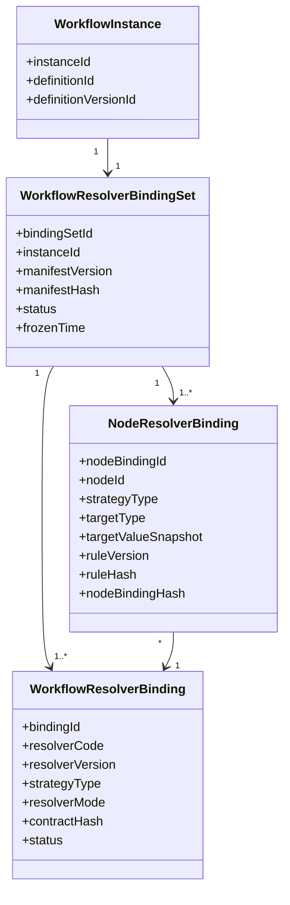
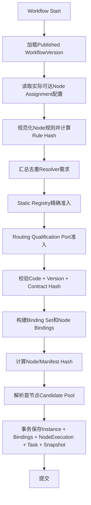
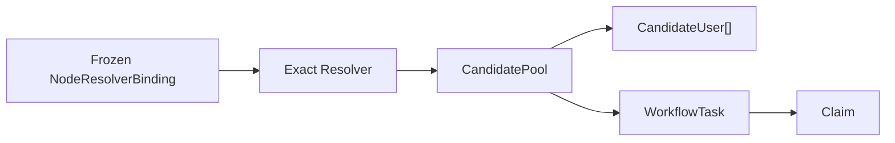

# Workflow Multi-Resolver Binding Governance Design

> Sprint：2-3.7-WF3.8
> 基线：V2.6.4、WF3.6、WF3.7
> 状态：`DESIGN_FROZEN / IMPLEMENTATION_NOT_STARTED`
> 当前运行能力：`EXPLICIT_USER_V1 + USER + DIRECT`

## 1. 背景与问题

当前 `WorkflowInstance` 只保存一组 `ResolverVersionBinding`：

```text
Instance -> EXPLICIT_USER / EXPLICIT_USER_V1 / ContractHash
```

该结构可以保证现有线性USER任务在实例启动后不重新选择Resolver，但不能表达一个实例内不同节点使用不同Resolver：

```text
Node A -> EXPLICIT_USER_V1
Node B -> ROLE_V1
Node C -> POSITION_V1
Node D -> ORG_V1
```

直接在Task创建时读取最新Node配置或查询最新Resolver会产生以下生产风险：

- 在途实例因发布新Resolver而改变审批人范围；
- Node配置变化后无法证明历史任务采用了哪条规则；
- Contract Hash漂移无法在实例级阻断；
- 历史任务恢复时依赖当前Registry，无法确定性重放；
- ROLE/POSITION/ORG人员变化可能被错误解释为历史候选证据。

因此需要把“实例启动时冻结Resolver实现集合”和“节点使用哪一个Resolver及什么Assignment规则”分别建模。

## 2. 设计目标

1. 实例启动时冻结该实例所有实际可达节点需要的Resolver实现契约。
2. 支持不同Node绑定不同Resolver，同一Resolver实现可被多个Node复用。
3. `ResolverCode + ResolverVersion + ContractHash`共同确定实现身份。
4. 冻结Node的Strategy、Target和Rule，不动态引用当前Node配置。
5. 后续Task只能读取实例冻结Binding，不允许选择最新Resolver。
6. 为ROLE/POSITION/ORG Candidate Pool和Claim提供稳定输入。
7. 保持SINGLE_NODE_LEGACY及现有EXPLICIT_USER实例兼容，不伪造历史证据。
8. 所有启动写入具备事务一致性、并发控制和幂等能力。

非目标：本Sprint不实现Resolver、不创建Candidate Pool、不实现Claim、不修改Investment、不创建Migration。

## 3. 核心不变量

- Binding是运行时冻结事实，不是指向当前定义配置的动态引用。
- 一个Multi-Resolver实例必须有且仅有一个活动Binding Set。
- 每个可执行Node必须有且仅有一个Node Resolver Binding。
- Node Binding必须引用本实例Binding Set中的Resolver Binding。
- Resolver身份三元组任一项不一致均拒绝启动或继续执行。
- Binding Set冻结后，身份、规则、目标和Hash不可修改。
- Task创建不得访问“默认Resolver”“最新Resolver”或最新Node Assignment配置。
- Candidate Pool是Task创建时的解析结果，不属于实例Binding Set。
- Resolver状态变化不得重写历史Binding。
- 无法证明的Legacy Node Binding不得回填或推断。

## 4. 方案评审

### 4.1 方案A：Instance + Node一对一Binding

每个实例Node记录完整Resolver Code、Version、Contract Hash和Assignment规则。

优点：查询直接、单表可追溯。
缺点：相同Resolver在多个Node重复存储；实现身份和节点业务规则混合；Contract治理、灾备统计和版本下线检查困难。

### 4.2 方案B：Instance Resolver Binding Set + Node引用Binding

实例先冻结去重的Resolver实现集合，每个Node再引用集合内某个Resolver并保存自己的规则快照。

优点：

- Resolver实现身份去重；
- Node规则独立冻结；
- 可按Resolver版本查找所有在途实例；
- 支持灾备、下线影响分析和Contract校验；
- 适合ROLE/POSITION/ORG扩展；
- Candidate Pool可精确引用Node Binding。

代价：需要Binding Set、Resolver Binding、Node Binding三层关系，Migration和Repository稍复杂。

### 4.3 方案C：Instance复制全部Node Assignment配置

实例保存完整Node配置JSON，由运行时自行解析。

优点：写入简单、结构变化少。
缺点：无法建立强约束和索引；Resolver复用、版本影响查询、Contract审计和局部规则校验困难；JSON演进风险高。

### 4.4 比较矩阵

| 维度 | 方案A | 方案B | 方案C |
|---|---|---|---|
| 数据冗余 | 高 | 低 | 中 |
| 审计能力 | 中 | 高 | 低 |
| 历史追溯 | 高 | 高 | 中 |
| Resolver复用 | 差 | 最佳 | 差 |
| 查询性能 | 简单但重复 | 索引后稳定 | JSON查询较差 |
| Migration复杂度 | 中 | 较高 | 低 |
| ROLE/POSITION/ORG扩展 | 中 | 最佳 | 较差 |
| Contract下线影响分析 | 困难 | 最佳 | 困难 |
| 数据库约束能力 | 中 | 高 | 低 |

冻结决策：采用方案B。

## 5. Domain模型



### 5.1 WorkflowResolverBindingSet

Binding Set是实例Resolver治理聚合，至少包含：

| 属性 | 说明 |
|---|---|
| `bindingSetId` | 稳定ID |
| `instanceId` | 所属实例 |
| `definitionId` | 定义快照引用 |
| `definitionVersionId` | 已发布版本 |
| `manifestVersion` | Binding Manifest格式版本 |
| `manifestHash` | 全部Node Binding规范化Hash |
| `bindingStatus` | FROZEN、ARCHIVED、SECURITY_BLOCKED |
| `frozenTime` | 冻结时间 |
| `auditInfo` | 非敏感冻结依据和trace信息 |

创建过程中的PREPARING只存在于内存/事务内；事务提交后必须直接成为FROZEN，禁止留下半成品Binding Set。

`SECURITY_BLOCKED`仅用于重大安全事件停止历史实例执行，不能用于普通Resolver退役。

### 5.2 WorkflowResolverBinding

表示实例冻结的一个Resolver实现契约：

| 属性 | 说明 |
|---|---|
| `bindingId` | Binding ID |
| `bindingSetId/instanceId` | 所属关系 |
| `resolverCode` | 稳定实现族编码 |
| `resolverVersion` | 精确版本 |
| `strategyType` | USER、ROLE、POSITION、ORG |
| `resolverMode` | DIRECT、CANDIDATE_POOL |
| `contractHash` | 小写SHA-256，ASCII/BINARY语义 |
| `bindingStatus` | FROZEN、ARCHIVED、SECURITY_BLOCKED |
| `createdTime/auditInfo` | 冻结时间和依据 |

同一Code不同Version是不同Binding；同一Code、Version但Contract Hash不同必须视为篡改，不允许并存或替换。

### 5.3 NodeResolverBinding

Node Binding是节点Assignment运行规则的实例快照：

| 属性 | 说明 |
|---|---|
| `instanceId/definitionVersionId/nodeId` | 归属 |
| `nodeCodeSnapshot` | 节点稳定编码快照 |
| `resolverBindingId` | 引用实例冻结Resolver |
| `resolverCode/version/contractHash` | 查询投影，可通过关联获得，不作为第二权威源 |
| `strategyType` | USER、ROLE、POSITION、ORG |
| `resolverMode` | DIRECT、CANDIDATE_POOL |
| `targetType` | USER、ROLE、POSITION、ORG |
| `targetValueSnapshot` | 稳定目标键及非敏感配置 |
| `ruleVersion` | Assignment规则语义版本 |
| `ruleSnapshot` | 规范化不可变规则 |
| `ruleHash` | 规则SHA-256 |
| `nodeBindingHash` | 节点、Resolver身份、目标、规则综合Hash |
| `bindingStatus` | FROZEN、ARCHIVED、SECURITY_BLOCKED |
| `auditInfo` | 来源版本、冻结原因、操作者/系统身份 |

Node Binding必须复制规则内容；只保存 `nodeId` 并在运行时读取 `workflow_node.assignment_rule_config` 不符合冻结要求。

## 6. Hash规范

### 6.1 Resolver Contract Hash

沿用V2.6.4：64位小写SHA-256、`ascii_bin`，代表Resolver实现契约。

### 6.2 Rule Hash

输入为规范化Assignment规则，包含：strategyType、mode、targetType、target稳定键、组织边界、时间策略、空候选策略和规则版本。

### 6.3 Node Binding Hash

```text
SHA256(
  manifestSchemaVersion |
  nodeCode |
  resolverCode | resolverVersion | contractHash |
  strategyType | resolverMode |
  targetType | canonicalTarget |
  ruleVersion | ruleHash
)
```

### 6.4 Manifest Hash

按nodeCode升序拼接全部Node Binding Hash后计算。Hash禁止包含数据库ID、创建/更新时间、显示名称、审计人员和备注。

## 7. 实例启动冻结流程



### 7.1 实际Resolver集合

当前线性引擎没有条件路由，实际集合为已选Published Version全部可执行Node的Resolver集合。

未来存在条件路由时，应基于启动前已冻结的路线计划计算所有可能可达Node；不得在运行到节点时临时新增Resolver Binding。

### 7.2 Static Registry准入

Application调用Domain `ResolverRegistry.require(code, version, contractHash)`，校验：

- 实现已注册；
- Code/Version精确匹配；
- Contract Hash一致；
- 实现对历史执行可用；
- strategyType和mode与Descriptor一致。

### 7.3 Database Routing资格边界

当前没有Database Registry，本Sprint仅冻结端口：

```text
ResolverRoutingQualificationPort
  requireStartEligible(code, version, contractHash, definitionVersionId, now)
  requireRuntimeEligible(binding, instanceId, now)
  describeLifecycle(code, version)
```

Static Registry决定“代码是否真实可执行”；未来Database Routing只决定“治理上是否允许新绑定/历史执行”，不得凭数据库记录替代缺失的代码实现。

### 7.4 事务边界

以下数据库写入必须在同一事务：

1. 创建Workflow Instance；
2. 创建Binding Set；
3. 创建Resolver Bindings；
4. 创建全部Node Bindings；
5. 创建首个NodeExecution；
6. 保存首节点Candidate Pool/Assignment Snapshot；
7. 创建首个Task；
8. 写入启动审计/Outbox事件。

Static Registry和目录解析是无副作用读取，可在写事务前准备；提交前必须重新校验Published Version、请求Hash和Binding Manifest未变化。任一Node配置非法、Resolver缺失、Contract漂移或首节点候选解析失败，整个启动失败且不得留下Instance。

## 8. Resolver版本生命周期

Resolver生命周期状态与执行资格分离：

| 状态 | 新实例绑定 | 已启动实例执行 | 历史恢复/审计 |
|---|---|---|---|
| ACTIVE | 允许 | 允许 | 允许 |
| DEPRECATED | 默认禁止；仅经限时发布豁免 | 允许精确旧Binding | 允许 |
| RETIRED | 禁止 | 仍允许被非终态实例精确引用 | 必须允许恢复 |
| SECURITY_BLOCKED | 禁止 | 禁止并触发人工处置 | 只读审计允许 |

### 8.1 关键规则

- “禁止新实例使用”不能等同“删除旧Resolver实现”。
- DEPRECATED/RETIRED不得让运行中实例自动升级或降级。
- 只要存在非终态实例、待处理Outbox、可重放Inbox或法定留存期内恢复要求，旧Resolver可执行制品不得删除。
- Resolver发布新版本不修改旧Descriptor和Contract Hash。
- Task创建必须从Node Binding取得精确Binding，不调用按Code查询最新版本的方法。

### 8.2 灾难恢复

每个Resolver版本必须保留：

- 可重复构建或不可变部署制品；
- 源码Commit、构建摘要、SBOM和依赖锁定；
- Resolver Code/Version/Contract Hash清单；
- Domain契约测试和目录Adapter兼容测试；
- 最低/最高可运行Schema版本；
- 下线影响查询和恢复演练记录。

恢复时先加载历史实例Binding，再装载完全匹配的旧实现。禁止使用当前最新Resolver代替。

## 9. Node Assignment冻结

实例启动时从Published WorkflowVersion读取每个可执行Node：

- `assignmentRuleType`；
- `assignmentRuleConfig`；
- Resolver Code/Version/Contract Hash；
- Target Type/Value；
- Rule Version；
- 时间窗口、组织边界、空候选策略；
- Candidate Pool上限及职责分离策略引用。

规范化并写入Node Binding后，后续节点推进只读Node Binding。即使管理员发布新WorkflowVersion或修改DRAFT Node，历史实例也不受影响。

Node Binding与Workflow Definition的区别：前者是运行时事实，后者是配置来源。历史审计同时展示来源Version和冻结快照，但以冻结快照为执行权威。

## 10. Candidate Pool边界



严格区分：

| 对象 | 生成时机 | 内容 | 可否因人员变化重算 |
|---|---|---|---|
| Resolver Binding | 实例启动 | 实现Code/Version/Hash | 否 |
| Node Binding | 实例启动 | 节点Strategy、Target、Rule | 否 |
| Candidate Pool | Task创建 | 解析时有效候选人 | 否；重分配需新attempt |
| Claim | 用户领取时 | 当前assignee和事件 | 不适用 |

同一Node多次访问时，每个NodeExecution/Task可以生成新的Candidate Pool，但始终使用相同Node Binding；目录水位和候选人可随新的执行轮次变化，历史Pool不覆盖。

Candidate Pool不得反向充当Resolver Binding，也不得仅凭Pool中的用户推断Resolver版本。

## 11. Claim衔接

未来Application边界：

```text
TaskClaimApplicationService
  claim(taskId, userId, idempotencyKey, expectedVersion)
  release(taskId, userId, reason, idempotencyKey, expectedVersion)
  assign(taskId, targetUserId, operatorId, reason, expectedVersion)
  transfer(taskId, fromUserId, toUserId, reason, expectedVersion)
```

Claim必须同时满足：

1. Workflow RBAC基础权限；
2. 用户属于冻结Candidate Pool；
3. 当前用户和员工仍有效；
4. 当前组织及数据范围允许；
5. 职责分离、回避和风险规则通过；
6. Task处于PENDING且无assignee；
7. NodeExecution处于ACTIVE；
8. Instance处于RUNNING；
9. Candidate Pool和Task未过期；
10. 幂等键及乐观锁校验成功。

Claim不修改Resolver/Node Binding或Candidate Snapshot。本Sprint不实现上述接口。

## 12. Legacy兼容

### 12.1 SINGLE_NODE_LEGACY

- 不要求Binding Set和Node Binding；
- 继续按原Task assignee/candidate字段执行；
- 查询投影标记 `LEGACY_UNPROVEN`；
- 不推断Resolver Code、Version、Rule或Candidate来源；
- 仅提供原始历史证据和兼容执行状态。

### 12.2 MULTI_NODE_LINEAR_V1旧实例

特征：只有V2.6.3实例级 `EXPLICIT_USER_V1` Binding，没有Node Binding。

- 执行继续使用实例级精确Binding和旧Node Assignment兼容链；
- 查询投影标记 `LEGACY_INSTANCE_DEFAULT`；
- 可以展示“实例默认Resolver应用于任务”，但不得持久化补造Node Binding；
- 恢复时必须装载EXPLICIT_USER_V1精确实现；
- 不允许把当前Node配置解释为启动时冻结证据。

### 12.3 新Multi-Resolver实例

- 必须存在FROZEN Binding Set和完整Node Bindings；
- 任一可执行Node缺失Binding即视为结构损坏并停止；
- 不允许回退实例默认Resolver；
- 查询投影标记 `MULTI_RESOLVER_FROZEN`。

### 12.4 统一查询投影

```text
ResolverBindingProjection
  evidenceType: LEGACY_UNPROVEN | LEGACY_INSTANCE_DEFAULT | MULTI_RESOLVER_FROZEN
  instanceDefaultBinding?
  bindingSet?
  nodeBindings[]
  warnings[]
```

投影不得修改数据库，不得把推断结果标记为事实。

## 13. 数据库规划

本Sprint不创建SQL。所有结构只能通过后续V2.6.x增量Migration实现。

### 13.1 workflow_instance_resolver_binding_set

职责：实例Binding Set头和Manifest权威记录。

建议字段：

| 字段 | 类型建议 | 说明 |
|---|---|---|
| `id` | BIGINT | 主键 |
| `instance_id` | BIGINT | 实例 |
| `definition_id` | BIGINT | 定义快照引用 |
| `definition_version_id` | BIGINT | 已发布版本 |
| `manifest_version` | VARCHAR(32) | 格式版本 |
| `manifest_hash` | VARCHAR(64) ASCII BIN | Manifest SHA-256 |
| `binding_status` | VARCHAR(30) | FROZEN/ARCHIVED/SECURITY_BLOCKED |
| `frozen_time` | DATETIME(3) | 冻结时间 |
| `audit_info` | TEXT | 非敏感审计摘要 |
| 审计字段 | 标准字段 | created/updated、deleted、delete_token、version、remark |

约束与索引：

- 主键 `id`；
- 活动唯一 `(instance_id, delete_token)`；
- 唯一 `(id, instance_id, definition_version_id)` 供子表复合外键；
- 外键 `(definition_version_id, instance_id)` 指向 `workflow_instance(version_id,id)`；
- CHECK Hash小写64位Hex、状态、逻辑删除、乐观锁；
- 索引 `(definition_version_id,binding_status,deleted)`、`(manifest_hash,deleted)`。

### 13.2 workflow_instance_resolver_binding

职责：实例级去重Resolver实现契约。

建议字段：`id`、`binding_set_id`、`instance_id`、`resolver_code`、`resolver_version`、`strategy_type`、`resolver_mode`、`contract_hash`、`binding_status`、`frozen_time`、`audit_info`及标准审计字段。

约束与索引：

- 主键 `id`；
- 活动唯一 `(binding_set_id,resolver_code,resolver_version,delete_token)`；
- Contract Hash使用 `VARCHAR(64) CHARACTER SET ascii COLLATE ascii_bin`；
- 复合外键保证Binding属于同一Set和Instance；
- CHECK strategyType、mode、status、Hash、delete_token和version；
- 索引 `(resolver_code,resolver_version,binding_status,deleted)` 用于下线影响分析；
- 索引 `(instance_id,strategy_type,deleted)` 用于运行查询。

### 13.3 workflow_node_resolver_binding_snapshot

职责：Node到Resolver的冻结映射及Assignment规则权威快照。

建议字段：

- 归属：`id/binding_set_id/resolver_binding_id/instance_id/definition_version_id/node_id`；
- 快照：`node_code_snapshot/strategy_type/resolver_mode/target_type/target_value_snapshot`；
- 规则：`rule_version/rule_snapshot/rule_hash/node_binding_hash`；
- 状态：`binding_status/frozen_time/audit_info`；
- 标准审计、逻辑删除、delete_token、version。

约束与索引：

- 活动唯一 `(instance_id,node_id,delete_token)`；
- 唯一 `(id,instance_id,node_id,resolver_binding_id)` 供Candidate Pool引用；
- 外键确保Node属于同一definition version；
- 复合外键确保引用的Resolver Binding属于同一Set/Instance；
- CHECK strategyType与targetType兼容、mode、规则非空、两个Hash小写64位Hex；
- 索引 `(instance_id,node_code_snapshot,deleted)`；
- 索引 `(resolver_binding_id,binding_status,deleted)`。

### 13.4 为什么需要三表

- Set表提供实例Manifest、幂等和整体完整性；
- Resolver Binding表去重实现契约并支持版本下线影响分析；
- Node Snapshot表保存每个Node不同的Target和Rule；
- 将三类职责压入一表会造成Contract重复、规则更新风险和复杂唯一约束。

## 14. V2.6.5—V2.6.7 Migration规划

### V2.6.5：Multi-Resolver Binding Foundation

- 创建上述三张Binding表；
- 增加精确外键、唯一键、CHECK和索引；
- 不回填Legacy Node Binding；
- 新实例写Binding Set，旧实例读取兼容投影；
- 不启用ROLE/POSITION/ORG Resolver。

### V2.6.6：Candidate Pool Foundation

- 创建 `workflow_task_candidate_pool`；
- 创建 `workflow_task_assignment_candidate`；
- Assignment Snapshot增加Node Binding引用、目录水位、有效期和Candidate Set Hash；
- USER + DIRECT继续兼容；扩展Resolver仍需独立准入。

### V2.6.7：Claim Governance

- 创建 `workflow_task_claim_event`；
- 增加Claim幂等键、并发索引和归属约束；
- 复用Task PENDING/CLAIMED状态并强化CHECK；
- 初始化 `workflow:claim/assign/transfer` 权限时仅授权明确管理角色；
- 不实现自动选人、代理、会签或条件路由。

每个Migration必须经过Fresh、上一版本Upgrade、Legacy兼容、负向约束、双路径Schema Fingerprint和历史SHA完整性验收。

## 15. Investment边界

Investment继续负责：

- 三重一大事项分类；
- 党委前置研究要求；
- 董事会/经理层业务路线；
- 投资决策快照、条件整改、风险门禁和最终业务状态。

Workflow负责：Resolver Binding、Candidate Pool、Task、Claim、NodeExecution、Action和流程留痕。

Workflow不得直接认定投资业务批准，也不得根据金额重算路线。Claim只表示经办/办理权，不能替代党委会、董事会或经理层集体决策。正式集体表决仍需独立模型和权威会议证据。

Investment启动Workflow时只传冻结路线及业务快照引用；Workflow根据对应Published Version冻结Node Bindings，不读取或修改Investment表。

## 16. 并发与幂等

### 16.1 重复启动

幂等键建议：`businessType + businessId + attemptNo + workflowVersionId`，并保存requestHash。

- 相同幂等键、相同requestHash：返回已创建Instance和Binding Set；
- 相同幂等键、不同requestHash：拒绝 `START_IDEMPOTENCY_CONFLICT`；
- 两个线程同时启动：数据库唯一约束保证只有一个Instance/Binding Set成功；
- 失败事务不得留下Binding或Task孤儿。

### 16.2 并发版本变化

启动读取Published Version后，在提交前重新校验version状态、contentHash和乐观锁。期间发生退役或内容变化则整体失败；已提交实例不受后续状态变化影响，除SECURITY_BLOCKED外。

### 16.3 Task创建

- NodeExecution唯一性和Task participant幂等继续生效；
- 重复推进必须读取同一Node Binding；
- 不允许并发创建两个不同Binding的同一Task；
- Candidate解析失败不推进NodeExecution游标。

## 17. 安全与审计

### 17.1 安全门禁

| 风险 | 控制 |
|---|---|
| Resolver版本篡改 | Code/Version/Contract Hash三元组、ascii_bin、Manifest Hash |
| Contract Hash漂移 | Registry精确校验，禁止fallback |
| Node配置变化 | Node Binding规则快照和Node Binding Hash |
| Candidate变化 | 每Task独立Pool和Candidate Set Hash，不覆盖历史 |
| 人员离岗/停用 | Claim及审批动作前实时资格复核 |
| 权限变化 | RBAC实时校验，不能由候选快照替代 |
| 数据范围变化 | Task操作时实时数据范围校验 |
| 历史流程恢复 | 精确旧Resolver制品和Binding恢复 |
| Resolver实现下线 | 在途引用计数、退役门禁和灾备制品保留 |
| 并发/重复启动 | 唯一约束、requestHash、乐观锁和事务 |

### 17.2 审计事件

至少记录：

- `RESOLVER_BINDING_SET_FROZEN`；
- `NODE_RESOLVER_BOUND`；
- `RESOLVER_CONTRACT_REJECTED`；
- `BINDING_MANIFEST_MISMATCH`；
- `RESOLVER_RUNTIME_UNAVAILABLE`；
- `RESOLVER_SECURITY_BLOCKED`；
- `LEGACY_BINDING_PROJECTED`；
- Candidate解析、Claim和人员失效事件由后续Sprint追加。

审计内容包含instance、version、node、Resolver三元组、规则Hash、Manifest Hash、traceId和结果码；禁止记录Token、密钥、密码、身份证、完整人员目录响应或敏感审批正文。

## 18. WF3.9实施准入条件

进入实现前必须全部满足：

1. 方案B及三表职责通过架构和数据库评审；
2. Manifest、Rule、Node Binding Hash规范形成固定测试向量；
3. Resolver生命周期的start/runtime双资格规则确认；
4. Static Registry与未来Routing Qualification Port边界确认；
5. Legacy三类投影语义确认，明确禁止历史Node Binding回填；
6. V2.6.5 Migration设计通过外键、索引、CHECK和国产数据库兼容评审；
7. 启动事务及外部目录读取时序完成故障注入设计；
8. Resolver旧版本制品保留和灾难恢复责任人确认；
9. ROLE/POSITION/ORG仍保持未注册，直到各自专项验收通过；
10. Investment契约测试证明Workflow不改变业务路线或批准状态。

## 19. 风险清单

| 风险 | 等级 | 处置 |
|---|---|---|
| Binding与Node规则混存导致历史漂移 | P0 | 采用方案B，分离实现契约和规则快照 |
| 旧Resolver退役后在途实例无法执行 | P0 | start/runtime资格分离，保留不可变制品 |
| Binding Set部分写入 | P0 | 同一事务、外键、唯一约束和失败回滚 |
| Legacy数据被错误补造 | P0 | 三类投影，禁止持久化推断证据 |
| Task临时选择最新Resolver | P0 | 只允许通过Node Binding读取精确Binding |
| Manifest Hash算法不稳定 | P1 | 规范化排序、固定测试向量、排除审计字段 |
| 数据库Routing记录替代真实实现 | P0 | Static Registry负责可执行性，数据库只负责资格 |
| SECURITY_BLOCKED被滥用 | P1 | 双人审批、范围评估、不可删除审计 |
| Binding表查询放大 | P1 | Set/Resolver/Node复合索引和聚合读取缓存 |
| 国产数据库约束差异 | P1 | Migration前分别设计MySQL、达梦、金仓兼容验证 |

## 20. 验收矩阵

| 类别 | 场景 | 预期 |
|---|---|---|
| Domain | 一个实例含USER/ROLE/POSITION/ORG | 形成一个Set、去重Resolver和四个Node Binding |
| Domain | 多Node复用同一Resolver | 只生成一个Resolver Binding |
| Hash | Node顺序输入不同 | 规范排序后Manifest Hash一致 |
| Hash | Target或Rule变化 | Node/Manifest Hash变化 |
| Registry | Code存在但Version缺失 | 启动失败 |
| Registry | Contract Hash漂移 | 启动失败 |
| Lifecycle | DEPRECATED Resolver启动新实例 | 默认拒绝 |
| Lifecycle | RETIRED Resolver运行旧实例 | 精确旧Binding继续执行 |
| Security | SECURITY_BLOCKED Resolver | 新旧执行均阻断并审计 |
| Transaction | 任一Node Binding非法 | Instance、Binding、Task均不落库 |
| Transaction | 首节点Candidate解析失败 | 整体启动回滚 |
| Idempotency | 相同请求重复启动 | 返回同一Instance/Binding Set |
| Idempotency | 相同key不同requestHash | 冲突拒绝 |
| Concurrency | 两线程同时启动 | 只有一个成功 |
| Runtime | 后续Task创建 | 只读取冻结Node Binding |
| Runtime | Registry新增新版本 | 旧实例Binding不变化 |
| Candidate | 同Node再次执行 | 新Pool、同Node Binding |
| Claim | 非冻结候选人Claim | 拒绝 |
| Personnel | 候选人离岗/停用 | Claim/审批实时拒绝，历史Pool不改 |
| Legacy A | SINGLE_NODE_LEGACY | LEGACY_UNPROVEN，不补造 |
| Legacy B | 旧线性EXPLICIT_USER实例 | LEGACY_INSTANCE_DEFAULT，不补造Node Binding |
| Legacy C | 新Multi-Resolver实例缺Node Binding | 结构损坏，停止执行 |
| Investment | Workflow节点完成 | 仅发事件，不直接批准Investment |
| Recovery | 旧Resolver灾备恢复 | 加载精确Code/Version/Hash制品 |
| Database | Fresh与Upgrade | 结构指纹一致、历史SHA无漂移 |

## 21. 冻结声明

本设计冻结以下内容：

- 采用方案B；
- Binding Set、Resolver Binding、Node Binding三层模型；
- 实例启动时全量冻结，Task创建只读冻结Binding；
- start/runtime Resolver资格分离；
- Candidate Pool与Resolver Binding严格分离；
- Legacy不补造Node级证据；
- V2.6.5—V2.6.7仅为规划，尚未创建；
- Investment与Workflow职责边界保持不变。

实现开始前必须满足WF3.9准入条件。本Sprint不包含任何代码、Migration、Resolver、Candidate Pool或Claim实现。
