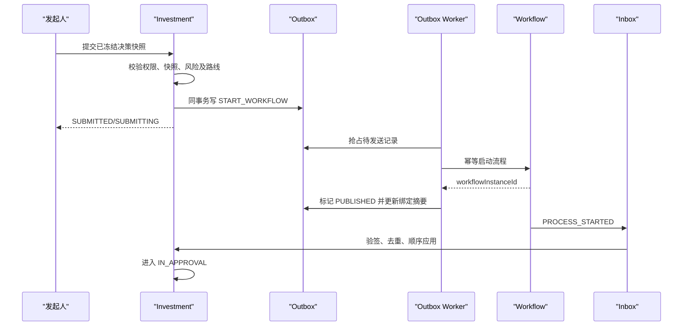

# Workflow 真实联调与可靠性增强设计

项目：县域国企数字化运营治理平台
Sprint：2-3.5
版本：V1.0
日期：2026-08-08
状态：设计冻结候选

## 1. 设计目标与边界

本设计用于 Investment 投资决策域与外部 Workflow 流程中心的真实联调及生产可靠性增强，不实现审批引擎，不创建 Workflow 数据库，不跨库访问 Workflow 数据，也不改变现有投资决策审批闭环。

职责边界：

| 能力 | Investment | Workflow |
| --- | --- | --- |
| 决策材料、快照、条件、风险门禁 | 权威维护 | 只持有最小流程变量和稳定引用 |
| 决策状态 | 权威维护，依据已验签事件推进 | 不直接修改 Investment 数据 |
| 流程实例、节点、任务、委托 | 保存只读摘要和绑定 | 权威维护 |
| 任务办理人及审批动作授权 | 校验业务查看权，不代替任务授权 | 权威校验 |
| 可靠投递 | Outbox | 至少一次接收、启动幂等 |
| 可靠回调 | Inbox 幂等、顺序应用 | 至少一次投递、支持按序重放 |

V2.4.0 至 V2.4.8 均为不可变历史 Migration。本文提出的数据库增强如需落地，只能使用后续新版本 Migration；本 Sprint 不执行数据库变更。

### 1.1 现状兼容与联调阻断项

现有 `WorkflowGateway`、`WorkflowAdapter`、Outbox/Inbox 表和投资决策状态机继续保留。真实联调前需要通过以下门禁：

1. 将实际客户端路径与冻结契约 `/api/workflow/v1` 对齐，并通过消费者驱动契约测试确认，不能凭环境重写掩盖路径差异。
2. 回调入口与冻结契约 `/api/internal/investment/workflow/v1/events` 对齐；旧路径只能作为有期限的兼容层。
3. 现有回调 Bearer Token 升级为服务认证、HMAC、时间戳和 Nonce 组合校验。
4. Outbox 从 `afterCommit` 尽力投递升级为独立 Worker；`afterCommit` 只可作为低延迟唤醒，不是可靠性保证。
5. 乱序事件必须先持久化为 `BUFFERED`，当前序列缺口补齐后自动排空。
6. 事件摘要必须基于原始请求体字节或规范化 JSON，禁止依赖 Java `toString()`。
7. 人工重放必须走受控命令、双人复核和不可变审计，禁止直接修改 Inbox、绑定或决策状态。

## 2. 真实联调方案

### 2.1 环境与前置条件

联调使用独立测试环境：

- Investment、Workflow 使用各自独立数据库和服务账号；
- 全链路 HTTPS，优先启用双向 TLS；
- 流程定义 `investment-decision` 使用显式版本，不允许自动使用最新版；
- 两端时钟接入同一 NTP 源，最大允许偏差 300 秒；
- 密钥、证书和客户端凭据由密钥管理服务注入，不写入仓库；
- 测试数据包含企业、组织、发起人、审批人、决策快照和决策路线；
- 联调环境禁止访问生产数据库、生产 Workflow 和生产文件地址。

联调前双方冻结以下资产：OpenAPI、事件 JSON Schema、错误码、枚举、HMAC 规范、流程定义版本、回调地址、证书指纹、服务身份和测试数据清单。

### 2.2 接口清单

| 场景 | 方法与路径 | 幂等性 | 权威方 |
| --- | --- | --- | --- |
| 启动流程 | `POST /api/workflow/v1/process-instances` | `Idempotency-Key` | Workflow |
| 查询实例 | `GET /api/workflow/v1/process-instances/{id}` | 只读 | Workflow |
| 查询任务 | `GET /api/workflow/v1/tasks` | 只读 | Workflow |
| 审批操作 | `POST /api/workflow/v1/tasks/{taskId}/actions` | `Idempotency-Key` | Workflow |
| 撤回流程 | `POST /api/workflow/v1/process-instances/{id}/withdrawals` | `Idempotency-Key` | Workflow |
| 事件回调 | `POST /api/internal/investment/workflow/v1/events` | `eventId`、实例序号 | Investment |
| 查询绑定 | `GET /api/workflow/v1/process-instances/by-business-key` | 只读、仅补偿 | Workflow |
| 事件补拉 | `GET /api/workflow/v1/process-instances/{id}/events` | 只读、按序分页 | Workflow |

审批操作由 Workflow 校验任务办理人、候选组、委托关系和允许动作。`investment:decision:approve` 仅表示业务侧可进入审批协同入口，不能绕过 Workflow 任务授权。

### 2.3 流程启动



启动幂等键固定为：

```text
INVESTMENT_DECISION:{decisionId}:{snapshotId}:{attemptNo}
```

响应超时或连接中断时必须使用原幂等键重试。收到 `409 IDEMPOTENCY_CONFLICT` 或绑定冲突时停止自动重试并进入安全告警，禁止生成第二个实例。

### 2.4 任务查询与审批操作

任务查询必须携带实际用户上下文，由 Workflow 按用户过滤，禁止 Investment 拉取全量任务后自行过滤。

审批动作建议请求：

```json
{
  "action": "APPROVE",
  "opinionSummary": "同意按方案实施",
  "opinionHash": "sha256:...",
  "conditionRefs": [],
  "operatorUserId": "10086",
  "delegationRef": null,
  "occurredAt": "2026-08-08T10:20:30Z"
}
```

动作枚举为 `APPROVE`、`APPROVE_WITH_CONDITIONS`、`REJECT`、`RETURN`。审批意见全文和附件由 Workflow 或统一文件中心按权限保存；Investment 只接收摘要、哈希和稳定引用。

审批操作成功只表示 Workflow 接受任务动作。Investment 决策状态必须等待 Workflow 事件回调，不根据前端响应直接修改。

### 2.5 结果回调与状态同步

事件采用冻结契约信封，至少包含：`eventId`、`eventVersion`、`sequence`、`occurredAt`、实例、企业、业务、快照、尝试号、节点、任务、结果、操作人和 `traceId`。

处理顺序：

1. 在进入 JSON 反序列化前保存请求体摘要并完成服务认证、HMAC、时间戳和 Nonce 校验。
2. 校验契约版本、企业、业务类型、实例、决策、快照和 `attemptNo` 绑定。
3. 按 `eventId` 去重，并校验相同 `eventId` 的载荷哈希一致。
4. 锁定本地 Workflow 绑定，比较 `event_sequence` 与 `last_event_sequence`。
5. 连续事件在同一事务内写 Inbox、更新业务聚合、绑定水位和审计事件。
6. 乱序事件持久化为 `BUFFERED`，提交事务后触发缺口补拉。
7. 事务提交后返回接收结果；数据库提交失败必须返回 5xx，使 Workflow 重投同一事件。

状态映射沿用现有审批闭环：`DRAFT -> SUBMITTED -> IN_APPROVAL -> APPROVED/REJECTED/WITHDRAWN -> ARCHIVED`。异常事件不得自动解释为否决；附条件批准先进入条件整改闭环，重大风险未关闭仍禁止归档。

## 3. Outbox Worker 可靠性设计

### 3.1 组件职责

`WorkflowOutboxWorker` 只负责可靠投递，不编排投资业务：

- 扫描 `PENDING` 和到期可重试的 `FAILED`；
- 并发安全抢占任务；
- 调用 Workflow Adapter；
- 分类处理成功、确定失败和不确定失败；
- 更新重试、死信和监控指标；
- 不直接修改投资决策状态。

### 3.2 扫描与抢占

建议参数初值：

| 参数 | 建议值 |
| --- | --- |
| 扫描间隔 | 1 秒，带 0～20% 抖动 |
| 单批大小 | 100 |
| Worker 并发 | 每实例 4，根据压测调整 |
| 单请求连接超时 | 2 秒 |
| 单请求响应超时 | 10 秒 |
| 最大自动尝试 | 8 次 |
| 最大事件年龄 | 24 小时，超过后死信 |

MySQL 8 首选短事务 `SELECT ... FOR UPDATE SKIP LOCKED` 抢占，按 `next_retry_time, create_time, id` 排序。抢占事务只将记录置为 `PROCESSING` 后立即提交，网络调用必须在事务外执行。

当前表没有 Worker 租约字段。单实例联调可使用 `status + version` 乐观锁；多实例生产前建议通过新 Migration 增加 `worker_id`、`locked_at`、`lock_until`，用于进程崩溃后的超时回收。不得修改 V2.4.7。

### 3.3 发送与结果分类

| 结果 | 处理 |
| --- | --- |
| 2xx 且响应绑定一致 | 标记 `PUBLISHED`，记录 `published_time` |
| 重复请求返回相同实例 | 视为成功 |
| 网络超时、连接失败、429、5xx | 可重试失败 |
| 400、401、403、404、422 | 确定失败，进入死信或人工处置 |
| 409 幂等或业务绑定冲突 | 立即死信并触发高等级安全告警 |
| 2xx 但实例、快照或尝试号不一致 | 协议冲突，立即死信 |

Outbox `payload_hash` 必须在每次发送前复核，发现与原始载荷不一致时停止发送并记录安全事件。

### 3.4 重试策略

指数退避公式：

```text
delay = min(30s * 2^(retryCount-1), 30m) + random(0, 20%)
```

建议序列约为 30 秒、1 分钟、2 分钟、4 分钟、8 分钟、16 分钟、30 分钟、30 分钟。所有重试复用原 `Idempotency-Key`、请求体和请求摘要。因 429 失败时优先遵循合法的 `Retry-After`，但不超过平台最大退避时间。

### 3.5 死信与人工重投

进入 `DEAD` 的条件：

- 超过最大尝试次数或最大事件年龄；
- 确定性 4xx；
- 幂等冲突、绑定冲突或响应摘要冲突；
- 载荷摘要不一致；
- 流程定义或契约版本不受支持。

人工重投不是将原记录改回 `PENDING`。应由受控运维命令创建新的投递尝试或重放审计记录，保留原 Outbox ID、操作者、复核人、原因、前后摘要和时间。重投仍使用原业务幂等键；任何载荷变更必须返回业务域重新生成快照和新 `attemptNo`。

## 4. Inbox 增强设计

### 4.1 重复事件

- `eventId` 是第一唯一键；`workflowInstanceId + eventSequence` 是第二唯一键。
- 相同 `eventId`、相同哈希返回 `DUPLICATE` 和 HTTP 200。
- 相同 `eventId`、不同哈希视为安全篡改，返回 409，冻结该实例自动处理并告警。
- 重复事件不得重复创建条件、审计事件或状态转换。

### 4.2 乱序事件与缓冲排空

当 `sequence > lastSequence + 1`：

1. 先插入 Inbox，状态为 `BUFFERED`；
2. 返回 `BUFFERED`，同时提交缺口补偿任务；
3. 按 `lastSequence + 1` 请求 Workflow 事件补拉接口；
4. 每补齐一个事件，在单实例锁下按序应用；
5. 连续排空后更新绑定水位；
6. 缺口超过 5 分钟告警，超过 30 分钟暂停该实例自动推进并转人工对账。

不得只拉取最终状态覆盖本地状态，也不得跳过缺失序号。

### 4.3 失败事件

失败分为：

- `RETRYABLE_TECHNICAL`：数据库锁超时、临时依赖故障；回调返回 5xx，由 Workflow 重投。
- `BUFFERED_GAP`：序号缺口；持久化后返回 200/`BUFFERED`。
- `STALE_ATTEMPT`：旧 `attemptNo`；记录历史后返回 200/`IGNORED_STALE`。
- `BUSINESS_CONFLICT`：非法状态转换、条件或风险门禁冲突；不推进状态，进入对账。
- `SECURITY_REJECTED`：签名、Nonce、绑定或哈希冲突；返回 401/403/409 并安全告警。

失败事件必须保留错误码、摘要、TraceId、接收时间和失败阶段。不得把异常事件自动转换为 `REJECTED`。

### 4.4 人工重放

提供内部运维能力，不作为普通 Controller 业务接口：

```text
申请重放 -> 校验运维权限 -> 双人复核 -> 校验原始事件哈希
-> 校验当前绑定/水位 -> dry-run 生成影响报告
-> 执行领域命令 -> 写不可变审计 -> 输出结果
```

控制要求：

- 权限建议 `investment:workflow:replay`，默认仅专门运维角色拥有；
- 申请人和复核人不能是同一人；
- 只允许从已验签、载荷未变化的 Inbox 证据重放；
- 不允许直接指定目标决策状态；
- 重放必须再次经过事件策略、聚合状态机、风险门禁和乐观锁；
- 全过程记录工单号、原因、操作者、复核人和 TraceId。

当前 Inbox 结构可保存处理结果，但生产级重放记录、重放次数和原始规范化载荷引用如需持久化，应使用后续新 Migration 增加独立审计结构。

## 5. 安全设计

### 5.1 分层认证

生产调用同时采用：

1. TLS 1.2 以上，优先 mTLS 验证服务实例；
2. OAuth2 Client Credentials 或等价短期服务令牌验证服务身份；
3. HMAC-SHA256 验证消息完整性；
4. 时间戳和 Nonce 防止重放；
5. 业务绑定、企业和快照校验防止跨租户注入。

终端用户 JWT 不得作为 Investment 与 Workflow 的服务互信凭证。审批操作需同时保留服务身份和实际用户身份，Workflow 负责校验任务权限。

### 5.2 HMAC 规范

请求头：

```text
Authorization: Bearer <short-lived-service-token>
X-Key-Id: workflow-hmac-2026-01
X-Timestamp: 2026-08-08T10:20:30Z
X-Nonce: 128-bit-random-base64url
X-Request-Id: uuid
X-Trace-Id: trace-id
X-Contract-Version: 1.0
X-Content-SHA256: lowercase-hex
X-Signature: base64url(hmac-sha256(secret, canonicalRequest))
```

规范串：

```text
HTTP_METHOD\n
NORMALIZED_PATH_AND_QUERY\n
X-CONTENT-SHA256\n
X-TIMESTAMP\n
X-NONCE\n
X-REQUEST-ID\n
X-CONTRACT-VERSION
```

要求：路径使用 UTF-8 百分号规范编码，查询参数按名称和值排序；请求体哈希基于收到的原始字节，空请求体使用 SHA-256 空值；签名比较必须恒定时间完成。

### 5.3 时间戳、Nonce 与密钥轮换

- 默认允许时钟偏差 ±300 秒；超过范围返回 401。
- Nonce 至少 128 位随机数；接收方以 `keyId + nonce` 在 Redis 使用 `SET NX EX 600` 原子登记。
- Redis 不可用时，回调写接口采用 fail-closed，不允许跳过防重放检查；只读查询可按降级策略处理。
- 密钥保存在 KMS/Secrets Manager，日志和数据库禁止保存明文。
- 轮换期间同时接受当前和上一把密钥，窗口不超过 24 小时；发送方只使用当前密钥。
- 未知、过期或已吊销 `keyId` 立即拒绝并告警。

### 5.4 数据和日志安全

- 不记录服务令牌、HMAC 密钥、完整签名、完整审批意见、永久附件 URL；
- 安全日志只记录 `keyId`、请求摘要前 12 位、错误码、服务身份、TraceId 和源地址；
- 审批意见全文、身份证号、银行卡号、合同和尽调正文不得进入流程变量或 Outbox 普通日志；
- 回调必须校验 `enterpriseId` 与本地决策企业一致；
- 管理查询和人工重放同时受 RBAC、数据范围、审计和职责分离约束。

## 6. 异常处理与运行保障

### 6.1 对账任务

对账不替代事件回调。每 5 分钟扫描以下异常绑定：

- `SUBMITTED` 超过 2 分钟仍无实例；
- 实例超过 5 分钟未收到 `PROCESS_STARTED`；
- Inbox 缺口超过 5 分钟；
- 本地终态与 Workflow 实例终态不一致；
- Outbox `PROCESSING` 超过租约；
- Outbox `FAILED/DEAD`；
- Workflow 最新序号大于本地水位。

对账结果只能触发补拉、重投建议或人工工单，不能直接覆盖决策状态。

### 6.2 可观测性

核心指标：

| 指标 | 告警建议 |
| --- | --- |
| Outbox 最老待发送年龄 | >2 分钟警告，>10 分钟严重 |
| Outbox 失败率 | 5 分钟窗口 >1% 警告 |
| Outbox DEAD 数量 | 任意新增立即告警 |
| Inbox 回调延迟 P95 | >30 秒警告 |
| Inbox BUFFERED 年龄 | >5 分钟警告 |
| 签名/Nonce 拒绝数 | 任意突增安全告警 |
| 绑定或哈希冲突 | 任意一条严重告警 |
| 状态对账差异 | 任意一条生成工单 |

所有日志通过 `traceId`、`requestId`、`eventId`、`decisionId`、`workflowInstanceId` 关联，但不得记录敏感载荷。

### 6.3 降级原则

- Workflow 不可用时允许创建和编辑草稿，不允许绕过流程形成审批结论。
- 启动请求已写 Outbox 后向用户显示“提交处理中”，不得重复生成快照或实例。
- 任务查询失败时显示暂不可用，不使用本地缓存授权审批。
- 回调安全依赖不可用时拒绝写入并让 Workflow 重试。
- 人工紧急处置只能恢复消息投递或重放合法事件，不能直接修改决策结论。

## 7. 测试计划

### 7.1 契约测试

- OpenAPI 和事件 JSON Schema 双向兼容测试；
- 字段、枚举、错误码、时间格式和金额格式测试；
- 启动、查询、任务、审批、撤回和回调消费者驱动契约测试；
- 不支持版本、未知字段、缺失字段和超长字段测试。

### 7.2 可靠性测试

| 场景 | 预期结果 |
| --- | --- |
| Workflow 启动响应丢失 | 原幂等键重试，只有一个实例 |
| Worker 发送中崩溃 | 租约到期后其他实例接管，不重复业务结果 |
| 429/5xx/网络超时 | 指数退避后成功或进入 DEAD |
| 400/401/403/409 | 不无限重试，分类死信并告警 |
| 相同事件重复 100 次 | 只应用一次，其他返回 DUPLICATE |
| 同 eventId 不同载荷 | 拒绝、冻结实例自动推进并安全告警 |
| 序号 1、3、2 到达 | 3 先 BUFFERED，2 到达后按 2、3 排空 |
| 旧 attemptNo 事件 | 只记历史，不影响当前尝试 |
| 业务事务回滚 | Inbox 和状态均不提交，Workflow 可重投 |
| 人工重放 | 双人复核、dry-run、聚合校验及审计完整 |

### 7.3 安全测试

- 正确 HMAC、错误签名、篡改请求体、未知 `keyId`；
- 过期和未来时间戳；
- Nonce 重复、并发重放和 Redis 故障；
- 服务令牌过期、权限不足和 mTLS 客户端不受信；
- 跨企业 `enterpriseId`、快照、实例及尝试号替换；
- 日志敏感信息扫描和密钥轮换演练。

### 7.4 业务联调场景

至少完成：

1. 党委前置研究后董事会决策通过；
2. 经理层路线决策通过；
3. 驳回、退回重提、撤回；
4. 附条件批准、整改、复核、关闭；
5. 重大风险未关闭禁止归档；
6. 委托审批和职责分离；
7. 多企业隔离与数据权限；
8. Workflow 故障、回调中断和密钥轮换恢复。

### 7.5 性能与容量验收

- 按预估峰值 2 倍进行启动和回调压测；
- 验证 Outbox 积压恢复速度不低于持续流入速度的 3 倍；
- 验证 Inbox 同实例严格串行、跨实例可并行；
- 记录端到端 P50/P95/P99、错误率、数据库锁等待和 Redis 延迟；
- 以实际压测结果冻结 Worker 批次、并发、超时、重试和告警阈值。

## 8. 分阶段落地与验收门禁

### 阶段 A：契约联通

- 冻结测试环境地址、证书、服务身份和 Workflow 定义版本；
- 完成启动、实例查询、任务查询、审批、撤回和回调冒烟；
- 完成 HMAC/Nonce 双向验证。

### 阶段 B：可靠性增强

- 实现独立 Outbox Worker、抢占、指数退避、死信和指标；
- 实现 Inbox 持久化缓冲、缺口补拉、顺序排空和人工重放；
- 所需表结构只能通过 V2.4.9 或更高的新 Migration 增量实现。

### 阶段 C：故障演练

- 执行网络中断、超时、限流、进程崩溃、重复乱序、Redis 故障和密钥轮换；
- 验证零重复实例、零重复状态推进、零跨企业访问和审计可追溯。

### 阶段 D：生产前冻结

只有同时满足以下条件才允许进入生产前验收：

- 所有契约、可靠性和安全测试通过；
- 无未处理 `DEAD`、长时间 `BUFFERED` 或状态对账差异；
- Workflow 定义版本、接口 SLA、重试阈值、密钥轮换和运行手册已冻结；
- 数据库增量 Migration 完成独立 MySQL 8 验收；
- 生产备份、回滚、监控、告警和应急联系人已确认。

## 9. 本 Sprint 结论

本 Sprint 仅完成真实联调与可靠性增强设计。现有 Workflow Adapter、审批状态机及 V2.4.0 至 V2.4.8 Migration 均未修改。后续实现应以独立 Outbox Worker、持久化乱序 Inbox、受控人工重放、HMAC 防重放和真实环境契约测试为主线，禁止通过同步双库事务、前端改状态或直接改库弥补消息一致性问题。
