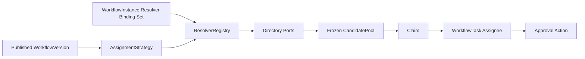

# Workflow Resolver Extension Governance Design

> Sprint：2-3.7-WF3.7
> 基线：V2.6.4 / Resolver Version Binding + Assignment Snapshot
> 状态：`DESIGN_FROZEN / NO_CODE / NO_MIGRATION`
> 范围：ROLE、POSITION、ORG Resolver，Candidate Pool、Claim、时间有效性、人员变更及Investment三重一大映射

## 1. 建设目标

在不改变 `EXPLICIT_USER_V1 + USER + DIRECT` 既有行为的前提下，为Workflow提供可审计、可冻结、可扩展的多人候选任务分配机制。

本设计只回答：

- 发布版本中的ROLE、POSITION、ORG规则如何解析为候选用户；
- 候选池何时冻结、何时失效；
- 多个候选人如何通过Claim成为当前Task处理人；
- 人员、岗位、角色、组织关系变化如何影响未完成任务；
- Investment三重一大节点如何使用分配能力而不越过法定决策边界。

本Sprint不创建Migration、不修改代码、不注册新Resolver，也不启用ROLE/POSITION/ORG运行能力。

## 2. 冻结结论

1. `Strategy`描述分配意图，`Resolver`解析主数据，`CandidatePool`冻结解析结果，`Claim`确定当前处理人，四者职责不得混用。
2. ROLE/POSITION/ORG首期统一采用 `CANDIDATE_POOL`；不得隐式选择“第一人”、负责人或排序最前人员。
3. Resolver输出必须在Task创建事务内形成不可变Assignment Snapshot和Candidate Pool；失败时Task、Snapshot、NodeExecution相关变化整体回滚。
4. 历史候选池不因当前人员目录变化而重算。新增人员不能加入旧任务；退出、停用或调岗人员在Claim和审批动作前必须实时复核。
5. RBAC能力权限不等于Task处理权。执行审批必须同时通过接口权限、候选/assignee、数据范围、时效和职责分离门禁。
6. 当前实例只能冻结一组Resolver的结构不足以支持异构节点。后续必须增加实例Resolver绑定集合；V2.6.3字段继续作为Legacy默认USER绑定，不改变含义。
7. Investment负责三重一大路线、决策主体和业务快照；Workflow只执行已冻结路线、任务分配和审批留痕。
8. Candidate Claim仅表示“领取办理任务”，不代表个人替代党委会、董事会或经理层形成集体决策。

## 3. 领域边界



### 3.1 Workflow负责

- 校验发布版本中的分配规则；
- 冻结Resolver Code、Version和Contract Hash；
- 调用只读目录端口解析候选人；
- 保存规则、目录水位、候选集合和Hash；
- 原子完成Claim、释放、转交和Task状态更新；
- 记录完整审计事件。

### 3.2 主数据模块负责

- System：用户、角色、用户角色、行政组织和账号状态；
- HR：员工、岗位、任职关系和有效期；
- Party/治理名册：党委、董事会、经理层等法定治理主体成员名册；
- Investment：投资决策路线、决策主体、风险门禁和业务状态。

Workflow禁止修改上述主数据，也不得把主数据查询结果反写为角色或组织授权。

## 4. 核心领域模型

### 4.1 AssignmentStrategy

发布版本节点中的不可变规则：

| 属性 | 说明 |
|---|---|
| `strategyType` | USER、ROLE、POSITION、ORG |
| `selectionMode` | DIRECT或CANDIDATE_POOL；扩展Resolver首期固定后者 |
| `targetKey` | userId、roleCode、positionCode或orgCode |
| `orgBoundaryMode` | CURRENT_ORG、SPECIFIED_ORG、ORG_AND_CHILDREN |
| `includeActing` | POSITION是否包含正式登记的代理任职 |
| `candidateTtl` | 候选池有效时长 |
| `maxCandidates` | 最大候选人数 |
| `emptyPolicy` | V1固定FAIL_TASK_CREATION |
| `canonicalConfig` | 规范化非敏感JSON |
| `configHash` | 规范化规则SHA-256 |

禁止使用角色名称、岗位名称或组织名称进行模糊匹配。

### 4.2 ResolverBindingSet

一个Workflow实例可能包含USER、ROLE、POSITION、ORG多种节点，因此实例启动时必须冻结一个Resolver绑定集合：

```text
ResolverBindingSet
  instanceId
  manifestVersion
  manifestHash
  bindings[]
    resolverCode
    resolverVersion
    contractHash
    strategyType
```

规则：

- 启动时扫描已发布WorkflowVersion实际使用的策略类型；
- 每种策略必须精确匹配ACTIVE Resolver版本；
- 任一Resolver缺失、版本不匹配或Contract Hash漂移，实例启动失败；
- Task创建只能从实例绑定集合读取，不得查询“最新Resolver”；
- 不允许fallback、自动升级或自动降级；
- V2.6.3三个实例字段继续表示Legacy默认Resolver绑定；不得重新解释为绑定集合。

### 4.3 CandidatePool

Candidate Pool是某个Task创建时的不可变候选资格证据：

| 属性 | 说明 |
|---|---|
| `poolId/taskId/snapshotId` | 归属关系 |
| `strategyType` | ROLE/POSITION/ORG |
| `resolverCode/version/hash` | 实际执行契约 |
| `ruleHash` | 节点分配规则Hash |
| `directoryRevision` | 主数据一致性水位 |
| `generatedTime` | 解析完成时间 |
| `validFrom/validUntil` | Claim有效窗口 |
| `candidateSetHash` | 规范化候选集合Hash |
| `candidateCount` | 去重后的候选人数 |
| `rankBasis` | 稳定排序依据，仅用于展示 |
| `status` | OPEN、CLAIMED、EXPIRED、CANCELLED、CLOSED |

Candidate集合按userId稳定升序去重。Hash只包含稳定业务字段，不包含显示名称、数据库关系行ID、创建时间或审计字段。

### 4.4 CandidateUser

| 属性 | 说明 |
|---|---|
| `userId` | 系统用户逻辑ID |
| `employeeId` | 员工逻辑ID；业务审批原则上必填 |
| `sourceType/sourceKey` | ROLE/POSITION/ORG及稳定业务键 |
| `sourceEvidence` | 脱敏后的成员关系依据摘要 |
| `orgIdSnapshot` | 解析时任职组织 |
| `membershipValidFrom/Until` | 成员关系有效期 |
| `accountStatusSnapshot` | 解析时账号状态 |
| `employeeStatusSnapshot` | 解析时员工状态 |
| `rank` | 稳定展示顺序，不代表自动选优 |

不得保存身份证、手机号、Token、密码、完整简历或敏感会议材料。

### 4.5 Claim

Claim是Task处理权从“冻结候选集合”转为“明确assignee”的原子行为，不修改原始Assignment Snapshot。

```text
PENDING + assignee=NULL + CandidatePool.OPEN
    -> claim gates
    -> CLAIMED + assignee=currentUser + claimedTime
    -> append ClaimEvent
```

## 5. Resolver统一契约

```text
AssignmentResolutionResult resolve(
    ResolverVersionBinding binding,
    AssignmentResolverContext context,
    AssignmentTarget target
)
```

输入必须包含实例、版本、节点执行、企业、组织边界、解析时间、规则Hash和目录水位要求。输出必须包含规范化候选集合、过滤统计、目录水位、候选Hash及非敏感审计摘要。

统一错误码：

| 错误码 | 含义 | 是否重试 |
|---|---|---|
| `RESOLVER_NOT_BOUND` | 实例未冻结所需Resolver | 否 |
| `RESOLVER_CONTRACT_MISMATCH` | Code/Version/Hash不一致 | 否 |
| `DIRECTORY_UNAVAILABLE` | 主数据服务临时不可用 | 是 |
| `TARGET_NOT_FOUND` | 稳定目标键不存在 | 否 |
| `TARGET_DISABLED` | 目标已停用 | 否 |
| `DIRECTORY_INCONSISTENT` | 用户、员工、组织关系冲突 | 否，需治理 |
| `CANDIDATE_EMPTY` | 无有效候选人 | 否，需人工处理 |
| `CANDIDATE_LIMIT_EXCEEDED` | 超过候选池上限 | 否，需收窄规则 |
| `ORG_BOUNDARY_VIOLATION` | 解析结果越过组织边界 | 否 |

## 6. ROLE Resolver设计

### 6.1 数据来源

- 目标：`sys_role.role_code`；
- 成员关系：`sys_user_role`；
- 用户有效性：`sys_user.status/deleted/locked_until`；
- 组织边界：用户与员工组织的协调结果；
- 业务审批人员必须关联ACTIVE员工，技术账号、服务账号不得进入候选池。

### 6.2 解析规则

```text
精确查找活动roleCode
  -> 查询活动用户角色关系
  -> 校验用户有效、未锁定、未删除
  -> 校验员工有效和组织边界
  -> 应用职责分离过滤
  -> 去重、稳定排序、限额
  -> 冻结CandidatePool
```

### 6.3 治理限制

- `SUPER_ADMIN`、系统管理员等平台管理角色默认禁止作为业务审批目标；
- 只有经过流程治理白名单审核的角色编码才能进入已发布节点规则；
- `workflow:approve`只表示调用审批API的能力，不能替代ROLE候选资格；
- 角色后续新增成员不进入历史候选池；移除成员后不得Claim或继续审批；
- 现有 `sys_role` 同时承载RBAC，尚无“治理角色类别”，正式实现前必须确定白名单来源和变更审批责任。

## 7. POSITION Resolver设计

### 7.1 数据来源

- 目标：`hr_position.position_code`；
- 任职关系：`hr_employee_position`；
- 员工：`hr_employee`；
- 登录账号：`sys_user.employee_id`；
- 组织：`hr_position.org_id`、`hr_employee.org_id`与规则组织边界。

### 7.2 有效任职判定

解析时刻 `T` 必须同时满足：

```text
position.status = 1 AND position.deleted = 0
employee_position.is_current = 1 AND deleted = 0
start_date <= DATE(T)
AND (end_date IS NULL OR end_date >= DATE(T))
employee.status = ACTIVE AND employee.deleted = 0
sys_user.status = 1 AND sys_user.deleted = 0
```

`hr_employee.position_id`只能作为当前岗位快速引用，权威有效期以 `hr_employee_position` 为准；两者冲突时失败关闭并输出主数据治理告警。

### 7.3 多岗、空岗和代理岗

- 一岗多人：全部进入候选池，不自动挑选；
- 空岗：返回 `CANDIDATE_EMPTY`，禁止回退到部门负责人；
- 兼岗：同一用户按userId去重，保留全部来源证据；
- 代理岗：只有存在正式、带有效期的代理任职数据且规则明确 `includeActing=true` 才可纳入；现有表未区分代理类型，因此首期实现门禁应固定为不支持代理岗；
- 岗位调动后，新任人员不进入旧池，原任人员在Claim/审批前因实时任职校验失败而被拒绝。

## 8. ORG Resolver设计

### 8.1 权威组织语义

- 行政审批组织以 `sys_org` 行政组织和HR任职组织为边界；
- `PARTY_ORG`不得自动混入行政ORG Resolver；党建组织应通过Party目录适配器单独治理；
- 业务审批候选人的任职组织以 `hr_employee.org_id` 为权威，`sys_user.org_id`作为访问组织；二者不一致时不得静默选择其一。

### 8.2 成员口径

首期允许两种显式规则：

- `DIRECT_MEMBERS`：仅目标组织直接成员；
- `ORG_AND_CHILDREN`：目标组织及所有活动下级组织成员。

禁止默认包含下级。`ORG_AND_CHILDREN`必须冻结组织树版本/水位、展开的orgId集合Hash和最大节点数。

### 8.3 安全限制

- 目标必须使用活动 `orgCode` 精确匹配；
- 不允许根公司ORG规则无上限地产生全企业候选池；
- 建议默认最大组织节点100、候选人员500，具体阈值由环境配置和制度评审冻结；
- 组织树环、路径异常、停用父节点或跨企业节点均导致解析失败；
- ORG候选资格不等于数据权限 `ORG/ORG_AND_CHILDREN`，两者独立计算、分别审计。

## 9. Candidate Pool治理

### 9.1 生成原则

1. 读取已发布节点规则和实例Resolver绑定；
2. 在同一一致性水位读取目录；
3. 按账号、员工、组织、时间和职责分离规则过滤；
4. 按userId去重并稳定排序；
5. 校验数量下限、上限和Hash；
6. 在Task创建事务中保存Snapshot、候选明细和Task；
7. 成功后Candidate Pool状态为OPEN，Task为PENDING且assignee为空。

### 9.2 不可变性

- 原始规则快照、候选集合和目录水位不可覆盖；
- 重新解析必须创建新的assignment attempt和新Snapshot；
- 原候选池标记CANCELLED或SUPERSEDED，但记录继续保留；
- 禁止定时任务直接更新历史 `resolved_users`；
- 查询当前目录只能作为资格复核，不能改变历史候选证据。

## 10. Claim机制

### 10.1 Claim门禁

```text
hasAuthority('workflow:claim')
AND task.status = PENDING
AND task.assignee_user_id IS NULL
AND pool.status = OPEN
AND currentUser存在于冻结候选池
AND now处于pool/task有效期
AND 当前账号、员工、角色/岗位/组织资格仍有效
AND Instance与Task数据范围允许
AND 职责分离、回避和风险门禁通过
AND 幂等键未使用
AND 乐观锁version匹配
```

任一条件失败均不得写入assignee。

### 10.2 并发与幂等

- Claim事务对Task执行条件更新：`status=PENDING AND assignee IS NULL AND version=?`；
- 两人并发Claim只能一人成功；
- 同一用户、同一Task、同一幂等键重复请求返回原成功结果；
- 不同用户竞争失败返回 `TASK_ALREADY_CLAIMED`，不暴露处理人敏感信息；
- Task更新和ClaimEvent追加必须同一事务。

### 10.3 Release、Assign与Transfer

- Release：当前assignee释放后，只有候选池仍有效且存在其他实时有效候选人时才能回到PENDING；
- Assign：具备专用管理权限的人员只能从冻结候选池中指定，不得任意输入userId；
- Transfer：新处理人必须属于原冻结候选池并通过实时门禁；
- 所有操作追加事件，不修改初始Snapshot；
- `workflow:manage`不自动包含Claim、Assign、Transfer或Approve权限。

### 10.4 状态映射

首期复用现有Task状态：

```text
CandidatePool.OPEN + Task.PENDING
  -> Claim
CandidatePool.CLAIMED + Task.CLAIMED
  -> Approve/Reject
CandidatePool.CLOSED + Task.APPROVED/REJECTED
```

候选池过期时Task转EXPIRED。首期不新增自动扩池、超时转交或自动代理。

## 11. 时间有效性

### 11.1 三个时间层次

| 时间 | 作用 |
|---|---|
| `resolveTime` | 目录解析和证据冻结时刻 |
| `candidateValidUntil` | 允许Claim的最晚时刻 |
| `task.dueTime` | 任务办理截止时间 |

最终Claim截止时间取规则TTL、成员关系结束时间和Task截止时间的最早非空值。

### 11.2 时钟与边界

- 统一使用服务端UTC时间存储，展示层转换Asia/Shanghai；
- 数据库和应用节点必须启用时间同步监控；
- `now == validUntil`视为已过期；
- 解析过程中跨越目录版本或有效期边界时整体重试，不允许拼接两个水位的候选集合；
- 已Claim任务在审批动作前再次校验Task截止时间和人员有效性。

## 12. 人员变更影响矩阵

| 变更 | 未Claim旧Task | 已Claim未处理 | 已完成Task |
|---|---|---|---|
| 新增角色/新入岗/调入组织 | 不加入旧池 | 无影响 | 无影响 |
| 移除角色 | 不能Claim | 下一审批动作拒绝，进入人工释放/重派 | 历史保持 |
| 离岗或任职到期 | 不能Claim | 下一审批动作拒绝 | 历史保持 |
| 调离组织 | 不能Claim | 下一审批动作拒绝 | 历史保持 |
| 账号停用/锁定 | 不能Claim | 立即禁止动作 | 历史保持 |
| 员工离职/停用 | 不能Claim | 立即禁止动作 | 历史保持 |
| 组织停用 | 相关未Claim任务阻断 | 人工复核，不自动跨组织转交 | 历史保持 |
| 显示名称变化 | 资格不变 | 资格不变 | 保留原快照名称 |

人员变化不得触发自动重新解析。若所有候选均失效，由有权管理员发起“重新分配申请”，形成新attempt、新Snapshot、新候选池和完整理由；该能力不属于首期实现。

## 13. 权限与职责分离

任务审批最终判定：

```text
RBAC接口能力
AND Task assignee身份
AND 冻结候选来源合法
AND 实时人员资格
AND 企业/组织数据范围
AND 职责分离与回避规则
AND Task/Instance状态和版本
```

必须支持的回避规则：

- 发起人不得审批本人提交事项，除非制度明确允许并形成规则快照；
- 可研/尽调编制人与最终审批人分离；
- 风险复核人不能同时作为风险整改确认人；
- 管理员不能因平台管理权限获得业务Task处理权；
- 紧急代办必须使用后续独立、限时、可撤销、全审计的授权机制。

## 14. Investment三重一大映射

### 14.1 职责边界

Investment冻结：

- 是否属于三重一大；
- 是否需要党委前置研究；
- 最终决策主体是董事会还是经理层；
- 决策依据、规则版本、会议/文件引用和路线Hash。

Workflow执行：

- 路线对应的已发布节点；
- 节点Resolver和候选池；
- Claim、审批动作和审计；
- 节点/实例结果事件。

Workflow不得根据投资金额自行改选董事会或经理层，也不得直接修改Investment状态。

### 14.2 节点与Resolver建议

| Investment节点 | 建议Resolver目标 | 说明 |
|---|---|---|
| `INVESTMENT_REVIEW` | POSITION或ROLE | 投资管理岗位/经治理的专业审核角色 |
| `PARTY_PRE_STUDY` | 治理名册ROLE，暂不直接启用普通sys_role | 党委前置研究，不代表最终批准 |
| `BOARD_DECISION` | 治理名册ROLE或会议办理POSITION | 董事会集体决策；Claim人只办理/记录任务 |
| `MANAGEMENT_DECISION` | 治理名册ROLE或会议办理POSITION | 经理层集体决策；Claim人不替代会议结论 |

### 14.3 集体决策边界

ROLE/POSITION/ORG Candidate Pool + Claim只能确定任务办理人，不能表达参会、法定人数、表决票、回避票、会签或多数决。

因此，在会签/表决能力实现前：

- 党委会、董事会、经理层的正式集体结论仍以受控会议决议或文件引用为权威证据；
- Workflow Task由会议秘书、经办岗位或授权记录人Claim并录入结果引用；
- 禁止把单个Claim人的Approve解释为该治理主体的个人批准；
- 未来会签/表决模块必须独立建模，不复用Candidate Claim冒充投票。

### 14.4 推荐路线


## 15. 数据库与Migration规划

本Sprint不创建SQL。后续仅允许新增V2.6.x Migration：

### V2.6.5：Resolver绑定集合

建议新增 `workflow_instance_resolver_binding`：

- `instance_id`、`resolver_code`、`resolver_version`、`contract_hash`；
- `strategy_type`、`manifest_hash`、`frozen_time`；
- 审计字段、deleted、delete_token、version；
- 唯一 `(instance_id,resolver_code,resolver_version,delete_token)`；
- 不修改V2.6.3/V2.6.4字段含义。

### V2.6.6：Candidate Pool与候选明细

建议新增：

- `workflow_task_candidate_pool`；
- `workflow_task_assignment_candidate`；
- Assignment Snapshot补充Resolver、规则Hash、目录水位和有效期字段。

Candidate明细不建立到System/HR表的物理外键，避免跨限界上下文耦合；使用逻辑ID、快照Hash和应用层一致性校验。

### V2.6.7：Claim审计

建议新增 `workflow_task_claim_event`，追加记录CLAIM、RELEASE、ASSIGN、TRANSFER、EXPIRE；为Task补充必要的幂等和查询索引。历史事件不可覆盖或物理删除。

每个版本必须单独进行Fresh、上一版本Upgrade、历史人员变化兼容、并发Claim和Schema Fingerprint验收。

## 16. API规划

仅规划，不实现：

| 方法 | 路径 | 权限 | 作用 |
|---|---|---|---|
| GET | `/workflow/tasks/{id}/assignment` | `workflow:view` | 查询脱敏Assignment Snapshot |
| GET | `/workflow/tasks/{id}/candidates` | `workflow:view`且任务可见 | 分页查询冻结候选池 |
| POST | `/workflow/tasks/{id}/claim` | `workflow:claim` | 候选人领取Task |
| POST | `/workflow/tasks/{id}/release` | `workflow:claim` | 当前处理人释放Task |
| POST | `/workflow/tasks/{id}/assign` | `workflow:assign` | 从冻结池中指定处理人 |
| POST | `/workflow/tasks/{id}/transfer` | `workflow:transfer` | 在冻结池内转交 |

禁止开放Resolver动态注册、版本切换、任意重算候选池或直接修改Task assignee接口。

## 17. 测试与验收门禁

进入实现阶段前必须具备：

1. ROLE/POSITION/ORG稳定业务键和权威数据源确认；
2. System与HR用户—员工—组织冲突处理规则确认；
3. Resolver绑定集合兼容方案通过架构评审；
4. Candidate Pool、Claim和审计Migration设计通过数据库评审；
5. 党委、董事会、经理层权威名册来源及责任部门确认；
6. 职责分离和回避规则获得制度确认；
7. ROLE/POSITION/ORG Resolver分别完成Domain、Repository、权限、数据权限、时间边界和人员变化测试；
8. 并发Claim验证只能一个用户成功；
9. 历史Task不重算、新成员不进入旧池、失效人员无法Claim/审批；
10. Investment契约测试证明Workflow不修改业务状态、不自行改变决策路线。

## 18. 风险清单

| 风险 | 等级 | 控制措施 |
|---|---|---|
| 单Resolver实例绑定无法支持异构节点 | P0 | 先实现实例Resolver绑定集合，禁止直接注册扩展Resolver |
| sys_role既是RBAC又被用于业务分配 | P0 | 角色白名单、系统角色禁用、变更审批和快照审计 |
| 党委/董事会/经理层名册缺少权威来源 | P0 | 未确认前禁止启用法定治理节点ROLE解析 |
| Claim被误解为集体决策 | P0 | 明确经办/记录边界，集体表决独立建模 |
| 人员变化导致越权 | P0 | 冻结候选池加Claim/审批前实时资格复核 |
| 组织与HR归属不一致 | P1 | 失败关闭并进入主数据治理，不静默选源 |
| 候选池过大造成泄露和性能问题 | P1 | 组织边界、数量上限、分页脱敏和限流 |
| 自动重算破坏审计 | P1 | 新attempt和新Snapshot，禁止覆盖历史 |
| Resolver升级影响在途实例 | P0 | 实例绑定Code/Version/Hash，禁止fallback |

## 19. 后续实施边界

建议拆分实施：

1. WF3.7.1：实例Resolver绑定集合与Migration设计；
2. WF3.7.2：Candidate Pool和Claim数据库设计；
3. WF3.7.3：ROLE Resolver实现与验收；
4. WF3.7.4：POSITION Resolver实现与验收；
5. WF3.7.5：ORG Resolver实现与验收；
6. WF3.7.6：Claim、Release、Assign、Transfer实现；
7. WF4.0：在权威治理名册和集体决策边界满足后接入Investment三重一大。

在V2.6.5绑定集合、候选池、Claim事务及权威治理名册门禁未完成前，不得把ROLE/POSITION/ORG加入运行时Resolver Registry。
