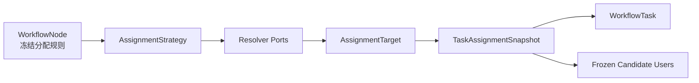
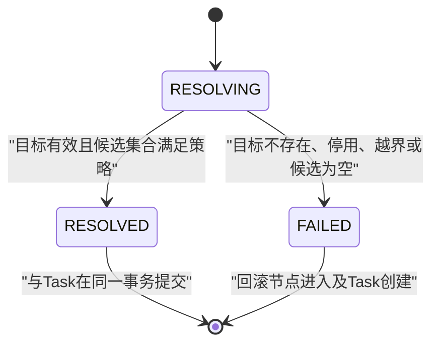

# Workflow任务分配策略设计

> Sprint：2-3.7-WF3.3
> 基线：V2.6.1 / `LINEAR_RUNTIME_ENGINE_FROZEN`
> 状态：`DESIGN_FROZEN / NO_CODE / NO_MIGRATION`
> 范围：任务分配领域设计；不实现自动选人、条件路由、会签或Investment改造。

## 1. 设计结论

1. 保留 `workflow_task` 作为可处理任务的权威模型，不推翻现有状态机、`assignee_user_id`、`candidate_snapshot`、`participant_key` 和 `node_execution_id`。
2. 节点进入并创建Task时，必须解析并冻结本次分配结果。流程定义后续变化、用户调岗、角色变更和组织调整不得改变已创建Task的审批边界。
3. `USER` 是V2.6.1当前唯一可运行策略；`ROLE`、`POSITION`、`ORG` 本Sprint只冻结语义和扩展契约，不启用运行时解析。
4. RBAC只决定用户能否进入Workflow功能；任务处理权必须由任务分配快照、任务状态、实例数据范围和职责分离规则共同判定。
5. V2.6.2仅规划可审计的分配快照结构，不创建Migration。历史任务保持可读、可处理，不强制回填推断结果。

## 2. 当前基线与缺口

### 2.1 已有能力

- `workflow_node.assignment_rule_type/config` 保存版本化节点分配规则；当前枚举已有 `USER/ORG/POSITION/ORG_POSITION/RULE`。
- `workflow_task.assignee_user_id` 保存明确处理人；用户需求中的历史 `assignee_id`，在当前真实表结构中对应此字段。
- `workflow_task.candidate_snapshot` 保存创建任务时的候选/规则文本快照。
- V2.6.1通过 `node_execution_id` 将Task绑定到确定的节点访问记录。
- 线性运行服务目前要求明确的USER分配，并强制 `operator_user_id == assignee_user_id`。

### 2.2 主要缺口

| 缺口 | 影响 |
| --- | --- |
| `candidate_snapshot` 无正式Schema和算法版本 | 无法稳定解释历史快照 |
| 无结构化分配依据、解析人、解析时间 | 审计证据不完整 |
| 无冻结候选成员明细 | ROLE/POSITION/ORG成员变化可能影响历史任务 |
| 无候选集Hash与目录版本 | 无法证明分配结果未漂移 |
| 当前线性引擎只支持USER | 不能直接启用候选池与认领 |

## 3. 领域模型



### 3.1 AssignmentStrategy

表示“如何确定本节点任务处理范围”，属于流程版本配置值对象，不直接保存目录实体。

建议属性：

| 属性 | 说明 |
| --- | --- |
| `strategyType` | `USER/ROLE/POSITION/ORG` |
| `strategyVersion` | 规则解释版本，如 `ASSIGNMENT_V1` |
| `targets` | 一个或多个AssignmentTarget；线性V1建议限制一个目标 |
| `selectionMode` | `DIRECT`或`CANDIDATE_POOL`；仅设计 |
| `orgBoundary` | 是否限制在发起组织、指定组织或实例允许组织集合 |
| `fallbackPolicy` | V1固定为`FAIL_TASK_CREATION`，禁止静默降级 |
| `canonicalConfig` | 规范化规则JSON |
| `configHash` | 排除数据库ID、时间和审计字段后的SHA-256 |

规则配置在WorkflowVersion发布时校验并参与定义内容Hash。已发布版本不可修改。

### 3.2 AssignmentTarget

表示规则引用的稳定业务对象，而不是最终审批权。

| 属性 | 说明 |
| --- | --- |
| `targetType` | `USER/ROLE/POSITION/ORG` |
| `targetKey` | 稳定业务键，优先使用userId、roleCode、positionCode、orgCode |
| `targetIdSnapshot` | 可选逻辑ID快照，仅用于追溯，不作为唯一语义来源 |
| `targetNameSnapshot` | 创建Task时的显示名称快照 |
| `scopeOrgKey` | 可选组织边界 |
| `enabledRequired` | 解析时是否要求目录对象有效，V1固定为true |

Workflow不得通过名称匹配目标，也不得把数据库自增ID作为跨模块唯一契约。

### 3.3 TaskAssignmentSnapshot

Task创建事务中生成的不可变证据对象，建议一项Task对应一项权威快照。

| 属性 | 说明 |
| --- | --- |
| `taskId/nodeExecutionId` | 绑定确定任务和节点访问 |
| `strategyType/strategyVersion` | 冻结策略语义 |
| `ruleConfigSnapshot/ruleHash` | 冻结规则及摘要 |
| `targets` | 冻结目标集合 |
| `candidateUserIds` | 解析时有效的候选用户集合，按userId升序规范化 |
| `candidateSetHash` | 候选集合SHA-256 |
| `directoryRevision` | 身份、角色、岗位、组织目录修订号或查询时间水位 |
| `resolutionStatus` | `RESOLVED/FAILED`；只有RESOLVED允许Task创建成功 |
| `resolvedByType/resolvedBy` | `SYSTEM/USER`及解析主体 |
| `resolvedTime` | 解析完成时间 |
| `assignmentReason` | 分配原因代码及非敏感说明 |
| `evidenceReference` | 可选制度、授权或配置依据引用 |

快照中不得保存密码、Token、身份证号、手机号等非必要敏感信息。

## 4. 状态模型

### 4.1 分配解析状态



`RESOLVING`仅是内存过程状态，不要求落库。系统禁止创建“无有效分配快照但可被任意有权限用户处理”的开放任务。

### 4.2 与现有Task状态的关系

- `USER + DIRECT`：解析出唯一用户，写入 `assignee_user_id`，Task保持现有 `PENDING → APPROVED/REJECTED/...`。
- `ROLE/POSITION/ORG + CANDIDATE_POOL`：未来解析并冻结候选集合，Task初始 `assignee_user_id=NULL`；必须先经受控Claim写入处理人再进入处理动作。
- V2.6.1线性引擎尚不接受空assignee，因此候选池策略在对应实现Sprint完成前必须被启动/发布门禁拒绝。
- AssignmentSnapshot不可修改；Claim、转派、委托等变化必须追加独立审计事件，不覆盖初始快照。

## 5. 策略模型

### 5.1 USER

- 配置稳定userId或userCode。
- 解析时要求用户存在、有效、属于允许企业/组织边界。
- 候选集合必须恰好一人，直接写入 `assignee_user_id`。
- 当前V2.6.1行为与此策略兼容。

### 5.2 ROLE

- 配置 `roleCode`，可附组织边界。
- `RoleResolver`返回解析时具备该角色且账号有效的用户集合。
- “拥有该业务角色”不等于“拥有 `workflow:approve`”；实际处理时两项都必须满足。
- 禁止把角色后续新增成员自动纳入历史Task。

### 5.3 POSITION

- 配置稳定 `positionCode` 与可选组织边界。
- `PositionResolver`根据组织人事主数据返回在岗且有效的用户集合。
- 岗位空缺、多岗和代理岗必须返回明确结果/错误，不允许按岗位名称模糊匹配。

### 5.4 ORG

- 配置稳定 `orgCode` 和成员口径，例如直属成员；首期禁止隐式包含全部下级组织。
- `OrgResolver`解析有效组织及成员集合。
- 是否包含下级必须成为显式规则字段并参与Hash；默认 `CURRENT_ORG_ONLY`。

### 5.5 解析端口

端口定义在Workflow Domain/Application边界，实现放在Infrastructure Adapter；领域层不依赖Spring、MyBatis或系统Entity。

```text
UserResolver.resolve(UserTarget, AssignmentContext) -> ResolvedUsers
RoleResolver.resolve(RoleTarget, AssignmentContext) -> ResolvedUsers
PositionResolver.resolve(PositionTarget, AssignmentContext) -> ResolvedUsers
OrgResolver.resolve(OrgTarget, AssignmentContext) -> ResolvedUsers
```

`AssignmentContext`至少包含 enterpriseId、initiatorUserId、initiatorOrgId、instanceId、versionId、nodeExecutionId、resolvedAt 和允许组织集合。Resolver只读取主数据，不创建Task、不推进流程、不授予RBAC权限。

所有Resolver应返回统一结果：规范化用户ID集合、目标显示快照、目录修订信息、过滤原因统计和稳定错误代码；禁止返回“第一个用户”作为隐式自动选人。

## 6. 冻结与审计规则

Task创建的同一事务必须完成：

1. 读取已发布WorkflowVersion中的节点规则；
2. 校验目标业务键与企业/组织边界；
3. 调用对应Resolver取得候选集合；
4. 对规则、目标和候选集合规范化并计算Hash；
5. 生成TaskAssignmentSnapshot；
6. 按DIRECT或未来Claim模式创建Task；
7. 同时提交NodeExecution、AssignmentSnapshot和Task。

任一步失败全部回滚。禁止在Task创建后异步补齐初始分配快照。

审计必须回答：

- 谁触发了分配：流程发起人、上一个任务处理人或系统；
- 谁执行了解析：系统服务身份或经授权管理员；
- 为什么分配：节点代码、策略类型、规则Hash、分配原因代码；
- 依据什么：Workflow版本、目录修订、目标业务键、候选集合Hash；
- 何时分配：毫秒级时间和traceId。

## 7. 权限与任务处理边界

任务操作必须同时满足以下条件：

```text
接口RBAC权限
AND Task处于允许状态
AND 用户是固定assignee或冻结候选集合中的合法Claim人
AND Instance/Task属于当前数据范围
AND 企业、组织与任务归属一致
AND 职责分离与风险门禁通过
AND 乐观锁/幂等校验通过
```

| 能力 | RBAC作用 | 是否产生具体任务处理权 |
| --- | --- | --- |
| `workflow:view` | 进入实例/任务查询功能 | 否 |
| `workflow:approve` | 允许调用审批动作 | 否 |
| `workflow:withdraw` | 允许调用撤回功能 | 否 |
| ROLE分配目标 | 形成冻结候选集合 | 仅对该Task形成候选资格 |
| `assignee_user_id` | 指向当前明确处理人 | 是，但仍需RBAC和其他门禁 |

管理员的 `workflow:manage` 不自动获得业务审批权。紧急代办必须通过未来受审计的授权/转派机制，不能绕过Task归属校验。

## 8. 历史实例兼容方案

### 8.1 兼容判定

- V2.6.2之前的任务以现有 `assignee_user_id` 和 `candidate_snapshot` 为权威历史证据。
- `assignee_user_id != NULL`：按 `LEGACY_DIRECT_USER` 解释，不反推角色、岗位或组织来源。
- `assignee_user_id == NULL`：保留原有Legacy语义，不自动推断候选人；V2.6.1线性任务不得出现此状态。
- 不根据当前用户角色、当前岗位或当前组织成员关系伪造历史快照。

### 8.2 双读与切换

未来实现阶段建议：

1. 新Task写结构化快照，同时继续写 `candidate_snapshot` 兼容摘要；
2. 读取优先使用结构化快照，缺失时回退Legacy字段；
3. 运行一段双读比对，差异只告警不自动修正；
4. 在所有调用方迁移完成前，不删除或改变既有字段含义。

## 9. V2.6.2数据库规划

V2.6.2仅为规划版本，本Sprint不创建SQL、不登记候选资产。

### 9.1 `workflow_task_assignment_snapshot`

一Task一份初始分配快照。

| 字段 | 建议类型 | 说明 |
| --- | --- | --- |
| `id` | BIGINT | 主键 |
| `task_id` | BIGINT | Task ID |
| `node_execution_id` | BIGINT | 节点执行ID |
| `strategy_type` | VARCHAR(30) | USER/ROLE/POSITION/ORG |
| `strategy_version` | VARCHAR(30) | 规则解释版本 |
| `selection_mode` | VARCHAR(30) | DIRECT/CANDIDATE_POOL |
| `rule_config_snapshot` | TEXT | 规范化规则，不含敏感信息 |
| `rule_hash` | CHAR(64) | 规则SHA-256 |
| `candidate_set_hash` | CHAR(64) | 候选集合SHA-256 |
| `candidate_count` | INT | 候选数量 |
| `directory_revision` | VARCHAR(100) | 主数据修订/水位 |
| `resolution_status` | VARCHAR(20) | RESOLVED/FAILED |
| `resolved_by_type` | VARCHAR(20) | SYSTEM/USER |
| `resolved_by` | VARCHAR(100) | 解析主体稳定标识 |
| `resolved_time` | DATETIME(3) | 解析时间 |
| `assignment_reason_code` | VARCHAR(64) | 稳定原因代码 |
| `assignment_reason` | VARCHAR(500) | 脱敏说明 |
| `evidence_reference` | VARCHAR(500) | 依据引用 |
| 通用字段 | — | created/updated、deleted、delete_token、version、remark、trace_id |

约束规划：唯一 `(task_id, delete_token)`；复合外键绑定Task及NodeExecution归属；Hash格式、状态、逻辑删除、乐观锁CHECK。

### 9.2 `workflow_task_assignment_target`

保存规则引用目标快照。关键字段：`assignment_snapshot_id`、`target_order`、`target_type`、`target_key`、`target_id_snapshot`、`target_name_snapshot`、`scope_org_key`及通用审计字段。

约束规划：唯一 `(assignment_snapshot_id, target_order, delete_token)` 和 `(assignment_snapshot_id, target_type, target_key, delete_token)`。

### 9.3 `workflow_task_assignment_candidate`

保存解析时冻结的候选用户集合。关键字段：`assignment_snapshot_id`、`user_id`、`user_key_snapshot`、`user_name_snapshot`、`source_target_id`、`candidate_status`及通用审计字段。

约束规划：唯一 `(assignment_snapshot_id, user_id, delete_token)`；索引 `(user_id, candidate_status, deleted)` 用于待办候选查询。

### 9.4 对现有表的最小增量

- 可向 `workflow_task` 新增可空 `assignment_snapshot_id`，Legacy保持NULL。
- 不删除、不改名 `assignee_user_id` 与 `candidate_snapshot`。
- 不对Workflow表建立到 `sys_user/sys_role/sys_org/hr_position` 的数据库外键，避免跨限界上下文耦合；使用逻辑引用和快照审计。
- Migration只新增表、可空兼容字段、索引和内部Workflow外键；历史数据不自动推断回填。

## 10. API规划

以下均为后续接口规划，本Sprint不实现：

| 方法 | 路径 | 用途 | 权限与任务门禁 |
| --- | --- | --- | --- |
| GET | `/workflow/tasks/{id}/assignment` | 查询脱敏分配快照及依据 | `workflow:view` + Task可见范围 |
| GET | `/workflow/tasks/candidates` | 查询本人可认领任务 | `workflow:view` + 冻结候选资格 |
| POST | `/workflow/tasks/{id}/claim` | 候选人认领 | 专用权限建议 `workflow:claim` + 候选快照 + CAS |
| POST | `/workflow/tasks/{id}/release` | 释放未处理认领 | 专用权限 + 当前assignee + 状态门禁 |

任务处理API继续使用现有审批入口。禁止提供“直接写assignee”或Controller修改分配结果的接口。管理员转派、委托和加签不属于首期范围。

## 11. 与Investment适配边界

Investment继续只负责投资业务状态、决策快照、风险与业务审计；Workflow负责节点规则、候选解析、Task归属和审批行为。

- Investment发起流程时只传业务键、发起人、发起组织和已冻结决策快照ID。
- 三重一大节点可在Workflow定义中配置ROLE、POSITION或ORG目标，但目标解释和任务分配完全由Workflow完成。
- Workflow通过事件返回流程/审批结果，不直接修改Investment状态。
- Investment不得传最终审批人列表绕过已发布WorkflowVersion；若业务确需建议名单，只能作为受校验的流程变量，不能成为审批权来源。
- 分配失败时流程启动或节点推进整体失败，Investment只接收稳定错误码，不读取Workflow内部目录表。

## 12. WF3.4扩展边界

建议WF3.4仅实现任务分配基础设施，不扩大到多节点高级路由：

1. 冻结V2.6.2 Migration并完成真实MySQL双路径验收；
2. 实现AssignmentStrategy、AssignmentTarget、TaskAssignmentSnapshot领域对象；
3. 实现Resolver端口及只读Adapter，优先USER，再分批启用ROLE/POSITION/ORG；
4. 实现分配快照仓储、双写和Legacy回退读取；
5. 如启用候选池，实现原子Claim、释放与审计事件；
6. 增加越权、目录变化、候选为空、并发Claim、事务回滚和历史兼容测试。

WF3.4仍不得实现条件路由、会签、自动择优选人、动态加签、委托链或Investment业务改造。

## 13. 风险与治理要求

| 风险 | 等级 | 治理措施 |
| --- | --- | --- |
| RBAC被误当作具体审批权 | P0 | 强制RBAC、Task归属、数据范围和状态联合校验 |
| 目录变化改变历史审批范围 | P0 | Task创建时冻结目标和候选集合，不动态重算 |
| 候选为空仍生成开放任务 | P0 | `FAIL_TASK_CREATION`并回滚节点推进事务 |
| 通过名称或不稳定ID关联 | P1 | 使用稳定业务键并保存ID/名称快照 |
| 候选集合过大导致性能或泄露 | P1 | 限额、分页查询、脱敏输出、候选Hash与专用索引 |
| Legacy任务被错误回填 | P1 | 不自动推断；按Legacy字段原义处理 |
| 管理员绕过分配规则 | P0 | 无超级审批通道；转派必须走独立权限和审计流程 |

## 14. 验收结论

Workflow任务分配策略设计已冻结。当前可执行基线仍保持V2.6.1的显式USER分配；ROLE、POSITION、ORG只是已设计的后续能力，未经Migration、代码实现及安全验收不得启用。
