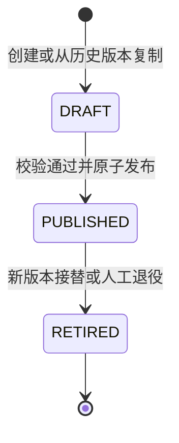

# Workflow版本发布机制设计

> Sprint：2-3.7-WF2.6
> 文档状态：设计冻结候选
> 范围：版本状态机、发布与冻结、实例绑定、Migration规划、Investment集成边界
> 本Sprint仅设计，不授权修改代码、数据库或创建Migration。

## 1. 目标与边界

本设计在现有Workflow定义域和运行域上补齐“草稿设计—校验发布—冻结运行—退役留痕”的治理闭环，不推翻V2.5.0、V2.5.1既有模型。

本Sprint明确不设计或实现：

- 多节点自动推进；
- 会签、或签和表决计算；
- 条件路由和表达式执行；
- 自动选人、候选人动态解析；
- 通用BPM画布或脚本引擎。

Workflow Lite当前只允许发布并运行“单个启用审批节点”的版本。数据库中已有的节点类型和规则字段仍作为未来能力预留，不代表当前可执行。

## 2. 当前基础与差距

### 2.1 已有能力

现有`workflow_version`已经包含：

- `version_no`及定义内唯一约束；
- `DRAFT/PUBLISHED/RETIRED`三态CHECK；
- `content_hash`、`published_by`、`published_time`发布证据；
- `effective_from/effective_to`有效期；
- `source_version_id`复制来源；
- 乐观锁`version`。

现有`workflow_definition.current_version_id`通过复合外键指向本定义的版本。`workflow_instance`通过`definition_id + version_id`绑定明确版本，并保存定义编码和版本号快照。

### 2.2 待补齐能力

- 当前Application层尚无正式发布、退役用例；
- 没有独立、只追加的发布/退役审计事实；
- Instance没有保存版本`content_hash`快照；
- 数据库无法跨表表达“Definition当前版本必须为已发布且属于本企业”的完整业务约束，需要Application事务保证；
- Workflow内部启动命令目前只接收`definitionId`并读取当前版本，而Investment契约已经携带`definitionKey + definitionVersion`，存在版本漂移风险；
- 没有发布请求幂等键、校验报告和失败原因留痕。

## 3. Version状态机

沿用现有三个持久化状态，不增加`REVIEWING`、`PUBLISHING`等中间状态。发布校验是Application用例过程，不应伪装成可长期停留的领域状态。



### 3.1 DRAFT

- 可修改版本元数据和节点；
- 不允许启动实例；
- 可从本定义任一历史版本复制，`version_no`只能递增；
- 尚未发布且未被其他数据引用时可受控逻辑删除；
- 草稿删除不等于版本退役。

### 3.2 PUBLISHED

- 内容已冻结，可作为新实例的执行依据；
- 必须具备`content_hash/published_by/published_time/effective_from`；
- 当前阶段仅支持立即生效，不支持未来定时切换；
- 一个Definition同一时刻只允许一个“当前可启动”版本，由`current_version_id`唯一指向；
- 发布版本不得修改或逻辑删除。

### 3.3 RETIRED

- 禁止创建新实例；
- 已绑定实例继续按原版本运行和查询；
- 不允许重新发布；
- 如需恢复相同设计，必须复制为新DRAFT并产生新版本号和新内容哈希；
- 退役不是删除，历史节点和发布证据永久保留。

### 3.4 运行资格派生规则

版本可启动不是单看`status=PUBLISHED`，必须同时满足：

```text
definition.status = ACTIVE
AND definition.current_version_id = version.id
AND version.definition_id = definition.id
AND version.status = PUBLISHED
AND version.effective_from <= now
AND (version.effective_to IS NULL OR now < version.effective_to)
AND version.deleted = 0
```

## 4. 发布规则

### 4.1 发布前置条件

1. 调用人具备`workflow:definition:publish`，并处于该定义的管理范围；
2. Definition未删除、未归档，企业和业务类型有效；
3. Version属于该Definition且状态为DRAFT；
4. 请求携带Definition和Version的期望乐观锁版本；
5. `schema_version`属于服务端支持白名单；
6. 当前Workflow Lite必须恰好存在一个启用节点；
7. 该节点必须是`APPROVAL`，节点编码和顺序唯一；
8. 节点分配配置只做结构和引用格式校验，本阶段不执行自动选人；
9. 变更说明完整，不包含敏感正文；
10. 规范化内容能够稳定计算SHA-256，且与同Definition历史版本哈希不重复；
11. 不允许存在引用该DRAFT的运行实例；
12. 发布请求幂等键未被其他发布内容使用。

### 4.2 内容哈希

发布哈希基于规范化、确定性JSON计算，至少包含：

- `definitionCode/businessType/enterpriseId`；
- `schemaVersion`；
- 按`nodeOrder + nodeCode`排序的全部节点；
- 节点类型、治理类型、启用状态；
- 审批模式、分配规则原始配置；
- 进入/完成条件原始配置；
- 超时和撤回配置。

排除数据库ID、创建/更新时间、操作人、备注和乐观锁版本。相同可执行语义必须得到相同哈希。

### 4.3 原子发布事务

锁顺序固定为Definition后Version，禁止反向加锁：

```text
锁定 WorkflowDefinition
  -> 锁定目标 DRAFT Version
  -> 读取并校验节点
  -> 生成规范化内容和 contentHash
  -> 退役原 currentVersion（如存在）
  -> 发布目标 Version
  -> 更新 Definition.currentVersionId/status
  -> 追加 ReleaseAudit
  -> 写入 Workflow Outbox（后续能力）
  -> 提交事务
```

发布失败必须整体回滚，不允许出现Version已发布但Definition指针未更新，或旧版本已退役但新版本未生效。

### 4.4 旧版本处理

- 首次发布：Definition由`DRAFT`转为`ACTIVE`，设置当前版本；
- 后续发布：同一事务将旧当前版本转为`RETIRED`并写入`effective_to=新版本发布时间`；
- 新版本写入`PUBLISHED/effective_from/published_by/published_time/content_hash`；
- 历史实例不更新`version_id`；
- 本阶段不支持预约发布，避免依赖定时切换Worker和“双当前版本”语义。

### 4.5 幂等与并发

- 发布请求使用`release_request_id`作为稳定幂等键；
- 相同请求ID、Definition、Version和内容哈希重复提交，返回原发布结果；
- 相同请求ID对应不同内容，按安全冲突拒绝；
- 乐观锁失败返回并发冲突，不自动覆盖；
- 两个草稿并发发布时，只允许一个完成Definition指针切换；另一事务必须重新读取状态后失败。

## 5. 冻结规则

### 5.1 发布后永久冻结

以下内容在`PUBLISHED/RETIRED`状态均不可修改：

- `definition_id/version_no/schema_version/source_version_id`；
- `content_hash/change_note/published_by/published_time/effective_from`；
- 所有WorkflowNode字段及节点数量；
- 节点编码、顺序、类型、规则配置；
- 发布审计记录。

唯一允许的版本状态变化是受控`PUBLISHED -> RETIRED`，同时写入退役时间、操作人和原因。`effective_to`只能由退役用例设置一次。

### 5.2 Definition冻结边界

首次发布后：

- `definition_code/business_type/enterprise_id`永久不可修改；
- `definition_name/description/owner_org_id`可按管理权限修改，但不改变历史实例快照；
- `current_version_id`只能由发布用例修改；
- `ACTIVE -> INACTIVE`只阻止新实例，不中止已有实例；
- `ARCHIVED`前必须没有DRAFT和运行中实例，归档后不可恢复。

### 5.3 防绕过措施

未来实现必须同时具备：

- Domain状态守卫；
- Application唯一发布/退役入口；
- Repository条件更新与乐观锁；
- 禁止Controller、Mapper直接修改版本和节点；
- 数据库CHECK、外键及发布审计；
- 代码审查规则：对非DRAFT版本执行节点写操作属于阻断项。

## 6. 实例版本绑定

### 6.1 启动绑定原则

启动命令必须指定明确的Definition业务键和版本号，Workflow解析成内部`definition_id/version_id`。禁止运行接口使用“最新版本”或静默回退。

```text
definitionKey + definitionVersion
  -> 校验企业、业务类型和当前发布资格
  -> 解析 definitionId + versionId + contentHash
  -> 同一事务写入 WorkflowInstance
```

Instance冻结：

- `definition_id`；
- `version_id`；
- `definition_code_snapshot`；
- `definition_version_no`；
- 规划新增`definition_content_hash_snapshot`；
- 业务快照引用和哈希；
- 企业、业务类型、业务ID、尝试号。

### 6.2 历史实例规则

- 新版本发布不得批量更新历史实例；
- Version退役不影响已运行实例读取节点；
- 查询和审计始终通过Instance的`version_id`读取冻结节点；
- Definition改名不改变实例编码和版本快照；
- 相同幂等键重试必须返回原实例及原版本；
- 新`attemptNo`是新实例，可绑定提交时明确指定的新版本。

### 6.3 发布切换窗口

Investment Outbox可能延迟投递。版本切换前必须：

1. 停止产生指向旧版本的新业务提交；
2. 排空或核对旧版本待发送Outbox；
3. 发布新版本；
4. 更新Investment受控配置；
5. 恢复提交并监控版本不匹配错误。

已存在实例的幂等重试可返回原实例；不得用新版本重新创建。没有原实例且请求指定已退役版本时必须拒绝，不得改用当前版本。

## 7. Investment集成边界

### 7.1 Investment负责

- 决策材料、可研、尽调、方案及风险快照；
- 决定使用哪个已批准的`definitionKey + definitionVersion`；
- 在Binding/Outbox中冻结版本号、业务快照、attemptNo和幂等键；
- 消费Workflow事件后执行投资业务状态机和风险门禁；
- 决定何时切换业务配置到新Workflow版本。

### 7.2 Workflow负责

- 校验指定版本存在、属于正确企业/业务类型并具有启动资格；
- 将业务键解析为内部ID并冻结到Instance；
- 管理版本发布、退役、实例、任务和审批事实；
- 在事件中返回`definitionKey/version/contentHash`；
- 版本不匹配时明确失败，不替Investment推断或升级版本。

### 7.3 禁止事项

- Workflow不得读取或修改Investment业务表；
- Investment不得读取Workflow表或直接改版本状态；
- Adapter不得把失效版本静默替换为当前版本；
- Workflow发布不得自动修改Investment配置；
- 流程批准事件不等于投资业务批准，Investment仍需执行自身门禁。

### 7.4 当前契约差距

Investment的`WorkflowGateway.StartCommand`已经携带`definitionKey/definitionVersion`；Workflow内部`StartWorkflowCommand`当前只有`definitionId`并读取`currentVersionId`。后续实现Sprint必须通过兼容Adapter把明确版本传入Application层，并增加契约测试。修复前不得宣称Investment已经获得严格版本绑定。

## 8. Migration规划

所有变更必须使用新增Migration，禁止修改V2.5.0—V2.5.4。以下仅为规划，不创建SQL文件。

### V2.5.5（规划）：发布治理与审计

建议新增`workflow_version_release`只追加表：

- `id/release_request_id`；
- `definition_id/version_id/version_no`；
- `action`：`PUBLISH/RETIRE`；
- `before_status/after_status`；
- `content_hash`；
- `effective_time`；
- `operator_user_id/operator_org_id`；
- `reason/validation_summary/trace_id`；
- 统一审计字段、`deleted/delete_token/version`，但应用禁止修改和删除发布事实。

约束和索引：

- `UNIQUE(enterprise_id, release_request_id, delete_token)`；
- `UNIQUE(definition_id, version_id, action, delete_token)`；
- Definition/Version复合外键；
- action和状态CHECK；
- definition、version、时间索引。

可为`workflow_version`增量增加`retired_by/retired_time/retire_reason`，或全部由release表表达。实施前二选一，禁止双重权威。

### V2.5.6（规划）：实例内容哈希快照

- 为`workflow_instance`增加可空`definition_content_hash_snapshot`；
- 从绑定的`workflow_version.content_hash`进行确定性回填；
- 回填前报告缺失/不一致记录，禁止自动伪造哈希；
- 回填为零缺失后改为NOT NULL；
- 增加长度/格式CHECK；
- 不修改历史实例`version_id`。

### V2.5.7（规划）：发布权限与菜单

现有`workflow:definition:publish`继续用于发布。若退役需要职责分离，新增`workflow:definition:retire`按钮权限；不得将其默认授予普通审批角色。Migration只做RBAC初始化，不修改核心业务表。

### 回滚边界

- 尚无发布审计和新实例前，可审批后回滚新增表/列；
- 一旦产生发布事实或带哈希快照的实例，只允许前向修复；
- 不允许删除release记录、清空哈希或把Instance重绑到其他Version；
- Fresh与Upgrade均需验证checksum、strict validate、no-op和Schema指纹。

## 9. 后续接口规划

仅规划，不在本Sprint创建接口：

- `POST /workflow/definitions/{definitionId}/versions/{versionId}/validate`
- `POST /workflow/definitions/{definitionId}/versions/{versionId}/publish`
- `POST /workflow/definitions/{definitionId}/versions/{versionId}/retire`
- `GET /workflow/definitions/{definitionId}/releases`

发布与退役请求必须携带幂等键、期望乐观锁版本和非敏感操作原因。校验接口只返回报告，不改变状态。

## 10. 验收设计

后续实现至少覆盖：

1. DRAFT可编辑，PUBLISHED/RETIRED不可编辑；
2. 不合规单节点版本无法发布；
3. 相同请求幂等返回，相同请求不同内容拒绝；
4. 两个草稿并发发布仅一个成功；
5. 发布和currentVersion指针原子一致；
6. 新版本发布后旧实例仍绑定旧版本；
7. 已退役版本不能创建新实例；
8. Investment指定版本不匹配时拒绝，不能回退到最新版本；
9. Instance版本号和内容哈希快照一致；
10. 退役、停用和归档不影响历史审计查询；
11. Flyway Fresh/Upgrade结构一致；
12. 达梦、人大金仓分别验证CHECK、复合外键和索引语义。

## 11. 风险与决策项

| 风险 | 控制 |
|---|---|
| 发布事务只更新一半 | 固定锁顺序、单事务、乐观锁、发布审计 |
| 运行时漂移到最新版本 | 启动命令明确版本，Instance冻结ID/版本号/哈希 |
| 发布后节点被Mapper绕过修改 | Repository条件更新、数据库审计、代码审查阻断 |
| Investment延迟消息撞上版本退役 | 发布窗口排空Outbox；不存在实例的退役版本请求明确拒绝 |
| 内容哈希不稳定 | 规范化JSON、固定字段与排序、跨JVM契约测试 |
| 管理权限变成审批权限 | 发布权限与任务参与权严格分离 |
| 预约发布引入双版本歧义 | 第一阶段只支持立即发布 |

待实现Sprint冻结的关键决策：

1. 退役证据采用`workflow_version`字段还是只追加release表，必须保持单一权威；
2. 发布是否强制双人复核。若需要，应接入Workflow治理流程或独立发布审批，不在Version状态中增加伪中间态；
3. `definition_name/owner_org_id`修改是否需要单独管理审计；
4. Investment版本切换的发布窗口和责任人。

## 12. 下一Sprint建议

进入“Workflow版本发布Migration详细设计”Sprint：先冻结`workflow_version_release`和Instance哈希快照的表结构、回填断言、权限与回滚边界，再决定是否创建V2.5.5候选。仍不进入多节点、会签、条件路由或自动选人开发。
